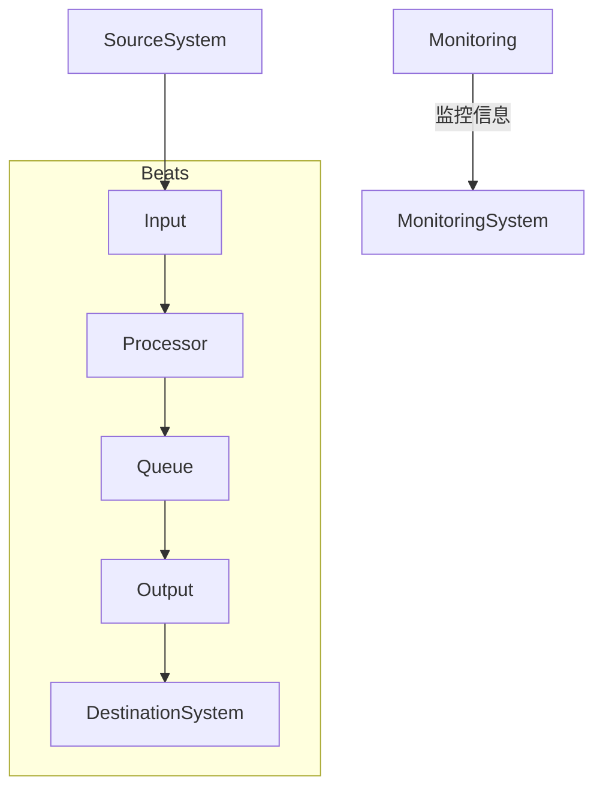

# ElasticSearch Beats原理与代码实例讲解

## 1. 背景介绍

### 1.1 问题的由来

在当今数据驱动的时代，日志数据的收集、处理和分析已经成为了一项关键的任务。无论是传统的基于文件的日志系统,还是现代的分布式日志收集解决方案,都面临着一些共同的挑战,例如:

- **数据量大且增长迅速**: 随着系统复杂度的增加和业务规模的扩大,需要处理的日志数据量也在不断增长。传统的日志收集方式很难满足大规模数据处理的需求。

- **数据来源分散**: 日志数据来源分散在不同的服务器、容器和应用程序中,需要一种统一的方式来收集和管理这些分散的数据源。

- **实时性要求高**: 对于许多应用场景,例如安全监控、故障排查等,需要实时收集和分析日志数据,以便及时发现和响应异常情况。

- **数据格式多样**: 不同的系统和应用程序生成的日志数据格式各不相同,需要一种灵活的方式来处理多种数据格式。

为了解决这些挑战,Elastic Stack (前身为ELK Stack)应运而生。作为一个开源的日志数据平台,Elastic Stack提供了一整套日志收集、存储、搜索、分析和可视化的解决方案。

### 1.2 研究现状

在Elastic Stack中,Beats是一个轻量级的数据发送器,用于从不同的数据源安全地收集数据,并将其发送到Logstash或Elasticsearch进行后续处理。Beats家族包括了多种专门的Beat,例如Filebeat(用于收集文件数据)、Metricbeat(用于收集系统和服务指标数据)、Packetbeat(用于收集网络数据)等。

Beats的设计理念是轻量级、安全、易于配置和扩展。它们可以作为独立的轻量级代理安装在需要收集日志数据的系统上,并通过SSL/TLS加密传输来确保数据安全。此外,Beats还支持模块化输入和输出,可以轻松地扩展以支持新的数据源和目标。

### 1.3 研究意义

研究和掌握Beats的原理和实现对于以下几个方面具有重要意义:

1. **提高日志收集效率**: 通过深入理解Beats的工作原理,可以更好地配置和优化Beats,从而提高日志收集的效率和性能。

2. **满足特定需求**: 了解Beats的内部实现机制,可以根据特定的需求进行定制和扩展,以支持新的数据源或输出目标。

3. **故障排查和问题解决**: 当遇到Beats相关的问题或错误时,掌握其原理和代码实现细节将有助于快速定位和解决问题。

4. **提高整体架构理解**: Beats作为Elastic Stack的重要组成部分,研究Beats的原理有助于更好地理解整个Elastic Stack的架构和工作流程。

5. **促进社区贡献**: 通过深入研究Beats的源代码,可以更好地参与到Beats的开发和维护中,为开源社区做出贡献。

### 1.4 本文结构

本文将从以下几个方面深入探讨Elasticsearch Beats的原理和实现:

1. 介绍Beats的核心概念和架构,包括其模块化设计和工作流程。

2. 详细分析Beats的核心算法原理,包括数据收集、处理和发送等关键环节。

3. 阐述Beats中使用的数学模型和公式,例如用于编码、压缩和加密的算法。

4. 通过代码示例和详细解释,揭示Beats的实现细节。

5. 探讨Beats在不同场景下的实际应用,如日志收集、指标监控等。

6. 介绍Beats相关的工具和学习资源,以帮助读者更好地掌握和使用Beats。

7. 总结Beats的发展趋势和面临的挑战,并对未来的研究方向进行展望。

8. 附录部分回答一些常见的问题,帮助读者更好地理解和使用Beats。

## 2. 核心概念与联系

在深入探讨Beats的原理和实现之前,让我们先了解一些核心概念和它们之间的关系。

### 2.1 Beats架构概览

Beats的整体架构可以概括为一个模块化的数据管道,由以下几个核心组件组成:

1. **输入(Input)**: 负责从各种数据源(如文件、系统指标、网络流量等)收集数据。每种数据源对应一种输入类型,例如`log`用于收集日志文件数据,`metric`用于收集系统指标数据。

2. **处理器(Processor)**: 对收集到的原始数据进行解码、解析、转换和丰富等处理,以便后续的传输和存储。处理器可以是内置的,也可以是自定义的。

3. **输出(Output)**: 将处理后的数据发送到指定的目的地,例如Elasticsearch、Logstash或Kafka等。Beats支持多种输出类型,并且可以同时配置多个输出目标。

4. **队列(Queue)**: 用于缓存待发送的数据,以防止数据丢失和确保数据的可靠传输。Beats支持内存队列和持久化队列两种类型。

5. **监控(Monitoring)**: 用于收集和报告Beats自身的运行状态和指标信息,以便进行监控和故障排查。

这些组件通过配置文件进行协调,形成一个完整的数据管道。下面是Beats的基本工作流程:

### 2.2 Beats模块化设计

Beats采用了模块化的设计,允许用户根据需求选择和配置不同的输入、处理器和输出模块。这种模块化设计带来了以下优势:

1. **灵活性**: 用户可以根据具体需求自由组合不同的模块,构建定制化的数据收集管道。

2. **可扩展性**: 开发人员可以较为容易地开发新的模块,并将其集成到Beats中,从而支持新的数据源或输出目标。

3. **可维护性**: 模块化设计使得每个模块的代码相对独立,便于开发人员进行维护和优化。

4. **复用性**: 不同的Beat可以共享和复用相同的模块,避免重复开发。

### 2.3 Beats与Elastic Stack的集成

Beats是Elastic Stack的重要组成部分,它与Logstash、Elasticsearch和Kibana等其他组件紧密集成,形成了一个完整的日志数据平台。

- **Beats -> Logstash**: Beats可以将收集到的数据直接发送到Logstash进行进一步的处理、转换和丰富。

- **Beats -> Elasticsearch**: Beats也可以直接将数据发送到Elasticsearch进行存储和索引,供后续的搜索和分析使用。

- **Kibana**: Kibana可以与Elasticsearch集成,提供友好的Web界面来可视化和分析由Beats收集的数据。

通过这种集成,Elastic Stack为用户提供了一个端到端的日志数据解决方案,涵盖了数据收集、传输、存储、搜索、分析和可视化等各个环节。

## 3. 核心算法原理 & 具体操作步骤

### 3.1 算法原理概述

Beats的核心算法原理可以概括为以下几个关键步骤:

1. **数据采集**: 从指定的数据源(如日志文件、系统指标、网络流量等)采集原始数据。

2. **数据解码和解析**: 对采集到的原始数据进行解码(如必要的解压缩)和解析,将其转换为结构化的事件(Event)格式。

3. **数据处理**: 对解析后的事件数据进行进一步的处理,例如字段转换、丰富、去重等。

4. **数据编码**: 将处理后的事件数据编码为适合传输的格式,例如JSON或者Bulkdata格式。

5. **数据缓存**: 将编码后的数据暂时缓存在内存或持久化队列中,以防止数据丢失。

6. **数据传输**: 从队列中取出数据,通过加密的SSL/TLS连接将其发送到指定的输出目标(如Elasticsearch或Logstash)。

7. **错误处理**: 在数据采集、处理和传输过程中,对可能发生的错误进行适当的处理和重试。

8. **监控报告**: 收集和报告Beats自身的运行状态和指标信息,用于监控和故障排查。

这些步骤形成了Beats的核心数据管道,确保了数据从采集到传输的完整性和可靠性。

### 3.2 算法步骤详解

接下来,我们将更加详细地解释Beats核心算法的每个步骤。

#### 3.2.1 数据采集

数据采集是Beats算法的第一步,也是最关键的一步。Beats支持从多种数据源采集数据,包括:

- **文件数据**: 通过Filebeat采集各种日志文件数据,支持多种文件输入类型(如日志、stdin等)和多种日志格式(如JSON、多行等)。

- **系统指标数据**: 通过Metricbeat采集系统级别的指标数据,如CPU、内存、网络等。

- **网络数据**: 通过Packetbeat采集网络流量数据,用于网络监控和安全分析。

- **Windows事件日志**: 通过Winlogbeat采集Windows事件日志数据。

- **云服务日志**: 通过各种专用模块(如AWS、Google Cloud等)采集来自云服务的日志数据。

Beats使用了高效的数据采集算法,如通过内核接口(inotify、FSEvents等)监视文件变化,减少不必要的磁盘IO;使用内核抓包机制(BPF、NFQUEUE等)高效地捕获网络数据等。

#### 3.2.2 数据解码和解析

采集到的原始数据通常是非结构化的,因此需要进行解码和解析,将其转换为结构化的事件(Event)格式。Beats支持多种解码器和解析器,用于处理不同格式的数据源。

常见的解码器包括:

- **plain**: 用于解码纯文本数据。
- **json**: 用于解码JSON格式数据。
- **gzip**: 用于解压缩gzip格式数据。

常见的解析器包括:

- **json**: 用于解析JSON格式的日志数据。
- **multiline**: 用于解析多行日志数据。
- **grok**: 使用Grok模式匹配和解析非结构化的日志数据。

解析后的数据会被转换为统一的事件(Event)格式,包含多个字段(Field),如`@timestamp`(事件时间戳)、`message`(原始消息)、`host`(主机名)等。这种统一的事件格式便于后续的处理和分析。

#### 3.2.3 数据处理

解析后的事件数据可以通过一系列处理器(Processor)进行进一步的处理和转换,以满足特定的需求。Beats提供了多种内置的处理器,同时也支持用户自定义处理器。

常见的处理器包括:

- **添加字段(Add Fields)**: 向事件添加新的字段或覆盖现有字段的值。
- **删除字段(Drop Fields)**: 从事件中删除指定的字段。
- **转换字段(Convert)**: 将字段的值从一种格式转换为另一种格式。
- **去重(DeduplicateFilter)**: 根据指定的字段值去重事件。
- **脚本(Script)**: 使用Painless脚本语言对事件执行自定义的处理逻辑。

处理器可以按照配置的顺序依次执行,形成一个处理管道。用户可以灵活地组合不同的处理器,以满足各种数据处理需求。

#### 3.2.4 数据编码

处理后的事件数据需要被编码为适合传输的格式,以便发送到输出目标。Beats支持两种主要的编码格式:

1. **JSON格式**: 将每个事件编码为一个JSON对象,多个事件用换行符分隔。这种格式易于人类阅读和解析,但对于大量事件数据来说,overhead较大。

2. **Bulkdata格式**: 将多个事件打包成一个批次,使用特定的格式进行编码。这种格式更加紧凑,适合大量事件数据的传输,但解析过程相对复杂一些。

Beats会根据配置的输出目标自动选择合适的编码格式。例如,发送到Elasticsearch时使用Bul