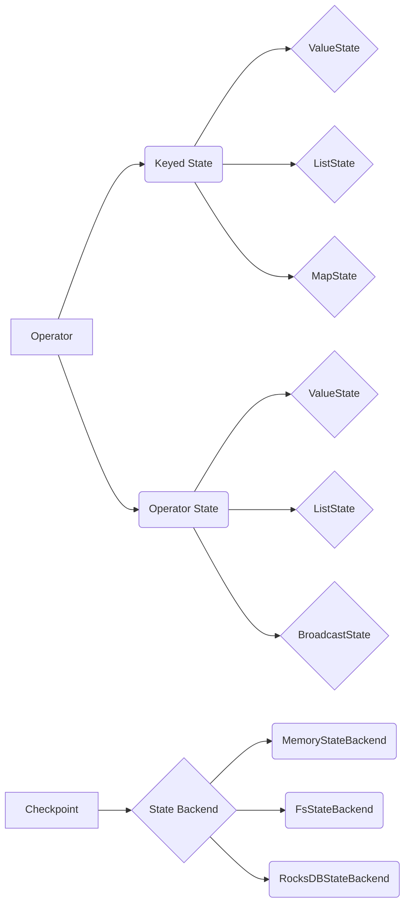

# Flink State状态管理原理与代码实例讲解

关键词：Flink、状态管理、Checkpoint、State Backend、状态一致性、可扩展状态

## 1. 背景介绍
### 1.1 问题的由来
在流式数据处理中,状态管理是一个关键问题。Flink作为一个分布式流处理引擎,需要在故障恢复、横向扩展等场景下,保证状态数据的一致性和正确性。而高效可靠的状态管理,正是Flink的一大亮点。
### 1.2 研究现状
目前业界主流的分布式流处理引擎,如Spark Streaming、Storm等,在状态管理方面都或多或少存在一些局限性,如状态存储和计算耦合、状态数据恢复成本高等。而Flink凭借其创新的状态管理机制,在保证强一致性的同时,实现了高效的状态存储和访问。
### 1.3 研究意义
深入理解Flink的状态管理原理,对于我们设计和优化基于Flink的流处理应用,具有重要的指导意义。通过对其内部机制的剖析,我们可以更好地利用Flink的状态管理能力,构建健壮、高性能的流处理系统。
### 1.4 本文结构
本文将从以下几个方面展开对Flink状态管理的讨论：首先介绍Flink中的核心状态概念；然后重点剖析其Checkpoint机制的算法原理；接着通过数学模型和代码实例深入讲解；最后总结Flink状态管理的特点和未来的发展方向。

## 2. 核心概念与联系
在Flink中,状态(State)是指流处理算子在处理过程中产生的中间结果数据,用于维护计算过程的上下文信息。Flink根据状态的作用域,将其分为Keyed State和Operator State两类。

Keyed State与特定的Key绑定,常用于记录每个Key对应的聚合结果。而Operator State则作用于整个算子,维护算子级别的状态信息。

Flink提供了多种不同类型的State,包括ValueState、ListState、MapState等,用户可以根据需求灵活选择。

为了在故障恢复时保证状态数据的一致性,Flink引入了Checkpoint机制,通过周期性地持久化状态数据,实现故障恢复时状态的精确恢复。同时Flink还提供了多种State Backend,用于状态数据的存储和访问,如MemoryStateBackend、FsStateBackend、RocksDBStateBackend等。

下图描述了Flink状态管理的核心概念之间的关系:



## 3. 核心算法原理 & 具体操作步骤
### 3.1 算法原理概述
Flink状态管理的核心算法是Checkpoint。Checkpoint是一种分布式快照技术,通过周期性地持久化状态数据,保证在故障恢复时能够将状态恢复到某个一致性时间点。Flink的Checkpoint机制是基于Chandy-Lamport分布式快照算法实现的。
### 3.2 算法步骤详解  
1. Checkpoint Coordinator在整个集群中选择一个时间点,作为本次Checkpoint的时间戳。
2. Checkpoint Coordinator向所有Source算子发送Checkpoint Barrier。
3. 当Source算子收到Barrier时,会暂停数据的摄入,并将Barrier向下游广播。
4. 下游算子收到Barrier后,会触发本地State的持久化,并将State数据异步写入到配置的State Backend中。
5. 当算子完成State的持久化后,会将Barrier继续向下游传递,直到Sink节点。
6. Sink节点收到所有上游算子的Barrier后,会向Checkpoint Coordinator发送ACK确认消息。
7. 当Checkpoint Coordinator收到所有Sink的ACK后,表示本次Checkpoint完成,Coordinator会更新元数据并删除旧的Checkpoint。

### 3.3 算法优缺点
Flink的Checkpoint机制具有以下优点：
- 能够保证Exactly-Once的状态一致性。
- 通过异步的Checkpoint过程,最小化了对正常数据处理的影响。
- 支持增量Checkpoint,避免了全量数据持久化的开销。

但Checkpoint机制也存在一些局限：
- Checkpoint的周期性持久化会占用一定的I/O带宽。
- 对于窗口计算等场景,Checkpoint的开销可能较大。

### 3.4 算法应用领域
Flink的状态管理和Checkpoint机制适用于各种有状态的流处理场景,如流式聚合、窗口计算、机器学习等。特别是在金融、电商、物联网等对数据一致性要求较高的领域,Flink凭借其可靠的状态管理能力,得到了广泛应用。

## 4. 数学模型和公式 & 详细讲解 & 举例说明
### 4.1 数学模型构建
我们可以用一个简化的数学模型来描述Flink的状态管理过程。假设一个Flink作业有$N$个算子$O_1, O_2, ..., O_N$,每个算子$O_i$在时间$t$有状态$S_i(t)$。那么整个作业的状态快照$S(t)$可以表示为:

$$S(t) = \{S_1(t), S_2(t), ..., S_N(t)\}$$

当触发一次Checkpoint时,每个算子会将当前状态$S_i(t)$持久化,并发送ACK。假设Checkpoint的持续时间为$\Delta t$,则Checkpoint完成后,作业的状态快照为:

$$S(t+\Delta t) = \{S_1(t+\Delta t), S_2(t+\Delta t), ..., S_N(t+\Delta t)\}$$

### 4.2 公式推导过程
对于一个Keyed State $S_i(t)$,我们可以将其表示为一个Key-Value对的集合:

$$S_i(t) = \{(k_1, v_1), (k_2, v_2), ..., (k_m, v_m)\}$$

其中$k_j$表示第$j$个Key,$v_j$表示其对应的状态值。当有新的数据$(k_x, v_x)$到达时,Keyed State会更新为:

$$S_i(t+1) = S_i(t) \cup \{(k_x, f(v_x))\}$$

其中$f$表示状态转换函数,用于将新的状态值$v_x$合并到已有的状态中。

### 4.3 案例分析与讲解
考虑一个简单的WordCount程序,其中使用Keyed State来维护每个单词的计数。假设初始状态为:

$$S(0) = \{("hello", 2), ("world", 1)\}$$

当单词"hello"再次到达时,状态会更新为:

$$S(1) = \{("hello", 3), ("world", 1)\}$$

此时如果触发一次Checkpoint,状态$S(1)$会被持久化。如果在Checkpoint完成后发生故障,Flink可以从持久化的状态$S(1)$恢复,保证数据的一致性。

### 4.4 常见问题解答
- Q: Flink状态存储在哪里?
- A: Flink支持多种State Backend,包括内存、文件系统、RocksDB等。用户可以根据状态的大小、访问方式等特点,选择合适的Backend。

- Q: Checkpoint的触发方式有哪些?
- A: Flink支持多种Checkpoint触发方式,包括基于时间间隔、数据量、外部事件等。用户可以根据业务需求灵活配置。

- Q: Flink状态管理是否支持增量Checkpoint?
- A: 是的,Flink支持增量Checkpoint。通过RocksDB等支持增量快照的State Backend,Flink可以只持久化上次Checkpoint之后发生变更的状态数据,显著减少了Checkpoint的开销。

## 5. 项目实践：代码实例和详细解释说明
### 5.1 开发环境搭建
首先需要搭建Flink的开发环境。这里我们以Java为例,使用Maven构建项目:

```xml
<dependencies>
    <dependency>
        <groupId>org.apache.flink</groupId>
        <artifactId>flink-java</artifactId>
        <version>1.14.0</version>
    </dependency>
    <dependency>
        <groupId>org.apache.flink</groupId>
        <artifactId>flink-streaming-java_2.11</artifactId>
        <version>1.14.0</version>
    </dependency>
</dependencies>
```

### 5.2 源代码详细实现
下面是一个简单的WordCount程序,演示了如何使用Flink的Keyed State:

```java
public class WordCount {
    public static void main(String[] args) throws Exception {
        StreamExecutionEnvironment env = StreamExecutionEnvironment.getExecutionEnvironment();
        
        // 开启Checkpoint
        env.enableCheckpointing(60000L);

        DataStream<String> text = env.socketTextStream("localhost", 9999);

        DataStream<Tuple2<String, Integer>> counts = text
            .flatMap(new Tokenizer())
            .keyBy(value -> value.f0)
            .map(new Accumulator());

        counts.print();

        env.execute("WordCount");
    }

    public static class Tokenizer implements FlatMapFunction<String, Tuple2<String, Integer>> {
        @Override
        public void flatMap(String value, Collector<Tuple2<String, Integer>> out) {
            String[] words = value.toLowerCase().split("\\s+");
            for (String word : words) {
                out.collect(new Tuple2<>(word, 1));
            }
        }
    }

    public static class Accumulator extends RichMapFunction<Tuple2<String, Integer>, Tuple2<String, Integer>> {
        
        // 定义Keyed State
        private transient ValueState<Integer> count;

        @Override
        public void open(Configuration config) {
            ValueStateDescriptor<Integer> descriptor = new ValueStateDescriptor<>("count", Integer.class);
            count = getRuntimeContext().getState(descriptor);
        }

        @Override
        public Tuple2<String, Integer> map(Tuple2<String, Integer> value) throws Exception {
            // 从State中读取当前单词的计数
            Integer currentCount = count.value();
            if (currentCount == null) {
                currentCount = 0;
            }
            
            // 更新State
            count.update(currentCount + value.f1);

            return new Tuple2<>(value.f0, currentCount + value.f1);
        }
    }
}
```

### 5.3 代码解读与分析
- 在`main`方法中,我们首先创建了一个`StreamExecutionEnvironment`,并开启了Checkpoint。
- 然后使用`socketTextStream`创建了一个数据源,监听本地9999端口的输入。
- 在`Tokenizer`中,我们将输入的文本按空格切分为单词,并将每个单词转换为`(word, 1)`的二元组。
- 在`Accumulator`中,我们首先定义了一个`ValueState`用于存储每个单词的计数。然后在`open`方法中初始化了这个State。
- 在`map`方法中,我们从State中读取单词的当前计数,并将其加1后更新回State,同时输出单词的最新计数。

可以看到,使用Flink的Keyed State,我们可以方便地维护每个单词的计数状态。同时借助Checkpoint机制,可以保证在故障恢复时,状态数据的一致性。

### 5.4 运行结果展示
启动程序后,我们可以在本地9999端口输入一些单词,如:

```
hello world
hello flink
```

程序会实时输出每个单词的计数结果:

```
(hello,1)
(world,1)
(hello,2)
(flink,1)
```

可以看到,程序正确地维护了每个单词的计数状态,并能够在故障恢复后继续累加计数。

## 6. 实际应用场景
Flink的状态管理在许多实际场景中都有广泛应用,比如：
- 实时数据聚合:使用Keyed State可以方便地维护每个Key的聚合结果,如求和、平均值等。
- 窗口计算:Flink提供了丰富的窗口语义,使用State可以存储每个窗口的中间结果。
- 机器学习:Flink提供了FlinkML库,支持在流上进行机器学习。State可用于存储模型参数和中间结果。
- 事件驱动应用:利用Flink的状态管理和CEP库,可以方便地构建复杂事件处理应用。

### 6.4 未来应用展望
随着流处理技术的不断发展,Flink的状态管理机制也在不断演进。未来Flink的状态管理可能会在以下方面取得更大突破：
- 状态的自动管理:减轻用户管