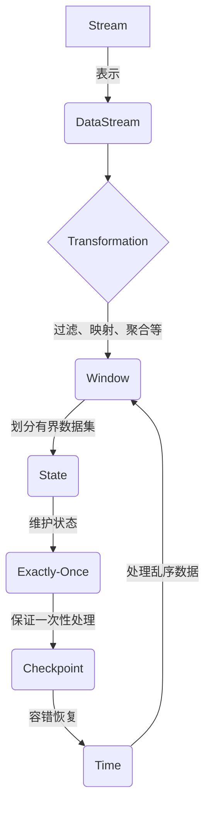

# Flink Stream原理与代码实例讲解

## 1. 背景介绍

### 1.1 问题的由来

在当今快速发展的数字时代，实时数据处理已经成为许多行业的关键需求。传统的批处理系统无法满足对实时性的要求,因为它们需要先收集并存储数据,然后再进行处理。随着物联网、社交媒体、金融交易等领域产生的海量数据不断增长,对实时数据处理的需求也越来越迫切。

### 1.2 研究现状

为了解决实时数据处理的挑战,许多流式处理系统应运而生,如Apache Storm、Apache Spark Streaming和Apache Flink等。其中,Apache Flink作为一个开源的分布式流处理框架,凭借其低延迟、高吞吐量和精确一次语义等优势,在业界获得了广泛关注和应用。

### 1.3 研究意义

深入理解Apache Flink的原理和实现细节,对于构建高效、可靠的实时数据处理系统至关重要。本文旨在剖析Flink Stream的核心概念、算法原理和实现细节,并通过代码示例帮助读者更好地掌握Flink Stream的使用方法。

### 1.4 本文结构

本文首先介绍Flink Stream的核心概念和架构,然后深入探讨其核心算法原理和数学模型。接下来,我们将通过代码示例详细解释Flink Stream的实现细节,并讨论其在实际应用场景中的应用。最后,我们将总结Flink Stream的发展趋势和面临的挑战,并推荐相关学习资源和工具。

## 2. 核心概念与联系

Apache Flink是一个开源的分布式流处理框架,它支持有状态计算和精确一次语义。Flink Stream是Flink的核心模块之一,用于实时数据流的处理和分析。以下是Flink Stream的几个核心概念:

1. **Stream**:代表一个无界的数据流,可以是来自各种数据源的事件或消息序列。

2. **DataStream**:Flink Stream中的基本数据模型,用于表示流数据。

3. **Transformation**:对DataStream进行各种转换操作,如过滤、映射、聚合等。

4. **Window**:将无界数据流划分为有界的数据集,以便进行有状态的计算。

5. **State**:Flink Stream支持有状态计算,可以在窗口或键控状态下维护状态。

6. **Time**:Flink Stream支持事件时间和处理时间两种时间概念,用于处理乱序数据和实现窗口操作。

7. **Checkpoint**:Flink的容错机制,通过定期保存状态快照来实现故障恢复。

8. **Exactly-Once**:Flink Stream提供了精确一次语义,确保每个事件只被处理一次,即使在发生故障的情况下也如此。

这些核心概念相互关联,共同构建了Flink Stream的实时数据处理能力。例如,通过对DataStream进行各种Transformation操作,并结合Window和State,我们可以实现复杂的有状态计算。而Checkpoint和Exactly-Once语义则确保了计算的可靠性和一致性。

## 3. 核心算法原理 & 具体操作步骤

### 3.1 算法原理概述

Flink Stream的核心算法原理主要包括以下几个方面:

1. **流分区(Stream Partitioning)**:将数据流划分为多个分区,以实现并行处理。

2. **窗口操作(Window Operation)**:将无界数据流划分为有界的数据集,以便进行有状态计算。

3. **状态管理(State Management)**:维护计算过程中的状态信息,以支持有状态计算。

4. **容错机制(Fault Tolerance)**:通过定期保存状态快照(Checkpoint)来实现故障恢复。

5. **任务调度(Task Scheduling)**:将计算任务分发到集群中的多个节点上进行并行执行。

### 3.2 算法步骤详解

1. **流分区(Stream Partitioning)**

   Flink Stream采用了基于键(Key)的分区策略,将数据流划分为多个分区。常见的分区策略包括:

   - 随机分区(Random Partitioning)
   - 哈希分区(Hash Partitioning)
   - 重缩分区(Rescale Partitioning)
   - 广播分区(Broadcast Partitioning)

   通过合理的分区策略,可以实现数据的并行处理,提高系统的吞吐量。

2. **窗口操作(Window Operation)**

   Flink Stream支持多种窗口操作,用于将无界数据流划分为有界的数据集,以便进行有状态计算。常见的窗口类型包括:

   - 滚动窗口(Tumbling Window)
   - 滑动窗口(Sliding Window)
   - 会话窗口(Session Window)
   - 全局窗口(Global Window)

   窗口操作通常与键(Key)和时间(Time)概念结合使用,以支持基于事件时间或处理时间的窗口计算。

3. **状态管理(State Management)**

   Flink Stream支持有状态计算,可以在窗口或键控状态下维护状态信息。常见的状态管理方式包括:

   - 键控状态(Keyed State)
   - 算子状态(Operator State)

   状态管理是实现有状态计算的关键,它允许我们在计算过程中保存和访问中间结果,从而支持更复杂的数据处理逻辑。

4. **容错机制(Fault Tolerance)**

   Flink Stream通过定期保存状态快照(Checkpoint)来实现容错机制,确保在发生故障时可以从最近的一致状态快照恢复计算。容错机制的关键步骤包括:

   - 状态快照(State Snapshot)
   - 障碍检测(Barrier Injection)
   - 故障恢复(Failure Recovery)

   容错机制确保了Flink Stream的计算结果具有精确一次(Exactly-Once)语义,即每个事件只被处理一次,即使在发生故障的情况下也如此。

5. **任务调度(Task Scheduling)**

   Flink Stream采用了基于流的任务调度策略,将计算任务分发到集群中的多个节点上进行并行执行。任务调度的关键步骤包括:

   - 任务链(Task Chaining)
   - 资源分配(Resource Allocation)
   - 动态缩放(Dynamic Scaling)

   合理的任务调度策略可以充分利用集群资源,提高系统的并行度和吞吐量。

### 3.3 算法优缺点

Flink Stream的核心算法具有以下优点:

1. **低延迟**:通过有效的流分区和任务调度策略,Flink Stream可以实现低延迟的实时数据处理。

2. **高吞吐量**:支持数据并行处理和动态缩放,可以充分利用集群资源,实现高吞吐量。

3. **精确一次语义**:基于状态快照和障碍检测机制,Flink Stream可以确保每个事件只被处理一次,即使在发生故障的情况下也如此。

4. **有状态计算**:支持键控状态和算子状态,可以实现复杂的有状态计算逻辑。

5. **容错性**:通过定期保存状态快照,Flink Stream可以在发生故障时从最近的一致状态快照恢复计算。

然而,Flink Stream的算法也存在一些缺点和挑战:

1. **状态管理开销**:维护状态信息会带来额外的内存和存储开销,需要合理管理和优化状态。

2. **延迟敏感性**:对于延迟敏感的应用场景,Flink Stream可能无法满足极低延迟的要求。

3. **学习曲线陡峭**:Flink Stream的概念和API相对复杂,存在一定的学习曲线。

4. **集群资源管理**:在大规模集群环境下,合理分配和调度资源是一个挑战。

### 3.4 算法应用领域

Flink Stream的核心算法可以广泛应用于以下领域:

1. **实时数据分析**:通过对实时数据流进行转换、聚合和窗口操作,可以实现实时数据分析和可视化。

2. **事件驱动应用**:利用Flink Stream的低延迟和有状态计算能力,可以构建高效的事件驱动应用程序。

3. **物联网(IoT)数据处理**:可以处理来自各种物联网设备的实时数据流,实现实时监控和异常检测。

4. **在线机器学习**:Flink Stream支持在线机器学习算法的实现,可以对实时数据流进行实时建模和预测。

5. **金融风险分析**:利用Flink Stream的高吞吐量和精确一次语义,可以实现实时金融交易数据的风险分析和欺诈检测。

6. **实时推荐系统**:通过对用户行为数据进行实时处理和分析,可以构建个性化的实时推荐系统。

7. **实时监控和报警**:可以对各种系统和应用程序的实时指标数据进行监控和异常报警。

总的来说,Flink Stream的核心算法为实时数据处理提供了强大的支持,在各种领域都有广泛的应用前景。

## 4. 数学模型和公式 & 详细讲解 & 举例说明

### 4.1 数学模型构建

在讨论Flink Stream的数学模型之前,我们先引入一些基本概念:

- 事件(Event):代表一个数据记录或消息,通常包含时间戳和其他属性。
- 数据流(Data Stream):由无限序列的事件组成,表示为$S = \{e_1, e_2, e_3, \ldots\}$。
- 窗口(Window):将无界数据流划分为有界的数据集,通常基于时间或计数进行划分。

Flink Stream的数学模型主要围绕窗口操作展开,我们可以将窗口操作定义为一个函数$W$,它将数据流$S$映射到一个有界的数据集合$W(S)$。具体来说,对于给定的窗口大小$w$和滑动步长$s$,窗口操作$W$可以表示为:

$$W(S) = \{W_1, W_2, W_3, \ldots\}$$

其中,每个$W_i$代表一个窗口,包含在时间范围$[t_i, t_i + w)$内的事件。相邻窗口之间的时间间隔为$s$。

根据不同的窗口类型,窗口操作$W$的具体实现也有所不同:

- 滚动窗口(Tumbling Window):$s = w$,相邻窗口之间没有重叠。
- 滑动窗口(Sliding Window):$s < w$,相邻窗口之间存在重叠。
- 会话窗口(Session Window):根据事件之间的时间间隔动态确定窗口边界。
- 全局窗口(Global Window):将整个数据流视为一个窗口。

在窗口操作之后,我们可以对每个窗口$W_i$进行各种转换和聚合操作,例如映射(Map)、过滤(Filter)、reduce等。这些操作可以表示为一个函数$F$,将窗口$W_i$映射到一个新的结果$R_i$:

$$R_i = F(W_i)$$

通过组合窗口操作$W$和转换/聚合操作$F$,我们可以实现各种复杂的实时数据处理逻辑。

### 4.2 公式推导过程

在上一节中,我们定义了窗口操作$W$和转换/聚合操作$F$。现在,我们将推导一个具体的例子,即如何计算一个滑动窗口内的事件计数。

假设我们有一个数据流$S$,其中每个事件$e_i$都带有一个时间戳$t_i$。我们希望计算一个大小为$w$、步长为$s$的滑动窗口内的事件计数。

首先,我们定义窗口操作$W$为:

$$W(S) = \{W_1, W_2, W_3, \ldots\}$$
$$W_i = \{e_j | t_i \leq t_j < t_i + w\}$$

也就是说,每个窗口$W_i$包含时间范围$[t_i, t_i + w)$内