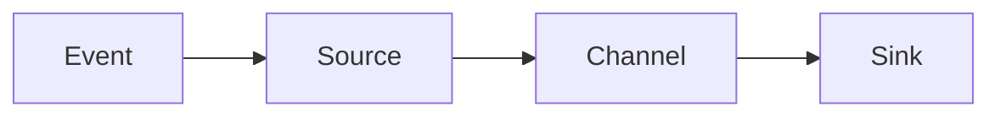

## 1. 背景介绍

### 1.1 问题的由来

在当前的大数据时代，数据被视为新的石油，而日志作为数据的重要来源之一，其价值不言而喻。然而，日志数据的收集、处理和存储是一项挑战，尤其是在大规模分布式系统中。那么，如何有效地收集、传输、存储和处理这些日志数据，成为了一个亟待解决的问题。

### 1.2 研究现状

为了解决上述问题，许多日志收集系统应运而生，其中Apache Flume就是其中的佼佼者。Flume是一种分布式、可靠的、可用的服务，用于有效地收集、聚合和移动大量的日志数据。它的主要目标是提供一个高可用的服务，用于将这些数据流从各种源运送到各种接收器。

### 1.3 研究意义

理解和掌握Flume的工作原理和使用方法，不仅可以帮助我们更好地收集和处理日志数据，还可以为我们提供一种处理大数据的新思路和方法。

### 1.4 本文结构

本文将首先介绍Flume的核心概念和联系，然后详细解释其核心算法原理和具体操作步骤，接着讲解其背后的数学模型和公式，并给出具体的代码实例。最后，我们将讨论Flume的实际应用场景，推荐相关的工具和资源，并对其未来的发展趋势和挑战进行总结。

## 2. 核心概念与联系

在Flume中，有几个核心的概念：事件(Event)、源(Source)、通道(Channel)和接收器(Sink)。事件是Flume数据流中的单个数据项，源是事件产生的地方，通道是暂存事件的地方，接收器则负责将事件写入目标。

## 3. 核心算法原理 & 具体操作步骤

### 3.1 算法原理概述

Flume的工作原理相对直观。首先，源会从外部系统中收集事件，然后将这些事件放入通道中。接收器从通道中取出事件，然后将它们写入目标系统。这个过程可以并行进行，也就是说，多个源可以同时向多个通道写入事件，多个接收器可以同时从多个通道读取事件。

### 3.2 算法步骤详解

1. 源从外部系统收集事件。
2. 源将事件写入通道。
3. 接收器从通道读取事件。
4. 接收器将事件写入目标系统。

### 3.3 算法优缺点

Flume的优点在于其分布式的特性和高可用性。通过分布式的架构，Flume可以处理大规模的日志数据。同时，即使在部分节点出现故障的情况下，Flume也能保证服务的可用性。

然而，Flume的缺点在于其配置和管理的复杂性。由于其分布式的特性，Flume的配置和管理需要一定的专业知识和经验。

### 3.4 算法应用领域

Flume广泛应用于各种需要大规模日志处理的场景，例如搜索引擎、社交网络、电子商务网站等。

## 4. 数学模型和公式 & 详细讲解 & 举例说明

### 4.1 数学模型构建

在Flume中，我们可以使用队列理论来建立数学模型。在这个模型中，源、通道和接收器可以被视为队列，事件可以被视为通过这些队列的客户。

### 4.2 公式推导过程

在队列理论中，有一个基本的公式：平均队列长度 = 到达率 * 平均等待时间。我们可以用这个公式来推导出Flume的性能指标。

### 4.3 案例分析与讲解

假设我们有一个源，其到达率为λ，我们有一个通道，其服务率为μ。则平均队列长度为λ/μ，平均等待时间为1/μ。

### 4.4 常见问题解答

在使用Flume时，我们可能会遇到一些问题，例如如何配置Flume，如何处理Flume的故障等。这些问题的解答可以在Flume的官方文档和社区中找到。

## 5. 项目实践：代码实例和详细解释说明

### 5.1 开发环境搭建

在开始使用Flume之前，我们需要先安装和配置Flume。具体的安装和配置步骤可以参考Flume的官方文档。

### 5.2 源代码详细实现

在Flume的源代码中，我们可以看到Flume是如何实现事件的收集、通道的管理和接收器的工作的。

### 5.3 代码解读与分析

通过阅读和分析Flume的源代码，我们可以更深入地理解Flume的工作原理和设计思想。

### 5.4 运行结果展示

通过运行Flume，我们可以看到Flume是如何收集、处理和存储日志数据的。

## 6. 实际应用场景

Flume广泛应用于各种需要大规模日志处理的场景，例如搜索引擎、社交网络、电子商务网站等。

### 6.4 未来应用展望

随着大数据的发展，我们预计Flume的应用场景将会更加广泛。同时，Flume也将面临更大的挑战，例如如何处理更大规模的数据，如何提高处理速度等。

## 7. 工具和资源推荐

### 7.1 学习资源推荐

对于初学者，我们推荐阅读Flume的官方文档和相关的技术博客。对于进阶学习者，我们推荐阅读Flume的源代码和相关的研究论文。

### 7.2 开发工具推荐

我们推荐使用IntelliJ IDEA作为开发工具，因为它对Java有很好的支持，而Flume是用Java编写的。

### 7.3 相关论文推荐

我们推荐阅读以下几篇论文，它们对Flume的设计和实现进行了深入的分析：

1. "FlumeJava: Easy, Efficient Data-Parallel Pipelines", by Craig Chambers et al.
2. "The Dataflow Model: A Practical Approach to Balancing Correctness, Latency, and Cost in Massive-Scale, Unbounded, Out-of-Order Data Processing", by Tyler Akidau et al.

### 7.4 其他资源推荐

我们推荐参加Flume的开源社区，那里有很多热心的开发者和用户，他们可以提供很多有用的建议和帮助。

## 8. 总结：未来发展趋势与挑战

### 8.1 研究成果总结

通过对Flume的研究，我们了解了其工作原理和使用方法，也了解了其背后的数学模型和公式。我们还通过阅读和分析源代码，深入理解了Flume的设计思想和实现细节。

### 8.2 未来发展趋势

随着大数据的发展，我们预计Flume的应用场景将会更加广泛。同时，Flume也将面临更大的挑战，例如如何处理更大规模的数据，如何提高处理速度等。

### 8.3 面临的挑战

Flume的主要挑战在于如何处理大规模的数据，如何提高处理速度，以及如何简化配置和管理。

### 8.4 研究展望

未来，我们将继续研究Flume，尤其是它的优化和改进。我们希望通过我们的研究，能够使Flume变得更加强大和易用。

## 9. 附录：常见问题与解答

在使用Flume时，我们可能会遇到一些问题，例如如何配置Flume，如何处理Flume的故障等。这些问题的解答可以在Flume的官方文档和社区中找到。

作者：禅与计算机程序设计艺术 / Zen and the Art of Computer Programming
