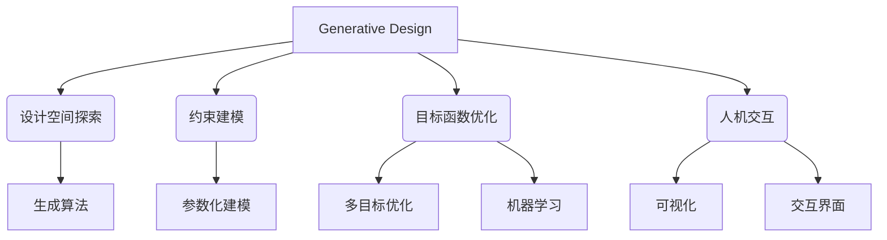

# Generative Design原理与代码实例讲解

## 1. 背景介绍

### 1.1 问题的由来

在当今快速发展的数字时代,设计师和工程师面临着越来越多的挑战,需要在有限的时间和资源内创造出高质量、高性能的设计方案。传统的设计方法通常依赖于人工经验和反复试错,效率低下且难以满足日益复杂的设计需求。因此,如何利用计算机技术来辅助甚至自动化设计过程,成为了一个备受关注的研究课题。

Generative Design(生成式设计)正是在这一背景下应运而生的一种全新的设计范式。它利用算法和计算机技术来探索设计空间,自动生成满足特定约束条件的设计方案。与传统的人工设计方式不同,Generative Design能够高效地生成大量可行的设计备选方案,并根据设计目标进行优化和评估,从而帮助设计师快速找到最优解决方案。

### 1.2 研究现状

Generative Design作为一种新兴的设计理念和技术,近年来受到了学术界和工业界的广泛关注。在建筑、工业设计、航空航天等领域,已有多个成功的应用案例。著名的例子包括由Autodesk公司设计的鸟巢建筑、Airbus公司的A320飞机机翼设计等。

目前,Generative Design的研究主要集中在以下几个方面:

1. **算法开发**: 设计高效、通用的生成算法,以探索更广阔的设计空间。
2. **约束建模**: 准确定义和表达复杂的设计约束条件。
3. **性能评估**: 建立合理的评价指标,对生成的设计方案进行优化和筛选。
4. **人机交互**: 提高设计师与生成系统之间的交互体验。
5. **应用拓展**: 将Generative Design技术推广到更多的领域。

### 1.3 研究意义

Generative Design的出现为设计领域带来了革命性的变革,其意义主要体现在以下几个方面:

1. **提高设计效率**: 通过计算机辅助,大幅缩短设计周期,降低人力成本。
2. **拓展设计空间**: 探索人工难以触及的设计解空间,发现创新的设计方案。
3. **优化设计质量**: 基于性能评估,生成满足多重约束条件的最优化设计。
4. **促进跨领域融合**: 将计算机技术、优化理论等多学科知识融入设计过程。

Generative Design的发展前景十分广阔,必将为工程设计、产品创新等领域带来深远影响。

### 1.4 本文结构

本文将全面介绍Generative Design的核心原理和实现方法。主要内容包括:

1. 核心概念与联系
2. 核心算法原理及具体操作步骤
3. 数学建模及公式推导
4. 代码实例及详细解释
5. 实际应用场景
6. 工具和资源推荐
7. 未来发展趋势与挑战分析

## 2. 核心概念与联系

Generative Design是一个涵盖多个核心概念的综合性范畴,主要包括以下几个方面:

1. **设计空间探索(Design Space Exploration)**: 利用算法高效地探索可能的设计解空间,生成大量候选设计方案。常用的生成算法包括启发式算法(如遗传算法、蚁群算法等)、拓扑优化算法等。

2. **约束建模(Constraint Modeling)**: 将现实世界中的设计约束(如材料、结构、制造等)转化为数学模型,为算法生成满足约束条件的可行解提供前提。参数化建模技术是实现约束建模的关键。

3. **目标函数优化(Objective Function Optimization)**: 根据设计目标(如强度、重量、成本等)构建评价函数,并利用多目标优化算法或机器学习技术对生成的候选解进行优化,得到最优设计方案。

4. **人机交互(Human-Computer Interaction)**: 通过可视化技术和交互式界面,提高设计师与生成系统之间的协作效率,使设计师能够便捷地调整参数、干预优化过程。

上述核心概念相互关联、环环相扣,共同构成了完整的Generative Design理论框架和技术体系。

## 3. 核心算法原理 & 具体操作步骤

### 3.1 算法原理概述

Generative Design的核心是利用算法高效地探索设计解空间,生成满足约束条件的候选设计方案。常用的生成算法主要有以下几类:

1. **启发式算法**
    - 遗传算法(Genetic Algorithm, GA)
    - 蚁群算法(Ant Colony Optimization, ACO)
    - 粒子群算法(Particle Swarm Optimization, PSO)
    - ...

2. **拓扑优化算法**
    - 双等级可展开同余拓扑优化(Bi-directional Evolutionary Structural Optimization, BESO)
    - 同余拓扑优化(Isotropic Solid Structural Topology Optimization, ISSTO)
    - ...

3. **其他算法**
    - 有限元分析(Finite Element Analysis, FEA)
    - 计算流体动力学(Computational Fluid Dynamics, CFD)
    - ...

这些算法通过不同的搜索策略,在设计空间中高效地生成和优化候选解,从而逐步逼近最优设计方案。

### 3.2 算法步骤详解

以遗传算法为例,其基本步骤如下:

1. **初始化种群**:根据设计变量的范围,随机生成一定数量的初始个体(候选解)作为种群。

2. **编码**:将每个个体(候选解)的设计变量编码为染色体(通常使用二进制编码或实数编码)。

3. **评估适应度**:计算每个个体的适应度函数值,作为优劣程度的评价指标。适应度函数通常基于设计目标(如强度、重量等)构建。

4. **选择**:根据适应度大小,从当前种群中选择优良个体,作为下一代种群的亲本。常用的选择算子有轮盘赌选择、锦标赛选择等。

5. **交叉**:对选定的亲本个体的染色体进行交叉操作,产生新的子代个体,以增加种群的多样性。

6. **变异**:以一定的小概率对子代个体的染色体进行变异操作,防止陷入局部最优解。

7. **终止判断**:检查是否满足终止条件(如达到最大进化代数或目标函数收敛),若满足则输出最优个体作为最终设计方案;否则转入下一代进化。

8. **更新种群**:根据选择、交叉、变异的结果更新种群,进入下一代进化。

通过不断进化,算法最终能够得到满足约束条件的全局最优或次优设计方案。

### 3.3 算法优缺点

上述生成算法具有以下优缺点:

**优点**:

- 高效探索广阔的设计空间
- 能够处理复杂的非线性约束条件
- 具有全局寻优能力,避免陷入局部最优
- 易于并行计算,提高求解效率

**缺点**:

- 算法参数设置对结果影响较大
- 求解质量和效率难以理论保证
- 适用于离散设计变量,处理连续变量存在困难
- 需要大量的计算资源,对硬件要求较高

### 3.4 算法应用领域

生成算法在多个领域得到了广泛应用,主要包括:

- **工业设计**: 机械零部件、工具、家电等产品设计优化
- **建筑设计**: 建筑结构形式探索,节能环保建筑设计
- **航空航天**: 机翼、发动机等关键部件轻量化设计
- **生物医学工程**: 植入式医疗设备、假肢等个性化设计
- **艺术创作**: 计算机辅助艺术创作,如雕塑、珠宝等设计
- ...

## 4. 数学模型和公式 & 详细讲解 & 举例说明

### 4.1 数学模型构建

在Generative Design中,需要将现实世界中的设计问题转化为数学模型,以便算法进行求解。一个典型的数学模型通常包括以下几个部分:

1. **设计变量**

   设计变量$\boldsymbol{x}=(x_1,x_2,\ldots,x_n)$表示待优化的参数,如尺寸、位置、拓扑等。它们的取值范围构成了设计空间。

2. **约束条件**

   约束条件$g_i(\boldsymbol{x})\leq 0, \quad i=1,2,\ldots,m$表示设计变量需要满足的限制,如材料强度、变形量、制造工艺等。

3. **目标函数**

   目标函数$f(\boldsymbol{x})$表示需要优化的设计指标,如重量、刚度、成本等,可以是单一目标或多个目标。

综合以上三个部分,一个典型的数学模型可以表示为:

$$
\begin{align*}
&\min\limits_{\boldsymbol{x}}& & f(\boldsymbol{x})\\
&\text{s.t.}& & g_i(\boldsymbol{x})\leq 0, \quad i=1,2,\ldots,m\\
& & & \boldsymbol{x}_L \leq \boldsymbol{x} \leq \boldsymbol{x}_U
\end{align*}
$$

其中$\boldsymbol{x}_L$和$\boldsymbol{x}_U$分别表示设计变量的下限和上限。

该数学模型的求解即是在满足所有约束条件的前提下,寻找能够使目标函数达到极小(或极大)值的最优设计变量组合$\boldsymbol{x}^*$。

### 4.2 公式推导过程

在实际问题中,约束条件和目标函数往往由一系列复杂的物理模型或经验公式组成。以一个简单的梁结构设计为例,我们需要推导出相关的数学公式。

<图片>

考虑如图所示的简单梁结构,已知梁的长度$L$、截面积$A$、材料的弹性模量$E$和允许最大应力$\sigma_\text{max}$。我们需要确定梁的高度$h$,使其在给定载荷$F$作用下,能够满足强度和刚度要求。

1. **应力约束**

   根据梯度公式,最大应力为:

   $$\sigma_\text{max}=\frac{Mc}{I}$$

   其中$M=FL/4$为最大弯矩,$c=h/2$为中性层到最远点的距离,$I=Ah^2/12$为矩形截面的转动惯量矩。将这些表达式代入,可得:

   $$\sigma_\text{max}=\frac{3FL}{2Ah^2}\leq[\sigma]$$

   上式即为应力约束条件。

2. **刚度约束**

   根据梁的挠度公式,梁的最大挠度为:

   $$\delta_\text{max}=\frac{FL^3}{48EI}=\frac{FL^3}{4EAh^2}\leq[\delta]$$

   上式即为刚度约束条件。

3. **目标函数**

   假设我们希望最小化梁的重量,则目标函数为:
   
   $$\min\limits_h W=\rho ALh$$
   
   其中$\rho$为材料密度。

综合以上三个部分,该梁结构设计问题的数学模型为:

$$
\begin{align*}
&\min\limits_h& & \rho ALh\\
&\text{s.t.}& & \frac{3FL}{2Ah^2}\leq[\sigma]\\
& & & \frac{FL^3}{4EAh^2}\leq[\delta]\\
& & & h_\text{min}\leq h\leq h_\text{max}
\end{align*}
$$

通过数值求解该优化模型,即可得到满足强度和刚度要求的最轻梁结构尺寸。

### 4.3 案例分析与讲解

下面我们以一个实际的工程案例,对Generative Design的数学建模过程进行具体分析和讲解。

**