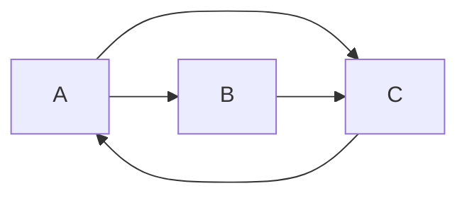

# Graph PageRank算法原理与代码实例讲解

关键词：PageRank算法、图算法、网页排名、马尔可夫过程、幂法迭代、Python实现

## 1. 背景介绍
### 1.1 问题的由来
在互联网飞速发展的今天,搜索引擎已经成为人们获取信息的主要途径。而一个好的搜索引擎,不仅要能够检索到相关的网页,更重要的是要能够对检索结果进行合理的排序,将最重要、最权威的网页排在前面。这就需要一种科学合理的网页重要性评估算法。

### 1.2 研究现状
目前主流的网页重要性评估算法主要有两大类:基于内容的算法和基于链接结构的算法。基于内容的算法通过分析网页内容的相关性来评估重要性,代表算法有向量空间模型、潜在语义索引等。基于链接结构的算法则利用网页之间的链接关系来评估重要性,其中最著名的当属Google的PageRank算法。

### 1.3 研究意义 
深入理解和掌握PageRank算法,对于从事搜索引擎、推荐系统、社交网络等领域的研究人员和工程师来说都是十分必要的。PageRank作为经典的链接分析算法,启发了众多后续算法的研究,如TrustRank、SimRank、Random Walk with Restart等。同时,PageRank的思想也被广泛应用到其他领域,如社交影响力分析、疾病基因预测等。

### 1.4 本文结构
本文将分为以下几个部分对PageRank算法进行详细讲解:

1. PageRank的基本概念与数学原理
2. PageRank的计算步骤与算法流程  
3. PageRank的矩阵表示与幂法求解
4. PageRank的Python代码实现与案例分析
5. PageRank算法的应用与扩展
6. PageRank的资源与工具推荐

通过本文的学习,读者将全面掌握PageRank的原理与实现,并能够将PageRank应用到实际问题中去。

## 2. 核心概念与联系
PageRank算法的核心思想可以用一句话概括:一个网页如果被很多其他网页链接到的话说明这个网页比较重要,也就是PageRank值会相对较高。而且,如果一个PageRank值很高的网页链接到一个其他的网页,那么被链接到的网页的PageRank值会相应地因此而提高。

PageRank的计算过程可以看作是一个马尔可夫过程。我们可以将网页看作状态空间中的状态,将网页之间的链接关系看作状态之间的转移概率,基于随机游走的模型来计算各个状态的平稳分布概率,也就是各个网页的PageRank值。

PageRank值的计算是一个迭代收敛的过程。我们通过迭代计算的方式,不断更新每个网页的PageRank值,直到达到收敛为止。在具体实现时,通常采用幂法等算法进行求解。

总的来说,PageRank涉及到以下几个关键概念:

- 网页之间的链接关系,可以用有向图来表示
- 马尔可夫过程,随机游走模型
- 状态转移矩阵,描述状态之间转移概率  
- 平稳分布,特征向量
- 幂法,迭代求解特征向量

这些概念环环相扣,共同构建起PageRank的理论基础。在下面的章节中,我们将逐一展开进行讲解。

## 3. 核心算法原理 & 具体操作步骤
### 3.1 算法原理概述
PageRank本质上是基于图的链接结构,通过马尔可夫过程的定义,利用幂法迭代求解每个节点的重要性得分,是一种经典的图中心度计算方法。

具体来说,PageRank算法基于以下两个基本假设:

1. 数量假设:如果一个页面节点接收到的其他网页指向的入链数量越多,那么这个页面越重要。 
2. 质量假设:指向页面A的入链质量不同,质量高的页面会通过链接向其他页面传递更多的PageRank值。

基于这两个假设,PageRank的计算过程可以简要描述如下:

1. 将整个网络看作一张有向图G=(V, E),其中V表示所有网页节点的集合,E表示网页间的链接有向边的集合。
2. 定义转移矩阵M,矩阵中的每一项Mij表示从页面i到页面j的链接权重。
3. 初始时,假设每个网页的重要性都是相同的,即PR值相等。 
4. 进行迭代计算,每一轮迭代,每个页面将其当前的PR值平均分配到它所链接的页面上去,同时也能从其他链接到它的页面获得相应的PR值。
5. 多次迭代直到PR值收敛,得到每个页面的最终PR值,作为其重要性的度量。

可见,PageRank本质上是通过链接关系,基于图的结构进行重要性计算和排序的一种算法。接下来,我们将PageRank的计算过程进行形式化描述。

### 3.2 算法步骤详解
输入:有向图G=(V,E),其中V为节点集,E为有向边集
输出:每个节点的PageRank值
算法步骤:
1. 初始化:对于每个节点i, 令PR(i)=1/N,其中N为节点总数。 
2. 迭代计算:重复R轮迭代,直到PR值收敛,在每一轮迭代中,对于每个节点i,更新其PR值为:

$$
PR(i) = \frac{1-d}{N} + d \sum_{j \in M(i)} \frac{PR(j)}{L(j)}
$$

其中,d为阻尼系数,一般取值在0.8~0.9之间。M(i)为指向节点i的节点集合,L(j)为节点j的出度,即从节点j指出的链接数量。

3. 终止条件:当PR值的变化小于一个预先设定的阈值,或者达到最大迭代轮数时,算法终止。

可以看出,PageRank是一个迭代收敛的过程,每个节点的PR值由其他节点的PR值和链接关系共同决定,经过多轮迭代后达到一个稳定平衡的状态。

### 3.3 算法优缺点
PageRank作为经典的网页排序算法,有以下优点:

1. 能够很好地反映网页的重要性和权威性,对网页进行合理的排序。
2. 计算过程简单,容易实现,可扩展性强。  
3. 利用了网络的链接结构信息,相比单纯的文本分析更能挖掘网页的重要性。

同时,PageRank算法也存在一些局限性:

1. 容易受到链接作弊的影响,一些垃圾网站通过刷链接的方式提高自己的PR值。
2. 对于新加入的网页,由于链接关系稀疏,往往得到较低的PR值,存在"富者愈富"的马太效应。
3. 忽略了链接的语义信息,无法区分链接的主题相关性。

针对这些问题,学术界提出了一系列改进算法,如TrustRank、TopicRank等,在实践中也有一些优化的策略,如减少垃圾链接、引入内容分析等。

### 3.4 算法应用领域
PageRank思想不仅应用于网页排序,在其他许多领域也有广泛应用:

1. 社交网络影响力分析:将社交网络看作一张图,利用类似PageRank的算法评估用户的影响力。
2. 推荐系统:通过分析用户-物品的二部图,预测用户的潜在兴趣。 
3. 问答系统:对问题和答案构建一个异构信息网络,利用链接关系评估答案的质量。
4. 生物信息学:在蛋白质相互作用网络、基因调控网络中应用,预测重要的蛋白质和基因。
5. 引文网络分析:对学术论文的引用关系进行建模,评估论文和学者的学术影响力。

总的来说,PageRank提供了一种基于图的通用的重要性评估思路,可以应用到许多具有网络结构的场景中去。

## 4. 数学模型和公式 & 详细讲解 & 举例说明
### 4.1 数学模型构建
我们首先定义一些符号:
- 令$G=(V,E)$表示一张有向图,$V$为节点集,$E$为有向边集。
- 令$N=|V|$表示节点的数量。
- 对于每个节点$i \in V$,定义其PageRank值为$PR(i)$。
- 定义阻尼系数$d \in (0,1)$,表示随机游走过程中,用户继续向下浏览的概率。

基于马尔可夫过程的思想,我们定义转移矩阵$M$如下:

$$
M_{ij} = \begin{cases} 
\frac{1}{L(j)}, & \text{if} (j,i) \in E \\
0, & \text{otherwise}
\end{cases}
$$

其中,$L(j)$表示节点$j$的出度,即从节点$j$指出的链接数量。$M_{ij}$表示从节点$j$到节点$i$的转移概率。

根据PageRank的定义,每个节点$i$的PR值可以表示为:

$$
PR(i) = \frac{1-d}{N} + d \sum_{j \in M(i)} \frac{PR(j)}{L(j)}
$$

其中,$M(i)$为指向节点$i$的节点集合。这个公式表明,一个节点的PR值由两部分组成:
1. 随机跳转部分:以$\frac{1-d}{N}$的概率随机跳转到任意一个节点。
2. 链接传播部分:所有指向节点$i$的节点将其PR值按照链接权重进行分配。

### 4.2 公式推导过程
我们将所有节点的PR值组成一个列向量$\mathbf{r}=(PR(1),\cdots,PR(N))^T$,则PageRank的计算公式可以写成矩阵形式:

$$
\mathbf{r} = (1-d) \frac{1}{N} \mathbf{1} + d M^T \mathbf{r}
$$

其中,$\mathbf{1}$为全1向量。这实际上是一个特征值问题:

$$
\mathbf{r} = (1-d) \frac{1}{N} (I - d M^T)^{-1} \mathbf{1}
$$

可以证明,当$0<d<1$时,矩阵$I-dM^T$是可逆的,因此PageRank向量总是唯一存在的。

在实际计算时,我们通常采用幂法迭代求解,即反复迭代更新:

$$
\mathbf{r}^{(t+1)} = (1-d) \frac{1}{N} \mathbf{1} + d M^T \mathbf{r}^{(t)}
$$

直到$\mathbf{r}$收敛。

### 4.3 案例分析与讲解
下面我们以一个简单的例子来说明PageRank的计算过程。考虑如下的一张有向图:

初始时,假设每个节点的PR值都为1/3。令阻尼系数$d=0.8$,则转移矩阵$M$为:

$$
M = \begin{bmatrix} 
0 & 1/2 & 1 \\
0 & 0 & 0 \\  
1 & 1/2 & 0
\end{bmatrix}
$$

进行幂法迭代:

- 第1轮:
$\mathbf{r}^{(1)} = 0.2/3 \mathbf{1} + 0.8 M^T \mathbf{r}^{(0)} = (0.2667, 0.4667, 0.2667)^T$

- 第2轮:  
$\mathbf{r}^{(2)} = 0.2/3 \mathbf{1} + 0.8 M^T \mathbf{r}^{(1)} = (0.3733, 0.2533, 0.3733)^T$

- 第3轮:
$\mathbf{r}^{(3)} = 0.2/3 \mathbf{1} + 0.8 M^T \mathbf{r}^{(2)} = (0.3413, 0.3707, 0.2880)^T$

最终得到收敛的PR值为$(0.3577, 0.3704, 0.2719)^T$,即节点B的PR值最高,其次是节点A,节点C的PR值最低。

这