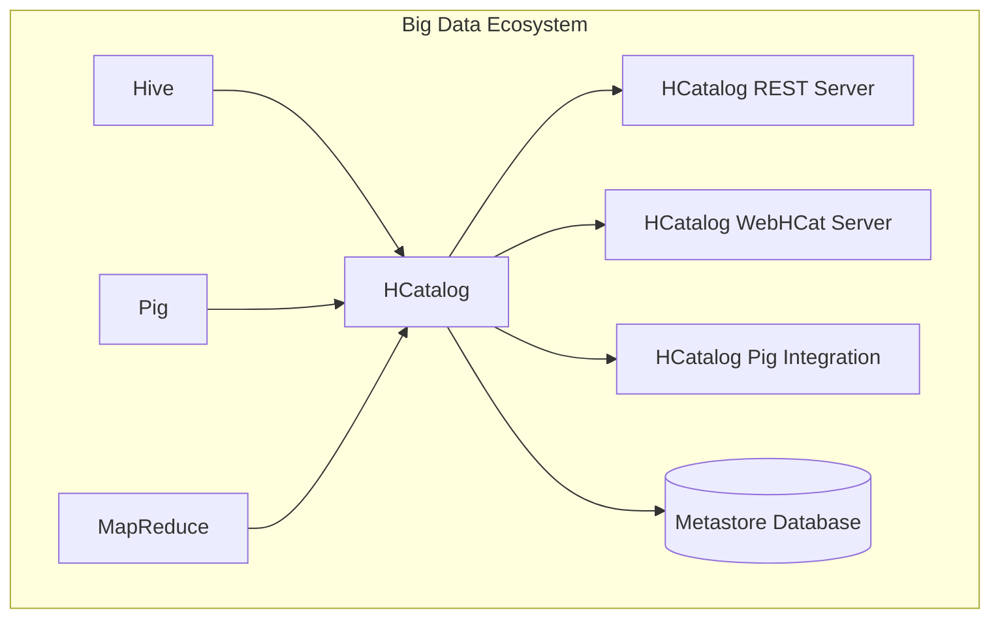

# HCatalog Table原理与代码实例讲解

## 1. 背景介绍

### 1.1 问题的由来

在大数据时代，海量数据的存储和管理成为了一个巨大的挑战。传统的关系型数据库已经无法满足大数据应用的需求,因为它们在处理结构化数据方面表现出色,但在处理非结构化和半结构化数据时却显得力不从心。为了解决这个问题,Apache Hive 作为一种建立在 Hadoop 之上的数据仓库工具应运而生。

Apache Hive 允许用户使用类似 SQL 的语言 HiveQL 来查询存储在 HDFS 或其他数据源中的数据。然而,Hive 本身并不直接管理数据,而是依赖于系统目录(metastore)来维护数据的元数据(metadata),如表的名称、列、分区等。最初,Hive 使用一个内置的关系型数据库 Derby 作为其 metastore,但这种方式在并发和可扩展性方面存在一些限制。

### 1.2 研究现状

为了解决 Hive metastore 的可扩展性问题,Apache 社区推出了 HCatalog,作为 Hive metastore 的一个替代方案。HCatalog 将 metastore 与 Hive 分离,并提供了一个可扩展、高可用和低延迟的关系型数据库支持,如 MySQL、PostgreSQL 等。HCatalog 不仅可以为 Hive 提供 metastore 服务,还可以为其他大数据工具(如 Pig、MapReduce 等)提供统一的元数据管理服务。

### 1.3 研究意义

HCatalog 的引入为大数据生态系统带来了一些重要的优势:

1. **元数据管理统一化**: HCatalog 提供了一个统一的元数据管理层,使得不同的大数据工具可以共享和访问相同的元数据,从而提高了数据的一致性和可管理性。

2. **可扩展性和高可用性**: 与 Hive 内置的 Derby 数据库相比,HCatalog 支持使用更加可靠和可扩展的关系型数据库,如 MySQL、PostgreSQL 等,从而提高了元数据服务的可用性和性能。

3. **数据共享**: HCatalog 允许不同的大数据工具共享相同的数据集,减少了数据重复存储和传输的开销。

4. **安全性**: HCatalog 提供了基于角色的访问控制(RBAC)机制,增强了元数据的安全性。

### 1.4 本文结构

本文将全面介绍 HCatalog Table 的原理和实现细节,内容包括:

- HCatalog 的核心概念和架构
- HCatalog Table 的数据模型和表结构
- 创建和管理 HCatalog Table 的具体步骤
- HCatalog 与 Hive、Pig 等工具的集成
- HCatalog Table 的实际应用场景
- HCatalog 的发展趋势和未来挑战

通过本文的学习,读者将对 HCatalog Table 有一个深入的理解,并掌握在实际项目中使用 HCatalog 的技能。

## 2. 核心概念与联系

在深入探讨 HCatalog Table 之前,我们需要先了解一些核心概念和它们之间的关系。

### 2.1 Hive Metastore

Hive Metastore 是 Hive 中用于存储元数据的组件。它维护着 Hive 中所有数据库、表、视图、分区等对象的元数据信息。最初,Hive Metastore 使用内置的 Derby 数据库,但由于其可扩展性和并发性能有限,后来引入了 HCatalog 作为替代方案。

### 2.2 HCatalog

HCatalog 是一个用于管理大数据工具(如 Hive、Pig、MapReduce 等)元数据的服务层。它提供了一个可扩展、高可用和低延迟的关系型数据库支持,如 MySQL、PostgreSQL 等。HCatalog 不仅可以为 Hive 提供 metastore 服务,还可以为其他大数据工具提供统一的元数据管理服务。

### 2.3 HCatalog Table

HCatalog Table 是 HCatalog 中用于描述数据集的抽象概念。它定义了数据的结构、存储格式、位置等元数据信息。HCatalog Table 可以被 Hive、Pig、MapReduce 等工具共享和访问,从而实现数据的统一管理和共享。

### 2.4 HCatalog REST Server

HCatalog REST Server 是一个提供 RESTful API 的服务器,允许客户端通过 HTTP 协议与 HCatalog 进行交互。它提供了一种标准化的方式来创建、修改和查询 HCatalog 中的元数据。

### 2.5 HCatalog WebHCat Server

HCatalog WebHCat Server 是一个基于 HTTP 的服务器,它提供了一个方便的接口,允许客户端使用 MapReduce 作业来处理 HCatalog 中的数据。它支持多种文件格式,如 TextFile、SequenceFile、RCFile 等。

### 2.6 HCatalog Pig Integration

HCatalog Pig Integration 是一个允许 Pig 直接读写 HCatalog 表的组件。它使得 Pig 可以无缝地访问和处理 HCatalog 中的数据,而无需手动指定数据的位置和格式。

下图展示了 HCatalog 及其相关组件在大数据生态系统中的位置:



## 3. 核心算法原理 & 具体操作步骤

### 3.1 算法原理概述

HCatalog Table 的核心原理是将数据集的元数据信息存储在关系型数据库中,并通过统一的 API 和服务层来管理和访问这些元数据。具体来说,HCatalog 将表的结构信息(如列名、数据类型等)、存储格式、位置等信息持久化到关系型数据库中。当需要访问这些数据时,HCatalog 会从数据库中读取相应的元数据,并将其传递给相应的大数据工具(如 Hive、Pig、MapReduce 等)进行处理。

### 3.2 算法步骤详解

创建和使用 HCatalog Table 的主要步骤如下:

1. **初始化 HCatalog 元数据服务**

   在使用 HCatalog 之前,需要先初始化元数据服务。这通常包括以下步骤:

   - 安装和配置关系型数据库(如 MySQL、PostgreSQL 等)
   - 在数据库中创建 HCatalog 所需的表和视图
   - 配置 HCatalog 连接到该数据库

2. **定义 HCatalog Table 结构**

   使用 HCatalog DDL 语句定义表的结构,包括表名、列名、数据类型、存储格式等信息。例如:

   ```sql
   CREATE TABLE hcatalog_table (
     id INT,
     name STRING,
     age INT
   )
   STORED AS ORC;
   ```

3. **将数据加载到 HCatalog Table**

   有多种方式可以将数据加载到 HCatalog Table 中:

   - 使用 Hive 或 Pig 的 LOAD 语句从 HDFS 或其他数据源加载数据
   - 直接在 HDFS 上创建数据文件,并将其与 HCatalog Table 关联
   - 使用 HCatalog 提供的 API 或工具将数据写入 HCatalog Table

4. **通过 HCatalog 访问数据**

   不同的大数据工具可以通过 HCatalog 访问和处理存储在 HCatalog Table 中的数据:

   - Hive 可以直接使用 HiveQL 查询 HCatalog 表
   - Pig 可以使用 HCatalog Pig Integration 读写 HCatalog 表
   - MapReduce 可以通过 HCatalog WebHCat Server 或 API 访问 HCatalog 表中的数据

5. **管理 HCatalog 元数据**

   HCatalog 提供了一系列命令和工具用于管理元数据,如创建、修改、删除表、分区等操作。这些操作最终都会反映到底层的关系型数据库中。

### 3.3 算法优缺点

**优点:**

- **可扩展性强**: 使用关系型数据库存储元数据,可以较好地解决 Hive 内置 Derby 数据库的可扩展性和并发性能问题。
- **元数据统一管理**: HCatalog 为不同的大数据工具提供了统一的元数据管理服务,提高了数据的一致性和可管理性。
- **数据共享**: 不同的工具可以共享和访问相同的 HCatalog 表,减少了数据重复存储和传输的开销。
- **安全性高**: HCatalog 提供了基于角色的访问控制(RBAC)机制,增强了元数据的安全性。

**缺点:**

- **额外的复杂性**: 引入 HCatalog 增加了系统的复杂性,需要额外配置和维护关系型数据库。
- **元数据和数据分离**: HCatalog 只管理元数据,实际数据仍然存储在 HDFS 或其他数据源中,可能会导致一些性能开销。
- **依赖关系型数据库**: HCatalog 的可靠性和性能在一定程度上依赖于底层的关系型数据库。

### 3.4 算法应用领域

HCatalog 及其 Table 概念主要应用于以下领域:

- **大数据管理**: HCatalog 为不同的大数据工具提供了统一的元数据管理服务,方便了大数据生态系统中各个组件之间的协作和数据共享。
- **数据湖**: HCatalog Table 可以用于构建数据湖,将来自不同源的数据集统一管理和访问。
- **ETL 流程**: HCatalog 可以在 ETL(提取、转换、加载)流程中发挥作用,方便不同工具之间的数据交换和转换。
- **元数据管理**: HCatalog 提供了一种集中式的元数据管理方式,有助于提高元数据的一致性和可管理性。

## 4. 数学模型和公式 & 详细讲解 & 举例说明

在 HCatalog 的实现中,并没有涉及太多复杂的数学模型和公式。不过,我们可以从存储和查询优化的角度,简单介绍一下 HCatalog 中可能使用的一些技术。

### 4.1 数据压缩

为了减少存储空间和提高查询性能,HCatalog 支持多种数据压缩格式,如 ORC、Parquet 等。这些格式通常采用一些压缩算法和编码技术来减小数据的存储大小。

常见的压缩算法包括:

- 熵编码: $$H(X) = -\sum_{i=1}^{n}P(x_i)\log_bP(x_i)$$

  其中 $H(X)$ 表示随机变量 $X$ 的信息熵, $P(x_i)$ 表示事件 $x_i$ 发生的概率, $b$ 是对数的底数。熵编码的基本思想是为出现概率较高的事件分配较短的编码,从而达到压缩的目的。

- 字典编码: 将重复出现的值映射到一个短的编码,从而减小存储空间。

- 行存储和列存储: 列存储格式(如 ORC、Parquet)通常比行存储格式(如 TextFile)具有更好的压缩率和查询性能,因为它可以更有效地对相同数据类型的值进行编码和压缩。

### 4.2 查询优化

HCatalog 通常依赖于底层的大数据工具(如 Hive、Pig 等)来执行实际的查询操作。这些工具通常会采用一些查询优化技术来提高查询性能,如:

- 谓词下推: 将一些过滤条件下推到数据读取阶段,减少需要读取和处理的数据量。
- 分区裁剪: 根据查询条件,只读取相关的数据分区,避免扫描整个数据集。
- 列裁剪: 只读取查询所需的列,减少数据读取和传输的开销。
- 代价模型: 基于数据统计信息和查询计划的代价估算,选择最优的查询执行计