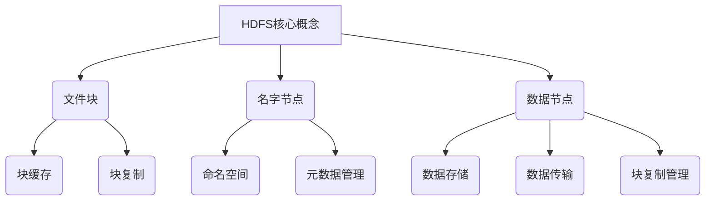

# HDFS原理与代码实例讲解

## 1. 背景介绍

### 1.1 问题的由来

随着大数据时代的到来，传统的存储系统已经无法满足海量数据的存储和处理需求。传统存储系统面临着可靠性、可扩展性和数据本地化计算等诸多挑战。为了解决这些问题,Google于2003年提出了Google文件系统(GFS)的概念,这为分布式文件系统的发展奠定了基础。

### 1.2 研究现状

受GFS理念的启发,Apache Hadoop项目应运而生,其中HDFS(Hadoop分布式文件系统)作为Hadoop的核心组件之一,成为了业界广泛使用的分布式文件系统。HDFS被设计用于在廉价的机器上可靠地存储大规模数据集,并提供高吞吐量的数据访问。它具有容错性、可扩展性、高吞吐量等优点,适用于大数据场景下的数据存储和处理。

### 1.3 研究意义

深入理解HDFS的原理和实现对于大数据开发者和系统架构师来说至关重要。掌握HDFS的设计思想、架构模式、核心算法和实现细节,可以帮助我们更好地设计和优化大数据应用,提高系统的可靠性和性能。此外,HDFS的许多设计理念和技术也为其他分布式系统的开发提供了借鉴和参考。

### 1.4 本文结构

本文将全面介绍HDFS的核心概念、架构设计、核心算法原理、数学模型、代码实现和实际应用场景。文章将从理论和实践两个层面深入探讨HDFS,帮助读者全面掌握HDFS的方方面面。

## 2. 核心概念与联系

HDFS的核心概念包括文件块(Block)、名字节点(NameNode)和数据节点(DataNode)。

1. **文件块(Block)**: HDFS将文件划分为一个个块(默认128MB),并将这些块分布式存储在集群中的多个数据节点上。每个块都会被复制到多个数据节点上,以提供容错能力和数据可靠性。块缓存(Block Cache)和块复制(Block Replication)是文件块的两个重要特性。

2. **名字节点(NameNode)**: 名字节点是HDFS的主节点,负责管理整个文件系统的命名空间(Namespace)和元数据(Metadata)。它维护了文件系统的目录树和文件到块的映射关系。名字节点还负责客户端请求的路由、数据块的复制和平衡等工作。

3. **数据节点(DataNode)**: 数据节点是HDFS的从节点,负责实际存储和管理数据块。它们定期向名字节点发送心跳信号和块报告,以确保整个系统的可靠性和一致性。数据节点还负责数据的读写操作、块复制和块删除等任务。

这三个核心概念紧密相连,共同构建了HDFS的分布式架构。名字节点管理文件系统的元数据,而数据节点负责存储和管理实际的数据块。文件块是HDFS存储和处理数据的基本单元,通过块缓存和块复制等机制提高了系统的性能和可靠性。

## 3. 核心算法原理 & 具体操作步骤

### 3.1 算法原理概述

HDFS的核心算法原理包括数据块放置策略、副本放置策略、负载均衡策略和故障恢复策略等。这些算法共同确保了HDFS的可靠性、可扩展性和高吞吐量。

1. **数据块放置策略**: HDFS采用了机架感知的数据块放置策略,将数据块复制到不同的机架上,以提高容错能力和数据可靠性。

2. **副本放置策略**: HDFS采用了机架感知的副本放置策略,优先将副本放置在不同的机架上,以最大化数据可靠性和网络带宽利用率。

3. **负载均衡策略**: HDFS通过数据块的复制和迁移来实现集群的负载均衡,确保每个数据节点的存储空间和计算资源得到合理利用。

4. **故障恢复策略**: HDFS通过副本复制和数据块迁移来实现故障恢复,确保数据的可靠性和可用性。

### 3.2 算法步骤详解

1. **数据块放置策略**:

   a) 客户端向名字节点发送写请求,名字节点分配一个新的数据块ID。

   b) 名字节点选择距离客户端最近的数据节点作为写入节点。

   c) 名字节点选择与写入节点不在同一机架的数据节点作为第二个副本节点。

   d) 名字节点选择与前两个节点不在同一机架的数据节点作为第三个副本节点。

   e) 如果无法找到合适的机架,则在同一机架内选择其他数据节点。

2. **副本放置策略**:

   a) 名字节点维护一个集群拓扑结构,包括机架和数据节点信息。

   b) 名字节点根据集群拓扑结构,优先选择不同机架上的数据节点存储副本。

   c) 如果无法在不同机架上找到合适的数据节点,则在同一机架内选择其他数据节点。

   d) 副本放置策略旨在最大化数据可靠性和网络带宽利用率。

3. **负载均衡策略**:

   a) 名字节点定期检查集群中数据节点的存储空间利用率。

   b) 如果某个数据节点的存储空间利用率过高或过低,名字节点会触发数据块迁移。

   c) 名字节点选择合适的源数据节点和目标数据节点,将数据块从源节点迁移到目标节点。

   d) 迁移过程中,数据块会在源节点和目标节点之间复制,确保数据安全。

4. **故障恢复策略**:

   a) 数据节点定期向名字节点发送心跳信号和块报告。

   b) 如果名字节点在一定时间内未收到某个数据节点的心跳信号,则认为该节点已失效。

   c) 名字节点检查失效节点上的数据块副本数量,如果低于复制因子,则触发数据块复制。

   d) 名字节点选择其他数据节点作为目标节点,将失效节点上的数据块复制到目标节点上。

### 3.3 算法优缺点

**优点**:

1. 机架感知的数据块放置和副本放置策略提高了数据可靠性和网络带宽利用率。
2. 负载均衡策略确保了集群资源的合理利用,提高了系统的可扩展性。
3. 故障恢复策略通过数据块复制和迁移,确保了数据的可靠性和可用性。

**缺点**:

1. 名字节点作为单点,存在单点故障风险。
2. 大量小文件会导致元数据管理开销较大。
3. 对于低延迟场景,HDFS的高吞吐量优势可能无法体现。

### 3.4 算法应用领域

HDFS的核心算法原理广泛应用于以下领域:

1. **大数据处理**: HDFS是Hadoop生态系统的核心组件,广泛应用于大数据处理场景,如批处理、数据分析和机器学习等。

2. **云存储**: HDFS的设计理念和技术也被应用于云存储系统,如Amazon S3、Google Cloud Storage等。

3. **内容分发网络(CDN)**: HDFS的数据块复制和负载均衡策略可以应用于CDN系统,提高内容分发的效率和可靠性。

4. **物联网(IoT)**: HDFS可以用于存储和处理来自物联网设备的海量数据。

5. **科学计算**: HDFS可以支持大规模科学计算任务,如基因组学、气象学和天文学等领域的数据处理。

## 4. 数学模型和公式 & 详细讲解 & 举例说明

HDFS的设计和实现涉及了多个数学模型和公式,包括数据块放置模型、副本放置模型、负载均衡模型和故障恢复模型等。

### 4.1 数学模型构建

1. **数据块放置模型**:

   假设集群中有 $N$ 个机架,每个机架有 $M$ 个数据节点。对于一个文件 $F$,需要存储 $R$ 个副本。我们定义以下变量:

   - $X_{ijk}$: 如果第 $i$ 个副本存储在第 $j$ 个机架的第 $k$ 个数据节点上,则 $X_{ijk} = 1$,否则 $X_{ijk} = 0$。
   - $d_{ij}$: 客户端到第 $j$ 个机架的第 $i$ 个数据节点的距离。

   我们的目标是最小化数据块的总网络传输开销:

   $$
   \min \sum_{i=1}^{R} \sum_{j=1}^{N} \sum_{k=1}^{M} d_{ij} X_{ijk}
   $$

   subject to:

   $$
   \sum_{i=1}^{R} \sum_{j=1}^{N} \sum_{k=1}^{M} X_{ijk} = R
   $$

   $$
   \sum_{k=1}^{M} X_{ijk} \leq 1, \forall i, j
   $$

   $$
   X_{ijk} \in \{0, 1\}, \forall i, j, k
   $$

   这是一个整数线性规划问题,可以通过求解得到最优的数据块放置方案。

2. **副本放置模型**:

   假设集群中有 $N$ 个机架,每个机架有 $M$ 个数据节点。对于一个文件 $F$,需要存储 $R$ 个副本。我们定义以下变量:

   - $X_{ijk}$: 如果第 $i$ 个副本存储在第 $j$ 个机架的第 $k$ 个数据节点上,则 $X_{ijk} = 1$,否则 $X_{ijk} = 0$。
   - $B_{ij}$: 如果第 $i$ 个副本存储在第 $j$ 个机架上,则 $B_{ij} = 1$,否则 $B_{ij} = 0$。

   我们的目标是最大化副本在不同机架上的分布:

   $$
   \max \sum_{i=1}^{R} \sum_{j=1}^{N} B_{ij}
   $$

   subject to:

   $$
   \sum_{i=1}^{R} \sum_{j=1}^{N} \sum_{k=1}^{M} X_{ijk} = R
   $$

   $$
   \sum_{k=1}^{M} X_{ijk} \leq B_{ij}, \forall i, j
   $$

   $$
   \sum_{j=1}^{N} B_{ij} \leq 1, \forall i
   $$

   $$
   X_{ijk}, B_{ij} \in \{0, 1\}, \forall i, j, k
   $$

   这也是一个整数线性规划问题,可以通过求解得到最优的副本放置方案。

3. **负载均衡模型**:

   假设集群中有 $N$ 个数据节点,每个数据节点的容量为 $C$。对于一个文件 $F$,需要存储 $R$ 个副本,文件大小为 $S$。我们定义以下变量:

   - $X_{ij}$: 如果第 $i$ 个副本存储在第 $j$ 个数据节点上,则 $X_{ij} = 1$,否则 $X_{ij} = 0$。
   - $L_j$: 第 $j$ 个数据节点的负载。

   我们的目标是最小化集群中数据节点负载的方差:

   $$
   \min \sum_{j=1}^{N} (L_j - \bar{L})^2
   $$

   subject to:

   $$
   \sum_{i=1}^{R} \sum_{j=1}^{N} X_{ij} = R
   $$

   $$
   \sum_{i=1}^{R} X_{ij} S \leq C, \forall j
   $$

   $$
   L_j = \sum_{i=1}^{R} X_{ij} S, \forall j
   $$

   $$
   \bar{