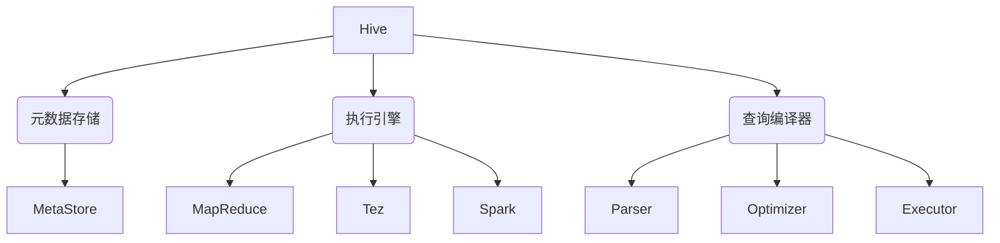

# Hive原理与代码实例讲解

## 1. 背景介绍

### 1.1 问题的由来

在大数据时代,海量的结构化和非结构化数据不断产生,传统的数据库管理系统已经无法满足存储和处理这些大规模数据集的需求。Apache Hive应运而生,作为建立在Hadoop之上的数据仓库基础工具,它为大数据环境提供了数据汇总、查询和分析的能力。

### 1.2 研究现状

Hive最初由Facebook开发,后来加入Apache软件基金会,成为Apache开源项目的一部分。它采用了类SQL语言HiveQL,使得熟悉SQL的开发人员能够轻松地将SQL技能迁移到Hadoop生态系统中。Hive广泛应用于各行各业,成为大数据分析的重要工具。

### 1.3 研究意义

深入理解Hive的原理和实现机制,对于充分利用其强大功能、优化查询性能、扩展自定义功能等具有重要意义。本文将全面剖析Hive的核心概念、算法原理、数学模型、代码实现和实际应用场景,为读者提供系统化的Hive知识体系。

### 1.4 本文结构

本文首先介绍Hive的核心概念和它们之间的关系,然后深入探讨Hive的算法原理和数学模型,接着通过代码实例详细说明Hive的实现细节。最后,文章将分享Hive在实际应用中的场景,并对其未来发展趋势和挑战进行展望。

## 2. 核心概念与联系



Hive的核心概念包括以下几个方面:

1. **元数据存储(MetaStore)**: Hive将其元数据(如表、视图、分区等)存储在关系数据库中,默认使用Derby数据库。MetaStore负责管理这些元数据。

2. **执行引擎**: Hive支持多种执行引擎,包括MapReduce、Tez和Spark。用户可以根据需求选择合适的引擎。

3. **查询编译器**: 查询编译器负责将HiveQL查询转换为可执行的作业计划。它包括三个主要组件:Parser(解析器)、Optimizer(优化器)和Executor(执行器)。

这些核心概念密切相关,共同构成了Hive的整体架构。MetaStore为Hive提供元数据支持,执行引擎负责实际执行查询,而查询编译器则将HiveQL查询转换为可执行的作业计划,并利用执行引擎运行这些计划。

## 3. 核心算法原理 & 具体操作步骤

### 3.1 算法原理概述

Hive的查询执行过程可以概括为以下几个主要步骤:

1. **语法分析**: 将HiveQL查询字符串解析为抽象语法树(AST)。
2. **逻辑优化**: 对AST进行一系列规则优化,如投影剪裁、谓词下推等。
3. **物理优化**: 根据统计信息选择最佳的执行计划。
4. **执行**: 将优化后的执行计划转换为一系列任务,并提交给执行引擎运行。

### 3.2 算法步骤详解

1. **语法分析**

   Hive使用ANTLR工具自动构建HiveQL的语法分析器,将查询字符串解析为抽象语法树(AST)。AST是一种树状数据结构,用于表示查询的逻辑结构。

2. **逻辑优化**

   逻辑优化阶段对AST进行一系列规则优化,以提高查询效率。常见的优化规则包括:

   - **投影剪裁(ProjectionPruningOptimizer)**: 移除不需要的列
   - **谓词下推(PredicatePushdownOptimizer)**: 将过滤条件下推到数据读取阶段
   - **分区剪裁(PartitionPruningOptimizer)**: 根据过滤条件只读取相关分区
   - **常量折叠(ConstantFoldingOptimizer)**: 预计算常量表达式

3. **物理优化**

   物理优化阶段根据统计信息选择最佳的执行计划。主要包括以下步骤:

   - **统计信息收集**: 从MetaStore获取表和分区的统计信息
   - **代价模型**: 基于统计信息估算每个执行计划的代价
   - **选择最优计划**: 根据代价模型选择代价最小的执行计划

4. **执行**

   最后,Hive将优化后的执行计划转换为一系列MapReduce/Tez/Spark任务,并提交给相应的执行引擎运行。执行引擎负责调度和执行这些任务,并将结果返回给Hive。

### 3.3 算法优缺点

**优点**:

- 借助SQL语义,降低了大数据处理的学习门槛
- 查询优化器可以自动选择最佳的执行计划
- 支持多种执行引擎,可根据需求进行选择

**缺点**:

- 由于需要启动MapReduce/Tez/Spark任务,存在较高的延迟
- 对于迭代式或流式计算,Hive的性能不佳
- 缺乏高级分析功能,如机器学习、图计算等

### 3.4 算法应用领域

Hive主要应用于以下领域:

- **数据ETL**: 利用HiveQL对数据进行提取、转换和加载
- **交互式数据分析**: 使用HiveQL进行ad-hoc查询和数据探索
- **批量数据分析**: 对大规模数据集进行定期统计和报告
- **数据仓库**: 将Hive作为数据仓库的查询引擎

## 4. 数学模型和公式 & 详细讲解 & 举例说明

### 4.1 数学模型构建

在Hive的查询优化过程中,需要估算不同执行计划的代价,以选择最优计划。Hive采用了基于代价模型的优化策略,其核心是建立数学代价模型,对执行计划的代价进行估算。

假设一个查询需要扫描表T,过滤条件为P,最终只需要输出列L。我们定义以下符号:

- $n$: 表T的行数
- $s$: 表T的大小(字节)
- $f_P$: 过滤条件P的选择率
- $w_L$: 输出列L的平均宽度(字节)

则该查询的代价可以表示为:

$$\text{Cost} = \text{IO} + \text{CPU}$$

其中,IO代价为:

$$\text{IO} = s$$

CPU代价为:

$$\text{CPU} = n \times f_\text{CPU}$$

$f_\text{CPU}$是CPU代价函数,用于估算每行记录的CPU开销。它通常由以下几个部分组成:

$$f_\text{CPU} = f_\text{eval}(P) + f_\text{proj}(L) + f_\text{qual}$$

- $f_\text{eval}(P)$: 计算过滤条件P的开销
- $f_\text{proj}(L)$: 投影输出列L的开销,与$w_L$有关
- $f_\text{qual}$: 其他固定开销,如行反序列化等

最终,查询的总代价为:

$$\text{Cost} = s + n \times (f_\text{eval}(P) + f_\text{proj}(L) + f_\text{qual})$$

通过估算不同执行计划的代价,优化器可以选择代价最小的计划作为最优执行计划。

### 4.2 公式推导过程

我们以投影操作的CPU代价$f_\text{proj}(L)$为例,推导其数学公式:

假设输出列L包含$k$个列,每个列的平均宽度为$w_i$,则L的总宽度为:

$$w_L = \sum_{i=1}^k w_i$$

投影操作需要为每行记录构造输出行,包括以下步骤:

1. 分配输出行的内存空间,代价为$c_1$
2. 复制每个输出列的值,对于第i个列,代价为$c_2 \times w_i$

则投影操作的总代价为:

$$f_\text{proj}(L) = c_1 + \sum_{i=1}^k c_2 \times w_i = c_1 + c_2 \times w_L$$

其中$c_1$和$c_2$是常数,可以通过实验确定。

将$f_\text{proj}(L)$代入总代价公式,我们可以得到查询的完整代价模型。

### 4.3 案例分析与讲解

假设有一个表`sales`,包含以下列:

- `sale_id`: 销售ID(int)
- `product_id`: 产品ID(int)
- `customer_id`: 客户ID(int)
- `price`: 销售价格(double)
- `sale_date`: 销售日期(date)

我们需要统计每个产品的总销售额,查询如下:

```sql
SELECT product_id, SUM(price) AS total_sales
FROM sales
GROUP BY product_id;
```

假设`sales`表有1亿行,大小为10GB,过滤条件的选择率为1(不过滤),则根据上述代价模型,该查询的代价为:

$$\begin{align*}
\text{Cost} &= \text{IO} + \text{CPU} \\
            &= 10 \times 10^9 + 10^8 \times (f_\text{eval}(\text{true}) + f_\text{proj}(\text{product_id, total_sales}) + f_\text{qual}) \\
            &= 10^{10} + 10^8 \times (c_3 + c_1 + 2c_2w_\text{int} + c_4)
\end{align*}$$

其中:

- $f_\text{eval}(\text{true}) = c_3$(过滤条件为true,代价为常数)
- $f_\text{proj}(\text{product_id, total_sales}) = c_1 + 2c_2w_\text{int}$(输出两个整型列)
- $f_\text{qual} = c_4$(其他固定开销)
- $w_\text{int}$为整型列的平均宽度(通常为4字节)

通过估算该查询的代价,优化器可以与其他候选执行计划进行比较,选择代价最小的计划作为最终执行计划。

### 4.4 常见问题解答

1. **如何获取表和列的统计信息?**

   Hive会周期性地收集和持久化表和列的统计信息,如行数、数据大小、列值的最大/最小值等。用户也可以手动运行`ANALYZE`语句来收集统计信息。

2. **代价模型是否考虑了数据倾斜?**

   目前Hive的代价模型还没有很好地解决数据倾斜问题。对于存在数据倾斜的查询,实际执行代价可能会偏离代价模型的估算结果。

3. **代价模型如何处理UDF(用户定义函数)?**

   对于UDF,Hive会根据UDF的代码复杂度给出一个固定的代价估算值。但是,这种估算可能不够准确。

4. **是否可以自定义代价模型?**

   Hive允许用户通过实现`org.apache.hadoop.hive.ql.optimizer.cost.ICostModel`接口来自定义代价模型。不过,自定义代价模型需要对查询执行有深入的理解。

## 5. 项目实践:代码实例和详细解释说明

### 5.1 开发环境搭建

要运行Hive代码示例,我们需要先搭建Hive的开发环境。以下是主要步骤:

1. 安装Hadoop集群(或者使用Pseudo分布式模式)
2. 下载Hive发行版,解压缩
3. 配置Hive的`hive-site.xml`文件,指定MetaStore的连接信息
4. 启动Hive的MetaStore服务
5. 启动Hive CLI或者Beeline客户端

### 5.2 源代码详细实现

我们以`ColumnPruningPersistInput`为例,展示Hive中投影剪裁优化的实现细节。

`ColumnPruningPersistInput`是一个Hive优化器规则,它负责将不需要的列从查询计划中移除,以减少I/O开销。其核心代码如下:

```java
public Object transform(Object input) {
  // 获取查询计划的逻辑表达式
  OpWalkerInfo opWalkerInfo = ServerUtils.getOpWalkerInfo(input);
  List<Node> topNodes = opWalkerInfo.getTopOps();

  // 遍历查询计划,