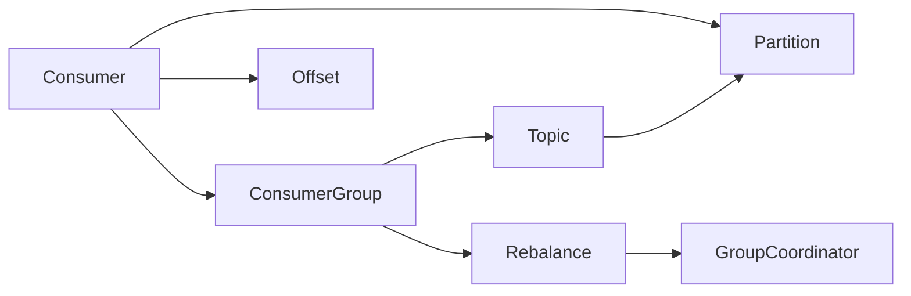

# Kafka Consumer原理与代码实例讲解

## 1. 背景介绍
### 1.1  问题的由来
在大数据时代，数据的实时处理和分析变得越来越重要。如何高效、可靠地在分布式系统中传输和消费海量数据，成为了一个亟待解决的问题。Kafka作为一个分布式的流处理平台，凭借其高吞吐、低延迟、可扩展等优点，在实时数据处理领域得到了广泛应用。而Kafka Consumer作为Kafka生态系统中的重要组成部分，承担着从Kafka中消费数据的重任。深入理解Kafka Consumer的工作原理和实现方式，对于开发高性能、高可靠的实时数据处理应用至关重要。

### 1.2  研究现状
目前，业界对Kafka Consumer的研究主要集中在以下几个方面：

1. Consumer的分区分配策略和再平衡机制。Kafka Consumer采用Consumer Group的方式来实现消费者的负载均衡和容错。研究者们探索了不同的分区分配算法，如Range、RoundRobin、Sticky等，以提高消费者的吞吐量和降低再平衡的开销。

2. 提交偏移量的方式和语义保证。Kafka提供了自动提交和手动提交两种offset提交方式，以及at-most-once、at-least-once、exactly-once三种语义保证。研究人员分析了不同提交方式和语义在实际应用中的优缺点，并提出了一些改进方案。

3. Consumer的故障恢复和高可用性。研究者们探索了基于Kafka的Consumer端高可用方案，如利用ZooKeeper实现Consumer的故障检测和自动重启，设计基于Group Coordinator的Consumer高可用方案等。

4. 与流处理框架的集成。很多流处理框架，如Spark Streaming、Flink等，都以Kafka作为数据源。研究人员分析了这些框架与Kafka Consumer的集成方式，并提出了一些优化方案来改善端到端的性能。

### 1.3  研究意义
深入研究Kafka Consumer原理和实现，有助于我们：

1. 开发出高性能、高可靠的消费者应用，充分发挥Kafka的性能优势。
2. 根据业务场景的特点，选择合适的消费者配置和使用方式，避免潜在的问题。
3. 优化Kafka Consumer与流处理框架的集成，提升整个流处理管道的效率。
4. 设计基于Kafka的消费端高可用方案，保障系统的稳定性。

### 1.4  本文结构
本文将围绕Kafka Consumer的原理和实现展开，主要内容包括：

1. Kafka Consumer的核心概念和基本架构
2. 消费者组、分区再平衡、位移提交等核心机制原理
3. 消费者配置参数详解
4. Kafka Consumer的代码实例和详细讲解
5. 消费者的最佳实践和注意事项
6. Kafka Consumer的新特性和发展趋势

## 2. 核心概念与联系
在深入探讨Kafka Consumer原理之前，我们先来了解一下Kafka Consumer的一些核心概念：

- Consumer：消费者，负责订阅Kafka中的Topic，并消费其中的消息。
- ConsumerGroup：消费者组，由多个Consumer实例组成，共同消费一个或多个Topic。组内的Consumer实例可以分布在不同的进程或机器上。
- Partition：分区，一个Topic可以分为多个Partition，每个Partition是一个有序的、不可变的消息序列，可以被Consumer并行消费。
- Offset：位移，表示一个Consumer在一个Partition中消费到的位置。Kafka使用Offset来记录Consumer的消费进度。
- Rebalance：再平衡，指ConsumerGroup内的Consumer实例动态地调整分配到的Partition集合的过程。当Group内成员发生变更（新Consumer加入、已有Consumer离开或Crash），或者订阅的Topic的Partition数发生变化时，就会触发Rebalance。
- GroupCoordinator：消费者组协调器，负责管理ConsumerGroup的成员关系，以及协调Rebalance过程。

下图展示了这些核心概念之间的关系：

从图中可以看出：
- 多个Consumer实例组成ConsumerGroup，共同消费一个或多个Topic。
- 一个Topic可以分为多个Partition，每个Partition由Group中的一个Consumer实例独占消费。
- Consumer通过Offset来跟踪在每个Partition上的消费进度。
- ConsumerGroup依赖GroupCoordinator来管理成员关系和Rebalance过程。

理解这些核心概念之间的关系，有助于我们更好地理解Kafka Consumer的工作原理。

## 3. 核心算法原理 & 具体操作步骤
### 3.1  算法原理概述
Kafka Consumer的核心算法主要涉及以下几个方面：

1. 分区分配策略：Kafka采用ConsumerGroup的方式来实现Consumer的负载均衡和容错。当Group内的Consumer实例发生变更，或者Topic的Partition数发生变化时，Kafka需要重新给Group内的Consumer分配Partition。Kafka内置了Range、RoundRobin、Sticky等分区分配策略，用户也可以自定义分配策略。

2. 位移提交：Consumer需要定期向Kafka汇报自己消费到的位置，即提交位移(Offset)。Kafka支持自动提交和手动提交两种方式。自动提交由Consumer定期自动进行，手动提交由用户代码控制。位移提交是Consumer实现Exactly-Once语义的基础。

3. 心跳机制：Consumer需要定期向GroupCoordinator发送心跳，以表明自己还存活着。如果Consumer在一定时间内没有发送心跳，Coordinator就会认为该Consumer已经死亡，并触发Rebalance。

4. 再平衡协议：当ConsumerGroup发生Rebalance时，Kafka需要保证Group内的所有成员看到的元数据信息是一致的，这是通过Rebalance协议来实现的。Rebalance过程分为Join、Sync、Heartbeat三个阶段，通过这三个阶段，可以保证Group内的Consumer实例对分配方案达成一致，以及故障Consumer的检测和剔除。

### 3.2  算法步骤详解
下面我们以Kafka Consumer的Poll模型为例，详细讲解其核心算法步骤：

1. 初始化阶段：
   - Consumer向GroupCoordinator发送JoinGroup请求，请求加入ConsumerGroup。
   - Coordinator选择一个Consumer作为Group Leader，并将Group的成员信息（Member ID和订阅信息）发送给Leader。
   - Leader根据分区分配策略，为每个Consumer分配Partition，并将分配方案发送给Coordinator。
   - Coordinator将分配方案转发给Group内所有的Consumer。

2. 稳定消费阶段：
   - Consumer根据分配方案，消费分配给自己的Partition中的消息。
   - Consumer定期向Coordinator发送心跳，汇报自己的消费进度，即提交位移。
   - Consumer也会定期向Coordinator发送Fetch请求，获取新的消息。

3. 再平衡阶段：
   - 当Group内成员发生变更，或者Topic的Partition数发生变化时，Coordinator会触发Rebalance。
   - Coordinator向Group内所有Consumer发送Rebalance通知。
   - 收到通知的Consumer会停止消费，提交位移，等待新的分配方案。
   - Rebalance完成后，Consumer根据新的分配方案继续消费。

4. 位移提交：
   - Consumer在消费消息后，需要向Kafka提交位移，表明自己消费到的位置。
   - 自动提交：Consumer定期自动向Kafka发送位移提交请求。
   - 手动提交：用户在代码中控制何时提交位移。
   - 同步提交：Consumer在提交位移后，会等待Kafka的响应，以确保位移提交成功。
   - 异步提交：Consumer提交位移后，不等待Kafka的响应，直接继续消费。

### 3.3  算法优缺点
Kafka Consumer的Poll模型有以下优点：
1. 简单易用：用户只需要定义好消费逻辑，然后循环调用poll()方法即可，不需要关心底层的网络通信和协议细节。
2. 高性能：Poll模型采用批量拉取的方式，可以减少网络IO次数，提高消费吞吐量。
3. 自动负载均衡：Kafka会根据分区分配策略，自动为ConsumerGroup内的Consumer实例分配Partition，实现消费负载的均衡。
4. 自动容错：当Consumer实例失败时，Kafka会自动将失败实例的Partition分配给其他Consumer，保证消费任务的继续进行。

但是Poll模型也有一些缺点：
1. 不支持事务：Poll模型不支持跨Partition的事务消费，无法保证严格的消息顺序和Exactly-Once语义。
2. 不支持消息过滤：Poll模型拉取到的是Partition中的所有消息，不支持按条件过滤消息。如果需要过滤，只能在客户端进行。
3. 不支持消息路由：Poll模型无法根据消息的Key或者Header将消息路由到指定的Consumer实例。

### 3.4  算法应用领域
Kafka Consumer的Poll模型广泛应用于各种实时数据处理场景，如：

1. 日志收集和监控：将分布式系统的日志数据汇总到Kafka，然后通过Consumer将日志数据读取出来，进行实时的监控和分析。
2. 数据管道：将上游系统产生的数据写入Kafka，下游系统通过Consumer读取数据进行处理，构建数据处理管道。
3. 事件驱动系统：将系统内的各种事件（如用户操作、系统状态变更等）写入Kafka，其他模块通过Consumer订阅相关的事件并进行处理，实现事件驱动的架构。
4. 流处理：将数据流写入Kafka，然后通过Spark Streaming、Flink等流处理框架消费Kafka的数据，进行实时的数据处理和分析。

## 4. 数学模型和公式 & 详细讲解 & 举例说明
### 4.1  数学模型构建
我们可以使用队列模型来抽象Kafka的消息消费过程。假设有m个Consumer从n个Partition中消费消息，每个Partition的消息到达率为$\lambda_i$（条/秒），第i个Consumer的消息处理率为$\mu_i$（条/秒）。我们的目标是找到一个最优的分区分配方案，使得所有Consumer的处理率之和最大，同时保证每个Partition只被一个Consumer消费。

我们可以定义一个二元决策变量$x_{ij}$，表示第i个Consumer是否消费第j个Partition：

$$
x_{ij} = \begin{cases}
1, & \text{if Consumer i is assigned to Partition j} \\
0, & \text{otherwise}
\end{cases}
$$

那么，我们可以将分区分配问题建模为一个整数规划问题：

$$
\begin{align*}
\max \quad & \sum_{i=1}^{m} \mu_i \sum_{j=1}^{n} \lambda_j x_{ij} \\
\text{s.t.} \quad & \sum_{i=1}^{m} x_{ij} = 1, \quad j = 1,2,\dots,n \\
& \sum_{j=1}^{n} x_{ij} \geq 1, \quad i = 1,2,\dots,m \\
& x_{ij} \in \{0, 1\}, \quad i = 1,2,\dots,m, \quad j = 1,2,\dots,n
\end{align*}
$$

其中，目标函数表示所有Consumer的处理率之和；第一个约束条件保证每个Partition只被一个Consumer消费；第二个约束条件保证每个Consumer至少分配到一个Partition；第三个约束条件定义了决策变量的取值范围。

### 4.2  公式推导过程
上述整数规划模型可以使用分支定界法、切平面法等方法求解。但是在实际应用中，由于Consumer和Partition的数量可能很大，求解这样的整数规划问题的计算复杂度很高。因此，Kafka采用了一些启发式的分区分配算法，如Range、RoundRobin等。

以Range算法为例，其核心思想是将Partition按照序号排序，然后将它们均分给Consumer。假设有n个Partition和m个Consumer，则每个Consumer分配到的Partition数量为：

$$
p = \lfloor \frac{n}{m} \rfloor
$$

前$m-1$个Consumer每个分配到p个Partition，最后一个Consumer分配到剩余的$n-(m-1)p$个Partition。

例如，假设有10个Partition（编号为0~9），3个Consumer（编号为0~2），则分配结果为：
- Consumer 0：0, 1, 2, 3
- Consumer 1：4, 5, 6
- Consumer 2：