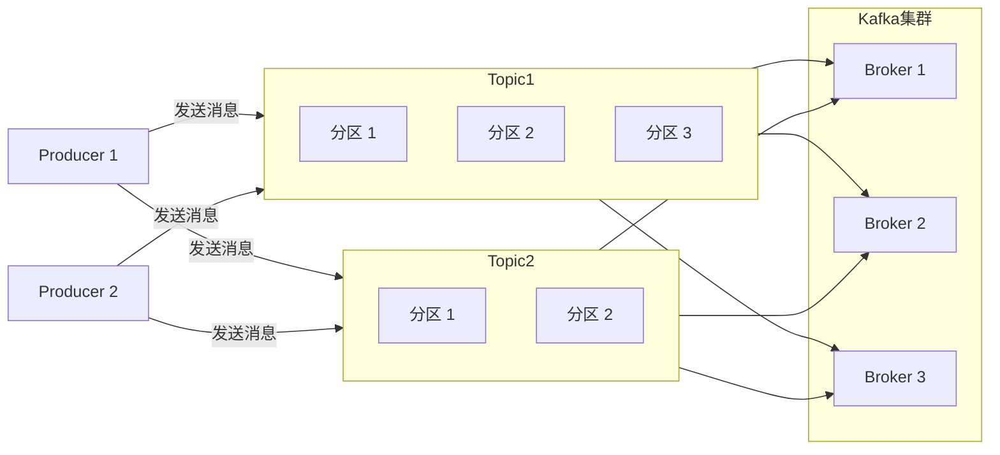
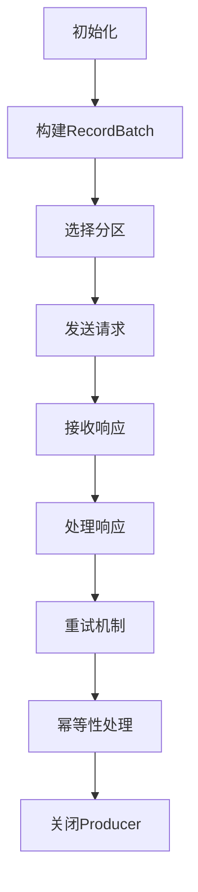

# Kafka Producer原理与代码实例讲解

## 1. 背景介绍

### 1.1 问题的由来

在现代分布式系统中，数据的实时传输和处理是一个关键的挑战。传统的消息队列系统往往存在吞吐量有限、可扩展性差、难以容错等问题。Apache Kafka作为一种分布式流处理平台,被广泛应用于大数据领域,能够可靠地处理大规模日志数据,满足了企业对于实时数据管道的需求。

Kafka Producer作为Kafka的重要组成部分,负责向Kafka集群发送消息。Producer的设计直接影响了数据的写入效率和可靠性。因此,理解Kafka Producer的原理和实现细节,对于构建高性能、可靠的数据管道至关重要。

### 1.2 研究现状

Kafka Producer的设计和实现一直是研究热点。业界和学术界已经提出了多种优化方案,旨在提高Producer的吞吐量、减少延迟、提升容错能力等。常见的优化策略包括:

- 批量发送: 将多个消息打包成一个批次发送,减少网络开销。
- 压缩: 对消息进行压缩,减小网络传输的数据量。
- 异步发送: 使用异步发送模式,提高吞吐量。
- 幂等性: 确保相同的消息只会被写入一次,避免重复写入。
- 容错机制: 引入重试机制、备份机制等,提高可靠性。

尽管取得了一定进展,但仍然存在一些挑战,如何在吞吐量、延迟、可靠性和资源利用率之间寻求平衡,是一个值得深入探讨的问题。

### 1.3 研究意义

深入理解Kafka Producer的原理和实现细节,对于构建高性能、可靠的数据管道具有重要意义:

1. 性能优化: 通过掌握Producer的工作原理,可以针对性地进行性能优化,提高吞吐量,降低延迟。
2. 可靠性提升: 了解Producer的容错机制,有助于提高数据传输的可靠性,避免数据丢失。
3. 资源利用: 合理配置Producer参数,可以最大化利用资源,提高资源利用率。
4. 架构设计: 在设计分布式系统时,可以更好地利用Kafka Producer的特性,构建高效的数据管道。
5. 问题排查: 掌握Producer的原理,有助于快速定位和解决生产环境中遇到的问题。

### 1.4 本文结构

本文将全面介绍Kafka Producer的原理和实现细节,内容安排如下:

1. 背景介绍: 阐述问题的由来、研究现状和研究意义。
2. 核心概念与联系: 介绍Kafka Producer相关的核心概念及其关系。
3. 核心算法原理与具体操作步骤: 详细解释Producer的核心算法原理和操作流程。
4. 数学模型和公式详细讲解与举例说明: 阐述Producer相关的数学模型和公式,并通过案例进行讲解。
5. 项目实践:代码实例和详细解释说明: 提供Producer的代码实例,并进行详细解释和分析。
6. 实际应用场景: 介绍Producer在实际场景中的应用,并展望未来的发展方向。
7. 工具和资源推荐: 推荐一些有用的学习资源、开发工具和相关论文。
8. 总结:未来发展趋势与挑战: 总结研究成果,并探讨Producer未来的发展趋势和面临的挑战。
9. 附录:常见问题与解答: 列出一些常见问题并给出解答。

## 2. 核心概念与联系

在深入探讨Kafka Producer的原理和实现之前,我们需要先了解一些核心概念及其关系。

### 2.1 Kafka集群

Kafka集群是一个分布式系统,由多个Broker组成。每个Broker是一个Kafka服务实例,负责存储和管理分区(Partition)数据。

### 2.2 Topic和分区

Topic是Kafka的基本数据单元,相当于一个消息队列。每个Topic可以被分为多个分区,分区是并行处理和存储的基本单元。消息以追加的方式写入分区,分区内部消息是有序的。

### 2.3 Producer

Producer是向Kafka集群发送消息的客户端。Producer需要指定消息的目标Topic,Kafka会根据分区策略将消息写入对应的分区。

### 2.4 分区策略

Kafka提供了多种分区策略,用于确定消息应该写入哪个分区。常见的策略包括:

- 轮询(Round-Robin): 将消息平均分配到所有分区。
- Key哈希: 根据消息Key的哈希值映射到特定分区。
- 自定义分区器: 用户可以实现自定义的分区策略。

### 2.5 消息批次

为了提高吞吐量,Producer会将多个消息打包成一个批次(Batch)发送。批次大小和延迟阈值可以通过参数进行配置。

### 2.6 幂等性

Kafka Producer支持幂等性,即相同的消息只会被写入一次。这可以通过为每个Producer分配一个唯一的Producer ID(PID)来实现。

### 2.7 核心概念关系

上述核心概念之间存在密切的关系,如下图所示:

Producer向Topic发送消息,消息被分发到不同的分区,分区数据存储在Broker上。Producer可以通过配置分区策略来控制消息写入的分区。

## 3. 核心算法原理与具体操作步骤

### 3.1 算法原理概述

Kafka Producer的核心算法原理可以概括为以下几个方面:

1. **消息批处理**: Producer会将多个消息缓存在内存中,形成一个批次,然后一次性发送给Broker。这种批处理机制可以减少网络开销,提高吞吐量。

2. **异步发送**: Producer采用异步发送模式,即发送消息后不会等待Broker的响应,而是继续发送下一批消息。这种方式可以充分利用网络带宽,提高吞吐量。

3. **幂等性保证**: Producer为每个消息生成一个唯一的序列号(Sequence Number),并将序列号与消息一起发送给Broker。Broker会根据序列号判断是否为重复消息,从而实现幂等性。

4. **负载均衡**: Producer会根据配置的分区策略,将消息均匀分布到不同的分区,实现负载均衡。

5. **容错机制**: Producer会对发送失败的消息进行重试,并维护一个重试队列。如果重试次数超过阈值,Producer会放弃该消息或者将其写入错误日志。

6. **压缩**: Producer可以对消息进行压缩,减小网络传输的数据量,提高传输效率。

7. **批次优化**: Producer会根据配置的批次大小和延迟阈值,动态调整批次大小,在吞吐量和延迟之间寻求平衡。

### 3.2 算法步骤详解

下面我们详细介绍Kafka Producer的算法步骤:

1. **初始化**:
   - 创建Kafka Producer实例,配置必要的参数,如Bootstrap服务器地址、Acks模式、重试次数等。
   - 为Producer分配一个唯一的PID(Producer ID),用于实现幂等性。

2. **构建RecordBatch**:
   - Producer会将待发送的消息缓存在内存中的RecordAccumulator。
   - 当缓存的消息数量或字节数达到一定阈值时,Producer会将这些消息组装成一个RecordBatch。
   - RecordBatch包含了消息的元数据,如Topic、分区编号、序列号等。

3. **选择分区**:
   - Producer根据配置的分区策略,为每个消息选择一个目标分区。
   - 常见的分区策略包括轮询、Key哈希和自定义分区器。

4. **发送请求**:
   - Producer将RecordBatch封装成一个ProduceRequest,异步发送给对应的Broker。
   - 发送请求时,Producer会记录下每个RecordBatch的元数据,用于后续的重试和幂等性处理。

5. **接收响应**:
   - Broker收到ProduceRequest后,会将消息写入对应的分区,并返回一个ProduceResponse。
   - ProduceResponse包含了每个RecordBatch的写入结果,如写入偏移量、错误码等。

6. **处理响应**:
   - Producer收到ProduceResponse后,会根据响应中的错误码进行处理。
   - 对于成功写入的RecordBatch,Producer会从内存中移除相应的消息。
   - 对于写入失败的RecordBatch,Producer会将其加入重试队列,等待重试。

7. **重试机制**:
   - Producer会定期扫描重试队列,对失败的RecordBatch进行重试。
   - 如果重试次数超过阈值,Producer会放弃该RecordBatch或将其写入错误日志。

8. **幂等性处理**:
   - Producer会为每个消息生成一个唯一的序列号(Sequence Number)。
   - Broker收到消息后,会根据序列号判断是否为重复消息,从而实现幂等性。

9. **关闭Producer**:
   - 当Producer不再需要时,可以调用close()方法进行关闭。
   - 关闭过程中,Producer会等待所有未完成的请求完成,并刷新内存中的所有消息。

上述算法步骤可以通过以下流程图进行直观展示:

### 3.3 算法优缺点

Kafka Producer的算法设计具有以下优点:

1. **高吞吐量**: 通过批处理、异步发送和压缩等机制,可以有效提高Producer的吞吐量。
2. **低延迟**: 采用异步发送模式,可以降低Producer的延迟。
3. **可靠性**: 引入幂等性和重试机制,确保消息不会丢失或重复写入。
4. **负载均衡**: 通过分区策略,可以实现消息的均匀分布,提高整体系统的并行处理能力。
5. **容错性**: 引入重试机制和错误日志,提高了Producer的容错能力。

同时,该算法也存在一些缺点和挑战:

1. **内存消耗**: 批处理和重试队列会占用一定的内存空间,需要合理配置参数以控制内存使用。
2. **延迟不确定性**: 虽然异步发送可以降低延迟,但由于批处理和重试机制,消息的实际延迟可能会有一定波动。
3. **幂等性开销**: 实现幂等性需要为每个消息生成唯一的序列号,会带来一定的开销。
4. **配置复杂性**: Kafka Producer提供了多个配置参数,需要根据实际场景进行合理配置,以达到最佳性能。

### 3.4 算法应用领域

Kafka Producer的算法设计适用于以下场景:

1. **大数据处理**: 在大数据领域,Kafka Producer可以高效地将海量数据实时写入Kafka集群,为后续的数据处理和分析提供支持。
2. **日志收集**: Kafka Producer可以用于收集分布式系统中的日志数据,实现集中式日志管理和分析。
3. **消息队列**: Kafka Producer可以作为一种高性能的消息队列,用于构建异步通信系统。
4. **流处理**: Kafka Producer可以将实时数据流源源不断地写入Kafka,为流处理系统提供数据源。
5. **事件驱动架构**: Kafka Producer可以将各种事件数据写入