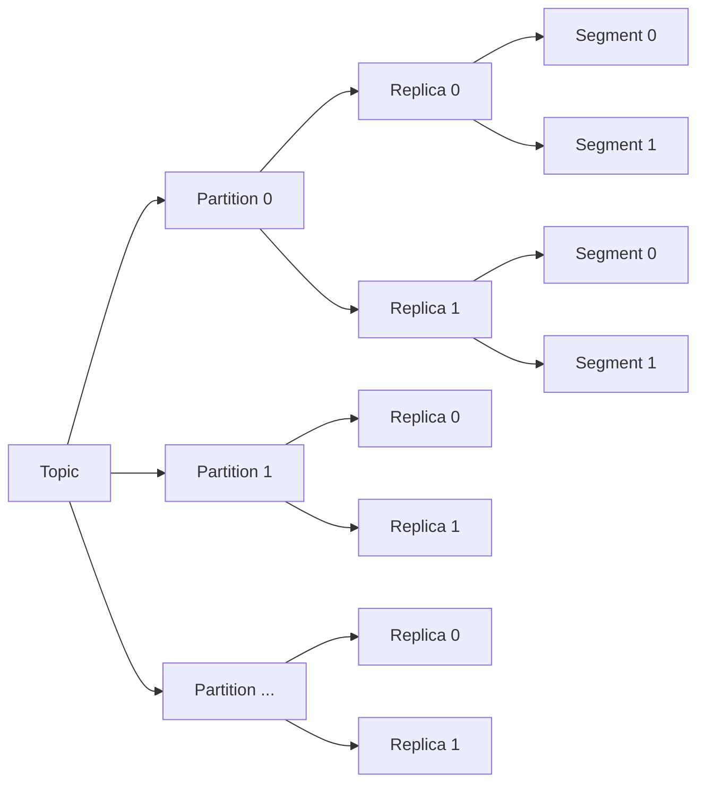

# Kafka Topic原理与代码实例讲解

作者：禅与计算机程序设计艺术 / Zen and the Art of Computer Programming

## 1. 背景介绍
### 1.1 问题的由来
在当今大数据时代,数据的实时处理和流式计算已成为企业的核心竞争力之一。面对海量的数据,如何高效、可靠地进行数据的生产、存储、消费和处理,成为了一个亟待解决的问题。Kafka作为一个分布式的消息队列系统,凭借其高吞吐、低延迟、可扩展等优异特性,在实时数据处理领域得到了广泛应用。

### 1.2 研究现状
目前,国内外已有大量关于Kafka的研究和应用实践。不少互联网公司如LinkedIn、Twitter、Netflix等都将Kafka作为其数据管道的核心组件。学术界对Kafka的研究主要集中在性能优化、可靠性保障、新功能扩展等方面。例如,有学者提出了基于Raft协议的Kafka副本同步机制,以提高Kafka的可靠性。

### 1.3 研究意义
深入理解Kafka Topic的工作原理,对于构建高性能、高可靠的流式数据处理系统具有重要意义。通过剖析Topic的内部机制,开发者可以更好地利用Kafka的特性,优化系统架构,提升数据处理效率。同时,对Topic原理的研究也有助于改进Kafka的设计,促进其在更广泛的场景下应用。

### 1.4 本文结构
本文将围绕Kafka Topic展开深入讨论。首先介绍Topic的核心概念和基本原理。然后重点剖析Topic的内部实现机制,包括日志存储、分区机制、副本同步等。接着,通过数学建模和公式推导,从理论层面阐释Topic的工作原理。在此基础上,给出Topic应用的代码实例和详细讲解。最后,总结Topic的特性,展望其发展趋势和面临的挑战。

## 2. 核心概念与联系
在Kafka中,Topic是数据流的核心抽象。生产者将数据发布到特定的Topic,消费者通过订阅Topic来获取数据。一个Topic可以被分为多个Partition(分区),每个分区是一个有序、不可变的消息序列。同一个Topic的不同分区可以分布在Kafka集群的不同Broker节点上,从而实现负载均衡和水平扩展。

分区是Topic物理上的分片单元。每个分区可以有多个副本(Replica),分布在不同的Broker上,以提供数据冗余和容错能力。其中,Leader副本负责处理生产者和消费者的读写请求,Follower副本被动地从Leader上同步数据。当Leader副本失效时,从Follower副本中选举出新的Leader,保证分区的高可用。

Kafka使用分段日志(Segmented Log)的方式来存储分区数据。每个分区被切分为多个Segment,Segment以追加写的方式不断累积数据。Segment文件由两部分组成:.log文件存储消息内容,.index文件存储消息的索引,便于快速定位。Kafka通过磁盘顺序写和页缓存技术,实现了高效的数据持久化和读写访问。

总的来说,Topic、Partition、Replica、Segment是Kafka的核心概念,它们之间紧密关联,构成了Kafka数据处理的基础框架。下图展示了它们之间的关系:

## 3. 核心算法原理 & 具体操作步骤
### 3.1 算法原理概述
Kafka Topic的核心算法主要体现在以下几个方面:

1. 分区分配算法:决定生产者将消息发送到Topic的哪个分区。常见的有Round-Robin轮询、Hash取模、按消息键哈希等。

2. 日志存储算法:Kafka采用分段日志结构,将分区数据切分为Segment,以追加写的方式存储,同时使用稀疏索引和二分查找加速消息定位。

3. 副本同步算法:分区Leader和Follower之间通过ISR(In-Sync Replica)机制进行副本同步,保证数据一致性。Follower定期从Leader拉取最新消息,追赶Leader的进度。

4. 消费者再均衡算法:在消费者组内,根据分区分配策略(如Range、RoundRobin)动态调整消费者与分区的对应关系,均衡消费负载。

### 3.2 算法步骤详解

以下以生产者发送消息的过程为例,详细说明Kafka Topic的工作步骤:

1. 生产者创建ProducerRecord对象,指定要发送到的Topic、Partition(可选)、消息Key(可选)和Value。

2. 生产者根据分区器(Partitioner)策略,计算消息要发送到的分区。默认分区器策略为:
   - 若指定了Partition,则直接使用该值;
   - 若未指定Partition但指定了Key,则对Key进行Hash取模;
   - 若二者都未指定,则使用轮询策略,Round-Robin选择分区。

3. 生产者将消息追加到RecordAccumulator中的对应分区Deque中,等待发送。

4. Sender线程从RecordAccumulator中批量获取消息,发送到对应的Broker上。

5. Broker接收到消息后,写入到底层的Log(日志)中。具体步骤为:
   - 将消息写入Log Segment的.log文件,采用顺序追加写;
   - 更新.index文件中的索引项,包括消息的offset、position等;
   - 更新内存中的Log对象元数据,如LEO(Log End Offset),HW(High Watermark)等;
   - 将Log Segment刷盘,持久化到磁盘中。

6. Follower副本拉取Leader副本的最新消息,更新自己的Log,追赶Leader的进度。

7. 消费者定期向Broker发送Fetch请求,拉取分区的最新消息。

8. Broker根据请求的offset,从底层Log中读取消息,返回给消费者。

9. 消费者处理接收到的消息,更新位移(offset),标识消费进度。

### 3.3 算法优缺点

Kafka Topic的设计具有以下优点:

- 分区机制实现了负载均衡和水平扩展,提高了并发处理能力;
- 分段日志存储利用磁盘顺序写,实现了高吞吐的数据持久化;
- 稀疏索引和二分查找使得消息定位高效;
- 副本机制保证了数据的高可用和容错;
- 支持多种分区分配和消费策略,灵活性强。

同时,Kafka Topic也存在一些局限:

- 消息无法修改和删除,只支持追加写;
- 消息在磁盘中是连续存储的,删除和清理的开销较大;
- 依赖Zookeeper进行元数据管理,增加了系统复杂度;
- 不支持消息优先级和过期时间。

### 3.4 算法应用领域
Kafka Topic广泛应用于以下领域:

- 日志聚合:收集分布式系统的日志数据,用于监控、分析和审计;
- 消息队列:作为分布式系统间的消息中间件,实现系统解耦和异步通信;
- 流式处理:接入实时数据流,进行实时计算、过滤、聚合等操作;
- 事件溯源:记录系统的状态变更事件,用于数据恢复和重建;
- 数据管道:作为数据从源系统到目标系统的传输通道,实现数据的可靠投递。

## 4. 数学模型和公式 & 详细讲解 & 举例说明
### 4.1 数学模型构建
我们可以使用队列模型来抽象描述Kafka Topic的工作原理。设Topic T由n个分区组成,每个分区可看作一个无界队列。令$P_i$表示第i个分区,则有:

$$T = \{P_1, P_2, ..., P_n\}$$

每个分区$P_i$包含一系列有序的消息,可表示为:

$$P_i = \{m_1, m_2, ..., m_k\}$$

其中,$m_j$表示第j个消息,包含其offset、key、value等属性。

设$r_i$表示分区$P_i$的副本数,$L_i$表示其Leader副本,则$P_i$可表示为:

$$P_i = (L_i, F_{i1}, F_{i2}, ..., F_{i(r_i-1)})$$

其中,$F_{ij}$表示第j个Follower副本。

### 4.2 公式推导过程

1. 分区分配

假设生产者使用Hash取模策略为消息选择分区,设消息的Key为$key$,哈希函数为$hash(·)$,则消息发送到的分区$P_i$满足:

$$i = hash(key) \bmod n$$

2. 日志存储

设$P_i$的Log由$s_i$个Segment组成,每个Segment大小为$size$,则$P_i$的总大小为:

$$size(P_i) = s_i · size$$

设$P_i$的当前LEO为$leo_i$,Segment的起始偏移量为$base_j$,则$leo_i$满足:

$$(s_i - 1) · size ≤ leo_i < s_i · size$$

$$leo_i = base_{s_i} + pos_i$$

其中,$pos_i$为$leo_i$在当前Segment中的位置。

3. 副本同步

设$F_{ij}$的LEO为$leo_{ij}$,拉取时间间隔为$t_f$,则$F_{ij}$在$t$时刻的同步进度为:

$$leo_{ij}(t) = leo_i(t - t_f)$$

若$leo_{ij}$与$leo_i$的差值不超过阈值$\theta$,则称$F_{ij}$与$L_i$同步:

$$|leo_i - leo_{ij}| ≤ \theta$$

4. 消费者再均衡

设消费者组$C$有$m$个消费者,Topic T有$n$个分区,则每个消费者分配到的分区数$n_c$为:

$$n_c = \lceil \frac{n}{m} \rceil$$

若使用Range分区策略,则第$i$个消费者分配到的分区范围为:

$$[\lfloor \frac{i·n}{m} \rfloor, \lfloor \frac{(i+1)·n}{m} \rfloor)$$

### 4.3 案例分析与讲解

假设有一个Topic T,包含4个分区$P_1$,$P_2$,$P_3$,$P_4$,每个分区有2个副本,初始时副本间是同步的。

某生产者发送一条消息$m_1$,Key为"abc",Value为"Hello"。根据Hash取模策略,该消息被发送到分区:

$$i = hash("abc") \bmod 4 = 2$$

即消息$m_1$被发送到分区$P_2$,追加到$P_2$的Leader副本$L_2$的Log中,位于Segment S1中,偏移量为100。此时$L_2$的LEO为101。

接着,消费者$C_1$订阅了Topic T,并拉取了分区$P_2$的消息。由于$P_2$有2个副本,且副本间是同步的,因此$C_1$可以从任一副本拉取消息。假设$C_1$从$F_{21}$拉取,在$F_{21}$上的消费位移为100。

之后,生产者又发送了3条消息到$P_2$,位于S1中,偏移量为101~103。$L_2$的LEO更新为104。但此时,由于网络延迟,$F_{21}$暂未同步到最新的消息,其LEO为101。

当$C_1$再次拉取$P_2$的消息时,如果从$F_{21}$拉取,则只能获取到偏移量≤101的消息;如果从$L_2$拉取,则可获取到全部消息。因此,$C_1$选择从$L_2$拉取,并更新其消费位移为104。

经过一段时间,$F_{21}$追上了$L_2$的进度,副本间重新达到同步,LEO一致为104。此时,$C_1$可以从任一副本拉取消息,且都可获得全部消息。

### 4.4 常见问题解答

**Q:** Kafka如何保证消息的有序性?

**A:** Kafka通过以下机