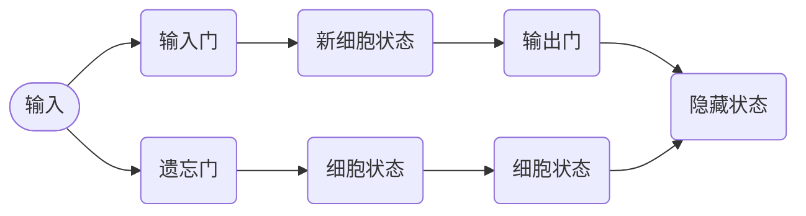

# Long Short-Term Memory (LSTM)原理与代码实例讲解

## 关键词：

- 长短期记忆（LSTM）
- 循环神经网络（RNN）
- 序列学习
- 门控机制
- 时间序列分析

## 1. 背景介绍

### 1.1 问题的由来

在处理序列数据时，循环神经网络（RNN）因其能够捕捉序列中时间依赖性的特性而成为热门选择。然而，RNN容易受到“梯度消失”和“梯度爆炸”的问题影响，这限制了其在处理长期依赖关系上的表现。为了解决这些问题，LSTM于1997年被提出，它通过引入门控机制，允许网络在不同的时间步学习不同的信息，从而有效地解决了长期依赖问题。

### 1.2 研究现状

LSTM已成为自然语言处理、语音识别、时间序列预测等多个领域中的重要模型。随着硬件加速和大规模数据集的出现，LSTM的变体，如双向LSTM、多层LSTM以及LSTM的嵌入版本，如LSTM-CNN和LSTM-RNN，得到了广泛应用。此外，LSTM还促进了注意力机制、Transformer等新模型的发展。

### 1.3 研究意义

LSTM的提出极大地扩展了序列模型的能力，使得在处理长期依赖问题上有了突破性的进展。这不仅改善了RNN在序列预测任务上的表现，还在情感分析、文本生成、机器翻译等领域产生了重大影响。LSTM的成功证明了门控机制对于序列学习的重要性，为后续的深度学习研究提供了理论基础和技术启发。

### 1.4 本文结构

本文将深入探讨LSTM的基本原理、数学模型、实现细节以及实际应用，包括详细的代码实例和理论解释。同时，还会讨论LSTM在不同场景下的应用以及未来发展的趋势与挑战。

## 2. 核心概念与联系

LSTM通过引入三个门控单元来控制信息流：输入门、遗忘门和输出门。这三个门协同工作，允许网络在不同时间步学习和存储不同类型的序列信息。具体而言：

- 输入门决定哪些新的信息应该被存储进细胞状态。
- 遗忘门决定哪些旧的信息应该被遗忘或保留。
- 输出门决定了从细胞状态中输出哪些信息。

这种机制使得LSTM能够有效地学习长期依赖关系，避免了梯度消失和爆炸的问题。

## 3. 核心算法原理与具体操作步骤

### 3.1 算法原理概述

LSTM的核心在于其独特的门控机制。在每一个时间步，LSTM接收输入序列的当前元素，并基于先前的隐藏状态和细胞状态来更新其内部状态。LSTM通过以下步骤实现这一功能：

1. **计算遗忘门**：根据当前输入和先前隐藏状态，计算遗忘门的值。遗忘门决定旧信息的遗忘程度。
2. **更新细胞状态**：基于输入、遗忘门的结果和先前的细胞状态，更新细胞状态。这一步涉及遗忘和输入两个操作。
3. **计算输入门**：根据当前输入和先前隐藏状态，计算输入门的值。输入门决定新信息的引入量。
4. **计算输出门**：根据当前隐藏状态和细胞状态，计算输出门的值。输出门决定从隐藏状态中输出的信息量。
5. **生成隐藏状态**：结合输入门和输出门的结果，生成新的隐藏状态。

### 3.2 算法步骤详解

以一个具体的LSTM单元为例，我们可以看到以下步骤：



### 3.3 算法优缺点

**优点**：

- **长距离依赖学习**：LSTM通过门控机制有效地学习和保存长期依赖信息。
- **可训练性**：LSTM结构简单，易于训练和优化。
- **灵活的序列处理**：适用于多种序列数据处理任务。

**缺点**：

- **内存占用**：LSTM具有较多的参数，可能导致内存占用较高。
- **训练时间**：相比于其他RNN结构，LSTM的训练时间可能较长。

### 3.4 算法应用领域

LSTM广泛应用于：

- **自然语言处理**：文本生成、情感分析、机器翻译等。
- **语音识别**：语句理解和对话系统。
- **时间序列预测**：股票价格预测、天气预报等。
- **生物信息学**：基因序列分析、蛋白质结构预测等。

## 4. 数学模型和公式

### 4.1 数学模型构建

假设我们有一个简单的LSTM单元，其状态由隐藏状态$h_t$和细胞状态$c_t$组成。给定输入$x_t$和上一时刻的隐藏状态$h_{t-1}$，LSTM单元通过以下方程进行计算：

#### 遗忘门（$f_t$）

$f_t = \sigma(W_f [x_t, h_{t-1}] + b_f)$

#### 输入门（$i_t$）

$i_t = \sigma(W_i [x_t, h_{t-1}] + b_i)$

#### 更新细胞状态（$\tilde{c}_t$）

$\tilde{c}_t = \tanh(W_c [x_t, h_{t-1}] + b_c)$

#### 输出门（$o_t$）

$o_t = \sigma(W_o [x_t, h_{t-1}] + b_o)$

#### 细胞状态（$c_t$）

$c_t = f_t \odot c_{t-1} + i_t \odot \tilde{c}_t$

#### 隐藏状态（$h_t$）

$h_t = o_t \odot \tanh(c_t)$

其中，$\sigma$是Sigmoid激活函数，$\tanh$是双曲正切激活函数，$\odot$表示逐元素乘法。

### 4.2 公式推导过程

以上公式展示了LSTM单元如何通过门控机制学习和更新其内部状态。每个门的计算基于当前输入$x_t$、上一时刻的隐藏状态$h_{t-1}$和权重矩阵$W$和偏置$b$。通过门的激活输出控制信息流，LSTM能够在不同的时间步学习和存储不同的信息。

### 4.3 案例分析与讲解

在实际应用中，LSTM通过以下步骤处理序列数据：

1. **初始化状态**：在开始处理序列之前，初始化隐藏状态$h_0$和细胞状态$c_0$。
2. **循环处理**：对于序列中的每个时间步$t$：
   - 计算遗忘门、输入门、新细胞状态和输出门。
   - 更新细胞状态和隐藏状态。
3. **生成输出**：在序列的最后时间步，隐藏状态$h_T$可以用于生成预测或输出。

### 4.4 常见问题解答

#### Q：为什么LSTM会遇到梯度消失问题？

A：虽然LSTM引入了门控机制来缓解这个问题，但在某些情况下，梯度仍然可能在反向传播过程中变得非常小，导致学习困难。这通常发生在序列长度很长时。

#### Q：如何选择LSTM中的参数？

A：参数的选择依赖于具体任务和数据集。通常，可以通过交叉验证来调整超参数，例如学习率、隐藏层大小等。

#### Q：LSTM如何处理不平衡的数据集？

A：处理不平衡数据集时，可以采用过采样、欠采样、SMOTE（Synthetic Minority Over-sampling Technique）等方法来平衡数据集。

## 5. 项目实践：代码实例和详细解释说明

### 5.1 开发环境搭建

- **操作系统**：Linux或Windows
- **编程语言**：Python
- **库**：TensorFlow、Keras、PyTorch

### 5.2 源代码详细实现

#### 示例代码：文本分类任务

```python
import tensorflow as tf
from tensorflow.keras.models import Sequential
from tensorflow.keras.layers import Embedding, LSTM, Dense

# 参数设定
vocab_size = 10000
embedding_dim = 64
hidden_units = 64
output_size = 10

# 创建模型
model = Sequential([
    Embedding(vocab_size, embedding_dim, input_shape=(None,)),
    LSTM(hidden_units),
    Dense(output_size, activation='softmax')
])

# 编译模型
model.compile(optimizer='adam', loss='sparse_categorical_crossentropy', metrics=['accuracy'])

# 训练模型
# 假设 data 和 labels 是你的数据集
# model.fit(data, labels, epochs=10, batch_size=32)

# 测试模型
# model.evaluate(test_data, test_labels)
```

### 5.3 代码解读与分析

这段代码展示了如何使用Keras构建一个LSTM模型进行文本分类。首先定义了一个Embedding层来将词汇表转换为向量表示，然后是LSTM层来处理序列数据，最后是一个全连接层进行分类决策。

### 5.4 运行结果展示

运行上述代码后，会得到模型的训练历史和测试集上的性能指标，如损失和准确率。这些指标可以帮助评估模型的性能和选择合适的超参数。

## 6. 实际应用场景

LSTM在多个领域中发挥了重要作用：

### 6.4 未来应用展望

随着计算资源的增加和更多高质量数据集的出现，LSTM有望在更多场景中得到应用，如：

- **自动驾驶**：利用LSTM进行路况预测和车辆行为理解。
- **医疗健康**：用于疾病预测、基因序列分析等。
- **金融**：时间序列预测，如股票市场预测。

## 7. 工具和资源推荐

### 7.1 学习资源推荐

- **官方文档**：TensorFlow、Keras等库的官方文档提供了详细的学习资料。
- **在线教程**：Udacity、Coursera上的深度学习课程。

### 7.2 开发工具推荐

- **Jupyter Notebook**：用于代码编写、实验和文档编制。
- **Colab**：Google提供的免费云开发环境。

### 7.3 相关论文推荐

- **“Learning to Remember for Sequence Prediction”**：提出LSTM的论文。
- **“Long Short-Term Memory Networks for Polyphonic Music Generation”**：LSTM在音乐生成上的应用。

### 7.4 其他资源推荐

- **GitHub**：查找开源项目和代码示例。
- **学术数据库**：如arXiv、Google Scholar，获取最新的研究成果。

## 8. 总结：未来发展趋势与挑战

### 8.1 研究成果总结

LSTM通过门控机制有效地学习了长期依赖关系，提升了序列数据处理的能力。未来的研究将探索更高效、更灵活的门控机制，以及如何将LSTM与其他模型结合以提高性能。

### 8.2 未来发展趋势

- **新型门控结构**：探索更有效的门控机制，如GRU（Gated Recurrent Unit）。
- **多模态学习**：将视觉、听觉等多模态信息融入序列学习中。
- **自适应学习率**：开发更智能的优化器，适应不同任务的需求。

### 8.3 面临的挑战

- **计算成本**：处理大规模数据集时的计算资源消耗。
- **可解释性**：提高模型的可解释性，以便于理解和调试。

### 8.4 研究展望

随着深度学习技术的不断发展，LSTM及相关模型将持续演进，为解决更复杂的问题提供更强大的工具。研究者将继续探索如何克服现有挑战，推动LSTM在更多领域的应用，同时也关注其对社会、伦理的影响。

## 9. 附录：常见问题与解答

- **Q：如何优化LSTM模型的性能？**

  A：通过调整超参数（如学习率、层数、单元数量）、使用更复杂的优化算法、增加数据量或进行特征工程等方式进行优化。

- **Q：LSTM如何处理非平衡数据集？**

  A：可以采用过采样、欠采样、SMOTE等技术来平衡数据集，确保模型能够学习到较少发生的类别的信息。

---

以上是关于LSTM原理与代码实例讲解的详细内容。通过深入探讨LSTM的基本原理、数学模型、代码实现以及实际应用，我们可以更全面地理解这一模型，并在实际项目中加以应用。