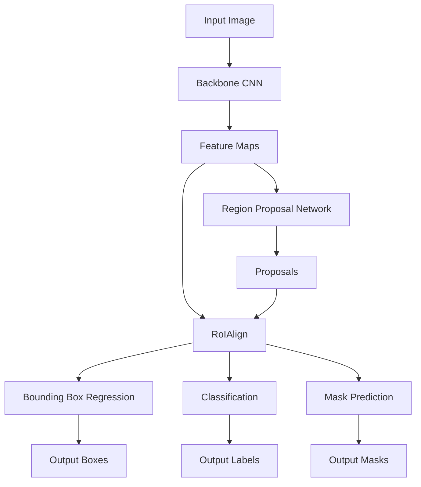

# MaskR-CNN原理与代码实例讲解

作者：禅与计算机程序设计艺术 / Zen and the Art of Computer Programming

## 1. 背景介绍

### 1.1 问题的由来

在计算机视觉领域，图像分割一直是一个极具挑战性的任务。传统的分割算法如阈值分割、边缘检测等，难以应对复杂场景下的图像分割问题。随着深度学习的发展，基于卷积神经网络（CNN）的图像分割方法取得了巨大突破。其中，Mask R-CNN作为一种先进的实例分割算法，在精度和速度上都达到了业界领先水平。

### 1.2 研究现状

自2017年Mask R-CNN被提出以来，许多研究者在此基础上进行了改进和优化。比如将Mask R-CNN与FPN结合以处理多尺度目标[1]，引入Deformable ConvNets增强特征提取能力[2]，利用Cascade R-CNN进一步提升检测精度[3]等。目前，Mask R-CNN已成为许多计算机视觉任务如自动驾驶、医学影像分析等的核心算法。

### 1.3 研究意义

深入理解Mask R-CNN的原理，并掌握其代码实现，对于从事计算机视觉研究和应用的学者和工程师来说至关重要。一方面，我们可以在Mask R-CNN的基础上进行改进，设计出性能更优的实例分割算法。另一方面，熟练应用Mask R-CNN可以解决许多实际问题，如工业视觉检测、无人驾驶感知等。因此，本文旨在通过理论讲解和代码实践相结合的方式，帮助读者全面掌握这一关键技术。

### 1.4 本文结构

本文将从以下几个方面展开论述：

- 第2部分介绍Mask R-CNN涉及的核心概念，如Faster R-CNN、RoIAlign等，并阐明它们之间的联系。 
- 第3部分详细讲解Mask R-CNN的算法原理，包括网络结构、训练过程等，并总结其优缺点和适用场景。
- 第4部分建立Mask R-CNN的数学模型，推导相关公式，并给出案例分析。
- 第5部分通过代码实例，演示如何使用Python和TensorFlow实现Mask R-CNN，并对关键代码进行解读。
- 第6部分探讨Mask R-CNN在自动驾驶、医疗诊断等领域的应用，展望其未来发展方向。  
- 第7部分推荐Mask R-CNN相关的学习资源、开发工具和研究论文。
- 第8部分总结全文，指出Mask R-CNN未来的机遇与挑战。
- 第9部分列举一些常见问题，并给出解答，帮助读者解惑。

## 2. 核心概念与联系

在深入理解Mask R-CNN之前，我们需要先了解其构建所依赖的几个核心概念。

首先是**R-CNN**系列算法。R-CNN率先将深度学习引入目标检测领域，通过CNN提取候选区域特征，再用SVM进行分类[4]。Fast R-CNN对此进行改进，提出RoI Pooling在特征图上直接提取候选区域特征[5]。Faster R-CNN进一步引入区域建议网络（RPN），实现端到端的目标检测[6]。

Mask R-CNN以**Faster R-CNN**为基础，新增一个与边界框回归、分类并行的分支，用于预测目标实例的分割掩码。同时，Mask R-CNN还提出**RoIAlign**层，通过双线性插值实现像素到像素的对齐，解决了RoI Pooling引入的像素偏移问题，使掩码预测更加精准[7]。

下图展示了Mask R-CNN的总体架构，可以清晰看出其与Faster R-CNN的联系和区别：

## 3. 核心算法原理 & 具体操作步骤

### 3.1 算法原理概述

Mask R-CNN算法主要由以下几个部分组成：

1. **主干网络**：通常采用ResNet或FPN等经典CNN网络，用于提取图像特征。
2. **区域建议网络（RPN）**：在特征图上滑动一个小网络，判断每个位置是否包含目标，并回归出目标的边界框。
3. **RoIAlign**：将RPN生成的候选区域投影到特征图上，通过双线性插值实现像素级对齐，提取出固定尺寸的区域特征。 
4. **检测头**：对RoIAlign提取的区域特征进行分类和边界框回归，得到最终的检测结果。
5. **分割头**：与检测头并行，对RoIAlign提取的区域特征进行逐像素的分割掩码预测。

### 3.2 算法步骤详解

下面我们对Mask R-CNN的训练和推理过程进行详细分解：

**训练阶段**：

1. 输入一批图像和对应的标注信息（类别、边界框、分割掩码）。
2. 图像经过主干网络提取特征，得到多尺度的特征图。
3. 在每个尺度的特征图上应用区域建议网络（RPN），生成候选区域（Proposals）。
4. 对每个候选区域，通过RoIAlign在特征图上提取出固定尺寸的区域特征。
5. 区域特征分别送入检测头和分割头：
   - 检测头通过全连接层进行分类和边界框回归，使用交叉熵损失和Smooth L1损失。
   - 分割头通过全卷积网络对区域特征进行上采样，预测出每个像素的类别，使用逐像素的交叉熵损失。
6. 将RPN损失、检测头损失和分割头损失相加，对整个网络进行端到端的反向传播训练。

**推理阶段**：

1. 输入待测图像，经过主干网络提取特征。
2. 在特征图上运行RPN，得到候选区域。
3. 对候选区域进行NMS（非极大值抑制），选出置信度最高的若干个区域。
4. 对选出的区域，通过RoIAlign提取特征，送入检测头和分割头。
5. 检测头输出每个区域的类别和边界框坐标。
6. 分割头输出每个区域的像素级分割掩码。
7. 将检测结果和分割结果组合，得到最终的实例分割输出。

### 3.3 算法优缺点

Mask R-CNN的优点主要有：

- 继承了Faster R-CNN的优秀检测性能，同时实现了精确的像素级实例分割。
- 采用RoIAlign层，有效解决了空间量化误差，使掩码预测更加准确。
- 可以灵活地调整主干网络和检测/分割头，适应不同任务需求。
- 可以方便地扩展到其他任务如关键点检测等。

但Mask R-CNN也存在一些局限性：

- 对小目标的分割效果有待提高，主要受限于特征图的分辨率。
- 推理速度相对较慢，实时性不够好，难以应用于对时延要求高的场合。  
- 训练对大量标注数据的依赖，尤其是像素级的分割标注，获取成本高。
- 对遮挡、重叠目标的分割效果不理想。

### 3.4 算法应用领域

得益于其强大的实例分割能力，Mask R-CNN在诸多领域得到了广泛应用，如：

- **自动驾驶**：对道路场景中的车辆、行人、交通标志等进行精确分割，为自动驾驶提供可靠的环境感知。
- **医学影像分析**：自动分割医学图像中的器官、病灶等，辅助医生进行疾病诊断和治疗规划。 
- **工业视觉检测**：检测和分割生产线上的零部件、缺陷等，实现工业自动化。
- **卫星遥感**：从卫星图像中分割出建筑物、道路、农田等地物，服务于城市规划、土地调查等。
- **时尚/电商**：从时装照片中分割出衣物、配饰等，应用于虚拟试衣、搭配推荐等。

可以预见，随着Mask R-CNN的不断发展和完善，其应用领域还将不断扩大，为人工智能赋能更多行业。

## 4. 数学模型和公式 & 详细讲解 & 举例说明

### 4.1 数学模型构建

我们可以将Mask R-CNN表示为一个多任务学习模型，其目标是最小化以下三个任务的联合损失函数：
$$
\mathcal{L} = \mathcal{L}_{rpn} + \mathcal{L}_{cls} + \mathcal{L}_{box} + \mathcal{L}_{mask}
$$
其中，$\mathcal{L}_{rpn}$是RPN网络的损失，$\mathcal{L}_{cls}$和$\mathcal{L}_{box}$分别是检测头的分类损失和边界框回归损失，$\mathcal{L}_{mask}$是分割头的掩码预测损失。

具体地，RPN网络的损失由二元交叉熵损失和边界框回归损失组成：
$$
\mathcal{L}_{rpn} = \frac{1}{N_{cls}} \sum_i \mathcal{L}_{cls}(p_i, p_i^*) + \lambda \frac{1}{N_{reg}} \sum_i p_i^* \mathcal{L}_{reg} (t_i, t_i^*)
$$
其中，$p_i$是第$i$个anchor的前景/背景预测概率，$p_i^*$是真实标签（1表示前景，0表示背景）。$t_i$是预测的边界框坐标，$t_i^*$是真实边界框坐标。$N_{cls}$和$N_{reg}$分别是二元交叉熵损失和边界框回归损失的归一化因子，$\lambda$是平衡两种损失的超参数。

检测头的分类损失和回归损失与RPN类似，只是针对RoIAlign提取的区域特征：
$$
\mathcal{L}_{cls} = \frac{1}{N_{cls}} \sum_i \mathcal{L}_{cls} (p_i, p_i^*)
$$
$$
\mathcal{L}_{box} = \frac{1}{N_{box}} \sum_i p_i^* \mathcal{L}_{reg} (t_i, t_i^*)
$$
其中，$p_i$是第$i$个区域的类别预测概率，$p_i^*$是真实类别标签的one-hot编码。$t_i$和$t_i^*$的定义与RPN相同。

分割头的掩码预测损失采用逐像素的二元交叉熵损失：
$$
\mathcal{L}_{mask} = \frac{1}{N_{mask}} \sum_{i=1}^{N_{mask}} \mathcal{L}_{bce} (m_i, m_i^*)
$$
其中，$m_i$是第$i$个像素的预测掩码值（0~1之间），$m_i^*$是真实掩码标签（0或1）。$N_{mask}$是掩码像素的总数。

### 4.2 公式推导过程

以上各个损失函数中的二元交叉熵损失$\mathcal{L}_{cls}$和$\mathcal{L}_{bce}$的定义如下：
$$
\mathcal{L}_{cls}(p, y) = -y \log p - (1-y) \log (1-p)
$$
$$
\mathcal{L}_{bce}(m, z) = -z \log m - (1-z) \log (1-m)
$$
其中，$y,z \in \{0,1\}$是真实标签，$p,m \in [0,1]$是预测值。

边界框回归损失$\mathcal{L}_{reg}$采用Smooth L1损失，定义为：
$$
  \mathcal{L}_{reg}(t, t^*) = \sum_{i \in \{x,y,w,h\}} \text{Smooth}_{L_1} (t_i - t_i^*)
$$
$$
  \text{Smooth}_{L_1}(x) = \begin{cases} 
   0.5x^2 & \text{if } |x| < 1 \\
   |x| - 0.5 & \text{otherwise}
  \end{cases}
$$
其中，$t=(t_x, t_y, t_w, t_h)$是预测