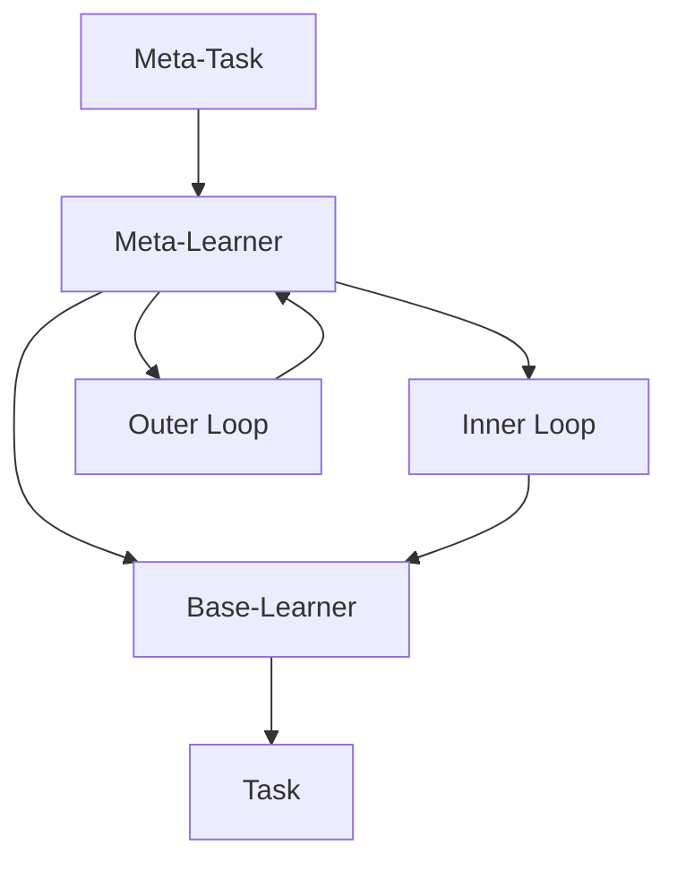

# Meta-Learning原理与代码实例讲解

## 1. 背景介绍

### 1.1 问题的由来

在机器学习领域中,传统的监督学习算法需要大量的标记数据集来训练模型,这种方法对于数据量有很大的依赖性。然而,在现实世界中,获取大量高质量的标记数据集往往是一个巨大的挑战,因为数据标记过程通常需要耗费大量的人力和时间。此外,对于一些新兴领域或罕见场景,可能根本无法获取足够的训练数据。因此,如何在数据量有限的情况下,快速学习新任务并取得良好的泛化能力,成为机器学习领域亟待解决的关键问题。

### 1.2 研究现状

为了解决上述问题,Meta-Learning(元学习)作为一种新兴的机器学习范式应运而生。元学习的核心思想是利用过去任务的经验,快速学习新任务,从而提高模型的泛化能力。具体来说,元学习算法通过在一系列相关任务上进行训练,学习一种通用的知识表示和快速适应新任务的能力,从而在新任务上只需要少量数据或少量梯度更新即可取得良好的性能。

近年来,元学习在计算机视觉、自然语言处理、强化学习等多个领域取得了卓越的成绩,展现出了巨大的应用前景。但同时,元学习也面临着一些挑战,如元学习算法的高计算复杂度、任务之间的差异性等,这些问题仍有待进一步探索和解决。

### 1.3 研究意义

元学习的研究对于推动机器学习技术的发展具有重要意义:

1. **提高数据利用效率**:元学习能够在少量数据的情况下快速学习新任务,从而大大提高了数据利用效率,降低了数据获取和标注的成本。

2. **增强模型泛化能力**:通过学习任务之间的共性知识,元学习可以提高模型在新任务上的泛化能力,从而获得更好的性能表现。

3. **推动人工智能发展**:元学习被认为是实现通用人工智能(AGI)的一种可能途径,其研究有助于探索智能系统快速学习和知识迁移的机制。

4. **拓展应用领域**:元学习技术可以应用于计算机视觉、自然语言处理、机器人控制等多个领域,为这些领域带来新的发展机遇。

### 1.4 本文结构

本文将全面介绍Meta-Learning的原理、算法、实现细节和应用场景。具体内容安排如下:

1. 背景介绍
2. 核心概念与联系
3. 核心算法原理与具体操作步骤
4. 数学模型和公式详细讲解与举例说明
5. 项目实践:代码实例和详细解释说明
6. 实际应用场景
7. 工具和资源推荐
8. 总结:未来发展趋势与挑战
9. 附录:常见问题与解答

## 2. 核心概念与联系

Meta-Learning的核心概念包括:

1. **Task(任务)**: 在元学习中,每个具体的学习问题都被称为一个Task。例如,在图像分类领域,识别不同类别的图像就是不同的Task。

2. **Meta-Task(元任务)**: 元任务指的是一系列相关但不同的Task的集合。元学习算法在这些元任务上进行训练,以获取通用的知识表示和快速适应新任务的能力。

3. **Meta-Learner(元学习器)**: 元学习器是指能够从元任务中学习通用知识表示和快速适应策略的模型或算法。常见的元学习器包括基于优化的方法(如MAML)、基于度量学习的方法(如Prototypical Network)、基于生成模型的方法(如GANN)等。

4. **Base-Learner(基础学习器)**: 基础学习器是指用于解决具体Task的模型或算法,如卷积神经网络用于图像分类任务。在元学习过程中,基础学习器的参数会根据元学习器提供的知识表示和适应策略进行快速更新,以适应新的Task。

5. **Inner Loop(内循环)** 和 **Outer Loop(外循环)**: 这是元学习算法的一种常见训练范式。在内循环中,基础学习器在每个Task上进行少量梯度更新,以适应该Task;在外循环中,元学习器根据基础学习器在所有Task上的表现,更新自身的参数,以获取更好的知识表示和适应策略。

这些核心概念之间的关系如下所示:

Meta-Task提供了一系列相关但不同的Task,作为元学习器的训练数据。元学习器(Meta-Learner)通过在这些Task上进行训练,学习到一种通用的知识表示和快速适应策略。基础学习器(Base-Learner)则利用元学习器提供的知识表示和适应策略,在具体的Task上进行少量梯度更新(Inner Loop),以快速适应该Task。元学习器根据基础学习器在所有Task上的表现,对自身的参数进行更新(Outer Loop),以获取更好的知识表示和适应策略。

通过这种方式,元学习算法能够在少量数据或少量梯度更新的情况下,快速学习新任务并取得良好的泛化性能。

## 3. 核心算法原理与具体操作步骤

在这一部分,我们将介绍元学习领域中一些核心的算法原理和具体操作步骤。

### 3.1 算法原理概述

元学习算法可以分为以下几种主要类型:

1. **基于优化的元学习(Optimization-Based Meta-Learning)**

   这类算法的核心思想是通过学习一个好的初始化点,使得在新任务上只需要少量梯度更新即可取得良好的性能。代表性算法包括MAML(Model-Agnostic Meta-Learning)和Reptile等。

2. **基于度量学习的元学习(Metric-Based Meta-Learning)**

   这类算法旨在学习一个好的embedding空间,使得同一类样本在该空间中的embedding更加紧密。在新任务上,通过计算查询样本与支持集样本的embedding距离,即可进行分类或回归。代表性算法包括Prototypical Network和Relation Network等。

3. **基于生成模型的元学习(Generative Meta-Learning)**

   这类算法通过学习一个生成模型,从而能够根据新任务的少量数据,快速生成该任务的合成训练集。代表性算法包括GANN(Generative Adversarial Neural Networks for Meta-Learning)和MetaGAN等。

4. **基于记忆的元学习(Memory-Based Meta-Learning)**

   这类算法通过构建一个可更新的记忆模块,存储过去任务的知识,并在新任务上进行快速检索和适应。代表性算法包括Meta-SGD和Meta-BGD等。

5. **基于注意力机制的元学习(Attention-Based Meta-Learning)**

   这类算法通过学习一种注意力机制,从而能够在新任务上自适应地聚焦于相关的知识,提高泛化能力。代表性算法包括ANML(Attentive Neural Machine Learning)和TAML(Task-Agnostic Meta-Learning)等。

### 3.2 算法步骤详解

接下来,我们将以MAML(Model-Agnostic Meta-Learning)算法为例,详细介绍基于优化的元学习算法的具体操作步骤。

MAML算法的核心思想是:通过在一系列相关任务上进行训练,学习一个好的初始化点,使得在新任务上只需要少量梯度更新即可取得良好的性能。算法步骤如下:

1. **初始化**:初始化元学习器的参数 $\theta$,以及基础学习器的参数 $\phi$。

2. **采样任务批次**:从元任务分布 $p(\mathcal{T})$ 中采样一个任务批次 $\mathcal{T}_i$,每个任务 $\mathcal{T}_i$ 包含支持集 $\mathcal{D}_i^{tr}$ 和查询集 $\mathcal{D}_i^{val}$。

3. **内循环**:对于每个任务 $\mathcal{T}_i$,使用支持集 $\mathcal{D}_i^{tr}$ 对基础学习器的参数 $\phi$ 进行少量梯度更新,得到适应于该任务的参数 $\phi_i'$:

   $$\phi_i' = \phi - \alpha \nabla_\phi \mathcal{L}_{\mathcal{T}_i}(f_\phi(\mathcal{D}_i^{tr}))$$

   其中 $\alpha$ 是内循环的学习率, $\mathcal{L}_{\mathcal{T}_i}$ 是任务 $\mathcal{T}_i$ 的损失函数, $f_\phi$ 是基础学习器的模型。

4. **外循环**:使用查询集 $\mathcal{D}_i^{val}$ 计算适应后的基础学习器在所有任务上的总损失:

   $$\mathcal{L}_{\mathcal{T}_i}(f_{\phi_i'}(\mathcal{D}_i^{val}))$$

   然后,对元学习器的参数 $\theta$ 进行梯度更新,以最小化总损失:

   $$\theta \leftarrow \theta - \beta \nabla_\theta \sum_{\mathcal{T}_i \sim p(\mathcal{T})} \mathcal{L}_{\mathcal{T}_i}(f_{\phi_i'}(\mathcal{D}_i^{val}))$$

   其中 $\beta$ 是外循环的学习率。

5. **重复训练**:重复步骤2-4,直到元学习器收敛。

在测试阶段,对于一个新的任务 $\mathcal{T}_{new}$,我们首先使用元学习器学习到的初始化点 $\theta$ 初始化基础学习器的参数 $\phi$,然后在 $\mathcal{T}_{new}$ 的支持集上进行少量梯度更新,即可获得适应于该新任务的模型。

MAML算法的优点在于其通用性,可以与任何基础学习器(如卷积神经网络、递归神经网络等)相结合,并且在各种任务上都展现出了良好的性能。但同时,MAML也存在一些缺陷,如计算复杂度较高、对任务分布的敏感性等,这些问题将在后面的章节中进一步讨论。

### 3.3 算法优缺点

**优点**:

1. **通用性强**:MAML算法可以与任何基础学习器相结合,适用于各种机器学习任务,如分类、回归、强化学习等。

2. **数据效率高**:通过学习一个好的初始化点,MAML能够在新任务上只需要少量数据或少量梯度更新即可取得良好的性能,大大提高了数据利用效率。

3. **理论基础扎实**:MAML算法基于优化理论,具有较为完备的理论支撑。

4. **性能优异**:在多个领域的基准测试中,MAML算法展现出了优异的性能,在少量数据的情况下也能获得较好的泛化能力。

**缺点**:

1. **计算复杂度高**:MAML算法需要在每个任务上进行多次梯度计算,计算量较大,训练速度较慢。

2. **任务分布敏感**:MAML算法对元任务分布的选择较为敏感,如果元任务分布与测试任务分布差异较大,性能可能会下降。

3. **过拟合风险**:在训练过程中,MAML可能会过度拟合元任务,导致在新任务上的泛化能力受限。

4. **超参数选择困难**:MAML算法的性能受到内外循环学习率等多个超参数的影响,合理的超参数选择对于获得良好性能至关重要。

### 3.4 算法应用领域

MAML及其变体算法已经在多个领域展现出了优异的性能,主要应用领域包括:

1. **计算机视觉**:如少shot图像分类、目标检测、语义分割等任务。

2. **自然语言处理**:如少shot文本分类、关系抽取、机器翻译等任务。

3. **强化学习**:如机器人控制、游戏AI等任务。

4. **医疗健康**:如医疗图像分析、疾病诊断等任务。

5. **物理学**:如量子