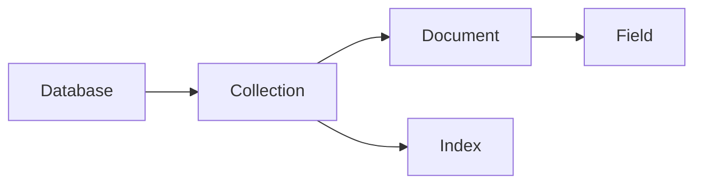

# MongoDB原理与代码实例讲解

关键词：MongoDB、NoSQL、文档型数据库、分布式存储、高可用、水平扩展

## 1. 背景介绍
### 1.1  问题的由来
在大数据时代,传统的关系型数据库在面对海量数据、高并发读写以及灵活多变的数据结构时,暴露出了诸多不足。为了应对这些挑战,NoSQL数据库应运而生。而MongoDB作为NoSQL阵营中的佼佼者,以其灵活的数据模型、强大的查询语言、高可用性和可扩展性等特性,受到了越来越多开发者的青睐。

### 1.2  研究现状
目前,MongoDB已经被广泛应用于各个领域,尤其在互联网、物联网、游戏、金融等对数据存储有着高并发、低延迟要求的场景。同时,学术界和工业界也在不断地对MongoDB进行研究和优化,推动其性能和功能的提升。许多知名公司如eBay、Foursquare、Shutterfly等都将MongoDB作为其核心数据库。

### 1.3  研究意义
深入研究MongoDB的原理和应用,一方面有助于我们理解现代NoSQL数据库的设计思想和实现机制,拓展数据库知识视野;另一方面,对于实际的软件开发,掌握MongoDB可以帮助我们更好地应对业务需求,提升系统性能,降低开发和维护成本。

### 1.4  本文结构
本文将从MongoDB的核心概念出发,讲解其数据模型、存储引擎、查询机制、索引、复制和分片等关键技术原理,并辅以代码实例进行说明,同时探讨MongoDB的适用场景和最佳实践,为读者全面深入地了解和掌握MongoDB提供参考。

## 2. 核心概念与联系
MongoDB是一个介于关系型数据库和非关系型数据库之间的产品,是非关系型数据库当中功能最丰富的,最像关系型数据库的NoSQL数据库。它支持的数据结构非常松散,是类似json的bson格式,因此可以存储比较复杂的数据类型。

MongoDB中的几个核心概念:
- Database: 数据库,MongoDB中可以建立多个数据库
- Collection: 集合,类似关系型数据库中的表
- Document: 文档,MongoDB中的最小数据单元,类似关系型数据库中的行,但比行复杂
- Field: 字段,MongoDB文档中的属性
- Index: 索引,MongoDB中可对文档的任意属性建立索引

这些概念之间的关系可以用下图表示:



可以看出,MongoDB采用了Database - Collection - Document这样一个层次结构,与关系型数据库的Database - Table - Row类似。但是它的schema设计更加灵活,一个Collection中可以存储结构完全不同的Document。这种灵活性使得MongoDB能够更好地适应数据结构多变的场景。

## 3. 核心算法原理 & 具体操作步骤
### 3.1  算法原理概述
MongoDB采用了一系列创新的算法和技术来实现其高性能、高可用性和可扩展性,主要包括:
- WiredTiger存储引擎: 默认存储引擎,支持文档级别锁、压缩、校验等
- Pluggable存储引擎架构: 允许使用不同的存储引擎
- Replica Set复制集: 自动容错,自动故障转移,提供高可用
- Sharding分片: 通过将数据分布在多个分片上,实现负载均衡和水平扩展
- B树索引: 高效查询,支持二级索引、复合索引、全文索引、地理位置索引等
- Aggregation聚合: 强大灵活的聚合分析能力,支持管道操作符

### 3.2  算法步骤详解
以MongoDB的查询为例,其基本步骤如下:

1. 客户端发送查询请求到MongoDB实例
2. MongoDB查询分析器解析查询,生成查询计划
3. 根据查询计划,在Collection中扫描Document
4. 如果查询涉及Index,则先扫描Index获取对应的Document指针
5. 返回找到的Document给客户端

如果是聚合查询,则执行过程会更复杂一些,需要经过多个聚合阶段的处理,每个阶段会生成一个新的临时Collection供下一阶段使用,直到完成所有聚合操作。

### 3.3  算法优缺点
MongoDB查询引擎的优点在于:
- 自动选择最优索引
- 支持丰富的查询语法和操作符
- 聚合框架功能强大,可实现类似SQL的GROUP BY、JOIN等复杂操作

但同时也存在一些不足:
- 不支持事务(4.0版本以后部分支持)
- 复杂聚合查询会消耗大量内存和CPU
- 大数据量分片集群情况下查询可能会很慢

### 3.4  算法应用领域
MongoDB查询引擎广泛应用于:
- 网站实时数据分析
- 用户行为分析 
- 基因数据分析
- 地理空间数据查询分析
- 物联网数据收集分析
- 内容管理系统
- 等等

## 4. 数学模型和公式 & 详细讲解 & 举例说明
### 4.1  数学模型构建
MongoDB中的很多功能都依赖于概率统计模型,比如查询优化、索引选择、负载均衡等。以查询优化为例,假设一个查询Q,针对的集合为C,可能用到的索引集合为I,则MongoDB需要估算使用每个索引执行查询的代价Cost(Q, I),并选择代价最小的那个索引。

Cost(Q, I)的计算公式为:

$Cost(Q, I) = R(Q, I) * C(I) + F(Q, I) * O(I)$

其中:
- R(Q,I): 使用索引I执行查询Q需要扫描的文档数
- C(I): 单个文档在索引I上的查找代价
- F(Q,I): 使用索引I执行查询Q需要进行的随机IO次数
- O(I): 单次随机IO的代价

### 4.2  公式推导过程
R(Q,I)的估算比较复杂,需要考虑查询的选择率、索引的分布情况等因素。一种简单的估算方法是假设索引值是均匀分布的,则:

$R(Q, I) = S(Q, I) * N(C)$

其中:
- S(Q,I): 查询Q在索引I上的选择率,即满足查询条件的索引值占所有索引值的比例
- N(C): 集合C的文档总数

C(I)和O(I)可以根据索引的类型(B树、哈希等)和存储引擎的特性(内存、磁盘等)来估算,这里不再展开。

F(Q,I)的估算需要考虑索引I是否覆盖了查询Q需要的所有字段,如果不能覆盖,则需要根据索引结果去文档中查找字段值,产生随机IO。

### 4.3  案例分析与讲解
假设有一个用户集合users,包含以下字段:
- _id: 主键
- name: 姓名
- age: 年龄
- city: 所在城市

假设查询Q为: 

```js
db.users.find({age: {$gt: 20, $lt: 30}, city: "Beijing"})
```

该查询的选择条件涉及age和city两个字段。假设集合users有如下两个索引:

```js
{age: 1} // 单字段索引
{age: 1, city: 1} // 复合索引
```

我们来估算分别使用这两个索引执行查询的代价。

假设:
- 集合users有100万文档
- age在20到30之间的文档占10%
- city为"Beijing"的文档占20%
- 单次文档查找代价为1
- 单次随机IO代价为100

对于索引{age: 1}:
- S(Q, I) = 10% * 20% = 2%
- R(Q, I) = 2% * 1,000,000 = 20,000
- C(I) = 1
- F(Q, I) = 20,000 (因为索引不包含city字段,需要回表)
- O(I) = 100
- Cost(Q, I) = 20,000 * 1 + 20,000 * 100 = 2,020,000

对于索引{age: 1, city: 1}:
- S(Q, I) = 10% * 20% = 2%
- R(Q, I) = 2% * 1,000,000 = 20,000
- C(I) = 1
- F(Q, I) = 0 (索引已覆盖所有查询字段,不需要回表)
- O(I) = 100
- Cost(Q, I) = 20,000 * 1 + 0 * 100 = 20,000

可以看出,在该查询中使用复合索引{age: 1, city: 1}的代价要远小于使用单字段索引{age: 1},因为复合索引避免了回表操作。当然,实际情况会更加复杂,还需要考虑索引的大小、内存命中率等因素。这里只是一个简单的示例。

### 4.4  常见问题解答
问: MongoDB支持哪些类型的索引?

答: MongoDB支持多种类型的索引,包括:
- 单字段索引: 在文档的单个字段上创建索引
- 复合索引: 在文档的多个字段上创建索引
- 多key索引: 在数组字段上创建索引
- 文本索引: 对字符串内容创建全文搜索索引
- 2dsphere索引: 对地理空间坐标创建索引
- 2d索引: 对平面坐标创建索引
- 哈希索引: 使用哈希值作为索引
- TTL索引: 可以为文档指定过期时间

问: MongoDB的Objectld是如何生成的?

答: MongoDB的Objectld是一个12字节的BSON类型,其结构如下:
- 4字节的时间戳
- 3字节的机器识别码
- 2字节的进程id
- 3字节的随机数

这样的结构可以保证Objectld在分布式环境下的全局唯一性,同时避免了主键自增产生的写入热点问题。Objectld可以快速生成,同时对分布式系统十分友好。

## 5. 项目实践：代码实例和详细解释说明
### 5.1  开发环境搭建
要使用MongoDB,首先需要安装MongoDB服务端和客户端。可以从官网下载安装包,或者使用包管理工具安装。

以MacOS为例,使用Homebrew安装MongoDB:

```bash
# 更新brew
brew update

# 安装mongodb
brew install mongodb

# 启动mongodb服务
brew services start mongodb
```

安装完成后,可以使用mongo命令连接到MongoDB:

```bash
mongo
```

这将进入MongoDB的交互式shell环境。

### 5.2  源代码详细实现
下面我们通过一个简单的Node.js项目来演示MongoDB的基本使用。该项目使用Express框架和Mongoose库,实现了一个用户管理的RESTful API。

首先初始化项目并安装依赖:

```bash
mkdir mongodb-demo
cd mongodb-demo
npm init -y
npm install express mongoose
```

然后创建一个app.js文件,作为项目的入口:

```js
const express = require('express');
const mongoose = require('mongoose');

// 连接MongoDB数据库
mongoose.connect('mongodb://localhost/test', {
  useNewUrlParser: true,
  useUnifiedTopology: true
});

const db = mongoose.connection;
db.on('error', console.error.bind(console, 'connection error:'));
db.once('open', function() {
  console.log("Connected to MongoDB!");
});

// 创建用户模型
const userSchema = new mongoose.Schema({
  name: String,
  email: String,
  age: Number
});

const User = mongoose.model('User', userSchema);

const app = express();

// 解析请求体为JSON格式
app.use(express.json()); 

// 创建新用户
app.post('/users', async (req, res) => {
  const user = new User(req.body);
  await user.save();
  res.status(201).json(user);
});

// 获取所有用户
app.get('/users', async (req, res) => {
  const users = await User.find();
  res.json(users);
});

// 获取单个用户
app.get('/users/:id', async (req, res) => {
  const user = await User.findById(req.params.id);
  res.json(user);
});

// 更新用户
app.put('/users/:id', async (req, res) => {
  const user = await User.findByIdAndUpdate(req.params.id, req.body, {new: true});
  res.json(user);
});

// 删除用户
app.delete('/users/:id', async (req, res) => {
  await User.findByIdAndDelete(req.params.id);
  res.sendStatus(204);
});

// 启动服务器
app.listen(3000, () => {