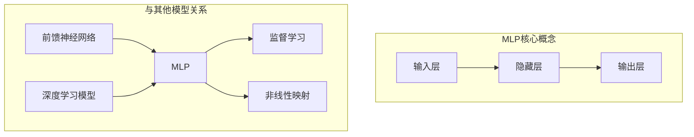

# Multilayer Perceptron (MLP)原理与代码实例讲解

## 1. 背景介绍

### 1.1 问题的由来

在机器学习和深度学习的领域中,人工神经网络(Artificial Neural Networks, ANNs)是一种强大的模型,被广泛应用于各种任务,如图像识别、自然语言处理和决策系统等。其中,多层感知器(Multilayer Perceptron, MLP)是一种最基本和最常见的人工神经网络结构。

MLP是一种前馈神经网络,由多个层次的节点(神经元)组成,每层中的节点与下一层的节点通过加权连接相连。输入数据通过网络的底层,经过一系列非线性变换,最终在输出层产生预测结果。MLP的关键特征在于其能够学习任意复杂的映射关系,从而解决非线性问题。

### 1.2 研究现状

MLP最早可追溯到20世纪60年代,当时由Frank Rosenblatt提出了"感知器"(Perceptron)的概念,这是一种简单的二层神经网络。随后,在1986年,David Rumelhart等人提出了反向传播(Backpropagation)算法,使得多层神经网络的训练成为可能。从那时起,MLP在各个领域得到了广泛应用和研究。

近年来,随着计算能力的提高和大数据时代的到来,深度学习技术取得了长足进展,MLP也得到了新的发展。研究人员不断探索新的激活函数、正则化方法、优化算法等,以提高MLP的性能和泛化能力。同时,MLP也被应用于更多的领域,如计算机视觉、自然语言处理、医疗诊断等。

### 1.3 研究意义

MLP作为一种基础的神经网络结构,对于理解更复杂的深度学习模型具有重要意义。掌握MLP的原理和实现,可以帮助我们更好地理解深度学习的核心思想,如前向传播、反向传播、梯度下降等。

此外,MLP在许多实际应用中仍然发挥着重要作用。虽然近年来更复杂的模型(如卷积神经网络、递归神经网络等)在某些任务上表现更加出色,但MLP由于其简单性和可解释性,在一些场景下仍然是一种有效的选择。

### 1.4 本文结构

本文将全面介绍MLP的原理和实现。我们将首先探讨MLP的核心概念和与其他神经网络模型的联系。接下来,详细阐述MLP的算法原理和具体操作步骤,包括前向传播、反向传播和梯度下降等。然后,我们将推导MLP的数学模型和公式,并通过案例分析加深理解。

在理论部分之后,本文将提供一个完整的代码实例,包括开发环境搭建、源代码实现、代码解读和运行结果展示。最后,我们将探讨MLP的实际应用场景、未来发展趋势和面临的挑战,并推荐相关的学习资源和工具。

## 2. 核心概念与联系

MLP是一种基于人工神经网络的前馈神经网络模型,属于深度学习模型的一种。它由输入层、一个或多个隐藏层和输出层组成。每个神经元接收来自上一层的输入,经过加权求和和非线性激活函数的处理,传递到下一层。

MLP的核心思想是通过训练过程,自动学习输入和输出之间的映射关系,从而解决复杂的非线性问题。它属于监督学习范畴,需要提供带有标签的训练数据集来指导模型的学习过程。

与其他神经网络模型相比,MLP具有以下特点:

1. **前馈传播**: 信息只从输入层向输出层单向传播,不存在反馈连接。
2. **非线性映射**: 通过引入非线性激活函数,MLP能够学习任意复杂的非线性映射关系。
3. **可解释性**: 相比于更深层的神经网络,MLP的结构相对简单,更容易理解和解释。
4. **通用近似能力**: 理论上,具有足够隐藏层和神经元的MLP可以近似任何连续函数。

MLP是深度学习模型的基础,许多更复杂的模型(如卷积神经网络、递归神经网络等)都借鉴了MLP的核心思想。因此,掌握MLP的原理对于理解深度学习至关重要。

## 3. 核心算法原理 & 具体操作步骤

### 3.1 算法原理概述

MLP的训练过程主要包括两个阶段:前向传播(Forward Propagation)和反向传播(Backpropagation)。

1. **前向传播**:输入数据通过网络的各层进行前向计算,得到最终的输出。在每一层,神经元接收来自上一层的输入,经过加权求和和非线性激活函数的处理,传递到下一层。

2. **反向传播**:根据输出与期望值之间的误差,计算每个权重对误差的影响程度(梯度),并通过梯度下降算法调整权重,使得模型输出逐渐接近期望值。

此外,MLP还涉及以下关键概念:

- **激活函数**:引入非线性,使得MLP能够学习复杂的非线性映射关系。常用的激活函数包括Sigmoid、Tanh、ReLU等。
- **损失函数**:度量模型输出与期望值之间的差异,如均方误差(MSE)、交叉熵(Cross-Entropy)等。
- **优化算法**:根据损失函数的梯度,更新网络权重。常用的优化算法包括梯度下降(Gradient Descent)、动量优化(Momentum)、自适应学习率优化(AdaGrad、RMSProp、Adam)等。
- **正则化**:防止过拟合,提高模型的泛化能力。常用的正则化方法包括L1/L2正则化、Dropout等。

### 3.2 算法步骤详解

以下是MLP训练过程的具体步骤:

1. **初始化权重**:通常使用小的随机值初始化网络中的所有权重。
2. **前向传播**:
   - 输入层:接收输入数据 $\boldsymbol{x}$。
   - 隐藏层:对于第 $l$ 层的第 $j$ 个神经元,其输入为 $z_j^{(l)} = \sum_{i} w_{ji}^{(l)}a_i^{(l-1)} + b_j^{(l)}$,其中 $w_{ji}^{(l)}$ 是连接第 $(l-1)$ 层第 $i$ 个神经元与第 $l$ 层第 $j$ 个神经元的权重, $b_j^{(l)}$ 是第 $l$ 层第 $j$ 个神经元的偏置项,  $a_i^{(l-1)}$ 是第 $(l-1)$ 层第 $i$ 个神经元的输出。然后,通过激活函数 $\sigma$ 计算输出 $a_j^{(l)} = \sigma(z_j^{(l)})$。
   - 输出层:类似于隐藏层,计算输出层神经元的输出 $\boldsymbol{\hat{y}}$。
3. **计算损失函数**:根据模型输出 $\boldsymbol{\hat{y}}$ 和期望输出 $\boldsymbol{y}$,计算损失函数值 $L(\boldsymbol{\hat{y}}, \boldsymbol{y})$。
4. **反向传播**:
   - 计算输出层误差:$\delta^{(n_l)} = \nabla_{\boldsymbol{a}^{(n_l)}} L(\boldsymbol{\hat{y}}, \boldsymbol{y}) \odot \sigma'(\boldsymbol{z}^{(n_l)})$,其中 $\nabla_{\boldsymbol{a}^{(n_l)}} L(\boldsymbol{\hat{y}}, \boldsymbol{y})$ 是损失函数关于输出层输出的梯度, $\sigma'$ 是激活函数的导数, $\odot$ 表示元素wise乘积。
   - 计算隐藏层误差(反向传播):$\delta^{(l)} = ((\boldsymbol{W}^{(l+1)})^T \delta^{(l+1)}) \odot \sigma'(\boldsymbol{z}^{(l)})$,其中 $\boldsymbol{W}^{(l+1)}$ 是连接第 $l$ 层与第 $(l+1)$ 层的权重矩阵。
   - 计算梯度:$\nabla_{\boldsymbol{W}^{(l)}} L = \delta^{(l+1)} (\boldsymbol{a}^{(l)})^T$, $\nabla_{\boldsymbol{b}^{(l)}} L = \delta^{(l+1)}$。
5. **更新权重**:根据梯度和优化算法(如梯度下降),更新网络权重 $\boldsymbol{W}^{(l)}$ 和偏置项 $\boldsymbol{b}^{(l)}$。
6. **重复步骤2-5**:使用新的权重,重复前向传播和反向传播,直到模型收敛或达到最大迭代次数。

需要注意的是,在实际应用中,通常会对训练数据进行批处理(Batch),每次迭代使用一个批次的数据进行前向传播和反向传播,从而提高计算效率。此外,还可以采用一些技巧(如正则化、学习率衰减等)来提高模型的性能和泛化能力。

### 3.3 算法优缺点

**优点**:

1. **通用近似能力**:理论上,具有足够隐藏层和神经元的MLP可以近似任何连续函数,从而解决复杂的非线性问题。
2. **可解释性**:相比于更深层的神经网络,MLP的结构相对简单,更容易理解和解释。
3. **易于实现**:MLP的算法原理和实现相对简单,易于上手和理解。
4. **高效计算**:前向传播和反向传播的计算过程可以高度并行化,利用现代硬件(如GPU)进行加速。

**缺点**:

1. **可能过拟合**:MLP具有较强的拟合能力,如果训练数据不足或存在噪声,可能导致过拟合问题。
2. **参数调优困难**:MLP的性能受到多个超参数(如隐藏层数量、神经元数量、学习率等)的影响,参数调优过程复杂。
3. **缓慢收敛**:在某些情况下,MLP的训练过程可能收敛缓慢,需要大量的迭代次数。
4. **局部最小值**:由于损失函数的非凸性,MLP可能陷入局部最小值,无法找到全局最优解。
5. **维数灾难**:当输入维度很高时,MLP可能需要大量的神经元和训练数据,计算复杂度会快速增加。

### 3.4 算法应用领域

MLP由于其通用近似能力和可解释性,在许多领域都有广泛的应用:

1. **图像识别**:MLP可以用于手写数字识别、人脸识别等图像分类任务。
2. **自然语言处理**:MLP可以用于文本分类、情感分析、机器翻译等任务。
3. **决策系统**:MLP可以用于风险评估、信用评分、欺诈检测等决策系统。
4. **控制系统**:MLP可以用于机器人控制、自动驾驶等控制系统。
5. **金融预测**:MLP可以用于股票预测、期货预测等金融时间序列预测任务。
6. **医疗诊断**:MLP可以用于疾病诊断、药物发现等医疗领域的任务。

虽然近年来更复杂的深度学习模型(如卷积神经网络、递归神经网络等)在某些任务上表现更加出色,但MLP由于其简单性和可解释性,在一些场景下仍然是一种有效的选择。

## 4. 数学模型和公式 & 详细讲解 & 举例说明

### 4.1 数学模型构建

MLP的数学模型可以表示为一个由多个函数组合而成的复合函数。假设MLP有 $L$ 个隐藏层,每层分别有 $n_0, n_1, \ldots, n_L