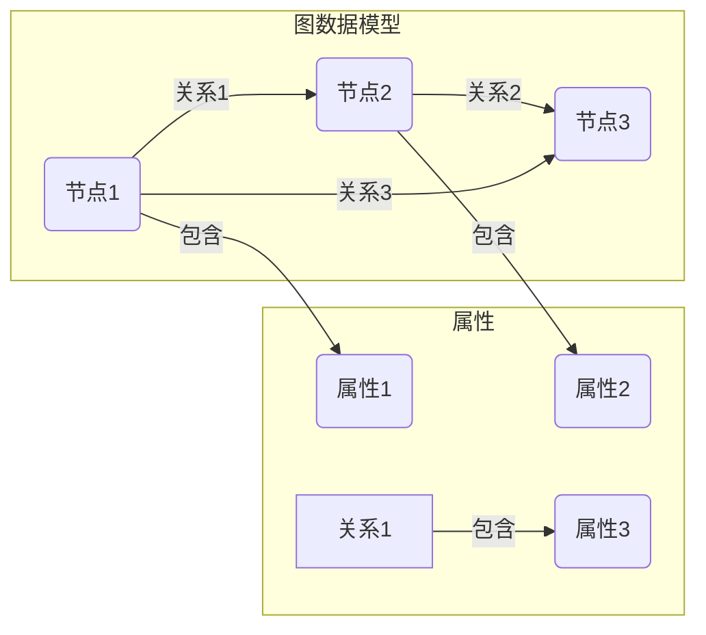

# Neo4j原理与代码实例讲解

## 1. 背景介绍

### 1.1 问题的由来

在当今数据驱动的世界中，管理和处理大规模数据已经成为许多组织面临的重大挑战。传统的关系型数据库在处理高度互连的数据时存在一些局限性,例如性能低下、查询复杂等问题。这种局限性导致了图数据库的兴起,图数据库被设计用于高效地存储和查询高度互连的数据。

Neo4j作为领先的开源图数据库,凭借其优秀的性能和灵活性,已经被广泛应用于各个领域,如社交网络、推荐系统、知识图谱、欺诈检测等。然而,Neo4j背后的原理和实现细节对于许多开发人员来说仍然是个黑盒,这给学习和使用Neo4j带来了一定的挑战。

### 1.2 研究现状

目前,已经有一些书籍和在线资源介绍了Neo4j的基本概念和使用方法,但是大多数资源都停留在较为浅层次的层面,缺乏对Neo4j内部实现原理的深入探讨。同时,现有资源中的代码示例往往过于简单,无法很好地反映Neo4j在实际项目中的应用。

### 1.3 研究意义

深入理解Neo4j的原理和实现细节对于更好地利用这一强大的图数据库工具至关重要。通过掌握Neo4j的内部工作机制,开发人员可以更高效地设计和优化图数据模型,编写高性能的Cypher查询,并有效地解决实际项目中遇到的各种挑战。

此外,研究Neo4j的原理和实现细节也有助于促进图数据库技术的发展。通过分析Neo4j的优缺点,可以为未来的图数据库系统提供宝贵的设计和优化建议。

### 1.4 本文结构

本文将从以下几个方面深入探讨Neo4j的原理和实现:

1. 介绍Neo4j的核心概念和架构,包括图数据模型、Cypher查询语言等。
2. 详细阐述Neo4j的核心算法原理,如图遍历、图匹配等,并给出具体的操作步骤。
3. 解析Neo4j背后的数学模型和公式,如PageRank算法等,并通过案例分析加深理解。
4. 提供完整的代码实例,涵盖Neo4j的安装、配置、数据导入、查询操作等多个方面,并进行详细的解释和分析。
5. 探讨Neo4j在实际应用场景中的使用,如社交网络分析、推荐系统等。
6. 推荐相关的学习资源、开发工具和论文,为读者提供进一步学习和研究的途径。
7. 总结Neo4j的发展趋势和面临的挑战,并对未来的研究方向进行展望。

通过本文的学习,读者将能够全面深入地理解Neo4j的原理和实现细节,掌握在实际项目中使用Neo4j的技能,并为未来的图数据库技术发展做好准备。

## 2. 核心概念与联系

在深入探讨Neo4j的原理和实现之前,我们首先需要了解Neo4j的核心概念和架构。Neo4j是一种基于属性图的图数据库,它将数据存储为节点(Node)、关系(Relationship)和属性(Property)的形式。



- **节点(Node)**: 代表图中的实体,可以是任何类型的数据,如人、地点、事件等。每个节点可以具有一个或多个属性。
- **关系(Relationship)**: 连接两个节点,表示它们之间的关联。关系是有向的,可以具有类型和属性。
- **属性(Property)**: 描述节点或关系的附加信息,通常是键值对的形式。

Neo4j使用Cypher作为查询语言,Cypher语言类似于SQL,但更加直观和面向图的。它支持创建、更新、删除和查询图数据,并提供了丰富的函数和操作符来处理图数据。

下面是一个简单的Cypher查询示例,用于查找两个人之间的最短路径:

```cypher
MATCH (p1:Person {name: 'Alice'}), (p2:Person {name: 'Bob'}),
      path = shortestPath((p1)-[*..15]-(p2))
RETURN path
```

在这个查询中,我们首先使用`MATCH`子句匹配两个名为Alice和Bob的Person节点。然后,我们使用`shortestPath()`函数查找这两个节点之间的最短路径,并将结果存储在`path`变量中。最后,我们使用`RETURN`子句返回路径结果。

Neo4j的核心架构由以下几个主要组件组成:

1. **Cypher查询引擎**: 负责解析和执行Cypher查询,并与其他组件进行交互。
2. **图存储引擎**: 负责管理图数据的持久化存储,包括节点、关系和属性。
3. **缓存和索引**: 提供缓存和索引机制,以加速查询和数据访问。
4. **集群和高可用性**: 支持水平扩展和高可用性,以满足大规模数据和高并发访问的需求。
5. **安全和访问控制**: 提供身份验证、授权和加密等安全功能,保护数据的隐私和完整性。

通过理解Neo4j的核心概念和架构,我们可以更好地掌握它的工作原理,并为后续的原理探讨和实践应用奠定基础。

## 3. 核心算法原理 & 具体操作步骤

### 3.1 算法原理概述

Neo4j作为一种图数据库,其核心算法主要围绕图的存储、遍历和查询等方面展开。这些算法的高效实现直接影响着Neo4j的性能和可扩展性。

以下是Neo4j中一些核心算法的概述:

1. **图存储算法**: Neo4j采用了一种称为"本地存储"的存储引擎,它将图数据以紧凑的二进制格式存储在磁盘上。这种存储方式可以最大限度地减少磁盘I/O操作,提高数据访问效率。

2. **图遍历算法**: Neo4j支持多种图遍历算法,如深度优先搜索(DFS)、广度优先搜索(BFS)、A*算法等。这些算法用于查找节点之间的路径、计算中心性等任务。

3. **图匹配算法**: Neo4j使用一种基于规则的图匹配算法来执行Cypher查询。该算法将查询模式与图数据进行匹配,并返回满足条件的子图。

4. **图分析算法**: Neo4j内置了多种图分析算法,如PageRank、社区发现、最短路径等。这些算法可用于分析网络结构、发现重要节点和社区等任务。

5. **图索引算法**: Neo4j支持基于标签和属性的索引,以加速节点和关系的查找。它采用了一种称为"基于属性前缀树"的索引算法,可以高效地处理范围查询和前缀查询。

在后续章节中,我们将详细探讨这些核心算法的原理和实现细节,并通过代码示例加深理解。

### 3.2 算法步骤详解

#### 3.2.1 图存储算法

Neo4j采用了一种称为"本地存储"的存储引擎,它将图数据以紧凑的二进制格式存储在磁盘上。这种存储方式可以最大限度地减少磁盘I/O操作,提高数据访问效率。

Neo4j的存储引擎由以下几个主要组件组成:

1. **节点存储(Node Store)**: 用于存储节点及其属性。每个节点都被分配一个唯一的ID,并以紧凑的二进制格式存储在磁盘上。

2. **关系存储(Relationship Store)**: 用于存储关系及其属性。每个关系都被分配一个唯一的ID,并以紧凑的二进制格式存储在磁盘上。关系存储还维护着关系的起点和终点节点的ID,以及关系类型。

3. **属性存储(Property Store)**: 用于存储节点和关系的属性。属性被存储为键值对,并使用一种称为"属性记录"的数据结构进行组织。

4. **日志文件(Log Files)**: 用于记录对图数据的修改操作,以确保数据的持久性和一致性。Neo4j采用了一种称为"写前日志(Write-Ahead Logging, WAL)"的机制,在执行任何写操作之前,都会先将操作记录到日志文件中。

5. **缓存(Caching)**: Neo4j使用了多级缓存系统,包括节点缓存、关系缓存和属性缓存,以加速数据访问。

下面是Neo4j图存储算法的基本步骤:

1. 当创建一个新节点或关系时,Neo4j会为其分配一个唯一的ID,并将其存储在相应的存储文件(节点存储或关系存储)中。

2. 如果节点或关系具有属性,则将这些属性存储在属性存储中,并与相应的节点或关系ID建立映射关系。

3. 对图数据的任何修改操作(如创建、更新或删除节点/关系)都会先记录在日志文件中,以确保数据的持久性和一致性。

4. 当从图数据库中读取数据时,Neo4j会首先检查缓存,如果缓存中没有所需的数据,则从磁盘存储中读取。

5. 定期执行检查点操作,将内存中的数据刷新到磁盘存储中,以确保数据的持久性。

通过这种存储算法,Neo4j可以高效地管理大规模的图数据,同时保证数据的持久性和一致性。

#### 3.2.2 图遍历算法

图遍历是Neo4j中一项非常重要的操作,它用于查找节点之间的路径、计算中心性等任务。Neo4j支持多种图遍历算法,包括深度优先搜索(DFS)、广度优先搜索(BFS)和A*算法等。

以下是Neo4j中图遍历算法的基本步骤:

1. **初始化**: 根据遍历目标(如查找路径、计算中心性等)和起始节点,初始化遍历算法的参数和数据结构。

2. **选择遍历策略**: 根据具体任务,选择合适的遍历策略,如DFS、BFS或A*算法。不同的策略具有不同的优缺点,需要根据具体情况进行权衡。

3. **遍历执行**: 执行遍历算法,按照选定的策略访问图中的节点和关系。在遍历过程中,可能需要维护一些辅助数据结构,如队列、栈或优先级队列等。

4. **结果收集**: 在遍历过程中,根据具体任务,收集所需的结果信息,如路径、中心性值等。

5. **终止条件检查**: 持续检查是否满足终止条件,如已找到所需路径、遍历深度达到上限等。如果满足终止条件,则结束遍历过程。

6. **结果返回**: 将收集到的结果信息返回给调用方。

下面以DFS算法为例,详细介绍Neo4j中图遍历算法的实现细节:

```java
// 深度优先搜索算法的伪代码
DFS(Node startNode, Predicate shouldTraverse) {
    Stack<Node> stack = new Stack();
    Set<Node> visited = new Set();
    stack.push(startNode);
    visited.add(startNode);

    while (!stack.isEmpty()) {
        Node currentNode = stack.pop();
        // 处理当前节点
        ...

        // 遍历当前节点的邻居节点
        for (Relationship rel : currentNode.getRelationships()) {
            Node neighbor = rel.getOtherNode(currentNode);
            if (!visited.contains(neighbor) && shouldTraverse.test(neighbor)) {
                stack.push(neighbor);
                visited.add(neighbor);
            }
        }
    }
}
```

在这个伪代码中,我们首先初始化一个栈和一个集合,分别用于存储待访问的节点和已访问的节点。然后,我们将起始节点推入栈中,并将其标记为已访问。

接下