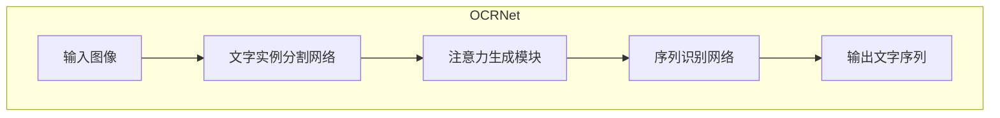

# OCRNet原理与代码实例讲解

## 1. 背景介绍

### 1.1 问题的由来

在当今数字化时代,海量的文字信息被储存在图像、扫描文件和PDF文档中。能够准确高效地从这些图像中提取文字内容,对于数据处理、内容分析和信息管理等领域都具有重要意义。传统的光学字符识别(Optical Character Recognition, OCR)技术虽然取得了一定成功,但在处理复杂背景、低质量图像和印刷文字时,其准确性和鲁棒性仍有待提高。

### 1.2 研究现状

近年来,随着深度学习技术的不断发展,基于卷积神经网络(Convolutional Neural Networks, CNN)的OCR方法逐渐成为研究热点。相比于传统方法,深度学习模型能够自动学习图像的高级语义特征,从而提高文字检测和识别的准确率。目前,主流的OCR深度学习模型可分为基于检测的方法和基于分割的方法两大类。

基于检测的方法首先定位文字区域,然后对每个文字区域进行识别,如CTPN、EAST等模型。这种方法对于水平排列的文字效果较好,但对于弯曲、倾斜等任意方向的文字,检测和识别的准确性仍有待提高。

基于分割的方法则将图像像素级别上的文字和背景进行分割,通过组合像素得到文字序列,如PSENet、PAN等模型。这种方法对任意方向的文字具有更好的适应性,但存在分割不准确、组合错误等问题。

### 1.3 研究意义

OCRNet是一种集成了检测和分割两种范式优点的全新OCR深度学习模型,它能够准确高效地从任意背景的图像中检测和识别任意方向的印刷体和手写体文字。OCRNet的提出不仅推动了OCR技术的发展,也为解决更加通用的图像理解问题提供了新的思路。本文将全面介绍OCRNet的原理、算法细节、代码实现和应用场景,以期为读者提供深入的理解和实践指导。

### 1.4 本文结构

本文共分为8个部分:第1部分介绍了研究背景;第2部分阐述OCRNet的核心概念及其与其他模型的联系;第3部分详细解释OCRNet的算法原理和具体步骤;第4部分构建OCRNet的数学模型,并推导关键公式;第5部分提供OCRNet的代码实现细节;第6部分列举OCRNet的实际应用场景;第7部分推荐相关工具和学习资源;第8部分总结OCRNet的研究成果、发展趋势和面临的挑战。

## 2. 核心概念与联系

OCRNet是一种端到端的OCR深度学习模型,它融合了目标检测和语义分割两种范式的优点。OCRNet的核心思想是:

1. **文字实例分割(Instance Segmentation)**:利用分割网络对图像中的每个文字实例进行像素级别的分割,得到文字实例的掩码(mask)。

2. **注意力机制(Attention Mechanism)**:根据分割结果,在原始图像上动态生成每个文字实例的注意力区域(attention region)。

3. **序列识别(Sequence Recognition)**:将注意力区域作为输入,通过识别网络直接生成对应的文字序列。

通过上述三个关键步骤,OCRNet能够同时实现对任意方向文字的精准检测和高效识别,大幅提升了OCR的性能。

OCRNet与其他主流OCR模型的主要区别和联系如下:

- 与基于检测的模型(如CTPN、EAST等)相比,OCRNet无需先行构建文字边界框,避免了检测错误导致的识别失败。
- 与基于分割的模型(如PSENet、PAN等)相比,OCRNet借助注意力机制,能够更加准确地关联分割结果与识别输出。
- OCRNet整合了检测和分割两种范式的优点,实现了"分割+注意力+识别"的创新架构。

## 3. 核心算法原理与具体操作步骤

### 3.1 算法原理概述

OCRNet的核心算法原理可概括为三个主要部分:文字实例分割网络、注意力生成模块和序列识别网络。

1. **文字实例分割网络**:采用U-Net等分割网络,对输入图像进行像素级别的语义分割,得到每个文字实例的掩码。
2. **注意力生成模块**:根据分割结果,在原始图像上动态生成每个文字实例的注意力区域。
3. **序列识别网络**:将注意力区域作为输入,通过CRNN等序列识别网络,直接生成对应的文字序列。

通过端到端的训练,OCRNet能够自动学习文字实例分割、注意力生成和序列识别三个任务,最终实现高精度的OCR识别。

### 3.2 算法步骤详解

OCRNet算法的具体步骤如下:

1. **数据预处理**:对输入图像进行标准化、缩放等预处理,以满足网络输入要求。

2. **文字实例分割**:使用U-Net等分割网络对预处理后的图像进行前向传播,得到每个文字实例的二值掩码。

3. **注意力区域生成**:
    - 对分割结果进行实例嵌套处理,确保每个文字实例对应一个独立的掩码。
    - 根据掩码在原始图像上提取每个文字实例的注意力区域。
    - 对注意力区域进行适当的几何变换(如旋转校正),使文字保持水平方向。

4. **序列识别**:
    - 将处理后的注意力区域输入CRNN等序列识别网络。
    - CRNN网络由卷积层、循环层和转录层组成,用于提取文字序列特征并解码成字符序列。
    - 对每个注意力区域得到一个字符序列,即为该文字实例的识别结果。

5. **后处理**:对识别结果进行规范化、滤波等后处理,得到最终的OCR输出文本。

在训练阶段,OCRNet的三个子网络共同优化,端到端地学习文字实例分割、注意力生成和序列识别的能力。

### 3.3 算法优缺点

OCRNet算法的主要优点:

- 端到端设计,无需人工设计复杂的流程,简化了传统OCR系统。
- 融合检测和分割范式的优点,能够精准识别任意方向的印刷体和手写体文字。
- 注意力机制有效关联了分割结果和识别输出,提高了准确性。
- 通过数据驱动的方式,能够自动学习文字的视觉特征和语义信息。

OCRNet算法的主要缺点:

- 需要大量的标注数据进行训练,对数据质量要求较高。
- 模型结构复杂,训练和推理过程的计算开销较大。
- 对于图像中的小文字、低质量文字,识别准确率仍有待提高。
- 对于特殊字体、符号等,需要进一步扩展字符集和训练数据。

### 3.4 算法应用领域

OCRNet算法可广泛应用于以下领域:

- 文档数字化:从扫描文档、书籍、报纸等图像中精准提取文字内容。
- 车牌识别:自动识别车辆图像中的车牌号码信息。
- 街景文字识别:从城市街景图像中提取店铺名称、路牌、标识等文字信息。
- 表单识别:自动读取表格、发票等结构化文档中的关键文本内容。
- 自然场景文字识别:在自然环境图像中识别路标、标语等文字。
- 手写体识别:识别手写字迹,如信件、便签等。

OCRNet的高精度、高鲁棒性使其能够广泛应用于各种复杂场景下的OCR任务。

## 4. 数学模型和公式详细讲解与举例说明

### 4.1 数学模型构建

OCRNet的核心是一个端到端的多任务深度神经网络模型,包含文字实例分割网络、注意力生成模块和序列识别网络三个主要部分。我们将分别构建每个部分的数学模型。

1. **文字实例分割网络**

我们采用U-Net作为分割网络的基础架构,其输入为图像 $I$,输出为每个像素的类别概率图 $P(c|I)$,其中 $c$ 表示像素的类别(文字或背景)。

U-Net由编码器(encoder)和解码器(decoder)两部分组成。编码器通过一系列卷积和下采样操作提取图像的特征表示,解码器则通过上采样和卷积操作逐步恢复特征图的空间分辨率,并利用编码器的特征图进行特征融合。

令 $f_\text{enc}$ 和 $f_\text{dec}$ 分别表示编码器和解码器的函数,U-Net的前向计算过程可表示为:

$$P(c|I) = f_\text{dec}(f_\text{enc}(I))$$

通过像素级别的二值交叉熵损失函数对U-Net进行训练,使其能够精准分割出图像中的文字实例。

2. **注意力生成模块**

注意力生成模块的输入为原始图像 $I$ 和分割结果 $P(c|I)$,输出为每个文字实例的注意力区域 $R_i$。

首先,我们对分割结果进行连通域分析,得到每个文字实例的二值掩码 $M_i$。然后,根据掩码在原始图像上提取对应的注意力区域:

$$R_i = I \odot M_i$$

其中 $\odot$ 表示元素级别的矩阵乘积操作。

对于每个注意力区域 $R_i$,我们可以进一步应用几何变换(如旋转校正),使文字保持水平方向:

$$\tilde{R}_i = \mathcal{T}(R_i)$$

其中 $\mathcal{T}$ 表示几何变换函数。

3. **序列识别网络**

我们采用CRNN(Convolutional Recurrent Neural Network)作为序列识别网络的基础架构。CRNN由卷积层、循环层和转录层(Transcription Layer)三部分组成。

- 卷积层提取输入图像的视觉特征,可表示为:

$$\boldsymbol{x} = f_\text{conv}(\tilde{R}_i)$$

其中 $f_\text{conv}$ 表示卷积层的函数,输出为特征序列 $\boldsymbol{x}$。

- 循环层(如LSTM或GRU)捕获特征序列中的上下文信息,可表示为:

$$\boldsymbol{h} = f_\text{rec}(\boldsymbol{x})$$

其中 $f_\text{rec}$ 表示循环层的函数,输出为隐状态序列 $\boldsymbol{h}$。

- 转录层对隐状态序列进行解码,生成对应的字符序列 $\boldsymbol{y}$:

$$\boldsymbol{y} = \arg\max_{\boldsymbol{y}} P(\boldsymbol{y}|\boldsymbol{h})$$

其中 $P(\boldsymbol{y}|\boldsymbol{h})$ 表示给定隐状态序列 $\boldsymbol{h}$ 时,字符序列 $\boldsymbol{y}$ 的条件概率分布。

通过最大化 $P(\boldsymbol{y}|\boldsymbol{h})$,我们可以得到注意力区域 $\tilde{R}_i$ 对应的最优字符序列 $\boldsymbol{y}_i$,即为该文字实例的识别结果。

### 4.2 公式推导过程

在4.1节中,我们构建了OCRNet各个模块的数学模型,其中涉及到一些关键公式。现在,我们将详细推导这些公式的过程。

1. **U-Net的前向计算公式**

$$P(c|I) = f_\text{dec}(f_\text{enc}(I))$$

其中 $f_\text{enc}$ 和 $f_\text{dec}$ 分别表示编码器和解码器的函数。

该公式的推导过程如下:

- 编码器 $f_\text{enc}$ 通过一系列卷积和下采样操作,将输入图像 $I$ 