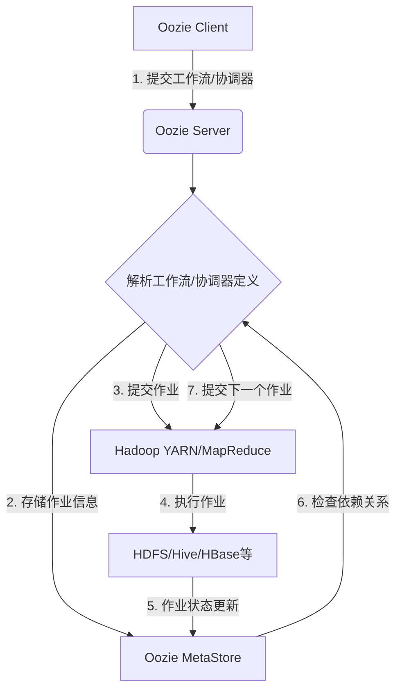
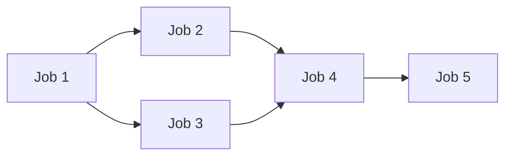

# Oozie原理与代码实例讲解

## 1. 背景介绍

### 1.1 问题的由来

在大数据时代,数据处理作业的管理和调度成为了一个巨大的挑战。由于数据量的持续增长和处理任务的复杂性,单个作业的执行往往需要依赖于其他作业的输出结果,形成了复杂的作业依赖关系。手动管理和调度这些相互依赖的作业不仅低效且容易出错。因此,需要一种可靠、高效的工作流调度系统来自动化管理这些复杂的数据处理流程。

### 1.2 研究现状  

目前,已有多种开源工作流调度系统应运而生,如Apache Oozie、Apache AirFlow、AWS Data Pipeline等。其中,Apache Oozie作为Apache Hadoop生态系统中的工作流调度系统,凭借其与Hadoop生态系统的无缝集成、可扩展性强、支持多种类型作业等优点,成为了大数据领域广泛使用的工作流调度系统之一。

### 1.3 研究意义

深入理解Oozie的原理和使用方法,对于提高大数据处理效率、降低运维成本具有重要意义。本文将全面介绍Oozie的核心概念、工作原理、使用方法,并通过实例讲解代码细节,旨在帮助读者掌握Oozie,提升大数据开发和运维能力。

### 1.4 本文结构

本文首先介绍Oozie的核心概念和工作原理,然后详细讲解Oozie工作流的定义方式和运行机制。接着通过数学模型和公式分析Oozie的调度策略,并给出实际应用场景。最后通过代码实例,讲解如何使用Oozie开发和部署工作流应用。

## 2. 核心概念与联系

Oozie是一个用于管理Hadoop作业(如Java MapReduce、Pig作业、Hive作业等)的工作流调度系统。它的核心概念包括:

1. **工作流(Workflow)**: 定义了控制执行顺序的作业集合。
2. **协调器(Coordinator)**: 用于调度基于时间和数据可用性触发的工作流。
3. **Bundle**: 用于打包并并行运行多个协调器和工作流作业。

Oozie通过将作业组织成有向无环图(DAG)的形式,使得复杂的数据处理过程可以被分解为多个有序的步骤,每个步骤都是一个独立的作业。这些作业可以是MapReduce、Pig、Hive等任意可执行程序。

Oozie的工作原理如下:

上图描述了Oozie的基本工作流程:

1. 客户端将工作流或协调器定义提交给Oozie Server。
2. Oozie Server解析定义,并将作业信息存储在Oozie MetaStore中。
3. Oozie Server根据定义向Hadoop YARN/MapReduce提交第一个作业。
4. Hadoop执行作业,作业读写数据位于HDFS/Hive/HBase等系统。
5. 作业完成后,状态更新存储在Oozie MetaStore中。
6. Oozie检查作业的依赖关系,确定下一步执行哪个作业。
7. 重复3-6步,直至所有作业执行完毕。

通过这种方式,Oozie实现了对复杂数据处理流程的高效调度和管理。

## 3. 核心算法原理 & 具体操作步骤  

### 3.1 算法原理概述

Oozie的核心算法是基于有向无环图(DAG)的拓扑排序算法,用于确定作业的执行顺序。该算法遍历DAG,将所有入度为0的节点(作业)加入执行队列,然后移除这些节点及其出边,重复该过程直至所有节点都被访问。

### 3.2 算法步骤详解  

Oozie的作业调度算法步骤如下:

1. 构建作业DAG
2. 统计每个作业的入度(依赖作业数)
3. 创建一个执行队列Queue
4. 将所有入度为0的作业加入Queue
5. 从Queue取出一个作业,提交执行
6. 在DAG中移除该作业及其出边
7. 对该作业指向的所有作业,减1入度
8. 将新的入度为0的作业加入Queue
9. 重复5-8步,直至Queue为空

### 3.3 算法优缺点

**优点**:
- 高效:平均时间复杂度为O(V+E),V为作业数,E为依赖关系数
- 无环:确保作业之间不存在循环依赖
- 并行:可以同时执行多个无依赖关系的作业

**缺点**:  
- 不支持动态调度:作业DAG在运行时无法修改
- 资源竞争:多个作业同时运行可能导致资源不足

### 3.4 算法应用领域

拓扑排序算法广泛应用于需要对事件的偏序关系建模的领域,如:

- 编译器中的指令调度
- 机器学习中的特征工程流水线
- 软件部署中的任务编排
- 制造业中的工艺流程控制

## 4. 数学模型和公式 & 详细讲解 & 举例说明

### 4.1 数学模型构建

我们将作业调度问题建模为一个约束优化问题。

**符号说明**:
- $J$: 作业集合,包含$n$个作业$\{j_1,j_2,...,j_n\}$
- $D$: 作业依赖关系集合,$(j_i,j_k) \in D$表示$j_k$依赖于$j_i$
- $t_j$: 作业$j$的执行时间
- $s_j$: 作业$j$的开始时间
- $c_j$: 作业$j$的完成时间,即$c_j = s_j + t_j$
- $M$: 一个足够大的常数

**目标函数**:
$$
\min \sum_{j \in J} c_j
$$

最小化所有作业的总完成时间,即makespan。

**约束条件**:

$$
\begin{aligned}
& \forall (j_i,j_k) \in D: c_i \leq s_k & (1)\\
& \forall j \in J: s_j \geq 0 & (2)\\
& \forall j \in J: c_j = s_j + t_j & (3)\\
\end{aligned}
$$

约束(1)确保依赖关系得到满足,约束(2)(3)分别确保作业开始时间非负和完成时间的定义。

### 4.2 公式推导过程

为了求解上述优化问题,我们引入一个辅助变量$y_{ik}$:

$$
y_{ik} = \begin{cases}
1 & \text{if } (j_i,j_k) \in D\\
0 & \text{otherwise}
\end{cases}
$$

则约束(1)可以等价表示为:

$$
\forall j_i,j_k \in J: c_i \leq s_k + M(1-y_{ik})
$$

这是因为当$(j_i,j_k) \in D$时,$y_{ik}=1$,约束等价于$c_i \leq s_k$;否则当$y_{ik}=0$时,由于$M$足够大,约束不起作用。

通过这一变换,我们得到了一个标准的混合整数线性规划(MILP)问题,可以使用现有的MILP求解器(如CPLEX、Gurobi等)来求解最优调度方案。

### 4.3 案例分析与讲解

我们以一个简单的作业调度案例来说明上述模型:

这个案例包含5个作业,作业1和作业3是入度为0的起始作业,作业5是终止作业。作业2和作业4分别依赖于作业1,作业4还依赖于作业3。

我们定义:
- $J=\{1,2,3,4,5\}$
- $D=\{(1,2),(1,3),(2,4),(3,4),(4,5)\}$
- $t_1=2,t_2=3,t_3=1,t_4=4,t_5=2$

将这些数据代入上面的MILP模型,并求解,可以得到最优调度方案:

- $s_1=0,c_1=2$
- $s_3=0,c_3=1$ 
- $s_2=2,c_2=5$
- $s_4=5,c_4=9$
- $s_5=9,c_5=11$

最优makespan为11。

我们可以看到,作业1和作业3并行执行,作业2在作业1完成后立即执行,作业4在作业2和作业3都完成后执行,作业5最后执行。这是一种合理的调度方案。

### 4.4 常见问题解答

**Q: 为什么要将约束(1)等价转换为约束(4)?**

A: 这是为了将原始的约束优化问题转换为标准的MILP问题,以便可以使用现有的MILP求解器求解。原始约束(1)中包含了逻辑条件,不属于标准MILP形式。通过引入辅助变量$y_{ik}$,我们将逻辑条件转换为线性约束,从而得到了等价的标准MILP模型。

**Q: 为什么要最小化makespan?**

A: makespan指所有作业完成的总时间,是评估调度算法性能的一个重要指标。最小化makespan可以确保所有作业在最短的时间内完成,提高了资源利用效率。在实际应用中,我们还可以根据具体需求,将目标函数设置为最小化平均作业完成时间、最大化吞吐量等。

**Q: 该模型是否考虑了资源约束?**

A: 目前的模型没有考虑资源约束,假设所有作业都有足够的资源(如CPU、内存等)供其独占式运行。在实际场景中,我们需要将资源作为额外的约束条件加入模型,以确保作业调度时不会出现资源过度使用的情况。

## 5. 项目实践:代码实例和详细解释说明

### 5.1 开发环境搭建

在开始Oozie开发之前,我们需要先搭建Hadoop环境。本示例使用Pseudo分布式模式安装Hadoop 3.2.2版本,具体步骤如下:

1. 下载Hadoop 3.2.2发行版,并解压到指定目录
2. 配置`etc/hadoop/hadoop-env.sh`,设置JAVA_HOME环境变量
3. 配置`etc/hadoop/core-site.xml`,设置NameNode和DataNode的主机名和端口号
4. 配置`etc/hadoop/hdfs-site.xml`,设置NameNode和DataNode的数据存储目录
5. 配置`etc/hadoop/mapred-site.xml`,设置MapReduce作业运行模式为Yarn
6. 配置`etc/hadoop/yarn-site.xml`,设置ResourceManager和NodeManager的主机名和端口号
7. 启动Hadoop集群:`sbin/start-dfs.sh`和`sbin/start-yarn.sh`

接下来,我们需要安装Oozie。本示例使用Oozie 5.2.1版本:

1. 下载Oozie 5.2.1发行版,并解压到指定目录
2. 配置`conf/oozie-env.sh`,设置JAVA_HOME和OOZIE_HOME环境变量
3. 配置`conf/oozie-site.xml`,设置Oozie Server的主机名和端口号,以及Oozie MetaStore的JDBC URL和凭据
4. 创建Oozie MetaStore数据库,并执行`oozie.sql`脚本初始化表结构
5. 启动Oozie Server:`bin/oozie-start.sh`

至此,我们已经成功搭建了Oozie开发环境。

### 5.2 源代码详细实现

接下来,我们通过一个示例工作流来演示如何使用Oozie开发工作流应用。该示例工作流包含3个MapReduce作业:

1. 第一个作业从HDFS读取文本文件,对每行进行词频统计
2. 第二