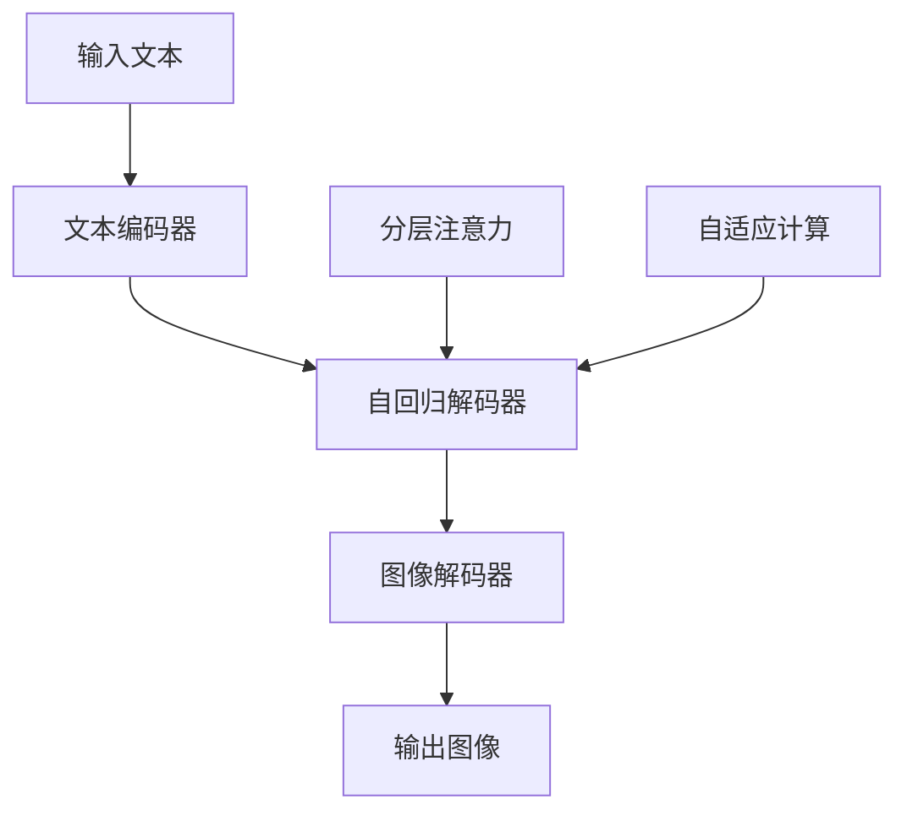

# Parti原理与代码实例讲解

## 1. 背景介绍
### 1.1  问题的由来
近年来，随着人工智能技术的飞速发展，大语言模型(Large Language Models, LLMs)在自然语言处理领域取得了突破性的进展。然而，现有的LLMs虽然在语言理解和生成方面表现出色，但在执行特定任务时，往往需要大量的微调和专门训练，这不仅耗时耗力，而且难以适应不断变化的需求。如何让LLMs具备更强的通用性和适应性，成为了亟待解决的问题。

### 1.2  研究现状
针对上述问题，谷歌于2022年提出了一种新的范式——Pathways Autoregressive Text-to-Image (Parti) 模型。Parti是一个基于自回归Transformer的文本到图像生成模型，它能够根据自然语言描述生成高质量、高分辨率的图像。与以往的方法不同，Parti采用了模块化的设计，可以灵活组合不同的组件，从而实现更强大的生成能力。同时，Parti还引入了一些创新的技术，如分层注意力机制、自适应计算等，进一步提升了模型的性能。

### 1.3  研究意义
Parti的提出具有重要的研究意义：

1. 它为LLMs的通用化和适应性问题提供了一种新的解决思路，为后续研究指明了方向； 
2. 它极大地拓展了LLMs的应用场景，使其不仅局限于文本任务，还能生成图像等多模态内容；
3. 它展示了模块化设计的优势，为构建更加灵活、高效的人工智能系统提供了参考。

总的来说，Parti代表了LLMs领域的一个重要进展，值得深入研究和探讨。

### 1.4  本文结构
本文将围绕Parti模型展开深入讨论。首先，我们将介绍Parti的核心概念和原理，阐述其与传统方法的区别。然后，我们将详细解析Parti的关键算法和数学模型，并给出直观的图示说明。接着，我们将通过一个完整的代码实例，演示如何使用Parti进行文本到图像的生成任务。最后，我们将总结Parti的优势和局限，展望其未来的发展方向，并提供一些有价值的资源供读者进一步学习和研究。

## 2. 核心概念与联系

Parti模型的核心概念可以概括为以下几点：

1. 自回归Transformer：Parti采用了自回归的Transformer结构，即每个时间步的输出都取决于之前的输出。这种结构天然适合处理序列数据，如文本和图像。

2. 文本到图像生成：Parti的主要任务是根据文本描述生成对应的图像。这是一个条件生成任务，输入为文本，输出为图像。

3. 模块化设计：Parti采用了模块化的设计思想，将整个模型拆分为多个可复用的组件，如编码器、解码器、注意力机制等。这种设计使得模型更加灵活，可以轻松适应不同的任务需求。

4. 分层注意力：Parti引入了分层注意力机制，即在不同的特征层次上应用注意力操作。这有助于捕捉图像的局部和全局信息，从而生成更加细致和逼真的图像。

5. 自适应计算：Parti还采用了自适应计算技术，根据输入的复杂度动态调整计算资源。这种机制可以显著提高模型的计算效率，同时保持生成质量。

下图展示了Parti模型的整体架构和各个组件之间的关系：

从图中可以看出，输入的文本首先经过编码器得到语义表示，然后送入自回归解码器中逐步生成图像。解码器中使用了分层注意力和自适应计算等技术，最终输出高质量的图像结果。

## 3. 核心算法原理 & 具体操作步骤
### 3.1  算法原理概述
Parti的核心算法可以分为三个主要部分：文本编码、图像解码和注意力计算。

文本编码部分使用Transformer的编码器对输入文本进行编码，将其转化为语义向量表示。这一步的目的是提取文本的关键信息，为后续的图像生成提供条件。

图像解码部分采用自回归的Transformer解码器，根据文本语义向量和已生成的图像内容，逐像素地预测下一个像素的色彩值。这个过程可以看作是一个序列生成任务，每个时间步输出一个像素。

注意力计算是Transformer的核心操作，用于建模不同位置之间的长距离依赖关系。Parti在此基础上引入了分层注意力机制，在不同的特征层次上应用注意力计算，以捕捉图像的局部和全局信息。

### 3.2  算法步骤详解
下面我们对Parti的算法步骤进行详细说明：

**Step 1: 文本编码**
1. 将输入文本 $\mathbf{x}$ 转化为词嵌入向量序列 $\mathbf{E}_x$；
2. 对 $\mathbf{E}_x$ 进行位置编码，加入位置信息；
3. 将位置编码后的向量送入Transformer编码器，计算自注意力权重，得到最终的文本语义向量 $\mathbf{Z}_x$。

**Step 2: 图像解码**
1. 初始化图像特征向量 $\mathbf{H}_0$；
2. 对于每个解码步骤 $t=1,2,...,T$：
   1. 将 $\mathbf{H}_{t-1}$ 和 $\mathbf{Z}_x$ 拼接，送入Transformer解码器；
   2. 在解码器的每一层，计算自注意力权重和编码-解码注意力权重；
   3. 将注意力权重应用于 $\mathbf{H}_{t-1}$ 和 $\mathbf{Z}_x$，得到更新后的图像特征向量 $\mathbf{H}_t$；
   4. 将 $\mathbf{H}_t$ 送入图像解码器，预测当前时间步的像素色彩值 $\hat{\mathbf{y}}_t$。

**Step 3: 注意力计算**
1. 对于每个注意力头 $h=1,2,...,H$：
   1. 将输入特征向量 $\mathbf{X}$ 乘以权重矩阵 $\mathbf{W}^Q_h, \mathbf{W}^K_h, \mathbf{W}^V_h$，得到查询向量 $\mathbf{Q}_h$、键向量 $\mathbf{K}_h$ 和值向量 $\mathbf{V}_h$；
   2. 计算查询向量和键向量的点积，得到注意力分数 $\mathbf{S}_h$；
   3. 对注意力分数进行归一化，得到注意力权重 $\mathbf{A}_h$；
   4. 将注意力权重应用于值向量，得到输出特征向量 $\mathbf{O}_h$。
2. 将所有注意力头的输出拼接，得到最终的注意力特征向量 $\mathbf{O}$。

以上就是Parti算法的主要步骤。通过文本编码、图像解码和注意力计算这三个环节的协同工作，Parti可以根据文本描述生成高质量、高分辨率的图像。

### 3.3  算法优缺点
Parti算法的优点主要有以下几个方面：

1. 端到端的生成方式，无需中间步骤，使用简单；
2. 模块化设计，组件可复用，适应性强；
3. 采用自回归结构，天然适合处理序列数据；
4. 引入分层注意力和自适应计算，提高了生成质量和效率。

同时，Parti算法也存在一些局限性：

1. 生成速度相对较慢，难以实时响应；
2. 对训练数据和计算资源要求较高；
3. 生成多样性有待进一步提升。

### 3.4  算法应用领域
Parti算法具有广泛的应用前景，主要可用于以下领域：

1. 艺术创作：根据文本描述自动生成插图、概念图等；
2. 设计辅助：提供设计灵感，自动生成设计草图；
3. 虚拟场景生成：根据场景描述生成逼真的虚拟环境；
4. 数据增强：自动生成训练数据，扩充数据集。

总的来说，Parti为文本到图像生成任务提供了一种强大、灵活的解决方案，有望在多个领域发挥重要作用。

## 4. 数学模型和公式 & 详细讲解 & 举例说明
### 4.1  数学模型构建
Parti的数学模型可以用以下几个关键公式来表示。

首先，我们定义输入文本为 $\mathbf{x}=(x_1,x_2,...,x_n)$，其中 $x_i$ 表示第 $i$ 个词。输出图像为 $\mathbf{y}=(y_1,y_2,...,y_m)$，其中 $y_j$ 表示第 $j$ 个像素。

文本编码器将输入文本 $\mathbf{x}$ 映射为语义向量 $\mathbf{z}_x$：

$$\mathbf{z}_x = \text{Encoder}(\mathbf{x})$$

图像解码器根据语义向量 $\mathbf{z}_x$ 和已生成的图像内容 $\mathbf{y}_{<t}$，预测下一个像素 $y_t$：

$$p(y_t|\mathbf{y}_{<t},\mathbf{z}_x) = \text{Decoder}(\mathbf{y}_{<t},\mathbf{z}_x)$$

其中，$\mathbf{y}_{<t}=(y_1,y_2,...,y_{t-1})$ 表示已生成的图像内容。

在解码器中，我们使用注意力机制来计算不同位置之间的相关性。对于第 $l$ 层的注意力头 $h$，其查询向量 $\mathbf{Q}_h^l$、键向量 $\mathbf{K}_h^l$ 和值向量 $\mathbf{V}_h^l$ 分别为：

$$\mathbf{Q}_h^l = \mathbf{X}^l\mathbf{W}_h^{Q,l}$$
$$\mathbf{K}_h^l = \mathbf{X}^l\mathbf{W}_h^{K,l}$$
$$\mathbf{V}_h^l = \mathbf{X}^l\mathbf{W}_h^{V,l}$$

其中，$\mathbf{X}^l$ 为第 $l$ 层的输入特征向量，$\mathbf{W}_h^{Q,l},\mathbf{W}_h^{K,l},\mathbf{W}_h^{V,l}$ 为可学习的权重矩阵。

注意力分数 $\mathbf{S}_h^l$ 和注意力权重 $\mathbf{A}_h^l$ 的计算公式为：

$$\mathbf{S}_h^l = \frac{\mathbf{Q}_h^l(\mathbf{K}_h^l)^\top}{\sqrt{d_k}}$$
$$\mathbf{A}_h^l = \text{softmax}(\mathbf{S}_h^l)$$

其中，$d_k$ 为查询向量和键向量的维度，用于缩放点积结果。

最后，注意力头的输出特征向量 $\mathbf{O}_h^l$ 为：

$$\mathbf{O}_h^l = \mathbf{A}_h^l\mathbf{V}_h^l$$

将所有注意力头的输出拼接，再经过线性变换，得到第 $l$ 层的最终输出：

$$\mathbf{O}^l = [\mathbf{O}_1^l;\mathbf{O}_2^l;...;\mathbf{O}_H^l]\mathbf{W}^{O,l}$$

以上就是Parti模型的主要数学公式。通过这些公式的相互作用，Parti可以实现从文本到图像的端到端生成。

### 4.2  公式推导过程
下面我们对Parti中的一些关键公式进行推导。

**1. 注意力分数的计算**

注意力分数 $\mathbf{S}_h^l$ 衡量了查询向量 $\mathbf{Q}_h^l$ 与键向量 $\mathbf{K}_h^l$ 之间的相似度。我们使用点积来计算这种相似度：

$$\mathb