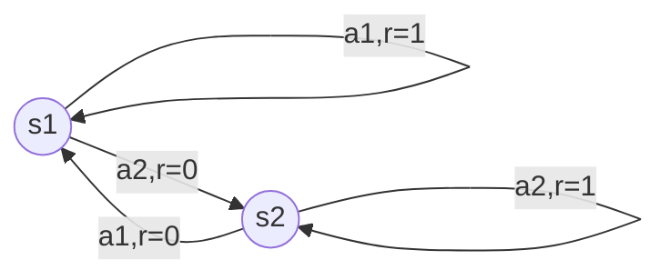

# Policy Gradients原理与代码实例讲解

作者：禅与计算机程序设计艺术 / Zen and the Art of Computer Programming 

## 1. 背景介绍
### 1.1 问题的由来
强化学习(Reinforcement Learning, RL)是一种通过智能体(agent)与环境交互来学习最优策略的机器学习方法。在许多实际应用中,我们往往需要处理连续动作空间的问题,比如机器人控制、自动驾驶等。然而,传统的基于值函数(value-based)的强化学习算法如 Q-learning 很难直接应用于连续动作空间。Policy Gradients(策略梯度)作为一种基于策略(policy-based)的强化学习算法,为解决连续动作空间的问题提供了一种有效的思路。

### 1.2 研究现状
近年来,Policy Gradients 及其变体在连续控制领域取得了广泛的成功。比如 TRPO[1]、PPO[2] 等算法相继被提出,大大提升了 Policy Gradients 的性能和训练稳定性。同时,Policy Gradients 也被用于解决 Multi-Agent[3]、Hierarchical RL[4] 等复杂场景下的决策问题。尽管如此,Policy Gradients 仍面临着样本效率低、方差大等问题有待进一步研究。

### 1.3 研究意义
深入理解 Policy Gradients 算法的原理,对于我们设计和改进连续控制算法具有重要意义。通过分析 Policy Gradients 的优缺点,我们可以更好地把握其适用场景,并针对性地提出改进方案。此外,Policy Gradients 的思想也为我们理解和设计其他强化学习算法提供了有益的视角。

### 1.4 本文结构
本文将首先介绍 Policy Gradients 的核心概念与数学原理。然后,我们将详细推导 Policy Gradients 的目标函数和优化方法。接着,本文将通过一个简单的代码示例来展示如何用 PyTorch 实现 Policy Gradients 算法。最后,我们将总结 Policy Gradients 的优缺点,并展望其在未来研究中的发展方向。

## 2. 核心概念与联系

在介绍 Policy Gradients 之前,我们首先回顾强化学习的一些核心概念:
- 状态(State):表示智能体所处的环境状态,通常用 $s$ 表示。
- 动作(Action):表示智能体在某一状态下采取的动作,通常用 $a$ 表示。
- 策略(Policy):将状态映射为动作的函数,表示智能体的行为模式。确定性策略可表示为 $a=\mu(s)$,随机性策略可表示为动作在状态 $s$ 下的条件概率分布 $\pi(a|s)$。 
- 轨迹(Trajectory):表示智能体与环境交互产生的一系列状态-动作对,即 $\tau=\{s_0,a_0,s_1,a_1,...,s_T,a_T\}$。
- 回报(Reward):表示智能体在某一状态采取某一动作后,环境给出的即时奖赏,通常用 $r$ 表示。
- 回报函数(Reward Function):将一个轨迹映射为累积回报的函数,即 $R(\tau)=\sum_{t=0}^{T}\gamma^t r_t$。其中 $\gamma$ 为折扣因子。
- 状态值函数(State Value Function):表示状态 $s$ 的期望累积回报,即 $V^\pi(s)=\mathbb{E}_{\tau\sim\pi}[R(\tau)|s_0=s]$。
- 动作值函数(Action Value Function):表示在状态 $s$ 下采取动作 $a$ 的期望累积回报,即 $Q^\pi(s,a)=\mathbb{E}_{\tau\sim\pi}[R(\tau)|s_0=s,a_0=a]$。

Policy Gradients 是一种基于策略的优化方法,其目标是最大化期望累积回报 $J(\theta)=\mathbb{E}_{\tau\sim\pi_\theta}[R(\tau)]$。与值函数方法不同,Policy Gradients 直接对策略函数 $\pi_\theta$ 的参数 $\theta$ 进行梯度上升。下图展示了 Policy Gradients 的核心思想:

## 3. 核心算法原理 & 具体操作步骤
### 3.1 算法原理概述
Policy Gradients 的核心是计算目标函数 $J(\theta)$ 关于策略参数 $\theta$ 的梯度,并利用梯度上升法更新参数以提升策略的期望回报。根据 Policy Gradient Theorem[5],目标函数的梯度可表示为:

$$\nabla_\theta J(\theta) = \mathbb{E}_{\tau\sim\pi_\theta}[\sum_{t=0}^T \nabla_\theta \log \pi_\theta(a_t|s_t) R(\tau)]$$

直观地理解,这个公式表明参数更新的方向由两部分决定:动作 $a_t$ 在当前策略 $\pi_\theta$ 下的对数似然梯度 $\nabla_\theta \log \pi_\theta(a_t|s_t)$,以及轨迹 $\tau$ 的累积回报 $R(\tau)$。前者决定了增大动作概率的方向,后者决定了更新的步长。

### 3.2 算法步骤详解
Policy Gradients 的算法流程可总结为:

1. 随机初始化策略网络参数 $\theta$
2. 重复以下步骤,直到策略收敛:
   - 根据当前策略 $\pi_\theta$ 采样一组轨迹 $\{\tau^i\}_{i=1}^N$
   - 对每个轨迹 $\tau^i$,计算梯度项 $g^i=\sum_{t=0}^T \nabla_\theta \log \pi_\theta(a_t^i|s_t^i) R(\tau^i)$
   - 计算梯度的经验均值 $\hat{g} = \frac{1}{N}\sum_{i=1}^N g^i$
   - 参数更新: $\theta \leftarrow \theta + \alpha \hat{g}$

其中 $\alpha$ 为学习率。在实践中,我们通常使用 Adam、RMSProp 等自适应优化器来动态调整学习率。

### 3.3 算法优缺点
Policy Gradients 的主要优点有:
- 适用于连续动作空间
- 可直接优化策略函数,避免了值函数估计的中间步骤
- 易于与函数逼近器(如神经网络)相结合,增强策略的表达能力

Policy Gradients 的缺点主要包括:
- 方差大,需要大量样本才能获得准确的梯度估计
- 难以利用 off-policy 数据,样本效率较低
- 对奖励函数的设计较为敏感,容易出现次优策略

### 3.4 算法应用领域
Policy Gradients 常用于解决以下问题:
- 连续控制问题,如机器人运动规划、自动驾驶等
- 大状态空间问题,值函数难以准确估计
- 奖励函数难以准确定义的问题,如对话生成、图像字幕等

一些知名的 Policy Gradients 变体如 TRPO、PPO 等,在保证单调性能提升的同时,大幅降低了方差,使得 Policy Gradients 在连续控制领域得到了广泛应用。

## 4. 数学模型和公式 & 详细讲解 & 举例说明
### 4.1 数学模型构建
我们考虑一个 Markov Decision Process(MDP)$\mathcal{M}=\langle\mathcal{S},\mathcal{A},\mathcal{P},r,\rho_0,\gamma\rangle$,其中:
- $\mathcal{S}$ 为状态空间
- $\mathcal{A}$ 为动作空间  
- $\mathcal{P}:\mathcal{S}\times\mathcal{A}\times\mathcal{S}\to\mathbb{R}$ 为状态转移概率
- $r:\mathcal{S}\times\mathcal{A}\to\mathbb{R}$ 为奖励函数
- $\rho_0:\mathcal{S}\to\mathbb{R}$ 为初始状态分布
- $\gamma\in[0,1]$ 为折扣因子

我们的目标是寻找一个随机性策略 $\pi_\theta:\mathcal{S}\times\mathcal{A}\to\mathbb{R}$,使得期望累积回报最大化:

$$\max_\theta J(\theta)=\mathbb{E}_{\tau\sim\pi_\theta}[R(\tau)]=\mathbb{E}_{s_0,a_0,...}[\sum_{t=0}^\infty \gamma^t r(s_t,a_t)]$$

其中 $s_0\sim\rho_0(s_0), a_t\sim\pi_\theta(a_t|s_t), s_{t+1}\sim\mathcal{P}(s_{t+1}|s_t,a_t)$。

### 4.2 公式推导过程
为推导 Policy Gradient 定理,我们首先引入关于轨迹 $\tau$ 的状态值函数和动作值函数:

$$V^\pi(s_t)=\mathbb{E}_{\tau\sim\pi}[\sum_{l=0}^\infty \gamma^l r(s_{t+l},a_{t+l})]$$

$$Q^\pi(s_t,a_t)=\mathbb{E}_{\tau\sim\pi}[\sum_{l=0}^\infty \gamma^l r(s_{t+l},a_{t+l})|s_t,a_t]$$

由此可得 Advantage 函数:

$$A^\pi(s_t,a_t)=Q^\pi(s_t,a_t)-V^\pi(s_t)$$

表示在状态 $s_t$ 下采取动作 $a_t$ 相对于平均而言有多好。

对目标函数求梯度,利用对数导数技巧可得:

$$
\begin{aligned}
\nabla_\theta J(\theta) &= \nabla_\theta \mathbb{E}_{\tau\sim\pi_\theta}[R(\tau)] \\
&= \mathbb{E}_{\tau\sim\pi_\theta}[\nabla_\theta \log p(\tau) R(\tau)] \\
&= \mathbb{E}_{\tau\sim\pi_\theta}[\sum_{t=0}^\infty \nabla_\theta \log \pi_\theta(a_t|s_t) R(\tau)] \\
&= \mathbb{E}_{\tau\sim\pi_\theta}[\sum_{t=0}^\infty \nabla_\theta \log \pi_\theta(a_t|s_t) Q^\pi(s_t,a_t)] \\
&= \mathbb{E}_{\tau\sim\pi_\theta}[\sum_{t=0}^\infty \nabla_\theta \log \pi_\theta(a_t|s_t) A^\pi(s_t,a_t)]
\end{aligned}
$$

最后一个等式利用了 $V^\pi(s_t)$ 与 $a_t$ 无关,因此 $\mathbb{E}_{a_t\sim\pi_\theta}[\nabla_\theta \log \pi_\theta(a_t|s_t) V^\pi(s_t)]=0$。

### 4.3 案例分析与讲解
我们以一个简单的 MDP 为例来说明 Policy Gradients 的计算过程。考虑一个只有 2 个状态 $\{s_1,s_2\}$ 和 2 个动作 $\{a_1,a_2\}$ 的 MDP,状态转移和奖励如下图所示:

我们用 Softmax 策略 $\pi_\theta(a|s)=\frac{\exp(\theta_{sa})}{\sum_{a'}\exp(\theta_{sa'})}$ 来参数化策略。假设折扣因子 $\gamma=1$,初始状态分布为 $\rho_0=[1,0]$。

对于一条轨迹 $\tau=(s_1,a_1,s_1,a_2,s_2,a_2,s_2,...)$,其概率为:

$$p(\tau)=\rho_0(s_1)\pi_\theta(a_1|s_1)\mathcal{P}(s_1|s_1,a_1)\pi_\theta(a_2|s_1)\mathcal{P}(s_2|s_1,a_2)\pi_\theta(a_2|s_2)...$$

累积回报为:

$$R(\tau)=r(s_1,a_1)+r(s_1,a_2)+r(s_2,a_2)+...=1+0+1+...$$

梯度项为:

$$\sum_{t=0}^\infty \nabla_\theta \log \pi_\theta(a_t|s_t) R(\tau)=\nabla_\theta \log \pi_\theta(a_1|s