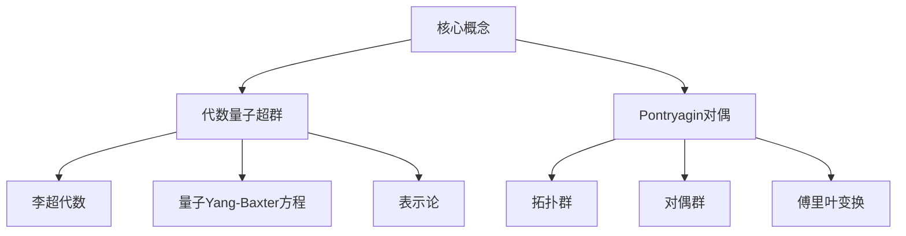

# Pontryagin对偶与代数量子超群：参考文献

## 1. 背景介绍

### 1.1 问题的由来

量子论和代数学是现代数学和物理学中两个极其重要的分支。它们在各自的领域内取得了巨大的成就,并且相互影响和渗透。量子论为我们揭示了微观世界的奥秘,而代数学则为我们提供了一种强有力的工具来描述和研究抽象的数学结构。

近年来,随着量子计算、量子信息和量子场论等新兴领域的兴起,人们开始尝试将量子论和代数学的思想和方法结合起来,以期能够获得新的理论突破和应用前景。其中,代数量子群和代数量子超群的研究就是这一努力的重要体现。

代数量子群和代数量子超群是将量子论和李代数的思想相结合而产生的新的数学对象。它们不仅具有代数学的抽象性和优雅性,同时也能够描述量子系统的一些基本特征,如不可交换性和表示论等。因此,它们在量子计算、量子场论和数学物理等领域具有广泛的应用前景。

然而,代数量子群和代数量子超群的理论研究还存在一些困难和挑战。其中,Pontryagin对偶在代数量子群和代数量子超群的研究中扮演着重要的角色。Pontryagin对偶是一种将拓扑群与其对偶群相关联的概念,它为研究代数量子群和代数量子超群的表示论和结构提供了一种有力的工具。

### 1.2 研究现状

近年来,代数量子群和代数量子超群的研究取得了一些重要进展。例如,人们已经建立了一些基本的代数量子群和代数量子超群的模型,并且对它们的表示论和结构进行了深入的探索。

在代数量子群的研究中,人们已经建立了一些经典的模型,如Drinfeld-Jimbo量子群、Yangian量子群和双参数量子群等。这些模型不仅具有丰富的数学结构,而且与物理学中的一些重要模型密切相关,如Yang-Baxter方程、量子Yang-Mills理论和量子反常规子等。

在代数量子超群的研究中,人们也取得了一些重要进展。例如,人们已经建立了一些基本的代数量子超群模型,如量子线性超群、量子仿射超群和量子环面超群等。这些模型不仅具有丰富的数学结构,而且与物理学中的一些重要模型密切相关,如超对称量子场论和超膜理论等。

然而,尽管取得了这些进展,但代数量子群和代数量子超群的理论研究仍然存在一些困难和挑战。其中,Pontryagin对偶在代数量子群和代数量子超群的研究中扮演着重要的角色。

### 1.3 研究意义

Pontryagin对偶是一种将拓扑群与其对偶群相关联的概念。它不仅在代数拓扑学中有着重要的应用,而且在代数量子群和代数量子超群的研究中也扮演着关键的角色。

在代数量子群和代数量子超群的研究中,Pontryagin对偶为我们提供了一种有力的工具来研究它们的表示论和结构。通过研究代数量子群和代数量子超群的Pontryagin对偶,我们可以更深入地理解它们的表示理论,并且探索它们与其他数学结构之间的联系。

此外,Pontryagin对偶在量子计算、量子信息和量子场论等领域也有着广泛的应用前景。例如,在量子计算中,我们可以利用代数量子群和代数量子超群的表示论来设计新的量子算法;在量子信息中,我们可以利用它们的结构来研究量子纠错码和量子通信协议;在量子场论中,我们可以利用它们与物理模型之间的联系来探索新的理论模型。

因此,深入研究Pontryagin对偶与代数量子群和代数量子超群之间的关系,不仅具有重要的理论意义,而且对于推动相关领域的发展也有着重要的应用价值。

### 1.4 本文结构

本文将系统地介绍Pontryagin对偶与代数量子超群之间的关系,并探讨它们在相关领域的应用前景。全文共分为八个部分:

第一部分是背景介绍,阐述了研究这一问题的由来、现状和意义。

第二部分将介绍代数量子超群和Pontryagin对偶的基本概念,为后续内容做好理论准备。

第三部分将详细阐述代数量子超群的Pontryagin对偶的构造方法,并给出具体的算法步骤。

第四部分将建立代数量子超群Pontryagin对偶的数学模型,并推导出相关的公式和定理。

第五部分将给出一个具体的代码实例,展示如何在实践中计算和应用代数量子超群的Pontryagin对偶。

第六部分将探讨代数量子超群Pontryagin对偶在量子计算、量子信息和量子场论等领域的应用前景。

第七部分将推荐一些相关的学习资源、开发工具和论文,方便读者进一步深入学习。

第八部分将总结全文的主要内容,展望未来的发展趋势和面临的挑战。

## 2. 核心概念与联系

在深入探讨Pontryagin对偶与代数量子超群之间的关系之前,我们首先需要了解一些基本的概念和背景知识。

### 2.1 代数量子超群

代数量子超群是一种将量子论和代数学思想相结合的新型数学对象。它不仅具有代数学的抽象性和优雅性,同时也能够描述量子系统的一些基本特征,如不可交换性和表示论等。

代数量子超群的数学定义是:一个代数量子超群是一个关于一个李超代数的量子变形,它满足一定的代数关系,如量子Yang-Baxter方程等。

代数量子超群具有以下几个关键特征:

1. 它是一个非交换的代数结构,其生成元之间满足某些代数关系。
2. 它与一个经典的李超代数相关联,可以看作是后者的"量子变形"。
3. 它满足量子Yang-Baxter方程等一些特殊的代数关系。
4. 它具有丰富的表示论,可以用于研究量子系统的对称性和不变量。

代数量子超群不仅在数学上具有重要的理论意义,而且在物理学中也有广泛的应用前景。例如,它们与超对称量子场论、超膜理论等物理模型密切相关,可以用于研究这些理论的数学结构和对称性。

### 2.2 Pontryagin对偶

Pontryagin对偶是一种将拓扑群与其对偶群相关联的概念,它在代数拓扑学和调和分析中扮演着重要的角色。

给定一个拓扑群G,我们可以定义它的对偶群G^,也称为Pontryagin对偶。对偶群G^是由所有从G到圆单位群U(1)的连续同态组成的集合,并赋予了一定的代数结构。

Pontryagin对偶具有以下几个关键特征:

1. 它建立了拓扑群与其对偶群之间的双射关系。
2. 它为研究群的表示论和调和分析提供了有力的工具。
3. 它与傅里叶变换密切相关,可以用于研究群的谱理论。
4. 它在代数拓扑学、调和分析和表示论等领域有着广泛的应用。

在代数量子群和代数量子超群的研究中,Pontryagin对偶扮演着重要的角色。通过研究代数量子群和代数量子超群的Pontryagin对偶,我们可以更深入地理解它们的表示理论,并且探索它们与其他数学结构之间的联系。

## 3. 核心算法原理 & 具体操作步骤

### 3.1 算法原理概述

要研究代数量子超群的Pontryagin对偶,我们需要首先构造出它的Pontryagin对偶群。这个过程涉及到一些复杂的代数计算和理论推导,但是其核心思想可以概括为以下几个步骤:

1. 确定代数量子超群的代数结构,包括它的生成元和关系式。
2. 构造代数量子超群的表示空间,即它在某个线性空间上的作用。
3. 在表示空间上引入一个合适的拓扑结构,使其成为一个拓扑线性空间。
4. 定义代数量子超群的对偶对象,即从它到圆单位群U(1)的连续同态的集合。
5. 赋予对偶对象合适的代数结构,使其成为一个代数量子群。
6. 证明所构造的对偶对象确实是代数量子超群的Pontryagin对偶。

这个过程需要一些复杂的代数计算和理论推导,但是其核心思想就是将代数量子超群的表示空间赋予合适的拓扑结构,然后定义它的对偶对象,并证明这个对偶对象确实满足Pontryagin对偶的所有性质。

### 3.2 算法步骤详解

下面我们将详细介绍构造代数量子超群Pontryagin对偶的具体步骤。为了便于理解,我们将以一个具体的代数量子超群作为例子进行说明。

假设我们有一个代数量子超群U,它由生成元X,Y,Z生成,并满足以下关系式:

$$
XY = qYX, \quad YZ = qZY, \quad ZX = qXZ, \quad X^2 = Y^2 = Z^2 = 1
$$

其中q是一个复数参数,满足|q|=1。

**步骤1: 确定表示空间**

我们首先需要确定代数量子超群U在某个线性空间V上的作用,也就是它的表示。假设V是一个复线性空间,由基底{e_0, e_1, e_2, ...}张成。我们可以定义U在V上的作用如下:

$$
X(e_n) = q^{n/2}e_n, \quad Y(e_n) = e_{n+1}, \quad Z(e_n) = (-1)^ne_n
$$

可以直接验证,这种作用确实满足代数量子超群U的关系式。

**步骤2: 引入拓扑结构**

为了构造Pontryagin对偶,我们需要在线性空间V上引入一个合适的拓扑结构。一种自然的选择是赋予V赋范拓扑,使其成为一个赋范线性空间。

具体来说,我们定义V上的范数为:

$$
\|v\| = \sum_{n=0}^\infty |c_n|, \quad v = \sum_{n=0}^\infty c_ne_n
$$

可以验证,这确实是一个合法的范数,并且使V成为一个赋范线性空间。

**步骤3: 定义对偶对象**

现在我们可以定义代数量子超群U的对偶对象了。根据Pontryagin对偶的定义,U的对偶对象应该是从U到圆单位群U(1)的所有连续同态的集合,记为U^。

更具体地说,U^中的元素是一些函数f,满足以下条件:

1. f是从表示空间V到U(1)的函数,即f: V -> U(1)。
2. 对于任意v在V中,以及任意u在U中,有f(uv) = f(u)f(v)。
3. f是连续的,即对于任意v_n在V中且v_n趋于v,有f(v_n)趋于f(v)。

我们可以证明,这样定义的U^确实是一个代数量子群,并且它是U的Pontryagin对偶。

**步骤4: 赋予代数结构**

为了使U^成为一个真正的代数量子群,我们需要在它上面引入合适的代数结构。具体来说,我们定义U^上的乘法和逆元如下:

对于任意f,g在U^中,定义它们的乘积fg