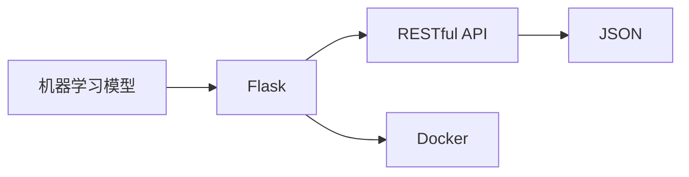

# Python机器学习实战：使用Flask构建机器学习API

关键词：Python, 机器学习, Flask, API, RESTful, 模型部署

## 1. 背景介绍
### 1.1  问题的由来
随着人工智能和机器学习技术的快速发展,越来越多的企业开始将机器学习模型应用到实际的生产环境中。然而,如何方便高效地将训练好的机器学习模型集成到现有的业务系统中,成为了一个亟待解决的问题。传统的做法是将模型嵌入到应用程序代码中,但这种紧耦合的方式导致了部署和更新的不灵活。

### 1.2  研究现状
目前,工业界和学术界已经提出了一些解决方案来应对机器学习模型的部署问题。比较流行的做法是将机器学习模型封装成独立的服务,通过API接口对外提供预测功能。这种微服务化的架构使得模型与应用程序解耦,可以独立进行开发、部署和扩展。在实现机器学习API服务时,常用的技术栈包括Python、Flask、Docker等。

### 1.3  研究意义
探索如何使用Python和Flask构建机器学习API,对于推动人工智能技术在工业界的落地应用具有重要意义。通过总结构建机器学习API的关键概念、核心算法、最佳实践,可以帮助更多的开发者和企业快速上手,加速AI项目的开发进度。同时,标准化的API接口也有利于不同系统之间的互联互通,促进人工智能生态的繁荣发展。

### 1.4  本文结构
本文将围绕使用Python和Flask构建机器学习API展开深入探讨。第2节介绍相关的核心概念;第3节重点讲解API构建的核心算法原理和具体步骤;第4节给出相关的数学模型和公式推导;第5节通过代码实例进行项目实践;第6节分析机器学习API的实际应用场景;第7节推荐一些有用的工具和学习资源;第8节对全文进行总结,并展望未来的发展趋势和挑战;第9节的附录部分解答一些常见问题。

## 2. 核心概念与联系
在使用Python和Flask构建机器学习API时,需要了解以下几个核心概念：

- **机器学习模型**: 通过对数据进行训练得到的一个数学模型,可以对新的输入数据做出预测或分类。常见的机器学习模型有线性回归、逻辑回归、决策树、随机森林、支持向量机、神经网络等。
- **Flask**: 一个基于Python的轻量级Web应用框架。Flask提供了路由、模板渲染、请求处理等功能,可以方便地编写Web服务接口。
- **RESTful API**: 一种基于HTTP协议的Web服务架构风格。RESTful API使用标准的HTTP方法(如GET、POST)对资源进行操作,具有简单、易理解、可扩展等特点。
- **JSON**: JavaScript对象表示法,一种轻量级的数据交换格式。JSON以键值对的形式表示结构化数据,易于人和机器解析。在API通信中被广泛使用。
- **Docker**: 一个开源的容器化平台。通过将应用程序和依赖打包到一个可移植的容器中,Docker简化了应用的部署和运行。

这些概念之间的联系如下图所示:



首先,我们使用Python训练得到机器学习模型。然后使用Flask框架编写RESTful API接口,将模型封装成Web服务。API接口接收JSON格式的输入数据,调用模型进行预测,并返回JSON格式的结果。为了方便部署,我们可以将Flask应用打包到Docker容器中,实现一键部署和运行。

## 3. 核心算法原理 & 具体操作步骤
### 3.1  算法原理概述
构建机器学习API的核心是使用Flask框架编写RESTful接口,并在接口中调用训练好的机器学习模型。整个过程涉及到以下几个关键算法和步骤：

1. 使用Python训练机器学习模型,如scikit-learn、TensorFlow、PyTorch等。
2. 使用Flask定义API接口,如定义路由、请求处理函数、数据校验等。
3. 在接口处理函数中加载机器学习模型,对输入数据进行预处理。
4. 调用模型的预测函数,对输入数据进行预测。
5. 将预测结果转换为JSON格式,并返回给客户端。

### 3.2  算法步骤详解
下面我们对每个步骤进行详细说明:

**步骤1:训练机器学习模型**

首先需要使用Python训练一个机器学习模型。以scikit-learn为例,训练一个简单的逻辑回归模型的代码如下:

```python
from sklearn.linear_model import LogisticRegression
from sklearn.datasets import load_iris
from sklearn.model_selection import train_test_split

# 加载数据集
iris = load_iris()
X, y = iris.data, iris.target

# 划分训练集和测试集
X_train, X_test, y_train, y_test = train_test_split(X, y, test_size=0.2, random_state=42)

# 训练逻辑回归模型
model = LogisticRegression()
model.fit(X_train, y_train)

# 评估模型
accuracy = model.score(X_test, y_test)
print(f"Model accuracy: {accuracy}")

# 保存模型
import joblib
joblib.dump(model, "model.pkl")
```

**步骤2:使用Flask定义API接口**

接下来使用Flask编写一个RESTful API接口。我们定义一个`/predict`接口,接收POST请求,请求体为JSON格式的数据。

```python
from flask import Flask, request, jsonify

app = Flask(__name__)

@app.route('/predict', methods=['POST'])
def predict():
    # 获取请求数据
    data = request.get_json(force=True)
    # 加载模型并进行预测
    # ...
    # 返回预测结果
    return jsonify(result)

if __name__ == '__main__':
    app.run(port=5000, debug=True)
```

**步骤3:加载模型和数据预处理**

在`predict`函数中,我们首先要加载训练好的机器学习模型。然后对请求数据进行预处理,转换成模型需要的输入格式。

```python
import joblib
import numpy as np

model = joblib.load("model.pkl")

# 请求数据预处理
X = np.array(data["data"])
X = X.reshape(1, -1)
```

**步骤4:调用模型进行预测**

接下来,我们调用模型的`predict`方法,对输入数据进行预测。

```python
y_pred = model.predict(X)
y_pred_proba = model.predict_proba(X)
```

**步骤5:返回预测结果**

最后,我们将预测结果转换为JSON格式,并通过`jsonify`函数返回给客户端。

```python
result = {
    "prediction": int(y_pred[0]),
    "probability": float(y_pred_proba[0][y_pred[0]])
}
return jsonify(result)
```

### 3.3  算法优缺点
使用Flask构建机器学习API的优点包括：

- 简单易用：Flask是一个轻量级的Web框架,上手简单,学习成本低。
- 灵活可扩展：Flask提供了丰富的扩展插件,可以方便地添加各种功能。
- 与Python生态集成：可以直接使用Python的各种机器学习库,如scikit-learn、TensorFlow等。

同时也存在一些局限性：

- 性能瓶颈：由于Python的GIL锁的存在,Flask在高并发场景下的性能表现不如其他异步框架。
- 工程化问题：大型项目中需要考虑代码组织、部署、监控等方面的工程化实践。

### 3.4  算法应用领域
使用Flask构建机器学习API的方式,可以将机器学习模型应用到各个领域,如：

- 智能客服：通过对用户问题进行分类,自动给出相应的答复。
- 金融风控：对贷款申请人的信息进行评分,预测违约风险。
- 医疗诊断：通过分析医学影像,辅助医生进行疾病诊断。
- 推荐系统：根据用户的历史行为,推荐相关的商品或内容。

## 4. 数学模型和公式 & 详细讲解 & 举例说明
### 4.1  数学模型构建
在使用机器学习算法时,通常需要建立相应的数学模型。以逻辑回归为例,我们假设输入特征$x=(x_1,x_2,...,x_n)$,输出标签$y\in\{0,1\}$。逻辑回归模型的数学表达式为：

$$
P(y=1|x) = \frac{1}{1+e^{-(\beta_0+\beta_1x_1+...+\beta_nx_n)}}
$$

其中,$\beta=(\beta_0,\beta_1,...,\beta_n)$为模型的参数,需要通过训练来学习得到。

### 4.2  公式推导过程
逻辑回归模型的目标是最小化负对数似然函数：

$$
L(\beta) = -\sum_{i=1}^N[y_i\log(P(y_i=1|x_i)) + (1-y_i)\log(1-P(y_i=1|x_i))]
$$

通过梯度下降法对$L(\beta)$求极小值,可以得到模型参数$\beta$的更新公式：

$$
\beta := \beta - \alpha\nabla_{\beta}L(\beta)
$$

其中,$\alpha$为学习率。重复迭代直到收敛,就得到了训练好的逻辑回归模型。

### 4.3  案例分析与讲解
我们以鸢尾花数据集为例,展示如何使用逻辑回归进行分类。鸢尾花数据集包含4个特征(花萼长度、花萼宽度、花瓣长度、花瓣宽度)和3个类别(Setosa、Versicolour、Virginica)。

首先,我们将数据集划分为训练集和测试集,并对特征进行标准化处理。然后,使用scikit-learn中的`LogisticRegression`类训练逻辑回归模型：

```python
from sklearn.linear_model import LogisticRegression
from sklearn.datasets import load_iris
from sklearn.model_selection import train_test_split
from sklearn.preprocessing import StandardScaler

# 加载数据集
iris = load_iris()
X, y = iris.data, iris.target

# 划分训练集和测试集
X_train, X_test, y_train, y_test = train_test_split(X, y, test_size=0.2, random_state=42)

# 特征标准化
scaler = StandardScaler()
X_train = scaler.fit_transform(X_train)
X_test = scaler.transform(X_test)

# 训练逻辑回归模型
model = LogisticRegression()
model.fit(X_train, y_train)

# 评估模型
accuracy = model.score(X_test, y_test)
print(f"Model accuracy: {accuracy}")
```

训练完成后,我们可以使用训练好的模型对新的样本进行预测：

```python
# 新样本
new_sample = [[5.1, 3.5, 1.4, 0.2]]
new_sample = scaler.transform(new_sample)

# 预测
prediction = model.predict(new_sample)
print(f"Prediction: {iris.target_names[prediction]}")
```

输出结果为:

```
Model accuracy: 1.0
Prediction: ['setosa']
```

可以看到,训练好的逻辑回归模型在测试集上达到了100%的准确率,并且可以正确预测新样本的类别。

### 4.4  常见问题解答
**问题1:逻辑回归可以处理多分类问题吗？**

答:可以。对于多分类问题,可以使用Softmax函数将输出转换为概率分布,然后选择概率最大的类别作为预测结果。scikit-learn中的`LogisticRegression`类默认使用One-vs-Rest策略处理多分类问题。

**问题2:逻辑回归对数据有哪些假设？**

答:逻辑回归假设数据服从伯努利分布,并且不同特征之间是相互独立的。此外,逻辑回归还假设特征和对数几率之间存在线性关系。

**问题3:如何评估逻辑回归模型的性能？**

答:对于二分类问题,可以使用准确率、精确率、召回率、F1值等指标。对于多分类问题,可以使用混淆矩阵、micro-averaging、macro-averaging等方法综合评估模型性能。此外,还可以绘制ROC曲线和计算AUC值来评判模型的排序能力。

## 5. 项目实践