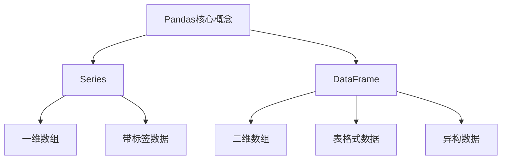
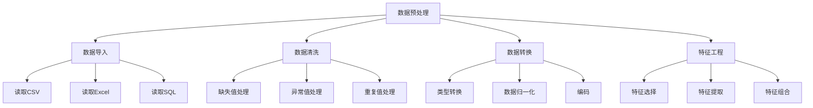

# Python机器学习实战：使用Pandas进行数据预处理与分析

## 1. 背景介绍

### 1.1 问题的由来

在当今数据驱动的时代，数据分析和机器学习已经成为各行各业不可或缺的工具。无论是金融、医疗、零售还是科技领域,都需要从海量数据中提取有价值的信息,以支持决策制定和业务优化。然而,原始数据通常是杂乱无章、存在缺失值和异常值的,这给数据预处理带来了巨大挑战。有效的数据预处理不仅能够确保机器学习模型的准确性,还能够加速模型训练过程,提高模型的可解释性。

### 1.2 研究现状

目前,已有多种数据预处理技术被广泛应用,如数据清洗、特征工程、数据转换等。然而,这些技术往往需要编写大量代码,且缺乏统一的框架,给数据科学家带来了额外的工作负担。近年来,Python生态系统中出现了多种数据预处理库,如Pandas、Scikit-learn等,它们提供了高度优化的数据操作功能,极大地简化了数据预处理流程。

### 1.3 研究意义

本文将重点介绍如何使用Python中的Pandas库进行数据预处理,为机器学习任务做好准备。Pandas是Python中最流行的数据分析库之一,它提供了高性能、易于使用的数据结构和数据分析工具。通过掌握Pandas,数据科学家可以高效地处理结构化和半结构化数据,从而为后续的建模和分析奠定坚实的基础。

### 1.4 本文结构

本文将按照以下结构进行阐述:

1. 背景介绍
2. Pandas核心概念与联系
3. 使用Pandas进行数据预处理的核心算法原理和具体操作步骤
4. 相关数学模型和公式详细讲解,并结合案例进行说明
5. 项目实践:代码实例和详细解释说明
6. Pandas在实际应用场景中的使用
7. 相关工具和学习资源推荐
8. 总结Pandas在数据预处理中的作用,并展望未来发展趋势和挑战
9. 附录:常见问题与解答

## 2. 核心概念与联系

在深入探讨Pandas在数据预处理中的应用之前,我们需要先了解一些核心概念。Pandas库的核心数据结构是Series和DataFrame,它们用于高效存储和操作数据。



### 2.1 Series

Series是一种一维数组对象,它由一组数据及相关的数据标签(索引)组成。Series可以被视为一个定长的有序字典,它的索引可以是任意的可迭代对象。Series支持大多数常见的一维数组操作,如索引、切片、数学运算等。

### 2.2 DataFrame

DataFrame是Pandas中的核心数据结构,它是一种二维的异构数据结构,可以被视为一个由Series组成的字典。DataFrame既有行索引,也有列索引,它可以被看作是一个共享相同索引的Series之集合。DataFrame支持对行和列进行高效的操作,如选取、插入、删除等。

### 2.3 Pandas与其他库的联系

Pandas与其他Python数据分析库有着密切的联系,它们相互补充,共同构建了Python强大的数据分析生态系统。

- NumPy: Pandas的数据结构基于NumPy的ndarray,它们在底层实现上有着紧密的联系。
- Matplotlib: Pandas与Matplotlib集成良好,可以方便地对数据进行可视化。
- Scikit-learn: Scikit-learn是Python中流行的机器学习库,Pandas可以为其提供数据预处理功能。
- SciPy: SciPy提供了多种数值计算工具,Pandas可以与其进行无缝集成。

通过掌握Pandas及其与其他库的联系,数据科学家可以高效地进行数据处理、分析和建模,从而解决实际问题。

## 3. 核心算法原理和具体操作步骤

使用Pandas进行数据预处理涉及多种算法和操作,本节将重点介绍其中的核心算法原理和具体操作步骤。



### 3.1 算法原理概述

1. **数据导入**:将数据从各种来源(如CSV、Excel、SQL等)读入Pandas数据结构中,为后续操作做准备。
2. **数据清洗**:处理原始数据中的缺失值、异常值和重复值,确保数据的完整性和一致性。
3. **数据转换**:对数据进行类型转换、归一化和编码等操作,使其符合机器学习算法的要求。
4. **特征工程**:通过特征选择、特征提取和特征组合等技术,从原始数据中构建出对机器学习任务更有意义的特征。

### 3.2 算法步骤详解

#### 3.2.1 数据导入

Pandas提供了多种方法从不同来源读取数据,如`pd.read_csv()`、`pd.read_excel()`、`pd.read_sql()`等。以读取CSV文件为例:

```python
import pandas as pd

# 读取CSV文件
data = pd.read_csv('data.csv')
```

#### 3.2.2 数据清洗

##### 3.2.2.1 缺失值处理

Pandas提供了多种处理缺失值的方法,如删除、填充等。

```python
# 删除包含缺失值的行
data.dropna(inplace=True)

# 用特定值填充缺失值
data.fillna(0, inplace=True)
```

##### 3.2.2.2 异常值处理

可以使用统计方法(如三sigma原则)或领域知识来识别并处理异常值。

```python
# 基于三sigma原则处理异常值
mean = data['col'].mean()
std = data['col'].std()
data['col'] = data['col'][(data['col'] - mean).abs() < 3*std]
```

##### 3.2.2.3 重复值处理

可以使用`drop_duplicates()`方法删除重复值。

```python
# 删除重复行
data.drop_duplicates(inplace=True)
```

#### 3.2.3 数据转换

##### 3.2.3.1 类型转换

使用`astype()`方法将数据类型转换为所需的类型。

```python
# 将列类型转换为整数
data['col'] = data['col'].astype(int)
```

##### 3.2.3.2 数据归一化

常用的归一化方法包括Min-Max标准化、Z-Score标准化等。

```python
# Min-Max标准化
from sklearn.preprocessing import MinMaxScaler
scaler = MinMaxScaler()
data['col'] = scaler.fit_transform(data[['col']])
```

##### 3.2.3.3 编码

对于类别型特征,需要进行编码(如One-Hot编码、Label编码等)才能被机器学习算法接受。

```python
# One-Hot编码
data = pd.get_dummies(data, columns=['col'])
```

#### 3.2.4 特征工程

##### 3.2.4.1 特征选择

通过统计方法(如相关系数、卡方检验等)或机器学习方法(如递归特征消除法)选择对目标变量具有预测能力的特征。

```python
# 基于相关系数选择特征
corr = data.corr()
features = corr.index[abs(corr['target']) > 0.5]
```

##### 3.2.4.2 特征提取

从原始特征中提取出新的特征,如主成分分析(PCA)、因子分析等。

```python
# PCA特征提取
from sklearn.decomposition import PCA
pca = PCA(n_components=5)
data_pca = pca.fit_transform(data)
```

##### 3.2.4.3 特征组合

将多个原始特征组合成一个新特征,以捕获它们之间的交互关系。

```python
# 特征组合
data['new_feature'] = data['col1'] * data['col2']
```

### 3.3 算法优缺点

使用Pandas进行数据预处理具有以下优点:

- **高效**:Pandas的数据结构和算法经过高度优化,能够高效地处理大规模数据。
- **易用**:Pandas提供了直观且富有表现力的API,使得数据操作变得简单直观。
- **集成度高**:Pandas与Python数据分析生态系统集成良好,可以方便地与其他库协作。

然而,Pandas也存在一些缺点:

- **内存占用大**:Pandas在处理大规模数据时,内存占用可能会成为瓶颈。
- **并行性差**:Pandas目前还缺乏对并行计算的良好支持,在处理大规模数据时可能会遇到性能瓶颈。
- **学习曲线陡峭**:尽管Pandas提供了友好的API,但掌握它的高级用法仍需要一定的学习成本。

### 3.4 算法应用领域

使用Pandas进行数据预处理可以广泛应用于以下领域:

- **金融**:处理金融数据,如股票数据、交易数据等。
- **零售**:分析客户购买行为、进行产品推荐等。
- **医疗**:处理电子病历数据,支持疾病预测和诊断。
- **科技**:处理网络日志、用户行为数据等,支持个性化推荐和广告投放。
- **其他**:政府数据分析、社交网络分析、自然语言处理等。

总的来说,只要涉及到结构化或半结构化数据的处理,Pandas都可以发挥重要作用。

## 4. 数学模型和公式详细讲解与举例说明

在数据预处理过程中,我们经常需要使用一些数学模型和公式,本节将对其进行详细讲解,并结合具体案例进行说明。

### 4.1 数学模型构建

#### 4.1.1 缺失值处理模型

缺失值处理是数据预处理中的一个重要环节,常用的缺失值处理模型包括:

1. **删除法**:直接删除包含缺失值的行或列。
2. **均值/中位数插补法**:用特征的均值或中位数来填充缺失值。
3. **机器学习插补法**:使用机器学习算法(如KNN、决策树等)预测缺失值。

以均值插补法为例,其数学模型如下:

$$\hat{x}_{ij} = \frac{1}{n}\sum_{k=1}^{n}x_{kj}$$

其中,\\(\hat{x}\_{ij}\\)表示第i个样本的第j个特征的缺失值估计值,\\(n\\)表示样本数量,\\(x\_{kj}\\)表示第k个样本的第j个特征值。

#### 4.1.2 异常值处理模型

异常值处理也是数据预处理的关键步骤,常用的异常值处理模型包括:

1. **三sigma原则**:将偏离均值超过三个标准差的数据点视为异常值。
2. **箱线图法**:利用箱线图中的上下四分位数确定异常值范围。
3. **隔离森林法**:使用隔离森林算法自动检测异常值。

以三sigma原则为例,其数学模型如下:

$$x_{ij}^{\prime} = \begin{cases}
x_{ij}, & \text{if } |x_{ij} - \mu_j| \leq 3\sigma_j\\
\mu_j + 3\sigma_j, & \text{if } x_{ij} > \mu_j + 3\sigma_j\\
\mu_j - 3\sigma_j, & \text{if } x_{ij} < \mu_j - 3\sigma_j
\end{cases}$$

其中,\\(x\_{ij}^{\prime}\\)表示处理后的第i个样本的第j个特征值,\\(\mu\_j\\)和\\(\sigma\_j\\)分别表示第j个特征的均值和标准差。

### 4.2 公式推导过程

#### 4.2.1 相关系数

在特征选择过程中,我们经常需要计