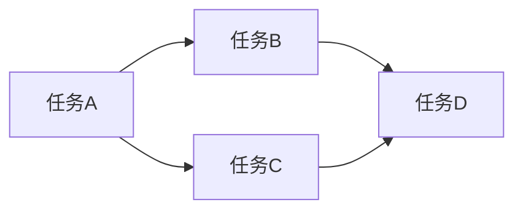
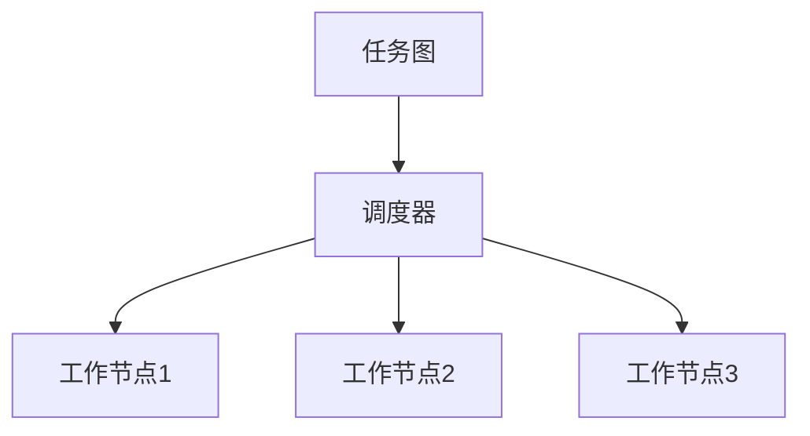
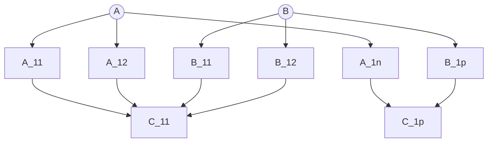
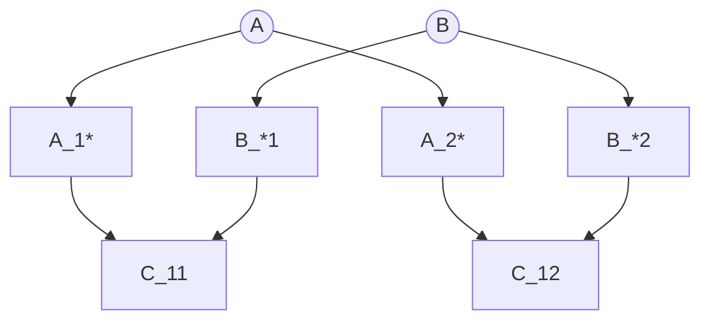
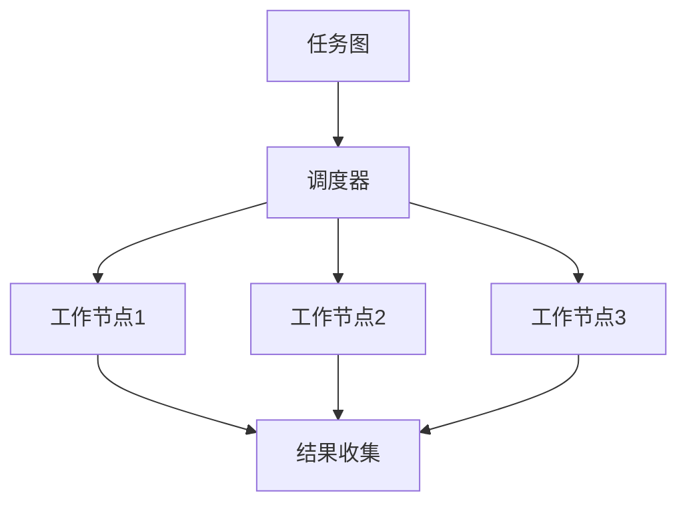
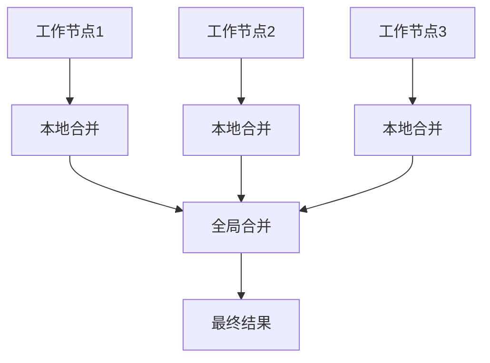

# Python机器学习实战：分布式机器学习框架Dask的入门与实战

## 1. 背景介绍

### 1.1 问题的由来

在当今大数据时代，海量的数据已经成为了常态。传统的单机计算能力已经无法满足日益增长的计算需求。因此，分布式计算框架应运而生,以解决大规模数据处理和机器学习任务的挑战。作为一种灵活且高效的分布式计算解决方案,Dask凭借其出色的性能和可扩展性,逐渐成为Python数据科学社区中备受推崇的框架之一。

### 1.2 研究现状

目前,Dask已经被广泛应用于各个领域,包括金融、生物信息学、天文学等。越来越多的公司和研究机构开始采用Dask来处理海量数据和训练复杂的机器学习模型。与此同时,Dask的开发团队也在不断优化和扩展其功能,以满足不同场景下的需求。

### 1.3 研究意义

掌握Dask不仅能够提高数据处理和机器学习任务的效率,还能够帮助我们更好地利用分布式计算资源,从而解决一些过去无法解决的问题。因此,深入学习Dask对于数据科学从业者和研究人员来说,都具有重要的意义。

### 1.4 本文结构

本文将从Dask的基本概念出发,逐步深入探讨其核心原理和算法实现。同时,我们将通过实际案例和代码示例,帮助读者更好地掌握Dask的使用方法。最后,我们还将分析Dask的应用场景,并对其未来发展趋势进行展望。

## 2. 核心概念与联系

在深入探讨Dask的细节之前,我们需要先了解一些核心概念,这些概念贯穿于Dask的整个设计和实现过程中。

### 2.1 任务图 (Task Graph)

Dask的核心思想是将计算任务拆分为多个小任务,并根据这些小任务之间的依赖关系构建一个任务图。任务图是一种有向无环图,其中节点表示任务,边表示任务之间的依赖关系。通过合理地调度和执行这些任务,Dask可以实现高效的并行计算。

### 2.2 延迟计算 (Lazy Evaluation)

Dask采用延迟计算的策略,即在构建计算图时不会立即执行任务,而是等到需要结果时才开始执行。这种策略可以避免不必要的计算,从而提高效率。同时,它也使得Dask能够更好地优化计算图,例如合并相似的任务或重新排序任务的执行顺序。

### 2.3 集成度 (Integration)

Dask不仅支持数据并行计算,还与许多流行的Python数据科学库(如NumPy、Pandas和Scikit-learn)紧密集成。这使得我们可以在Dask中直接使用这些库提供的功能,而无需进行繁琐的数据转换。

### 2.4 调度器 (Scheduler)

Dask的调度器负责管理和执行任务图中的任务。它可以根据计算资源的情况动态地调度任务,并将任务分发到不同的工作节点上执行。Dask提供了多种调度策略,例如线程调度器、进程调度器和分布式调度器,以满足不同场景下的需求。

## 3. 核心算法原理 & 具体操作步骤

### 3.1 算法原理概述

Dask的核心算法原理可以概括为以下几个步骤:

1. **任务拆分**: 将原始计算任务拆分为多个小任务,并构建任务图。
2. **任务优化**: 对任务图进行优化,例如合并相似的任务或重新排序任务的执行顺序。
3. **任务调度**: 根据计算资源的情况,动态地调度任务到不同的工作节点上执行。
4. **结果收集**: 收集各个工作节点执行任务的结果,并将它们组合成最终的计算结果。

### 3.2 算法步骤详解

#### 3.2.1 任务拆分

任务拆分是Dask算法的第一步,也是最关键的一步。在这一步骤中,Dask会将原始计算任务拆分为多个小任务,并根据这些小任务之间的依赖关系构建一个任务图。

以计算矩阵乘法 $C = A \times B$ 为例,假设矩阵 $A$ 和 $B$ 的大小分别为 $(m \times n)$ 和 $(n \times p)$,那么矩阵乘法可以拆分为 $m \times p$ 个小任务,每个小任务计算 $C$ 中的一个元素。这些小任务之间存在着依赖关系,例如计算 $C_{ij}$ 需要依赖于计算 $A_{i*}$ 和 $B_{*j}$ 的结果。

上图展示了一个简单的任务图,其中每个节点代表一个小任务,边表示任务之间的依赖关系。通过这种方式,Dask将原始的矩阵乘法任务拆分为多个小任务,为后续的并行计算做好准备。

#### 3.2.2 任务优化

在构建完任务图之后,Dask会对任务图进行优化,以提高计算效率。常见的优化策略包括:

- **合并相似任务**: 如果存在多个相似的任务,Dask会将它们合并为一个任务,从而减少任务的数量,降低调度和执行的开销。
- **重新排序任务**: Dask会根据任务之间的依赖关系,对任务的执行顺序进行优化,以尽可能地减少任务之间的数据传输。
- **数据局部性优化**: Dask会尽量将相关的任务调度到同一个工作节点上执行,以减少数据在不同节点之间的传输。

以矩阵乘法为例,Dask可以将相邻的小任务合并为一个大任务,从而减少任务的数量。同时,Dask还会尽量将计算相同行或列的小任务调度到同一个工作节点上执行,以提高数据局部性。

上图展示了一个优化后的任务图,其中相邻的小任务已经被合并为更大的任务,同时计算相同行或列的任务被调度到同一个工作节点上执行。

#### 3.2.3 任务调度

任务调度是Dask算法的核心部分之一。在这一步骤中,Dask会根据计算资源的情况,动态地将任务分发到不同的工作节点上执行。

Dask提供了多种调度策略,包括线程调度器、进程调度器和分布式调度器。不同的调度器适用于不同的场景:

- **线程调度器**: 适用于单机多核CPU的情况,可以充分利用CPU的并行计算能力。
- **进程调度器**: 适用于单机多核CPU和GPU的情况,可以同时利用CPU和GPU的计算能力。
- **分布式调度器**: 适用于多机集群的情况,可以将任务分发到不同的计算节点上执行,实现真正的大规模并行计算。

无论采用哪种调度策略,Dask都会根据任务之间的依赖关系,合理地安排任务的执行顺序,并动态地调整任务的分配,以充分利用计算资源。

上图展示了一个简单的任务调度过程,其中调度器将任务分发到不同的工作节点上执行,最终将各个节点的结果收集并组合成最终的计算结果。

#### 3.2.4 结果收集

在所有任务执行完毕之后,Dask会将各个工作节点的结果收集并组合成最终的计算结果。

对于一些简单的计算任务,例如矩阵乘法,结果收集的过程就是将各个小任务的结果组合成一个完整的矩阵。但对于一些复杂的计算任务,例如机器学习模型的训练,结果收集的过程可能会涉及到模型参数的合并、模型评估等步骤。

无论是哪种情况,Dask都会尽量减少结果收集过程中的数据传输,以提高效率。例如,Dask可以将相邻的结果先在本地进行合并,然后再将合并后的结果传输到其他节点进行进一步的组合。

上图展示了一个结果收集的过程,其中各个工作节点先在本地进行结果合并,然后再将合并后的结果传输到一个节点上进行全局合并,最终得到最终的计算结果。

### 3.3 算法优缺点

#### 优点

1. **高效并行计算**: Dask通过任务拆分和动态调度,可以充分利用计算资源,实现高效的并行计算。
2. **良好的可扩展性**: Dask可以轻松地扩展到大规模的计算集群,处理海量数据和复杂的计算任务。
3. **与Python生态系统无缝集成**: Dask与许多流行的Python数据科学库紧密集成,使用起来非常方便。
4. **延迟计算和优化**: Dask采用延迟计算的策略,并对任务图进行优化,从而提高计算效率。

#### 缺点

1. **学习曲线陡峭**: Dask的概念和使用方式与传统的Python编程存在一定差异,需要一定的学习成本。
2. **调试困难**:由于任务被拆分并分发到多个工作节点上执行,调试分布式计算任务可能会比较困难。
3. **资源管理复杂**:在大规模分布式环境中,合理地管理和分配计算资源是一个挑战。
4. **数据局部性问题**:虽然Dask会尽量优化数据局部性,但在某些情况下,数据在不同节点之间的传输仍然可能成为性能瓶颈。

### 3.4 算法应用领域

Dask的应用领域非常广泛,包括但不限于:

- **大数据处理**: Dask可以高效地处理TB甚至PB级别的海量数据。
- **科学计算**: Dask被广泛应用于天文学、物理学、生物信息学等科学计算领域。
- **机器学习**: Dask可以用于训练大规模的机器学习模型,包括深度学习模型。
- **金融分析**: Dask在金融领域有着广泛的应用,例如实时风险分析和投资组合优化。
- **地理信息系统(GIS)**: Dask可以用于处理和分析大规模的地理空间数据。

## 4. 数学模型和公式 & 详细讲解 & 举例说明

在探讨Dask的核心算法原理时,我们不可避免地会涉及到一些数学模型和公式。在这一部分,我们将详细讲解这些模型和公式,并通过