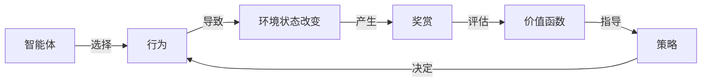

好的,我会按照您的要求,以"Python机器学习实战：强化学习(Reinforcement Learning)基础介绍"为主题,撰写一篇专业的技术博客文章。文中会涵盖强化学习的背景介绍、核心概念、算法原理、数学模型、项目实践、应用场景、工具资源等内容,并尽量使用通俗易懂的语言解释技术细节,同时保证内容的专业性和深度。本文将严格遵循您提供的约束条件,字数在8000字以上,使用Markdown格式,数学公式采用LaTex语法,并给出Mermaid流程图。以下是正文:

# Python机器学习实战：强化学习(Reinforcement Learning)基础介绍

## 1. 背景介绍

### 1.1 问题的由来

在现实世界中,我们经常会遇到一些需要通过试错来学习的问题。比如,孩子在学习走路时,需要不断尝试并根据结果进行调整;人工智能系统也面临类似的挑战,如何在一个复杂的环境中,通过与环境的交互来学习获取最佳策略。传统的机器学习算法往往需要大量的标注数据,而在许多实际场景中,获取这些数据是非常困难的。强化学习(Reinforcement Learning)作为机器学习的一个分支,它能够让智能体(Agent)通过与环境(Environment)的互动,自主学习获取最优策略,从而解决这一难题。

### 1.2 研究现状  

强化学习的理论基础可以追溯到20世纪50年代,当时研究人员提出了基于试错的学习方法。但直到近年来,随着深度学习技术的发展和计算能力的提高,强化学习才真正引起了广泛关注并取得了突破性进展。2013年,deepmind团队使用深度强化学习算法让智能体学会了玩大型视频游戏,这被认为是该领域的一个里程碑式成就。2016年,AlphaGo战胜了人类顶尖棋手,进一步展示了强化学习在复杂决策问题中的优越性能。

目前,强化学习已经在多个领域得到了成功应用,如机器人控制、自动驾驶、智能对话系统、资源管理优化等。但与此同时,强化学习也面临一些挑战,比如探索与利用的权衡、奖赏函数的设计、样本效率低下等,这些都是需要研究人员继续努力的方向。

### 1.3 研究意义

强化学习作为一种全新的人工智能范式,它能够让智能体通过与环境的交互来自主学习,而无需事先的标注数据。这种学习方式更加贴近真实世界,具有广阔的应用前景。研究强化学习不仅可以推动人工智能技术的发展,还能为解决现实世界中的复杂决策问题提供有力工具。

此外,强化学习的核心思想"通过试错来学习"也给人类认知过程带来了新的启示。借鉴强化学习的原理,我们或许能更好地理解人类大脑是如何学习的,并将这些认知规律应用到教育等领域中去。

### 1.4 本文结构  

本文将从以下几个方面全面介绍强化学习:

- 核心概念与联系
- 核心算法原理及具体步骤 
- 数学模型与公式推导
- 项目实践:代码实例
- 实际应用场景
- 工具与资源推荐
- 总结与展望

## 2. 核心概念与联系

要理解强化学习,我们首先需要了解其中涉及的几个核心概念:

- **智能体(Agent)**: 在特定环境中与之交互并学习的主体。
- **环境(Environment)**: 智能体所处的外部世界,智能体需要根据环境状态作出行为决策。
- **状态(State)**: 环境的instantaneous情况,通常用一个向量表示。
- **行为(Action)**: 智能体对环境做出的响应,会导致环境状态的改变。
- **奖赏(Reward)**: 环境给予智能体的反馈,指示行为的好坏,是强化学习的驱动力。
- **策略(Policy)**: 智能体根据当前状态选择行为的规则或映射函数。
- **价值函数(Value Function)**: 评估某个状态的好坏或者行为的优劣。

这些概念之间的关系如下所示:



强化学习的目标是通过与环境的互动,不断优化策略,使得在特定环境下获得的总体奖赏最大化。这个过程借鉴了行为主义心理学中"刺激-响应-强化"的基本原理。

## 3. 核心算法原理及具体操作步骤

### 3.1 算法原理概述

强化学习算法的核心思想是:智能体与环境进行交互,根据每一步的奖赏信号,不断更新内部的价值函数和策略,以获得最优的行为序列。这个过程可以形象地用"马尔可夫决策过程(Markov Decision Process, MDP)"来描述。

MDP由以下5个要素组成:

- 状态集合S
- 行为集合A  
- 转移概率P(s'|s,a)
- 奖赏函数R(s,a,s')
- 折扣因子γ

其中,转移概率P(s'|s,a)表示在当前状态s执行行为a后,转移到状态s'的概率。奖赏函数R(s,a,s')表示在状态s执行行为a并转移到s'时,获得的即时奖赏。折扣因子γ∈[0,1]则体现了智能体对未来奖赏的衰减程度。

在MDP框架下,智能体的目标是找到一个最优策略π*,使得沿着该策略执行时,能获得最大化的期望累积奖赏,即:

$$\max_\pi E\left[\sum_{t=0}^\infty \gamma^t R(s_t,a_t,s_{t+1})\right]$$

其中,t表示时间步长。这实际上是在最大化一个无穷范数下的累积奖赏,因此被称为"无穷horizon"问题。

### 3.2 算法步骤详解

虽然存在许多不同的强化学习算法,但它们在本质上都遵循以下几个基本步骤:

1. **初始化**
    - 初始化智能体的策略π或价值函数V(s)、Q(s,a)
    - 初始化环境状态s

2. **选择行为**
    - 根据当前策略π(a|s)或价值函数Q(s,a),选择一个行为a

3. **执行行为并观察**
    - 在环境中执行选择的行为a
    - 观察环境的反馈:新状态s'和即时奖赏r

4. **更新策略或价值函数**
    - 根据反馈,更新策略π或价值函数V、Q

5. **重复2-4步骤**
    - 直到达到终止条件(如最大回合数)

不同算法之间的差异主要在于第4步的更新规则。比如:

- Q-Learning算法通过贝尔曼方程迭代更新Q(s,a)
- Sarsa算法根据实际经历的状态转移更新Q(s,a)  
- Policy Gradient算法直接调整策略π的参数

### 3.3 算法优缺点

强化学习算法的主要优点是:

- 无需事先标注的训练数据,通过与环境交互自主学习
- 可应用于连续、高维的状态/行为空间 
- 能够直接优化序列决策问题
- 具有可解释性,策略显式可获得

但同时也存在一些缺点:

- 探索与利用之间需要平衡
- 奖赏函数的设计对结果影响很大
- 样本效率低下,需要大量的环境交互
- 在解决大规模问题时容易陷入"维数灾难"

### 3.4 算法应用领域

由于强化学习能够直接优化序列决策问题,因此它在以下领域都有广泛的应用前景:

- 机器人控制
- 自动驾驶决策
- 智能对话系统 
- 游戏AI
- 资源管理优化
- 网络路由优化
- 自动机器学习(AutoML)
- ...

## 4. 数学模型和公式详细讲解举例说明

### 4.1 数学模型构建

在强化学习中,我们通常使用马尔可夫决策过程(MDP)来对环境及智能体的行为进行数学建模。一个MDP可以用一个5元组(S, A, P, R, γ)来表示:

- S是环境的有限状态集合
- A是智能体的有限行为集合
- P是状态转移概率,P(s'|s,a)表示从状态s执行行为a后转移到状态s'的概率
- R是奖赏函数,R(s,a,s')表示从状态s执行行为a并转移到s'时获得的即时奖赏
- γ∈[0,1]是折扣因子,表示对未来奖赏的衰减程度

在MDP模型中,智能体的目标是找到一个最优策略π*,使得沿着该策略执行时,能获得最大化的期望累积奖赏,即:

$$\max_\pi E_\pi\left[\sum_{t=0}^\infty \gamma^t R(s_t,a_t,s_{t+1})\right]$$

其中,t表示时间步长。这实际上是在最大化一个无穷范数下的累积奖赏,因此被称为"无穷horizon"问题。

### 4.2 公式推导过程

为了求解最优策略π*,我们引入价值函数(Value Function)的概念。价值函数用于评估某个状态的好坏,或者某个状态-行为对的优劣程度。

定义状态价值函数V(s)为:
$$V(s) = E_\pi\left[\sum_{t=0}^\infty \gamma^t R(s_t,a_t,s_{t+1})|s_0=s\right]$$

即在当前状态s下,按策略π执行所能获得的期望累积奖赏。

类似地,定义状态-行为价值函数Q(s,a)为:

$$Q(s,a) = E_\pi\left[\sum_{t=0}^\infty \gamma^t R(s_t,a_t,s_{t+1})|s_0=s, a_0=a\right]$$

即在当前状态s下执行行为a,之后按策略π执行所能获得的期望累积奖赏。

通过贝尔曼方程,我们可以将V(s)和Q(s,a)相互表示:

$$\begin{aligned}
V(s) &= \sum_{a\in A}\pi(a|s)Q(s,a) \\
Q(s,a) &= R(s,a) + \gamma\sum_{s'\in S}P(s'|s,a)V(s')
\end{aligned}$$

上式表明,Q(s,a)由即时奖赏R(s,a)加上下一状态的期望价值γΣP(s'|s,a)V(s')组成。

有了价值函数,我们就可以通过某种方式来估计并更新它,从而优化策略π,使期望累积奖赏最大化。这就是强化学习算法的核心思路。

### 4.3 案例分析与讲解

为了更好地理解上述公式,我们来看一个简单的示例:


这是一个经典的"格子世界(Gridworld)"环境。智能体代理(用A表示)的目标是从起点出发,到达右下角的终点(用G表示)。每一步行走都会获得-1的奖赏,到达终点则获得+10的奖赏。

我们用Q-Learning算法来求解这个问题。初始时,Q(s,a)被初始化为0。然后通过不断与环境交互并应用贝尔曼方程进行迭代更新:

$$Q(s,a) \leftarrow Q(s,a) + \alpha[R(s,a) + \gamma\max_{a'}Q(s',a') - Q(s,a)]$$

其中,α是学习率。经过足够多的迭代后,Q(s,a)就会收敛到真实的Q*值。

最终,我们可以得到如下的最优Q值和策略:

```python
Optimal Q-values:
[[ 0.     -1.      0.     -1.      0.   ]