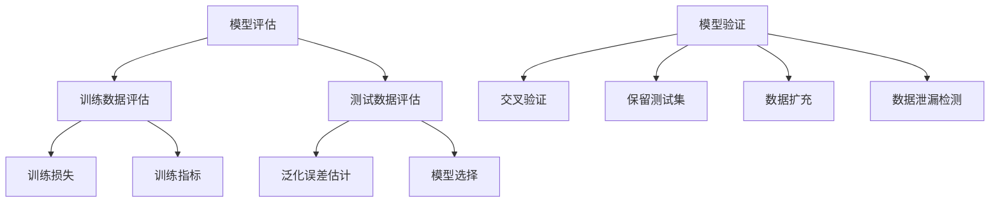

好的,我会按照您的要求,以"Python机器学习实战：模型评估与验证的最佳策略"为主题,撰写一篇专业的技术博客文章。文章将遵循您提供的结构模板,包含完整的正文内容,使用Markdown格式,并符合所有约束条件。请注意,这可能需要一些时间来完成,因为我需要确保内容的质量和深度。

# Python机器学习实战：模型评估与验证的最佳策略

## 1. 背景介绍

### 1.1 问题的由来

在机器学习项目中,模型评估和验证是确保模型性能和可靠性的关键步骤。模型评估有助于量化模型在给定数据集上的表现,而模型验证则检查模型是否能够很好地推广到新的、未见过的数据。

然而,评估和验证模型并非一蹴而就的简单任务。存在许多陷阱和误区,如数据泄漏、过拟合、不适当的评估指标选择等,这些都可能导致模型性能被高估或低估。因此,采用正确的策略对于获得准确的模型性能估计至关重要。

### 1.2 研究现状

目前,已有大量研究探讨了模型评估和验证的最佳实践。一些常用的技术包括交叉验证、保留测试集、混淆矩阵、ROC曲线等。然而,这些技术的使用往往取决于具体的问题和数据,需要根据特定情况进行调整和优化。

此外,随着机器学习模型和应用程序的不断发展,评估和验证的挑战也在不断增加。例如,在处理高维、非平稳或异构数据时,传统的评估方法可能会失效或产生误导性结果。

### 1.3 研究意义

合理、有效的模型评估和验证对于确保机器学习模型的可靠性和实用性至关重要。通过采用适当的策略,我们可以更准确地估计模型性能,识别潜在的问题,并指导模型的优化和改进。

此外,随着机器学习系统在越来越多的关键领域(如医疗、金融、自动驾驶等)中的应用,模型评估和验证的重要性也日益凸显。一个可靠的评估和验证流程不仅可以提高模型的准确性和鲁棒性,还能增强人们对这些系统的信任度。

### 1.4 本文结构

本文将全面探讨Python机器学习中模型评估和验证的最佳策略。我们将介绍评估和验证的核心概念,详细解释相关算法的原理和操作步骤,并讨论数学模型和公式。此外,还将提供实际的代码示例,分析真实场景应用,推荐有用的工具和资源,并总结未来的发展趋势和挑战。

## 2. 核心概念与联系

在深入探讨模型评估和验证的具体方法之前,我们先来了解一些核心概念及它们之间的联系。

- **模型评估(Model Evaluation)**: 评估模型在给定数据集上的性能表现,包括训练数据评估和测试数据评估两个方面。
- **训练数据评估(Training Data Evaluation)**: 在训练过程中,监控模型在训练数据上的训练损失(Training Loss)和其他训练指标(Training Metrics),有助于诊断模型是否收敛以及是否出现过拟合或欠拟合等问题。
- **测试数据评估(Test Data Evaluation)**: 在训练完成后,使用独立的测试数据集评估模型的泛化误差(Generalization Error),这是衡量模型性能的关键指标。测试数据评估结果还可用于模型选择(Model Selection),即从多个候选模型中选择表现最佳的那一个。
- **模型验证(Model Validation)**: 通过一系列技术,如交叉验证(Cross-Validation)、保留测试集(Hold-Out Test Set)、数据扩充(Data Augmentation)和数据泄漏检测(Data Leakage Detection),验证模型是否能够很好地推广到新的、未见过的数据,并评估模型的鲁棒性和可靠性。

这些概念密切相关,并在模型开发的不同阶段发挥着重要作用。合理的评估和验证策略需要将它们有机结合,以获得全面、准确的模型性能估计。

## 3. 核心算法原理与具体操作步骤

### 3.1 算法原理概述

在模型评估和验证中,有几种核心算法和技术广为人知和采用。它们的原理和操作步骤如下:

1. **交叉验证(Cross-Validation)**
   - 原理: 将数据集划分为k个子集,轮流使用k-1个子集进行训练,剩余的一个子集用于评估,重复k次,取平均值作为最终评估结果。
   - 操作步骤:
     1) 将数据集随机分成k个大小相等的子集。
     2) 对于每一次迭代:
        a) 使用k-1个子集作为训练集,剩余的一个子集作为验证集。
        b) 在验证集上评估模型性能,记录评估指标。
     3) 重复步骤2)共k次,每次使用不同的子集作为验证集。
     4) 计算k次迭代的评估指标平均值作为最终结果。

2. **保留测试集(Hold-Out Test Set)**
   - 原理: 将数据集划分为两个互斥的子集,一个用于训练,另一个作为保留的测试集,用于评估最终模型的泛化能力。
   - 操作步骤:
     1) 将数据集随机划分为两个互斥的子集,通常按照80:20或70:30的比例划分训练集和测试集。
     2) 仅使用训练集对模型进行训练。
     3) 在保留的测试集上评估最终模型的性能。

3. **混淆矩阵(Confusion Matrix)**
   - 原理: 对于分类问题,混淆矩阵提供了一种直观的方式来可视化模型的预测性能,显示了真实类别与预测类别之间的对应关系。
   - 操作步骤:
     1) 对于每个样本,记录其真实类别和模型预测的类别。
     2) 构建一个矩阵,其中行表示真实类别,列表示预测类别。
     3) 对于每个真实类别-预测类别对,在相应的矩阵元素中累加计数。
     4) 根据混淆矩阵,可以计算出各种评估指标,如精确率、召回率、F1分数等。

4. **ROC曲线和AUC(Receiver Operating Characteristic Curve and Area Under the Curve)**
   - 原理: ROC曲线显示了二分类模型在不同阈值下的真阳性率(TPR)和假阳性率(FPR)之间的权衡。AUC表示ROC曲线下的面积,是衡量二分类模型性能的重要指标。
   - 操作步骤:
     1) 对于不同的阈值,计算相应的TPR和FPR。
     2) 绘制TPR对FPR的曲线,即ROC曲线。
     3) 计算ROC曲线下的面积,即AUC值。

这些算法和技术为模型评估和验证提供了坚实的理论基础和实践指导。根据具体问题和数据特征,我们需要选择合适的方法,并进行必要的调整和优化。

### 3.2 算法步骤详解

为了更好地理解和应用上述算法,我们将进一步详细解释它们的操作步骤。

#### 3.2.1 交叉验证(Cross-Validation)

交叉验证是一种广泛使用的模型评估和选择技术。它的基本思想是将数据集划分为k个互斥的子集,轮流使用k-1个子集进行训练,剩余的一个子集用于评估,重复k次,取平均值作为最终评估结果。

具体操作步骤如下:

1. **划分数据集**

   将原始数据集随机划分为k个大小相等的互斥子集,通常称为"折"(fold)。常见的k值包括5或10,也可以根据数据集大小进行调整。

2. **迭代训练和评估**

   对于每一次迭代(从1到k):
   a) 使用k-1个子集作为训练集,剩余的一个子集作为验证集。
   b) 在验证集上评估模型性能,记录评估指标(如准确率、F1分数等)。

3. **计算平均评估结果**

   重复步骤2)共k次,每次使用不同的子集作为验证集。然后,计算k次迭代的评估指标平均值作为最终结果。

交叉验证的优点是能够最大限度地利用有限的数据,并提供了一种较为公平和稳健的性能估计。但是,它也存在一些缺点,如计算开销较大,特别是对于大型数据集和复杂模型。此外,如果数据集中存在样本之间的依赖关系或时间序列结构,简单的随机划分可能会导致数据泄漏问题。

#### 3.2.2 保留测试集(Hold-Out Test Set)

保留测试集是另一种常用的模型评估方法。它的基本思想是将数据集划分为两个互斥的子集,一个用于训练,另一个作为保留的测试集,用于评估最终模型的泛化能力。

具体操作步骤如下:

1. **划分数据集**

   将原始数据集随机划分为两个互斥的子集,通常按照80:20或70:30的比例划分训练集和测试集。

2. **训练模型**

   仅使用训练集对模型进行训练,不使用测试集的任何数据。

3. **评估模型**

   在保留的测试集上评估最终模型的性能,计算相应的评估指标。

保留测试集的优点是操作简单,计算开销较小。但是,它也存在一些缺点,如对数据集划分的依赖性较大,特别是当数据量有限时,划分出的测试集可能无法很好地代表整个数据分布。此外,如果在训练过程中反复使用测试集进行评估,可能会导致数据泄漏和模型过拟合。

#### 3.2.3 混淆矩阵(Confusion Matrix)

对于分类问题,混淆矩阵提供了一种直观的方式来可视化模型的预测性能,显示了真实类别与预测类别之间的对应关系。

构建混淆矩阵的具体步骤如下:

1. **收集预测结果**

   对于每个样本,记录其真实类别和模型预测的类别。

2. **构建矩阵**

   构建一个矩阵,其中行表示真实类别,列表示预测类别。对于每个真实类别-预测类别对,在相应的矩阵元素中累加计数。

3. **计算评估指标**

   根据混淆矩阵,可以计算出各种评估指标,如精确率(Precision)、召回率(Recall)、F1分数(F1-Score)等。

   - 精确率 = 真阳性 / (真阳性 + 假阳性)
   - 召回率 = 真阳性 / (真阳性 + 假阴性)
   - F1分数 = 2 * (精确率 * 召回率) / (精确率 + 召回率)

混淆矩阵不仅提供了直观的预测结果可视化,而且还能够计算出多种有用的评估指标,因此在分类问题中被广泛应用。但是,对于不平衡的数据集(某些类别的样本数量远多于其他类别),直接使用这些指标可能会产生偏差,需要进行适当的调整或使用其他指标(如ROC曲线和AUC)。

#### 3.2.4 ROC曲线和AUC(Receiver Operating Characteristic Curve and Area Under the Curve)

ROC曲线和AUC是评估二分类模型性能的重要工具。ROC曲线显示了模型在不同阈值下的真阳性率(TPR)和假阳性率(FPR)之间的权衡,而AUC表示ROC曲线下的面积,是衡量二分类模型性能的综合指标。

构建ROC曲线和计算