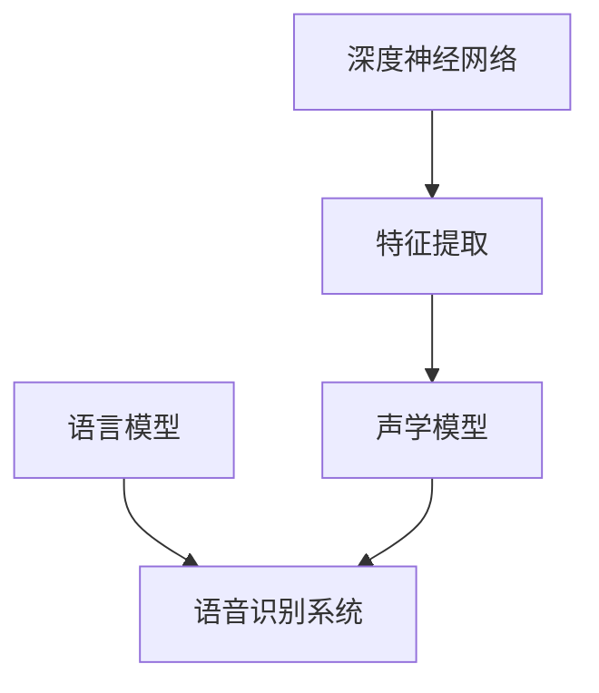

# Python机器学习实战：深度学习在语音识别中的应用

## 1. 背景介绍

### 1.1 问题的由来

在当今信息时代,语音识别技术已经广泛应用于各个领域,如智能助手、语音输入法、语音交互系统等。然而,传统的语音识别系统往往存在一些缺陷,如准确率不高、适应性差、噪音环境下表现欠佳等。这些问题的根源在于传统方法难以有效地处理语音信号中的复杂变化和背景噪音。

### 1.2 研究现状 

近年来,随着深度学习技术的不断发展,其在语音识别领域取得了卓越的成绩。深度神经网络具有强大的特征学习能力,能够自动从海量语音数据中提取出高层次的抽象特征,从而更好地表征语音信号的内在规律。目前,基于深度学习的语音识别系统已经在商业应用中得到广泛应用,取得了比传统方法更高的识别准确率。

### 1.3 研究意义

语音识别技术的发展对于提高人机交互体验、促进无障碍访问、推动智能化发展等方面具有重要意义。通过深入研究深度学习在语音识别中的应用,可以进一步提高语音识别系统的性能,扩大其应用范围,为构建智能化社会提供有力支撑。

### 1.4 本文结构

本文将全面介绍深度学习在语音识别中的应用。首先阐述核心概念和算法原理,包括深度神经网络模型、特征提取方法等;然后详细讲解数学模型和公式推导过程;接着通过实际项目实践,展示代码实现和运行结果;最后探讨实际应用场景、发展趋势和面临的挑战。

## 2. 核心概念与联系

深度学习在语音识别中的应用涉及多个核心概念,如深度神经网络、特征提取、声学模型、语言模型等。这些概念相互关联,共同构建了完整的语音识别系统。

深度神经网络是语音识别系统的核心部分,通过对原始语音信号进行特征提取,将其映射为高层次的抽象特征表示。这些特征被用于训练声学模型,声学模型的作用是将语音特征序列转换为对应的文本序列。同时,语言模型提供了文本序列的先验概率,用于提高识别的准确性。最终,声学模型和语言模型的结合构成了完整的语音识别系统。

## 3. 核心算法原理 & 具体操作步骤

### 3.1 算法原理概述

深度学习在语音识别中的核心算法是基于深度神经网络的端到端模型。该模型将原始语音信号作为输入,直接输出对应的文本序列,无需手工设计特征提取和声学模型等中间步骤。

该算法的关键在于使用深度卷积神经网络(CNN)和循环神经网络(RNN)的组合结构。CNN能够自动从语音信号中提取出局部特征,而RNN则能够有效捕捉语音序列中的长期依赖关系。通过端到端的训练,该模型能够自动学习最优的特征表示和声学模型映射,从而实现高精度的语音识别。

### 3.2 算法步骤详解

1. **数据预处理**:将原始语音数据转换为适当的格式,如频谱图或梅尔频率倒谱系数(MFCC)等,作为神经网络的输入。

2. **CNN特征提取**:使用多层卷积神经网络对预处理后的语音数据进行特征提取,获得局部特征表示。

3. **RNN序列建模**:将CNN提取的特征序列输入到RNN中,利用RNN的循环结构捕捉序列中的长期依赖关系。常用的RNN变体包括长短期记忆网络(LSTM)和门控循环单元(GRU)。

4. **注意力机制**:引入注意力机制,使模型能够自适应地关注输入序列中的关键部分,提高识别准确率。

5. **束搜索解码**:在测试阶段,使用束搜索算法对模型输出的概率分布序列进行解码,得到最终的文本序列结果。

6. **模型训练**:使用带有语音-文本对的大规模数据集,通过端到端的方式训练整个神经网络模型,最小化预测结果与真实文本之间的损失函数。

### 3.3 算法优缺点

**优点**:

- 端到端训练,无需手工设计特征提取和声学模型等中间步骤,简化了系统的复杂性。
- 能够自动学习最优的特征表示和声学模型映射,提高了识别准确率。
- 注意力机制使模型能够关注输入序列中的关键部分,进一步提升性能。

**缺点**:

- 需要大量的训练数据和计算资源,训练过程复杂且耗时。
- 对噪音和口音等因素的鲁棒性有待提高。
- 解码过程计算量较大,实时性受到一定影响。

### 3.4 算法应用领域

基于深度学习的语音识别算法已经在多个领域得到广泛应用,包括但不限于:

- 智能助手(如Siri、Alexa等)
- 语音输入法
- 会议记录
- 自动字幕生成
- 人机交互系统
- 无障碍访问辅助
- 语音控制设备
- 语音翻译
- 语音分析与挖掘

## 4. 数学模型和公式 & 详细讲解 & 举例说明

### 4.1 数学模型构建

在深度学习语音识别系统中,我们需要构建一个模型来映射输入的语音特征序列$X=\{x_1, x_2, \ldots, x_T\}$到目标的文本序列$Y=\{y_1, y_2, \ldots, y_U\}$。这个映射可以用条件概率$P(Y|X)$来表示,目标是找到一个模型参数$\theta$,使得$P(Y|X;\theta)$最大化。

根据贝叶斯公式,我们可以将$P(Y|X)$分解为:

$$P(Y|X) = \frac{P(X|Y)P(Y)}{P(X)}$$

其中:

- $P(X|Y)$是声学模型,表示在给定文本序列$Y$的情况下,观测到语音特征序列$X$的概率。
- $P(Y)$是语言模型,表示文本序列$Y$的先验概率。
- $P(X)$是语音特征序列$X$的边缘概率,在优化过程中可以忽略。

因此,我们的目标是最大化$P(X|Y;\theta_a)P(Y;\theta_l)$,其中$\theta_a$和$\theta_l$分别表示声学模型和语言模型的参数。

### 4.2 公式推导过程

#### 4.2.1 声学模型

声学模型的目标是估计$P(X|Y;\theta_a)$,即在给定文本序列$Y$的情况下,观测到语音特征序列$X$的概率。我们使用深度神经网络来建模这个概率分布。

假设神经网络的输出是一个向量$\hat{y}_t$,其中每个元素$\hat{y}_{t,k}$表示在时间步$t$观测到第$k$个字符的概率。那么,我们可以将声学模型的概率定义为:

$$P(X|Y;\theta_a) = \prod_{t=1}^{T} P(\hat{y}_t|x_t;\theta_a)$$

其中$P(\hat{y}_t|x_t;\theta_a)$是神经网络在给定语音特征$x_t$的情况下,输出$\hat{y}_t$的概率。

为了优化神经网络参数$\theta_a$,我们需要最大化声学模型的对数似然:

$$\mathcal{L}_a(\theta_a) = \sum_{n=1}^{N} \log P(X^{(n)}|Y^{(n)};\theta_a)$$

其中$N$是训练样本的数量。

#### 4.2.2 语言模型

语言模型的目标是估计$P(Y;\theta_l)$,即文本序列$Y$的先验概率。我们可以使用基于$n$-gram的统计语言模型或基于神经网络的语言模型。

对于$n$-gram语言模型,我们有:

$$P(Y;\theta_l) = \prod_{i=1}^{U} P(y_i|y_{i-n+1}, \ldots, y_{i-1};\theta_l)$$

其中$P(y_i|y_{i-n+1}, \ldots, y_{i-1};\theta_l)$是在给定前$n-1$个字符的情况下,观测到字符$y_i$的条件概率。

对于基于神经网络的语言模型,我们可以使用循环神经网络(RNN)或transformer等模型来估计$P(Y;\theta_l)$。

最终,我们需要联合优化声学模型和语言模型的参数,以最大化整个系统的对数似然:

$$\mathcal{L}(\theta_a, \theta_l) = \sum_{n=1}^{N} \log P(X^{(n)}|Y^{(n)};\theta_a) + \lambda \log P(Y^{(n)};\theta_l)$$

其中$\lambda$是一个权重参数,用于平衡声学模型和语言模型的贡献。

### 4.3 案例分析与讲解

为了更好地理解深度学习在语音识别中的应用,我们以一个简单的案例进行分析和讲解。

假设我们有一个小型语音数据集,包含一些简单的英文句子及其对应的语音录音。我们的目标是训练一个深度神经网络模型,能够将给定的语音信号转录为正确的文本。

#### 4.3.1 数据预处理

首先,我们需要对原始语音数据进行预处理。常见的预处理步骤包括:

1. 重采样:将语音信号重采样到统一的采样率,如16kHz。
2. 预加重:通过预加重滤波器增强高频部分,提高语音信号的可辨识性。
3. 分帧:将语音信号分割成固定长度的帧,每帧代表一个短时间窗口内的语音特征。
4. 特征提取:对每个语音帧提取特征,如MFCC、梅尔频谱等,作为神经网络的输入。

#### 4.3.2 模型结构

在这个案例中,我们使用一个简单的深度神经网络结构,包括卷积层、循环层和全连接层。

1. 卷积层:用于从语音特征中提取局部模式。
2. 池化层:对卷积层的输出进行下采样,减少计算量。
3. LSTM层:捕捉语音序列中的长期依赖关系。
4. 全连接层:将LSTM层的输出映射到字符空间。
5. Softmax输出:输出每个时间步对应的字符概率分布。

#### 4.3.3 模型训练

在训练过程中,我们将语音特征序列输入到神经网络中,并将模型输出的字符概率分布与真实的文本序列进行比较,计算损失函数(如交叉熵损失)。然后,使用优化算法(如Adam优化器)根据损失函数的梯度,更新模型参数。

通过多次迭代训练,模型将逐步学习到从语音特征到文本序列的映射关系,提高识别准确率。

#### 4.3.4 模型评估

在训练完成后,我们可以使用保留的测试集来评估模型的性能。常用的评估指标包括:

- 字错率(WER):错误识别的字符数与总字符数的比率。
- 词错率(WRR):错误识别的词数与总词数的比率。

通过