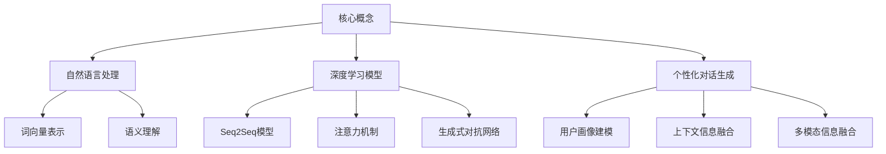

# Python深度学习实践：基于深度学习的个性化聊天机器人

## 1. 背景介绍

### 1.1 问题的由来

在当今信息时代,人机交互已经成为一种日常生活方式。传统的基于规则和模板的聊天机器人存在局限性,无法提供个性化和上下文相关的响应。随着深度学习技术的发展,基于深度学习的聊天机器人逐渐引起了广泛关注。

### 1.2 研究现状

目前,基于深度学习的聊天机器人主要分为两大类:生成式模型和检索式模型。生成式模型通过序列到序列(Seq2Seq)模型直接生成回复,但存在一致性和相关性问题。检索式模型则是从预先构建的语料库中检索最匹配的回复,但缺乏多样性和创新性。

### 1.3 研究意义

开发一种能够提供个性化、上下文相关和富有创意的聊天机器人,不仅可以提高人机交互体验,还可以推动自然语言处理和人工智能技术的发展。本文将探讨如何利用深度学习技术构建一个个性化的聊天机器人系统。

### 1.4 本文结构

本文首先介绍相关核心概念,然后深入探讨核心算法原理和数学模型。接下来,将通过代码实例和应用场景说明系统的实现和应用。最后,讨论未来发展趋势和面临的挑战。

## 2. 核心概念与联系



上图展示了构建个性化聊天机器人所涉及的核心概念及其关系。自然语言处理(NLP)是基础,包括词向量表示和语义理解等技术。深度学习模型则是核心,包括Seq2Seq、注意力机制和生成式对抗网络等。个性化对话生成需要用户画像建模、上下文信息融合和多模态信息融合等技术。

## 3. 核心算法原理 & 具体操作步骤

### 3.1 算法原理概述

个性化聊天机器人系统的核心算法原理可以概括为以下三个主要部分:

1. **编码器(Encoder)**: 将输入的对话历史和上下文信息编码为向量表示。
2. **上下文融合(Context Fusion)**: 融合用户画像、情感状态等个性化信息,构建个性化上下文向量。
3. **解码器(Decoder)**: 基于编码向量和个性化上下文向量,生成个性化且相关的回复。

### 3.2 算法步骤详解

1. **数据预处理**
   - 对话语料库清洗和标准化
   - 构建词典和词向量表示

2. **编码器(Encoder)**
   - 使用双向LSTM或Transformer等模型对输入序列进行编码
   - 获得上下文语义表示$\boldsymbol{h} = [\boldsymbol{h}_1, \boldsymbol{h}_2, \dots, \boldsymbol{h}_n]$

3. **上下文融合(Context Fusion)**
   - 用户画像嵌入$\boldsymbol{u}$: 基于用户属性(年龄、性别等)学习用户表示
   - 情感状态嵌入$\boldsymbol{e}$: 基于对话历史判断当前情感状态
   - 个性化上下文向量$\boldsymbol{c} = \boldsymbol{W}_c[\boldsymbol{h};\boldsymbol{u};\boldsymbol{e}] + \boldsymbol{b}_c$

4. **解码器(Decoder)**
   - 基于编码向量$\boldsymbol{h}$和个性化上下文向量$\boldsymbol{c}$生成回复
   - 使用注意力机制捕获输入和输出之间的对齐关系
   - 对于序列输出$\boldsymbol{y} = [y_1, y_2, \dots, y_m]$,计算条件概率:
     $$P(\boldsymbol{y}|\boldsymbol{x}, \boldsymbol{u}, \boldsymbol{e}) = \prod_{t=1}^m P(y_t|\boldsymbol{y}_{<t}, \boldsymbol{h}, \boldsymbol{c})$$
   - 使用Beam Search或其他策略生成最终回复

### 3.3 算法优缺点

**优点**:
- 融合了用户画像和情感状态,能生成个性化且上下文相关的回复
- 注意力机制提高了输入和输出的关联性
- 生成式模型具有较强的泛化能力,可产生多样化的回复

**缺点**:
- 训练数据质量对模型性能影响较大
- 生成式模型可能产生不合逻辑或不合语义的回复
- 个性化信息融合的效果有待进一步提升

### 3.4 算法应用领域

- 智能客服系统
- 教育辅助系统
- 心理健康辅导系统
- 娱乐聊天机器人
- 个性化推荐系统

## 4. 数学模型和公式 & 详细讲解 & 举例说明

### 4.1 数学模型构建

个性化聊天机器人系统的核心是一个基于Seq2Seq的生成式模型,其数学表达式如下:

$$P(\boldsymbol{y}|\boldsymbol{x}, \boldsymbol{u}, \boldsymbol{e}) = \prod_{t=1}^m P(y_t|\boldsymbol{y}_{<t}, \boldsymbol{h}, \boldsymbol{c})$$

其中:
- $\boldsymbol{x}$是输入的对话历史
- $\boldsymbol{y}$是期望生成的回复序列
- $\boldsymbol{u}$是用户画像嵌入
- $\boldsymbol{e}$是情感状态嵌入
- $\boldsymbol{h}$是编码器输出的上下文语义表示
- $\boldsymbol{c}$是融合了个性化信息的上下文向量

该模型的目标是最大化生成回复序列$\boldsymbol{y}$的条件概率。

### 4.2 公式推导过程

我们先定义一个基于注意力机制的Seq2Seq模型:

$$P(\boldsymbol{y}|\boldsymbol{x}) = \prod_{t=1}^m P(y_t|\boldsymbol{y}_{<t}, \boldsymbol{h})$$

其中$\boldsymbol{h}$是通过注意力机制从编码器输出获得的上下文向量。

为了融合个性化信息,我们将用户画像嵌入$\boldsymbol{u}$和情感状态嵌入$\boldsymbol{e}$与上下文向量$\boldsymbol{h}$拼接,并通过一个线性变换获得个性化上下文向量$\boldsymbol{c}$:

$$\boldsymbol{c} = \boldsymbol{W}_c[\boldsymbol{h};\boldsymbol{u};\boldsymbol{e}] + \boldsymbol{b}_c$$

将$\boldsymbol{c}$代入原始模型,我们得到了个性化聊天机器人的数学模型:

$$P(\boldsymbol{y}|\boldsymbol{x}, \boldsymbol{u}, \boldsymbol{e}) = \prod_{t=1}^m P(y_t|\boldsymbol{y}_{<t}, \boldsymbol{h}, \boldsymbol{c})$$

### 4.3 案例分析与讲解

假设我们有一个对话历史$\boldsymbol{x}$="你今天过得怎么样?",用户画像嵌入$\boldsymbol{u}$表示该用户是一位年轻男性,情感状态嵌入$\boldsymbol{e}$表示用户当前情绪一般。

1. 编码器将$\boldsymbol{x}$编码为上下文语义表示$\boldsymbol{h}$
2. 将$\boldsymbol{h}$、$\boldsymbol{u}$和$\boldsymbol{e}$拼接,并通过线性变换获得个性化上下文向量$\boldsymbol{c}$
3. 解码器基于$\boldsymbol{h}$和$\boldsymbol{c}$生成回复,例如"今天过得还可以,就是工作有点累。作为一个年轻人,适当放松一下也很重要。"

可以看到,生成的回复不仅与输入相关,而且融入了用户画像(年轻男性)和情感状态(一般),体现了个性化的特点。

### 4.4 常见问题解答

**Q: 为什么要融合个性化信息?**
A: 融合用户画像和情感状态等个性化信息,可以使聊天机器人的回复更加贴近用户的实际需求和情况,提高人机交互的自然性和有效性。

**Q: 如何获取用户画像和情感状态信息?**
A: 用户画像信息可以通过用户注册信息或历史行为数据学习获得;情感状态可以通过对话历史的情感分析来判断。

**Q: 生成式模型的回复是否可能不合逻辑或不合语义?**
A: 是的,生成式模型存在这个风险。可以通过对抗训练、约束解码等方法来缓解这一问题。另外,也可以结合检索式模型的优点,形成混合模型。

## 5. 项目实践:代码实例和详细解释说明

### 5.1 开发环境搭建

我们使用Python作为开发语言,并利用PyTorch深度学习框架实现个性化聊天机器人系统。首先,需要安装以下依赖库:

```bash
pip install pytorch torchtext numpy pandas
```

接下来,我们导入所需的库:

```python
import torch
import torch.nn as nn
import torchtext
from torchtext.data import Field, BucketIterator
import pandas as pd
import numpy as np
```

### 5.2 源代码详细实现

#### 数据预处理

```python
# 定义Field对象
SRC = Field(tokenize='spacy', init_token='<sos>', eos_token='<eos>')
TRG = Field(tokenize='spacy', init_token='<sos>', eos_token='<eos>')

# 加载数据
train_data = pd.read_csv('train.csv')
train_data = train_data[['source', 'target']]

# 构建词典
SRC.build_vocab(train_data['source'], max_size=50000)
TRG.build_vocab(train_data['target'], max_size=50000)

# 构建迭代器
train_iter = BucketIterator(train_data, batch_size=32, sort_key=lambda x: len(x.source),
                            device=device, train=True)
```

#### 编码器实现

```python
class Encoder(nn.Module):
    def __init__(self, input_dim, emb_dim, enc_hid_dim, dec_hid_dim, dropout):
        super().__init__()
        self.embedding = nn.Embedding(input_dim, emb_dim)
        self.rnn = nn.GRU(emb_dim, enc_hid_dim, bidirectional=True)
        self.fc = nn.Linear(enc_hid_dim * 2, dec_hid_dim)
        self.dropout = nn.Dropout(dropout)

    def forward(self, src):
        embedded = self.dropout(self.embedding(src))
        outputs, hidden = self.rnn(embedded)
        hidden = torch.tanh(self.fc(torch.cat((hidden[-2, :, :], hidden[-1, :, :]), dim=1)))
        return outputs, hidden
```

#### 上下文融合层实现

```python
class ContextFusion(nn.Module):
    def __init__(self, user_dim, emo_dim, dec_hid_dim):
        super().__init__()
        self.user_embedding = nn.Embedding(user_dim, dec_hid_dim)
        self.emo_embedding = nn.Embedding(emo_dim, dec_hid_dim)
        self.fc = nn.Linear(dec_hid_dim * 3, dec_hid_dim)

    def forward(self, hidden, user, emo):
        user_emb = self.user_embedding(user)
        emo_emb = self.emo_embedding(emo)
        context = torch.cat((hidden, user_emb, emo_emb), dim=1)
        context = torch.tanh(self.fc(context))
        return context
```

#### 解码器实现

```python
class Decoder(nn.Module):
    def __init__(self, output_dim, emb_dim, enc_hid_dim, dec_hid_dim, dropout, attention):
        super().__init__()
        self.output_dim = output_dim
        self.attention = attention
        self.embedding = nn.Embedding(output_dim, emb_dim)
        self.rnn = nn.GRU((enc_hid_dim * 2) + emb