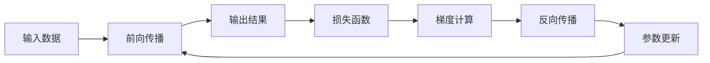

# Python深度学习实践：理解反向传播算法的细节

关键词：深度学习、反向传播、梯度下降、神经网络、Python

## 1. 背景介绍
### 1.1  问题的由来
深度学习作为人工智能的核心技术之一，在计算机视觉、自然语言处理、语音识别等领域取得了巨大的成功。而支撑深度学习的基石之一就是反向传播算法(Backpropagation)。反向传播算法能够高效地计算神经网络中各层参数的梯度，为模型的训练和优化提供了理论基础。然而，对于很多初学者来说，反向传播算法的原理和细节往往难以理解和掌握。

### 1.2  研究现状
目前关于反向传播算法的研究主要集中在以下几个方面：
1. 反向传播算法的理论基础和数学推导
2. 反向传播算法的改进和优化，如AdaGrad、RMSProp、Adam等自适应学习率优化算法
3. 反向传播算法在不同神经网络架构中的应用，如CNN、RNN、Transformer等
4. 反向传播算法的并行化和加速实现

### 1.3  研究意义
深入理解反向传播算法的原理和细节，对于深度学习的学习和应用具有重要意义：
1. 理解反向传播算法有助于更好地理解深度学习的本质和内在机制
2. 掌握反向传播算法的推导过程，能够更好地设计和优化神经网络模型
3. 了解反向传播算法的局限性，有助于探索新的优化算法和学习范式
4. 运用反向传播算法解决实际问题，促进人工智能技术的发展和应用

### 1.4  本文结构
本文将从以下几个方面深入探讨反向传播算法：
1. 反向传播算法的核心概念与联系
2. 反向传播算法的原理和具体操作步骤
3. 反向传播算法涉及的数学模型和公式推导
4. 反向传播算法的代码实现和案例分析
5. 反向传播算法的实际应用场景
6. 反向传播算法的学习资源和工具推荐
7. 反向传播算法的未来发展趋势与挑战
8. 常见问题解答

## 2. 核心概念与联系
在深入理解反向传播算法之前，我们需要先了解一些核心概念：
- 神经网络：由大量神经元按照一定的层次结构和连接方式构成的网络，用于对输入数据进行特征提取和抽象表示。
- 前向传播：输入数据从输入层开始，逐层传递到输出层的过程，用于计算神经网络的输出。
- 损失函数：衡量神经网络输出与真实标签之间差异的函数，常见的有均方误差、交叉熵等。
- 梯度：损失函数对神经网络中各参数的偏导数，表示参数变化对损失函数的影响。
- 梯度下降：通过不断调整神经网络的参数，使损失函数沿着梯度的反方向下降，以找到最优参数的优化算法。
- 反向传播：从输出层开始，逐层计算各层参数的梯度，并将梯度传递到前一层，直到输入层的过程。

反向传播算法将前向传播、损失函数、梯度计算和参数更新有机地结合在一起，通过迭代优化的方式训练神经网络模型。下图展示了这些概念之间的联系：

## 3. 核心算法原理 & 具体操作步骤
### 3.1  算法原理概述
反向传播算法的核心思想是利用链式法则，通过逐层计算各层参数的梯度，并将梯度传递到前一层，最终得到损失函数对所有参数的梯度，然后根据梯度下降法更新参数，使损失函数最小化。

### 3.2  算法步骤详解
反向传播算法的具体步骤如下：
1. 前向传播：根据当前参数，计算神经网络的输出。
2. 计算损失函数：比较网络输出与真实标签，计算损失函数值。
3. 反向传播：
   - 计算损失函数对输出层的梯度
   - 逐层计算各层参数的梯度，利用链式法则将梯度传递到前一层
   - 直到计算出损失函数对所有参数的梯度
4. 更新参数：根据梯度下降法，使用学习率更新神经网络的参数。
5. 重复步骤1-4，直到满足停止条件（如达到最大迭代次数或损失函数值达到阈值）。

### 3.3  算法优缺点
反向传播算法的优点包括：
- 能够高效地训练多层神经网络
- 具有良好的数学理论基础，易于理解和实现
- 适用于各种神经网络架构，如前馈网络、卷积网络、循环网络等

反向传播算法的缺点包括：
- 容易陷入局部最优，难以找到全局最优解
- 对参数初始化和学习率敏感，需要仔细调参
- 训练时间较长，计算复杂度高

### 3.4  算法应用领域
反向传播算法广泛应用于各种深度学习任务，如：
- 图像分类、目标检测、语义分割等计算机视觉任务
- 语音识别、机器翻译、情感分析等自然语言处理任务
- 推荐系统、异常检测、风险控制等工业应用

## 4. 数学模型和公式 & 详细讲解 & 举例说明
### 4.1  数学模型构建
考虑一个简单的三层全连接神经网络，其数学模型可表示为：

$$
\begin{aligned}
\mathbf{z}^{(1)} &= \mathbf{W}^{(1)}\mathbf{x} + \mathbf{b}^{(1)} \\
\mathbf{a}^{(1)} &= \sigma(\mathbf{z}^{(1)}) \\
\mathbf{z}^{(2)} &= \mathbf{W}^{(2)}\mathbf{a}^{(1)} + \mathbf{b}^{(2)} \\ 
\mathbf{a}^{(2)} &= \sigma(\mathbf{z}^{(2)}) \\
\mathbf{\hat{y}} &= \text{softmax}(\mathbf{a}^{(2)})
\end{aligned}
$$

其中，$\mathbf{x}$为输入向量，$\mathbf{W}^{(l)}$和$\mathbf{b}^{(l)}$分别为第$l$层的权重矩阵和偏置向量，$\mathbf{z}^{(l)}$为第$l$层的加权输入，$\mathbf{a}^{(l)}$为第$l$层的激活值，$\sigma$为激活函数（如sigmoid或ReLU），$\mathbf{\hat{y}}$为网络的输出概率分布。

损失函数采用交叉熵损失：

$$
J(\mathbf{W},\mathbf{b}) = -\frac{1}{m}\sum_{i=1}^{m}\sum_{j=1}^{k}y_{ij}\log\hat{y}_{ij}
$$

其中，$m$为样本数，$k$为类别数，$y_{ij}$为第$i$个样本属于第$j$类的真实标签（0或1），$\hat{y}_{ij}$为网络预测的概率。

### 4.2  公式推导过程
反向传播算法的核心是利用链式法则计算损失函数对各层参数的梯度。以上述三层网络为例，假设第$l$层的加权输入为$\mathbf{z}^{(l)}$，激活值为$\mathbf{a}^{(l)}$，则有：

$$
\begin{aligned}
\frac{\partial J}{\partial \mathbf{W}^{(l)}} &= \frac{\partial J}{\partial \mathbf{z}^{(l)}} \frac{\partial \mathbf{z}^{(l)}}{\partial \mathbf{W}^{(l)}} \\
\frac{\partial J}{\partial \mathbf{b}^{(l)}} &= \frac{\partial J}{\partial \mathbf{z}^{(l)}} \frac{\partial \mathbf{z}^{(l)}}{\partial \mathbf{b}^{(l)}} \\
\frac{\partial J}{\partial \mathbf{z}^{(l)}} &= \frac{\partial J}{\partial \mathbf{a}^{(l)}} \frac{\partial \mathbf{a}^{(l)}}{\partial \mathbf{z}^{(l)}} = \frac{\partial J}{\partial \mathbf{a}^{(l)}} \sigma'(\mathbf{z}^{(l)})
\end{aligned}
$$

其中，$\frac{\partial J}{\partial \mathbf{a}^{(l)}}$为第$l$层的误差项，可以通过递归计算得到：

$$
\frac{\partial J}{\partial \mathbf{a}^{(l)}} = \left(\mathbf{W}^{(l+1)}\right)^T \frac{\partial J}{\partial \mathbf{z}^{(l+1)}}
$$

对于输出层，误差项为：

$$
\frac{\partial J}{\partial \mathbf{a}^{(L)}} = \mathbf{\hat{y}} - \mathbf{y}
$$

其中，$L$为网络的层数。

根据上述公式，反向传播算法的梯度计算过程可总结为：
1. 计算输出层的误差项 $\frac{\partial J}{\partial \mathbf{a}^{(L)}}$
2. 逐层计算各层的误差项 $\frac{\partial J}{\partial \mathbf{a}^{(l)}}$，直到输入层
3. 计算各层参数的梯度 $\frac{\partial J}{\partial \mathbf{W}^{(l)}}$ 和 $\frac{\partial J}{\partial \mathbf{b}^{(l)}}$

### 4.3  案例分析与讲解
下面以一个简单的二分类问题为例，演示反向传播算法的计算过程。

假设输入为$\mathbf{x} = [x_1, x_2]^T$，真实标签为$y \in \{0,1\}$，网络结构为：
- 输入层：2个神经元
- 隐藏层：3个神经元，激活函数为sigmoid
- 输出层：1个神经元，激活函数为sigmoid

前向传播过程为：

$$
\begin{aligned}
\mathbf{z}^{(1)} &= \mathbf{W}^{(1)}\mathbf{x} + \mathbf{b}^{(1)} \\
\mathbf{a}^{(1)} &= \sigma(\mathbf{z}^{(1)}) \\
z^{(2)} &= \mathbf{w}^{(2)}\mathbf{a}^{(1)} + b^{(2)} \\ 
\hat{y} &= \sigma(z^{(2)})
\end{aligned}
$$

损失函数为：

$$
J = -[y\log\hat{y} + (1-y)\log(1-\hat{y})]
$$

反向传播过程为：
1. 计算输出层误差项：
$$
\frac{\partial J}{\partial z^{(2)}} = \hat{y} - y
$$

2. 计算隐藏层误差项：
$$
\frac{\partial J}{\partial \mathbf{a}^{(1)}} = \mathbf{w}^{(2)T} \frac{\partial J}{\partial z^{(2)}} \sigma'(\mathbf{z}^{(1)})
$$

3. 计算参数梯度：
$$
\begin{aligned}
\frac{\partial J}{\partial \mathbf{w}^{(2)}} &= \frac{\partial J}{\partial z^{(2)}} \mathbf{a}^{(1)T} \\
\frac{\partial J}{\partial b^{(2)}} &= \frac{\partial J}{\partial z^{(2)}} \\
\frac{\partial J}{\partial \mathbf{W}^{(1)}} &= \frac{\partial J}{\partial \mathbf{a}^{(1)}} \mathbf{x}^T \\  
\frac{\partial J}{\partial \mathbf{b}^{(1)}} &= \frac{\partial J}{\partial \mathbf{a}^{(1)}}
\end{aligned}
$$

4. 更新参数：
$$
\begin{aligned}
\mathbf{W}^{(1)} &:= \mathbf{W}^{(1)} - \alpha \frac{\partial J}{\partial \mathbf{W}^{(1)}} \\
\mathbf{b}^{(1)} &:= \mathbf{b}^{(1)} - \alpha \frac