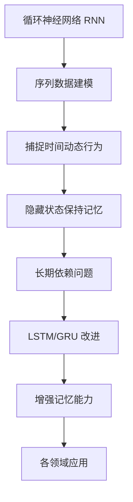

以下是《Recurrent Neural Networks (RNN)原理与代码实例讲解》的正文部分:

# Recurrent Neural Networks (RNN)原理与代码实例讲解

## 1. 背景介绍

### 1.1 问题的由来

在自然语言处理、语音识别、时间序列预测等领域中,数据通常呈现出序列形式。传统的前馈神经网络如多层感知机(MLP)对这类数据处理效果并不理想,因为它们无法很好地捕捉序列数据中的时间依赖关系。为了更好地处理序列数据,循环神经网络(Recurrent Neural Networks, RNN)应运而生。

### 1.2 研究现状 

RNN是一种特殊的深度神经网络,它在隐藏层中引入了循环连接,使网络在处理序列数据时能够捕捉前后时间步之间的动态行为。经典RNN存在梯度消失/爆炸等问题,因此出现了改进型RNN如长短期记忆网络(LSTM)和门控循环单元(GRU)等。这些改进型RNN在各领域取得了卓越的表现,成为当前序列数据处理的主流模型。

### 1.3 研究意义

RNN在自然语言处理、语音识别、时间序列预测等领域有着广泛的应用前景。掌握RNN的原理及实现方式,对于从事相关领域的工作者来说是非常重要的。本文将系统地介绍RNN的基本原理、数学模型、实现细节以及实际应用,为读者提供全面的理解和实践指导。

### 1.4 本文结构

本文首先介绍RNN的基本概念和与其他神经网络模型的联系,然后深入探讨RNN的核心算法原理、数学模型及公式推导,接着通过实例代码讲解RNN在实践中的具体实现细节,最后分析RNN在实际应用中的场景,并对未来发展趋势和面临的挑战进行展望。

## 2. 核心概念与联系



循环神经网络(Recurrent Neural Networks, RNN)是一种针对序列数据建模的神经网络。与传统的前馈神经网络不同,RNN在隐藏层中引入了循环连接,使得网络能够捕捉序列数据中各时间步之间的动态行为。

RNN的核心思想是通过在每个时间步保持一个隐藏状态(Hidden State),该隐藏状态充当网络的"记忆",汇总了之前时间步的信息。通过这种方式,RNN能够更好地捕捉序列数据中长期的依赖关系。然而,经典RNN在学习长期依赖时存在梯度消失/爆炸的问题,因此出现了一些改进型RNN如长短期记忆网络(LSTM)和门控循环单元(GRU),它们通过引入门控机制和记忆细胞,增强了网络捕捉长期依赖的能力。

改进后的RNN在自然语言处理、语音识别、时间序列预测等领域取得了卓越的表现,成为当前序列数据处理的主流模型之一。

## 3. 核心算法原理 & 具体操作步骤  

### 3.1 算法原理概述

RNN的核心思想是通过在隐藏层中引入循环连接,使得网络能够捕捉序列数据中各时间步之间的动态行为。具体来说,在处理序列数据时,RNN将序列的每个时间步作为一个独立的输入,并更新隐藏状态和输出。隐藏状态充当网络的"记忆",汇总了之前时间步的信息,并将其传递给当前时间步,从而捕捉序列数据中的长期依赖关系。

RNN的数学表达式如下:

$$
\begin{aligned}
h_t &= \tanh(W_{hh}h_{t-1} + W_{xh}x_t + b_h) \\
y_t &= W_{yh}h_t + b_y
\end{aligned}
$$

其中:
- $x_t$是时间步$t$的输入
- $h_t$是时间步$t$的隐藏状态
- $y_t$是时间步$t$的输出
- $W$是权重矩阵
- $b$是偏置向量

通过上述公式,RNN能够在每个时间步更新隐藏状态和输出,并将隐藏状态传递给下一个时间步,从而捕捉序列数据中的时间动态行为。

### 3.2 算法步骤详解

RNN在处理序列数据时,遵循以下步骤:

1. **初始化**:初始化RNN的权重矩阵$W$和偏置向量$b$,通常使用随机初始化。同时,初始化第一个时间步的隐藏状态$h_0$,通常设为全0向量。

2. **前向传播**:对于序列中的每个时间步$t$,执行以下操作:
    a. 计算当前时间步的隐藏状态$h_t$,根据上一时间步的隐藏状态$h_{t-1}$和当前输入$x_t$。
    b. 计算当前时间步的输出$y_t$,根据当前隐藏状态$h_t$。

3. **反向传播**:计算损失函数,并通过反向传播算法更新RNN的权重矩阵$W$和偏置向量$b$。

4. **重复步骤2和3**:对序列中的所有时间步重复步骤2和3,直到模型收敛或达到最大迭代次数。

需要注意的是,在处理每个新序列时,RNN都需要重新初始化隐藏状态$h_0$。这样可以确保不同序列之间的隐藏状态相互独立,避免信息泄露。

### 3.3 算法优缺点

**优点**:

- 能够捕捉序列数据中的时间动态行为和长期依赖关系
- 网络结构相对简单,易于理解和实现
- 在自然语言处理、语音识别等领域取得了不错的表现

**缺点**:

- 存在梯度消失/爆炸问题,难以有效捕捉长期依赖关系
- 只能以序列方式进行训练,无法并行计算,效率较低
- 对于同一序列中不同位置的输入,网络的参数是共享的,无法针对不同位置进行参数专门化

### 3.4 算法应用领域

RNN由于其捕捉序列数据时间动态行为的能力,在以下领域有着广泛的应用:

- **自然语言处理**:机器翻译、文本生成、情感分析等
- **语音识别**:将语音信号转录为文本
- **时间序列预测**:股票预测、天气预报等
- **手写识别**:将手写体转换为文本
- **机器人控制**:根据环境变化调整机器人运动轨迹
- **音乐生成**:根据已有旋律生成新的音乐作品

## 4. 数学模型和公式 & 详细讲解 & 举例说明

### 4.1 数学模型构建

RNN的数学模型可以用以下公式表示:

$$
\begin{aligned}
h_t &= \tanh(W_{hh}h_{t-1} + W_{xh}x_t + b_h) \\
y_t &= W_{yh}h_t + b_y
\end{aligned}
$$

其中:

- $x_t$是时间步$t$的输入
- $h_t$是时间步$t$的隐藏状态
- $y_t$是时间步$t$的输出
- $W_{hh}$是隐藏层到隐藏层的权重矩阵
- $W_{xh}$是输入层到隐藏层的权重矩阵
- $W_{yh}$是隐藏层到输出层的权重矩阵
- $b_h$是隐藏层的偏置向量
- $b_y$是输出层的偏置向量

该模型的核心思想是通过引入循环连接,使得隐藏状态$h_t$不仅取决于当前输入$x_t$,还取决于上一时间步的隐藏状态$h_{t-1}$。这样,隐藏状态就能够汇总之前时间步的信息,从而捕捉序列数据中的长期依赖关系。

### 4.2 公式推导过程

我们可以通过展开RNN的计算过程,来更好地理解其公式推导过程。

对于一个长度为$T$的序列$(x_1, x_2, \dots, x_T)$,RNN的计算过程如下:

$$
\begin{aligned}
h_1 &= \tanh(W_{hh}h_0 + W_{xh}x_1 + b_h) \\
y_1 &= W_{yh}h_1 + b_y \\
h_2 &= \tanh(W_{hh}h_1 + W_{xh}x_2 + b_h) \\
y_2 &= W_{yh}h_2 + b_y \\
&\vdots \\
h_T &= \tanh(W_{hh}h_{T-1} + W_{xh}x_T + b_h) \\
y_T &= W_{yh}h_T + b_y
\end{aligned}
$$

可以看出,每个时间步的隐藏状态$h_t$都依赖于上一时间步的隐藏状态$h_{t-1}$和当前输入$x_t$,而输出$y_t$则由当前隐藏状态$h_t$计算得到。这种递归计算方式使得RNN能够捕捉序列数据中的长期依赖关系。

在实际应用中,我们通常会对整个序列计算损失函数,然后使用反向传播算法来更新RNN的权重矩阵$W$和偏置向量$b$,从而优化模型的性能。

### 4.3 案例分析与讲解

为了更好地理解RNN的工作原理,我们来分析一个简单的案例:使用RNN对一个文本序列进行字符级别的语言模型构建。

假设我们有一个文本序列"hello world",我们希望训练一个RNN模型,能够根据前面的字符预测下一个字符。

首先,我们需要为每个字符指定一个唯一的数字编码,例如:

```
h: 0, e: 1, l: 2, o: 3, w: 4, r: 5, d: 6, 空格: 7
```

然后,我们将文本序列"hello world"转换为数字序列:

```
0 1 2 2 3 7 4 3 5 2 6
```

接下来,我们将这个数字序列输入到RNN中进行训练。在每个时间步,RNN会根据当前输入和上一个隐藏状态计算新的隐藏状态,然后根据新的隐藏状态预测下一个字符。

例如,在时间步$t=1$时,输入是字符"h"的编码0,RNN会根据初始隐藏状态$h_0$和输入0计算新的隐藏状态$h_1$,然后根据$h_1$预测下一个字符是"e"的概率最大。

在时间步$t=2$时,输入是字符"e"的编码1,RNN会根据$h_1$和输入1计算新的隐藏状态$h_2$,然后根据$h_2$预测下一个字符是"l"的概率最大。

这个过程一直持续到序列的最后一个字符。通过不断地迭代和调整RNN的权重矩阵,模型就能够学习到文本序列中字符之间的依赖关系,从而更好地进行字符级别的语言模型构建。

### 4.4 常见问题解答

**Q: RNN是如何捕捉序列数据中的长期依赖关系的?**

A: RNN通过在隐藏层中引入循环连接,使得每个时间步的隐藏状态不仅取决于当前输入,还取决于上一时间步的隐藏状态。这样,隐藏状态就能够汇总之前时间步的信息,从而捕捉序列数据中的长期依赖关系。

**Q: 为什么经典RNN存在梯度消失/爆炸问题?**

A: 在训练过程中,RNN需要通过反向传播算法计算梯度。但是,由于循环连接的存在,梯度会在不断乘以相同的权重矩阵,导致梯度值在传播过程中可能exponentially decay(梯度消失)或exponentially blow up(