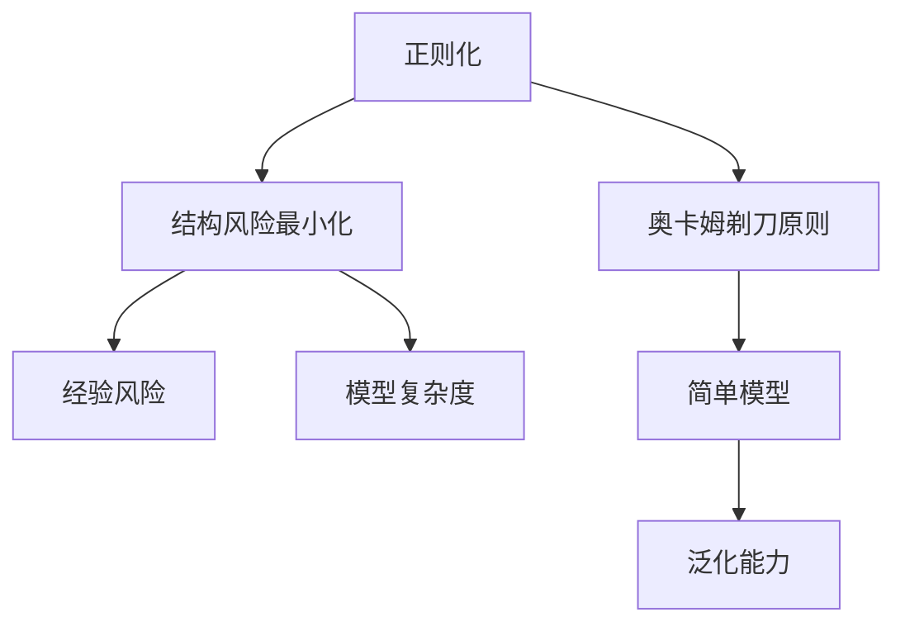

# Regularization原理与代码实例讲解

## 1. 背景介绍

### 1.1 问题的由来

在机器学习和深度学习领域中,过拟合(Overfitting)是一个常见且棘手的问题。当模型过于复杂时,它可能会过度捕捉训练数据中的噪声和特殊模式,从而导致在新的未见数据上表现不佳。这种情况下,模型在训练数据上表现良好,但在测试数据上的泛化能力较差。

为了解决过拟合问题,需要引入正则化(Regularization)技术。正则化旨在通过对模型参数施加约束或惩罚,从而降低模型的复杂性,提高其在新数据上的泛化能力。

### 1.2 研究现状

目前,正则化技术在机器学习和深度学习中被广泛应用,并取得了显著的效果。常见的正则化方法包括L1正则化(Lasso Regression)、L2正则化(Ridge Regression)、Dropout、Early Stopping等。这些技术通过不同的方式约束模型参数,从而达到防止过拟合的目的。

### 1.3 研究意义

正则化技术对于提高模型的泛化能力至关重要。通过合理应用正则化,可以有效防止过拟合,提高模型在未见数据上的预测精度。此外,正则化还可以帮助简化模型结构,减少计算复杂度,从而提高模型的效率和可解释性。

### 1.4 本文结构

本文将全面介绍正则化的原理、算法和实现。首先,我们将探讨正则化的核心概念和与其他技术的联系。然后,详细阐述正则化算法的原理和具体操作步骤。接下来,我们将构建数学模型并推导公式,并通过案例分析加深理解。此外,还将提供代码实例和详细解释,帮助读者掌握实现细节。最后,我们将讨论正则化在实际应用中的场景,并分享相关工具和资源。

## 2. 核心概念与联系



正则化(Regularization)是一种结构风险最小化(Structural Risk Minimization, SRM)的实现方式。SRM理论认为,模型的泛化能力不仅取决于经验风险(Empirical Risk),还取决于模型的复杂度(Model Complexity)。

正则化技术遵循奥卡姆剃刀原则(Occam's Razor Principle),即在所有可能的模型中,选择最简单的模型。通过约束模型参数,正则化可以降低模型的复杂度,从而提高其泛化能力。

此外,正则化还与其他一些重要概念和技术密切相关,如偏差-方差权衡(Bias-Variance Tradeoff)、参数缩减(Parameter Shrinkage)和特征选择(Feature Selection)等。

## 3. 核心算法原理 & 具体操作步骤

### 3.1 算法原理概述

正则化算法的核心思想是在损失函数(Loss Function)中引入惩罚项(Penalty Term),对模型参数施加约束。通过最小化损失函数,可以同时降低模型在训练数据上的误差,并控制模型的复杂度。

常见的正则化算法包括L1正则化(Lasso Regression)和L2正则化(Ridge Regression)。L1正则化通过引入L1范数惩罚项,可以实现参数稀疏性,从而达到特征选择的效果。L2正则化则通过引入L2范数惩罚项,对参数进行缩减,但不会产生稀疏解。

### 3.2 算法步骤详解

以线性回归为例,我们可以将正则化算法分为以下几个步骤:

1. **定义损失函数**:首先,定义线性回归的损失函数,通常使用均方误差(Mean Squared Error, MSE)。

$$J(w) = \frac{1}{2m}\sum_{i=1}^m(y^{(i)} - w^Tx^{(i)})^2$$

其中,$ w $是模型参数(权重矩阵),$ x^{(i)} $是第$ i $个样本的特征向量,$ y^{(i)} $是第$ i $个样本的标签。

2. **引入正则化项**:在损失函数中加入正则化项,对模型参数施加约束。对于L2正则化,我们引入L2范数惩罚项:

$$J(w) = \frac{1}{2m}\sum_{i=1}^m(y^{(i)} - w^Tx^{(i)})^2 + \frac{\lambda}{2}\|w\|_2^2$$

其中,$ \lambda $是正则化系数,用于控制正则化强度。$ \|w\|_2^2 $表示L2范数,即$ w $的平方和。

3. **优化目标函数**:使用优化算法(如梯度下降)最小化正则化后的损失函数,从而得到最优参数$ w $。

4. **预测**:使用训练好的模型参数$ w $对新数据进行预测。

$$\hat{y} = w^Tx$$

### 3.3 算法优缺点

**优点**:

- 有效防止过拟合,提高模型的泛化能力
- 简化模型结构,提高可解释性
- L1正则化可实现自动特征选择

**缺点**:

- 需要调整正则化系数,过程较为耗时
- 过度正则化可能导致欠拟合
- L1正则化存在奇异性问题,不适用于高维数据

### 3.4 算法应用领域

正则化技术在机器学习和深度学习的诸多领域都有广泛应用,包括但不限于:

- 线性模型(如线性回归、逻辑回归)
- 非线性模型(如支持向量机、神经网络)
- 结构化预测(如条件随机场)
- 推荐系统
- 自然语言处理
- 计算机视觉

## 4. 数学模型和公式 & 详细讲解 & 举例说明

### 4.1 数学模型构建

我们以线性回归为例,构建正则化的数学模型。假设有$ m $个训练样本$ \{(x^{(1)}, y^{(1)}), (x^{(2)}, y^{(2)}), \dots, (x^{(m)}, y^{(m)})\} $,其中$ x^{(i)} \in \mathbb{R}^n $是$ n $维特征向量,$ y^{(i)} \in \mathbb{R} $是标量标签。线性回归模型可以表示为:

$$f(x) = w^Tx + b$$

其中,$ w \in \mathbb{R}^n $是权重向量,$ b \in \mathbb{R} $是偏置项。

为了防止过拟合,我们引入L2正则化项,得到正则化后的目标函数:

$$J(w, b) = \frac{1}{2m}\sum_{i=1}^m(y^{(i)} - w^Tx^{(i)} - b)^2 + \frac{\lambda}{2}\|w\|_2^2$$

其中,第一项是经验风险(数据拟合项),第二项是L2正则化项,$ \lambda \geq 0 $是正则化系数,用于控制正则化强度。

### 4.2 公式推导过程

我们的目标是找到最小化目标函数$ J(w, b) $的参数$ w $和$ b $。可以使用梯度下降法进行优化。

首先,计算目标函数关于$ w $和$ b $的梯度:

$$\begin{aligned}
\frac{\partial J}{\partial w} &= \frac{1}{m}\sum_{i=1}^m(w^Tx^{(i)} + b - y^{(i)})x^{(i)} + \lambda w \\
\frac{\partial J}{\partial b} &= \frac{1}{m}\sum_{i=1}^m(w^Tx^{(i)} + b - y^{(i)})
\end{aligned}$$

然后,使用梯度下降法更新参数:

$$\begin{aligned}
w &\leftarrow w - \alpha\frac{\partial J}{\partial w} \\
b &\leftarrow b - \alpha\frac{\partial J}{\partial b}
\end{aligned}$$

其中,$ \alpha $是学习率,控制每次更新的步长。

重复上述过程,直到收敛或达到最大迭代次数。最终,我们可以得到正则化线性回归模型的最优参数$ w $和$ b $。

### 4.3 案例分析与讲解

现在,让我们通过一个具体的案例来加深对正则化的理解。假设我们有一个线性回归问题,需要预测房屋价格。特征包括房屋面积、卧室数量、浴室数量等。我们将使用带有L2正则化的线性回归模型进行训练和预测。

```python
import numpy as np
from sklearn.linear_model import Ridge

# 加载数据
X_train, y_train = load_data('housing_train.csv')
X_test, y_test = load_data('housing_test.csv')

# 创建Ridge回归模型
ridge = Ridge(alpha=0.1)  # alpha是正则化系数

# 训练模型
ridge.fit(X_train, y_train)

# 预测
y_pred = ridge.predict(X_test)

# 评估模型
mse = mean_squared_error(y_test, y_pred)
print(f'Mean Squared Error: {mse:.2f}')
```

在上述代码中,我们首先加载训练数据和测试数据。然后,创建Ridge回归模型,其中`alpha`是正则化系数,用于控制正则化强度。接下来,我们使用`fit`方法在训练数据上训练模型。最后,使用训练好的模型对测试数据进行预测,并计算均方误差(MSE)来评估模型性能。

通过调整正则化系数`alpha`,我们可以观察到模型性能的变化。当`alpha`较小时,正则化效果较弱,模型可能会过拟合;当`alpha`较大时,正则化效果较强,模型可能会欠拟合。因此,需要通过交叉验证等方法来选择合适的正则化系数。

### 4.4 常见问题解答

**Q: 什么时候应该使用正则化?**

A: 当模型出现过拟合时,应该考虑使用正则化技术。过拟合通常表现为模型在训练数据上表现良好,但在测试数据上表现较差。此外,如果模型复杂度较高,也可以考虑使用正则化来简化模型结构。

**Q: 如何选择合适的正则化系数?**

A:正则化系数的选择对模型性能有重大影响。通常可以使用交叉验证或者网格搜索等方法来寻找最优的正则化系数。另外,也可以根据经验进行初步估计,然后进行微调。

**Q: L1正则化和L2正则化有什么区别?**

A: L1正则化和L2正则化的主要区别在于惩罚项的范数不同。L1正则化使用L1范数惩罚项,可以产生稀疏解,实现自动特征选择;而L2正则化使用L2范数惩罚项,对参数进行缩减,但不会产生稀疏解。因此,在不同的场景下,需要根据具体需求选择合适的正则化方法。

**Q: 正则化是否适用于所有模型?**

A: 正则化技术适用于大多数机器学习模型,包括线性模型和非线性模型。但是,对于某些特殊的模型,可能需要采用其他的防止过拟合的方法,如Dropout、Early Stopping等。

## 5. 项目实践:代码实例和详细解释说明

在本节中,我们将通过一个实际的代码示例,展示如何在Python中实现带有L2正则化的线性回归模型。

### 5.1 开发环境搭建

首先,我们需要安装所需的Python库,包括NumPy、Scikit-learn和Matplotlib。可以使用pip或conda进行安装:

```
pip install numpy scikit-learn matplotlib
```

### 5.2 源代码详细实现

```python
import numpy as np
from sklearn.linear_model import Ridge
from sklearn.datasets import make_regression
from sklearn.model_selection import train_test_split
import matplotlib.pyplot as plt

# 生成模拟数据
X, y = make_regression(n_samples=1000, n_features=10, noise=10)

# 划分训练集和测试集
X_train, X_test, y_train, y_test = train_test_split(X, y, test_size=0.2, random_state=42)

# 创建Ridge回归模型
ridge = Ridge(alpha=0.1)

# 训练模型
ridge.fit(X_train, y_train)

# 预测
y_pred = ridge.predict(X_test)

#