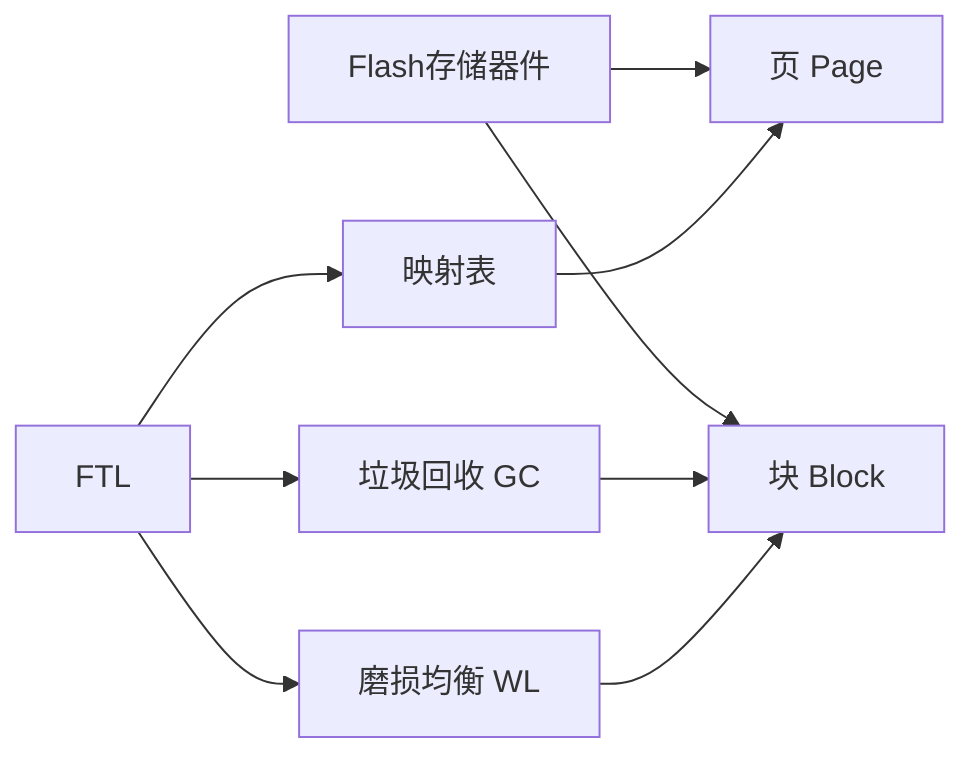

# SSD原理与代码实例讲解

## 1. 背景介绍

### 1.1 问题的由来
随着大数据时代的到来,海量数据的存储和高效访问成为了一个巨大的挑战。传统的机械硬盘(HDD)虽然容量大,但是访问速度较慢,难以满足实时数据处理的需求。固态硬盘(Solid State Drive, SSD)技术的出现,为解决这一问题提供了新的思路。

### 1.2 研究现状
近年来,SSD技术得到了广泛的研究和应用。各大存储厂商纷纷推出了自己的SSD产品,在服务器、个人电脑等领域得到了大量部署。同时,学术界也对SSD的原理和优化技术开展了深入研究,取得了丰硕的成果。

### 1.3 研究意义
深入理解SSD的工作原理,对于存储系统的设计优化具有重要意义。通过分析SSD的内部架构、数据组织方式、读写控制机制等,可以最大限度地发挥SSD的性能优势,提升数据存取效率。同时,面向SSD特性进行应用程序设计和优化,也是提升系统整体性能的关键。

### 1.4 本文结构
本文将从SSD的核心概念出发,系统地介绍SSD的原理和关键技术。内容涵盖SSD的整体架构、Flash存储器件原理、FTL映射管理、垃圾回收机制、磨损均衡等。同时,本文还将给出SSD读写控制的代码实例,并详细解读其实现原理。最后,本文也将探讨SSD技术的实际应用场景和未来的发展趋势。

## 2. 核心概念与联系

在深入探讨SSD原理之前,有必要对其涉及的核心概念进行必要的说明:

- Flash存储器件:SSD的核心存储介质,以NAND Flash为主,具有非易失、可重复擦写等特点。
- 页(Page):Flash存储器件的基本读写单位,通常为4KB或8KB。
- 块(Block):Flash存储器件的基本擦除单位,通常由64/128个页组成。
- FTL(Flash Translation Layer):Flash转换层,负责将逻辑地址映射到物理地址,并管理Flash的读写操作。
- 映射表:FTL用于记录逻辑页与物理页映射关系的数据结构。
- 垃圾回收(GC):由于Flash只能按块擦除,需要通过GC将无效页回收以释放可用空间。
- 磨损均衡(Wear Leveling):平衡Flash各个块的擦写次数,延长SSD的使用寿命。

下图描述了SSD的核心概念之间的联系:



从图中可以看出,Flash存储器件是SSD的物理基础,其上层的FTL负责管理Flash的读写操作和地址映射,并通过垃圾回收和磨损均衡保证SSD的可靠性和寿命。

## 3. 核心算法原理 & 具体操作步骤

### 3.1 算法原理概述
SSD的核心算法主要体现在FTL的设计上。FTL需要在有限的资源下,高效地完成逻辑地址到物理地址的转换,合理安排Flash的读写操作,并及时进行垃圾回收和磨损均衡。目前主流的FTL算法包括:

- 页级映射(Page Mapping):为每个逻辑页建立独立的映射表项,可以灵活地将逻辑页映射到任意物理页。
- 块级映射(Block Mapping):将逻辑块映射到物理块,映射粒度较粗,转换开销小但灵活性不足。
- 混合映射(Hybrid Mapping):结合页级映射和块级映射的优点,对热数据采用页映射,冷数据采用块映射。
- 日志结构映射(Log-Structured Mapping):将数据顺序地追加写入Log块,通过GC整理数据。

### 3.2 算法步骤详解
以页级映射算法为例,其核心步骤如下:

1. 初始化映射表,建立逻辑页到物理页的空映射。
2. 接收来自上层的读写请求,根据逻辑地址查询映射表获得物理地址。 
3. 对于读请求,直接从Flash读取对应物理页数据;对于写请求,先找到一个空闲物理页,写入数据,再更新映射表。
4. 当空闲物理页数量低于阈值时,触发GC操作:
   - 选择一个块,将其中的有效页复制到其他块。
   - 擦除该块,将其加入空闲块列表。
5. 定期触发磨损均衡,将写操作均匀分散到各个块上。
6. 重复步骤2~5,直到所有请求处理完毕。

### 3.3 算法优缺点
页级映射算法的优点是:
- 映射粒度小,可以灵活地将逻辑页映射到任意物理页。
- 写操作只需要更新页映射表,开销较小。
- 支持随机写,适合频繁更新的数据。

但其缺点也较为明显:
- 映射表占用内存空间大,成本较高。
- GC操作需要复制大量有效页,I/O开销大。
- 映射表缓存未命中时,需要从Flash读取映射表,延迟较大。

### 3.4 算法应用领域
FTL算法广泛应用于各类SSD中,包括企业级SSD、消费级SSD、嵌入式SSD等。不同的应用场景对FTL算法有不同的要求,需要根据具体需求选择合适的算法。例如:
- 数据库应用中,需要频繁进行随机小块写操作,适合使用页级映射。
- 视频监控应用中,以顺序写为主,数据更新较少,适合使用块级映射。
- 移动设备应用中,内存资源有限,适合使用混合映射,兼顾性能与成本。

## 4. 数学模型和公式 & 详细讲解 & 举例说明

### 4.1 数学模型构建
为了定量分析SSD的性能,可以建立一个简化的数学模型。假设SSD有$N$个物理块,每个块有$P$个页,读写一个页的时间为$T_r$和$T_w$,擦除一个块的时间为$T_e$。

定义写放大系数$WAF$为实际写入Flash的数据量与应用写入数据量之比:

$$
WAF = \frac{D_{flash}}{D_{app}} = 1 + \frac{D_{gc}}{D_{app}}
$$

其中$D_{flash}$为实际写入Flash的数据量,$D_{app}$为应用写入的数据量,$D_{gc}$为GC过程中迁移的有效数据量。

假设SSD的平均写入速度为$V_w$,则有:

$$
V_w = \frac{D_{app}}{D_{app} \cdot T_w + D_{gc} \cdot (T_r+T_w) + \frac{D_{flash}}{P} \cdot T_e}
$$

可见,写放大和GC开销会显著影响SSD的写入性能。

### 4.2 公式推导过程
为了证明上述公式,我们从SSD的工作过程出发进行推导。

首先,根据$WAF$的定义,有:

$$
D_{flash} = D_{app} + D_{gc}
$$

对于每个块的擦除操作,其触发条件是该块中的有效页数小于某个阈值$P_t$。假设写操作均匀分布到各个块上,则平均每写入$\frac{P}{P_t}$个页就需要进行一次GC操作。而每次GC需要迁移$(P-P_t)$个有效页,因此有:

$$
D_{gc} = \frac{D_{flash}}{P} \cdot (P-P_t)
$$

结合上式与$WAF$的定义,可得:

$$
WAF = 1 + \frac{P-P_t}{P_t}
$$

最后,考虑SSD的实际写入过程。应用每写入$D_{app}$数据,实际需要写入$D_{flash}$数据到Flash,同时需要进行$\frac{D_{flash}}{P}$次GC操作,每次GC需要读出$(P-P_t)$个页并重新写入。因此,总写入时间为:

$$
T = D_{app} \cdot T_w + D_{gc} \cdot (T_r+T_w) + \frac{D_{flash}}{P} \cdot T_e
$$

由此即可得到平均写入速度$V_w$的表达式。

### 4.3 案例分析与讲解
下面我们通过一个具体的例子来说明SSD的性能分析。假设一个SSD有1024个物理块,每个块有128个页,读写一个页的时间分别为50us和500us,擦除一个块的时间为2ms。应用需要写入1TB数据,GC阈值$P_t$取32。

根据公式,写放大系数为:

$$
WAF = 1 + \frac{128-32}{32} = 4
$$

实际需要写入Flash的数据量为:

$$
D_{flash} = 1TB \times 4 = 4TB
$$

GC过程中需要迁移的数据量为:

$$
D_{gc} = \frac{4TB}{128} \times (128-32) = 3TB
$$

写入1TB数据的总时间为:

$$
\begin{aligned}
T &= 1TB \times 500us + 3TB \times (50us+500us) + \frac{4TB}{128} \times 2ms \\
  &= 500s + 1650s + 62.5s \\
  &= 2212.5s
\end{aligned}
$$

因此,平均写入速度为:

$$
V_w = \frac{1TB}{2212.5s} = 452MB/s
$$

可见,由于写放大和GC开销的影响,SSD的实际写入速度远低于其原始写入速度(1/500us=2GB/s)。

### 4.4 常见问题解答
问题1:SSD的写入速度为什么会远低于其原始写入速度?

答:这主要是由于SSD的写放大效应和GC操作开销导致的。写放大是指实际写入Flash的数据量大于应用写入的数据量,这是由于SSD的擦除粒度(块)大于写入粒度(页)导致的。而GC操作需要迁移大量有效页,其读写开销进一步降低了SSD的写入速度。

问题2:是否可以完全避免SSD的写放大?

答:理论上,如果应用的写操作粒度与SSD的擦除粒度完全匹配,且写操作可以均匀分布到各个块上,则可以避免写放大。但在实际应用中,这两个条件往往难以满足。因此,写放大在一定程度上是不可避免的,我们只能通过优化FTL算法和参数来尽量降低写放大程度。

问题3:SSD的GC操作什么时候触发?

答:SSD的GC操作通常在空闲物理页数量低于某个阈值时触发。这个阈值需要根据SSD的容量、工作负载特性等因素进行设置。如果阈值设置过高,会频繁触发GC,影响性能;如果阈值设置过低,可能出现无可用物理页的情况,导致SSD停止服务。因此,GC阈值的选取需要在性能和可靠性之间进行权衡。

## 5. 项目实践:代码实例和详细解释说明

下面我们给出一个简单的SSD读写控制模块的代码实例,并对其进行详细解释。该模块基于页级映射算法,支持对SSD进行读写和GC操作。

### 5.1 开发环境搭建
本代码实例使用C++语言编写,在Linux环境下进行编译和测试。读者需要安装g++编译器和make工具。

### 5.2 源代码详细实现

```cpp
#include <iostream>
#include <vector>
#include <unordered_map>
using namespace std;

const int PAGE_SIZE = 4096;      // 页大小
const int PAGES_PER_BLOCK = 64;  // 每个块的页数
const int GC_THRESHOLD = 32;     // GC阈值

// 物理页结构体
struct PhysicalPage {
    int block_id;   // 所属块号
    int page_id;    // 页号
    bool is_valid;  // 是否有效
};

// SSD类定义
class SSD {
public:
    SSD(int n_blocks) : n_blocks_(n_blocks) {
        // 初始化物理页
        for (int i = 0;