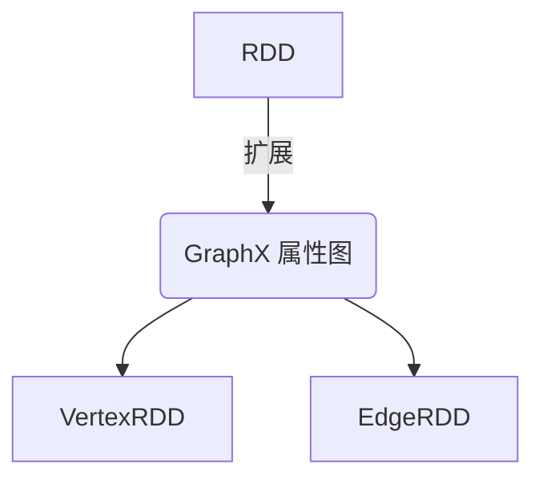
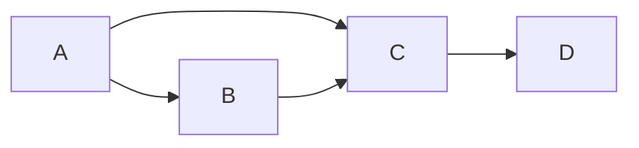

# Spark GraphX原理与代码实例讲解

## 1. 背景介绍

### 1.1 问题的由来

在当今大数据时代，图形数据处理成为了一个越来越重要的话题。从社交网络分析到基因组学研究,再到网络安全和推荐系统,图形数据无处不在。传统的关系数据库系统在处理图形数据时存在诸多瓶颈,如查询低效、扩展性差等,无法满足大规模图形数据处理的需求。因此,一种高效、可扩展的大规模图形并行计算框架应运而生。

### 1.2 研究现状

近年来,随着大数据技术的快速发展,一些图形并行计算框架相继问世,如Pregel、GraphLab、Giraph等。然而,这些框架要么缺乏容错机制,要么扩展性有限。Apache Spark作为当前最热门的大数据处理框架之一,提供了GraphX作为其图形并行计理组件,旨在解决上述问题。

### 1.3 研究意义

GraphX将Spark的弹性分布式数据集(RDD)抽象扩展到了图形结构,并提供了一组高度优化的图形运算符,使得开发者能够以熟悉的Spark编程模型高效地表达图形计算。GraphX不仅具有Spark的容错性和可伸缩性,还支持图形视图和图形聚合等高级功能。因此,深入研究GraphX的原理和实践对于理解大规模图形并行计算至关重要。

### 1.4 本文结构

本文将首先介绍GraphX的核心概念及其与RDD的联系。接着详细阐述GraphX的核心算法原理和数学模型,并结合代码实例进行说明。然后探讨GraphX在实际应用中的场景,并推荐相关工具和学习资源。最后总结GraphX的发展趋势和面临的挑战。

## 2. 核心概念与联系

在了解GraphX之前,我们需要先理解Spark的核心抽象RDD(Resilient Distributed Dataset)。RDD是一个不可变、分区的记录集合,可以并行操作。GraphX将RDD的概念扩展到了属性图(Property Graph),即具有属性的顶点和边集合。

GraphX中的属性图由两个RDD组成:

- 顶点RDD(VertexRDD): `RDD[(VertexId, VD)]`,其中`VertexId`是顶点ID,`VD`是顶点属性值的类型。
- 边RDD(EdgeRDD): `RDD[Edge[ED]]`,其中`Edge`是一个边对象,包含源顶点ID、目标顶点ID和边属性值`ED`。

用户可以通过`Graph`对象操作属性图,`Graph`对象包装了顶点RDD和边RDD,并提供了一组图形运算符,如`mapVertices`、`mapEdges`等。这些运算符可以并行作用于顶点或边,并生成新的RDD。



通过将图形数据抽象为RDD,GraphX可以继承Spark的容错性和可扩展性。同时,GraphX还提供了一组优化的图形运算符和图形视图等高级功能,使得图形计算更加高效和方便。

## 3. 核心算法原理 & 具体操作步骤  

### 3.1 算法原理概述

GraphX的核心算法原理基于"顶点程序"(Vertex Program)模型,该模型由图形处理系统Pregel提出。顶点程序的基本思想是将用户定义的程序并行运行在每个顶点上,顶点之间通过消息传递协同工作,最终收敛到解。

在GraphX中,顶点程序的执行过程分为多个超步(superstep)。每个超步包括三个阶段:

1. **vertexProgram**:并行运行在每个顶点上的用户定义函数。
2. **sendMsg**:每个顶点根据上一步的计算结果向其他顶点发送消息。
3. **mergeMsg**:接收其他顶点发来的消息,并合并到自身状态。

上述过程反复迭代,直到满足用户定义的终止条件。

### 3.2 算法步骤详解

我们以GraphX中的"PageRank"算法为例,详细解释顶点程序的执行步骤:

1. **初始化**:将每个顶点的PageRank值初始化为1/N(N为顶点总数)。

2. **vertexProgram**:计算每个顶点发送到其他顶点的PageRank值:`PR(v)/outDegree(v)`。

3. **sendMsg**:将上一步计算的值发送给每个出边的目标顶点。

4. **mergeMsg**:接收其他顶点发来的PageRank值,并与自身的PageRank值累加。

5. **判断终止条件**:如果PageRank值收敛(变化小于阈值),则终止;否则转到步骤2,进入下一个超步。

以上即为PageRank算法在GraphX中的实现过程。我们可以看到,顶点程序模型将复杂的图形算法转化为顶点级别的简单计算和消息传递,极大地降低了并行化的难度。

### 3.3 算法优缺点

**优点**:

- **自然并行**:顶点程序模型将计算自然地分解到顶点级别,易于并行化。
- **容错性**:继承Spark的RDD容错机制,可以从节点故障中恢复。
- **通用性**:适用于各种图形算法,如PageRank、连通分量、最短路径等。

**缺点**:

- **消息开销**:大量的消息传递会带来额外的开销。
- **收敛速度**:某些算法的收敛速度较慢,需要多个超步才能收敛。
- **内存限制**:大规模图形可能会导致内存不足。

### 3.4 算法应用领域

GraphX的顶点程序模型适用于各种图形计算场景,包括但不限于:

- **社交网络分析**:计算PageRank、社区发现等。
- **Web信息检索**:构建网页链接图,计算网页重要性。  
- **推荐系统**:基于用户/物品的协同过滤图。
- **交通网络**:道路网络分析,寻找最短路径。
- **生物信息学**:构建基因调控网络,分析蛋白质相互作用。

总的来说,任何需要对大规模图形数据进行分析的场景,都可以使用GraphX的并行计算能力提高效率。

## 4. 数学模型和公式 & 详细讲解 & 举例说明

### 4.1 数学模型构建

为了更好地理解GraphX的核心算法,我们需要建立相应的数学模型。在图论中,一个图$G$可以表示为$G=(V, E)$,其中$V$是顶点集合,$ E\subseteq V \times V$是边集合。

在GraphX中,属性图的数学表示为$G=(V, E, \phi, \psi)$,其中:

- $V$是顶点集合
- $E \subseteq V \times V$是边集合 
- $\phi: V \rightarrow D_V$是顶点属性函数,将顶点映射到属性值域$D_V$
- $\psi: E \rightarrow D_E$是边属性函数,将边映射到属性值域$D_E$

该模型将图形结构与属性值相结合,为图形算法的设计和分析提供了理论基础。

### 4.2 公式推导过程

接下来,我们以PageRank算法为例,推导其数学公式。PageRank算法旨在计算网页的重要性分数,其基本思想是:一个网页的重要性取决于链接到它的其他网页的重要性分数之和。

设$PR(v)$表示顶点$v$的PageRank值,则PageRank公式可以表示为:

$$PR(v) = \frac{1-d}{N} + d \sum_{u \in \mathcal{B}_v} \frac{PR(u)}{L(u)}$$

其中:

- $N$是图$G$中顶点的总数
- $d$是一个阻尼系数,通常取值0.85
- $\mathcal{B}_v$是所有链接到$v$的顶点集合
- $L(u)$是顶点$u$的出度(出边数量)

该公式可以理解为:一个网页的PageRank值由两部分组成。第一部分$(1-d)/N$是所有网页的默认初始重要性分数。第二部分是从链接到该网页的其他网页的重要性分数的贡献,且贡献大小与链接网页自身的重要性分数和出度成反比。

通过不断迭代更新每个顶点的PageRank值,直到收敛,我们就可以得到网页的最终重要性排名。

### 4.3 案例分析与讲解

为了更好地理解PageRank算法,我们用一个简单的示例进行说明。假设有一个小型网络,包含4个网页(A、B、C、D),它们之间的链接关系如下图所示:



我们将PageRank公式应用于该网络,并假设阻尼系数$d=0.85$,初始PageRank值都为0.25。经过几次迭代后,各网页的PageRank值将收敛为:

- $PR(A) = 0.2775$
- $PR(B) = 0.1375$  
- $PR(C) = 0.475$
- $PR(D) = 0.1375$

从结果可以看出,网页C拥有最高的PageRank值,因为它被A和B两个重要网页链接。而D虽然只被C链接,但由于C的重要性较高,所以D的PageRank值也相对较高。

该案例说明了PageRank算法能够很好地捕捉网页之间的链接关系,并合理地评估网页的重要性。通过GraphX的并行计算能力,我们可以高效地在大规模网络上执行PageRank算法。

### 4.4 常见问题解答

**Q: PageRank算法是否考虑了网页内容的重要性?**

A: 不,PageRank算法只考虑了网页之间的链接结构,而没有涉及网页内容本身。评估网页内容质量需要结合其他算法,如文本挖掘等。

**Q: 如何处理环形链接和死链接的情况?**

A: 环形链接会导致PageRank值无限循环,无法收敛。而死链接(没有任何出边的顶点)会导致其PageRank值一直为0。因此,PageRank公式中引入了阻尼系数$d$,将一部分PageRank值平均分配给所有顶点,避免了上述问题。

**Q: PageRank算法的时间复杂度是多少?**

A: 理论上,PageRank算法需要$O(\log(1/\epsilon))$次迭代才能收敛,其中$\epsilon$是收敛阈值。每次迭代的时间复杂度为$O(|V|+|E|)$,即顶点数加边数。因此,总的时间复杂度为$O((|V|+|E|)\log(1/\epsilon))$。在GraphX的并行实现中,时间复杂度会进一步降低。

## 5. 项目实践:代码实例和详细解释说明

### 5.1 开发环境搭建

要在Spark中使用GraphX,我们首先需要正确配置开发环境。以下是在基于Scala的SBT项目中配置GraphX的步骤:

1. 在`project/assembly.sbt`文件中添加Spark和GraphX依赖:

```scala
addSbtPlugin("com.eed3si9n" % "sbt-assembly" % "0.14.10")

val sparkVersion = "3.0.0"

libraryDependencies ++= Seq(
  "org.apache.spark" %% "spark-core" % sparkVersion,
  "org.apache.spark" %% "spark-sql" % sparkVersion,
  "org.apache.spark" %% "spark-graphx" % sparkVersion
)
```

2. 在`build.sbt`文件中启用程序集插件:

```scala
enablePlugins(JavaAppPackaging)
```

完成上述配置后,我们就可以开始GraphX的编程实践了。

### 5.2 源代码详细实现

下面是一个使用GraphX实现PageRank算法的Scala示例代码:

```scala
import org.apache.spark.graphx._
import org.apache.spark.rdd.RDD
import org.apache.log4j.Logger
import org.apache.log4j.Level

object PageRank {

  def main(args: Array[String]): Unit = {
    // 设置日志级别
    Logger.getLogger("org").setLevel(Level.ERROR)
    
    // 创建SparkContext
    val sc = new SparkContext("local[*]", "PageRank")
    
    // 构建图
    val vertices: RDD[(VertexId,