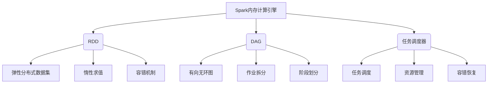
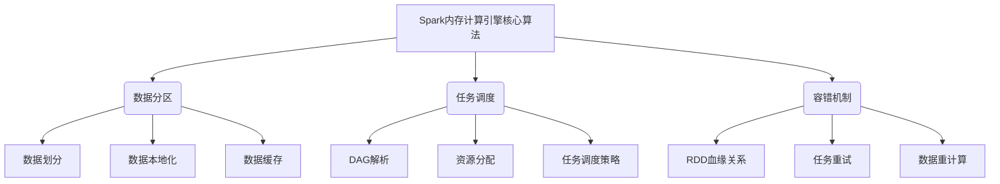

# Spark内存计算引擎原理与代码实例讲解

## 1. 背景介绍

### 1.1 问题的由来

在大数据时代,海量数据的存储和处理成为了一个巨大的挑战。传统的基于磁盘的数据处理系统由于频繁的磁盘I/O操作,导致处理效率低下。为了提高数据处理的效率,内存计算应运而生。Apache Spark作为一种新兴的内存计算框架,凭借其优秀的性能和丰富的功能,在大数据领域备受青睐。

### 1.2 研究现状

Apache Spark是一个开源的大数据处理框架,它基于内存计算模型,可以高效地处理海量数据。Spark的核心是弹性分布式数据集(Resilient Distributed Dataset,RDD),它是一种分布式内存抽象,能够有效地缓存数据并支持并行计算。Spark不仅提供了丰富的API,还支持多种编程语言,如Scala、Java、Python和R,使得开发者可以更加灵活地进行大数据处理。

### 1.3 研究意义

深入研究Spark内存计算引擎的原理对于提高大数据处理效率具有重要意义。通过掌握Spark内存计算的核心概念和算法原理,开发者可以更好地利用Spark进行高效的数据处理,从而满足各种复杂的大数据应用场景。此外,了解Spark内存计算引擎的实现细节也有助于开发者进行性能优化和故障排查。

### 1.4 本文结构

本文将全面介绍Spark内存计算引擎的原理和实现细节。首先,我们将探讨Spark内存计算的核心概念,如RDD、DAG和任务调度等。接下来,我们将深入剖析Spark内存计算引擎的核心算法原理,包括数据分区、任务调度和容错机制等。然后,我们将介绍Spark内存计算引擎的数学模型和公式推导过程,并通过实例进行详细讲解。此外,我们还将提供一个完整的代码实例,并对其进行深入解读和分析。最后,我们将探讨Spark内存计算引擎在实际应用场景中的应用,并总结其未来发展趋势和面临的挑战。

## 2. 核心概念与联系

Spark内存计算引擎的核心概念包括RDD(Resilient Distributed Dataset)、DAG(Directed Acyclic Graph)和任务调度器(Task Scheduler)等。

### 2.1 RDD

RDD(Resilient Distributed Dataset)是Spark内存计算引擎的核心数据结构,它是一种分布式内存抽象,能够有效地缓存数据并支持并行计算。RDD具有以下特点:

- **弹性分布式数据集**:RDD是一个逻辑分区的数据集,分布在集群的多个节点上,支持数据并行处理。
- **惰性求值**:RDD的转换操作(如map、filter等)是惰性的,只有在需要计算结果时才会真正执行。
- **容错机制**:RDD通过记录数据的血缘关系(lineage),可以在出现故障时重新计算丢失的数据分区。

### 2.2 DAG

DAG(Directed Acyclic Graph)是Spark内存计算引擎用于表示作业执行流程的有向无环图。Spark将用户提交的作业拆分为多个阶段(Stage),每个阶段由一系列任务(Task)组成。这些任务之间的依赖关系形成了一个DAG。Spark通过解析DAG,可以高效地调度和执行任务。

### 2.3 任务调度器

任务调度器(Task Scheduler)是Spark内存计算引擎的核心组件之一,负责管理和调度集群资源,以及执行任务。它包括以下主要功能:

- **任务调度**:根据DAG和集群资源情况,合理地调度和分发任务。
- **资源管理**:管理和分配集群资源,如CPU、内存等,以确保任务高效执行。
- **容错恢复**:当发生故障时,通过RDD的血缘关系重新计算丢失的数据分区,实现容错恢复。

## 3. 核心算法原理 & 具体操作步骤

### 3.1 算法原理概述

Spark内存计算引擎的核心算法原理包括数据分区、任务调度和容错机制等。

### 3.2 算法步骤详解

#### 3.2.1 数据分区

1. **数据划分**:Spark将输入数据划分为多个逻辑分区(Partition),这些分区分布在集群的不同节点上,支持并行计算。
2. **数据本地化**:Spark采用数据本地化策略,尽可能将计算任务调度到存储数据的节点上,减少数据传输开销。
3. **数据缓存**:Spark可以将中间计算结果缓存在内存中,避免重复计算,提高处理效率。

#### 3.2.2 任务调度

1. **DAG解析**:Spark将用户提交的作业转换为DAG(有向无环图),表示作业的执行流程。
2. **资源分配**:根据集群资源情况和任务优先级,合理地分配CPU、内存等资源。
3. **任务调度策略**:Spark采用多种调度策略,如FIFO、Fair Scheduler等,根据策略将任务分发到不同的Executor上执行。

#### 3.2.3 容错机制

1. **RDD血缘关系**:Spark通过记录RDD的血缘关系(lineage),可以在发生故障时重新计算丢失的数据分区。
2. **任务重试**:对于失败的任务,Spark会自动重试一定次数,以尝试恢复故障。
3. **数据重计算**:如果任务重试仍然失败,Spark会根据RDD的血缘关系,重新计算丢失的数据分区。

### 3.3 算法优缺点

#### 3.3.1 优点

- **高效并行计算**:Spark通过数据分区和任务并行执行,可以充分利用集群资源,提高计算效率。
- **容错性强**:基于RDD的血缘关系和任务重试机制,Spark具有良好的容错能力。
- **灵活性高**:Spark支持多种编程语言和丰富的API,可以满足不同的应用场景需求。

#### 3.3.2 缺点

- **内存开销大**:Spark需要将大量数据缓存在内存中,对内存资源的需求较高。
- **延迟较高**:由于需要构建DAG和调度任务,Spark在处理小数据集时可能会产生较高的延迟。
- **容错机制复杂**:基于RDD血缘关系的容错机制相对复杂,可能会影响性能。

### 3.4 算法应用领域

Spark内存计算引擎的算法适用于以下领域:

- **大数据处理**:Spark可以高效地处理海量数据,如日志分析、网络数据挖掘等。
- **机器学习**:Spark提供了MLlib库,支持分布式机器学习算法的实现和优化。
- **流式计算**:Spark Streaming可以实时处理来自各种数据源的流式数据。
- **图计算**:Spark GraphX支持图数据的并行处理和分析。

## 4. 数学模型和公式 & 详细讲解 & 举例说明

### 4.1 数学模型构建

在Spark内存计算引擎中,我们可以构建一个数学模型来描述RDD的转换操作和容错机制。假设有一个RDD $R$,经过一系列转换操作后得到新的RDD $R'$,可以表示为:

$$R' = f_n(f_{n-1}(...f_2(f_1(R))))$$

其中,$ f_1, f_2, ..., f_n $表示一系列转换操作,如map、filter等。

为了实现容错,Spark记录了RDD的血缘关系(lineage),即每个RDD是如何从初始RDD经过一系列转换操作得到的。假设RDD $R$的血缘关系为:

$$R = g_m(g_{m-1}(...g_2(g_1(S))))$$

其中,$ g_1, g_2, ..., g_m $表示一系列转换操作,$ S $是初始RDD。

如果RDD $R$的某个分区丢失,Spark可以根据血缘关系重新计算该分区:

$$R_i = g_m(g_{m-1}(...g_2(g_1(S_i))))$$

其中,$ R_i $表示RDD $R$的第i个分区,$ S_i $表示初始RDD $S$的第i个分区。

### 4.2 公式推导过程

我们可以推导出RDD转换操作的数学表达式。假设有一个RDD $R$,经过map操作后得到新的RDD $R'$,其中map操作的函数为$f$,则:

$$R' = R.map(f)$$

对于每个元素$x \in R$,有:

$$y = f(x), y \in R'$$

因此,我们可以将map操作表示为:

$$R' = \{f(x) | x \in R\}$$

类似地,我们可以推导出filter操作的数学表达式。假设有一个RDD $R$,经过filter操作后得到新的RDD $R'$,其中filter操作的条件函数为$p$,则:

$$R' = R.filter(p)$$

对于每个元素$x \in R$,如果满足条件$p(x)$,则保留在$R'$中,否则被过滤掉。因此,我们可以将filter操作表示为:

$$R' = \{x | x \in R, p(x) = true\}$$

### 4.3 案例分析与讲解

假设我们有一个包含整数的RDD $R$,我们希望对其进行一系列转换操作,得到一个只包含偶数的RDD $R'$。

首先,我们定义一个map函数$f(x) = x * 2$,将每个元素乘以2:

$$R_1 = R.map(f) = \{x * 2 | x \in R\}$$

然后,我们定义一个filter函数$p(x) = x \% 2 == 0$,过滤掉所有奇数:

$$R' = R_1.filter(p) = \{x | x \in R_1, x \% 2 == 0\}$$

我们可以将上述转换操作合并为一个表达式:

$$R' = \{x * 2 | x \in R, (x * 2) \% 2 == 0\}$$

这个表达式描述了从初始RDD $R$经过map和filter操作后得到的RDD $R'$,它只包含初始RDD中所有偶数的两倍。

如果RDD $R'$的某个分区丢失,Spark可以根据血缘关系重新计算该分区:

$$R'_i = \{x * 2 | x \in R_i, (x * 2) \% 2 == 0\}$$

其中,$ R_i $表示初始RDD $R$的第i个分区。

### 4.4 常见问题解答

**Q: 为什么Spark需要记录RDD的血缘关系?**

A: Spark需要记录RDD的血缘关系(lineage)是为了实现容错机制。当某个RDD的分区丢失时,Spark可以根据血缘关系重新计算该分区,而不需要从头开始重新计算整个RDD。这种基于血缘关系的容错机制提高了Spark的可靠性和容错能力。

**Q: Spark如何确定重新计算丢失分区的优先级?**

A: Spark采用一种基于成本模型的优先级调度策略。当需要重新计算丢失分区时,Spark会估算每个分区的计算成本,并优先执行成本较低的分区。这种策略可以提高容错恢复的效率。