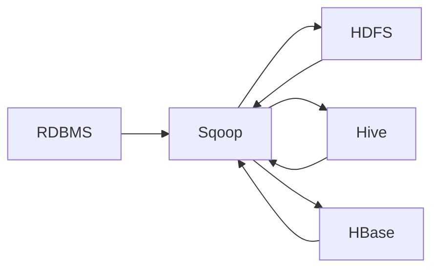

# Sqoop导入导出原理与代码实例讲解

关键词：Sqoop, 大数据, 数据导入导出, HDFS, Hive, HBase, 关系型数据库, MySQL

## 1. 背景介绍
### 1.1 问题的由来
在大数据时代,海量数据的存储和处理是每个企业都需要面对的问题。企业的数据通常存储在传统的关系型数据库中,如MySQL、Oracle等。但是,当数据量急剧增长时,关系型数据库无法满足大数据处理的需求。因此,将数据从关系型数据库迁移到Hadoop生态系统中进行存储和分析处理,成为大数据应用的必经之路。

### 1.2 研究现状
目前,业界主流的数据迁移和交换工具包括Sqoop、Kettle、DataX等。其中,Sqoop是Apache旗下的一款开源工具,专门用于在Hadoop(HDFS)与传统关系型数据库间进行数据的导入和导出。Sqoop采用MapReduce框架进行数据传输,可以高效地实现海量数据的批量迁移。

### 1.3 研究意义
深入研究Sqoop的工作原理和使用方法,对于掌握大数据项目的数据采集和交换具有重要意义。通过学习Sqoop,可以帮助我们:
1. 了解如何将关系型数据库中的数据导入到HDFS、Hive、HBase等Hadoop组件中。
2. 掌握如何将HDFS、Hive中的数据导出到关系型数据库中。
3. 学会如何在Shell命令行和Java代码中使用Sqoop API执行数据传输任务。
4. 理解Sqoop底层的工作机制,为优化数据传输性能提供理论基础。

### 1.4 本文结构
本文将从以下几个方面对Sqoop展开深入探讨:
- 第2部分：介绍Sqoop的核心概念与架构设计
- 第3部分：讲解Sqoop导入导出数据的工作原理和操作步骤
- 第4部分：对Sqoop底层使用的数据抽取算法进行数学建模和公式推导
- 第5部分：通过代码实例演示如何使用Sqoop进行数据导入导出
- 第6部分：总结Sqoop在实际项目中的应用场景
- 第7部分：推荐Sqoop相关的学习资源和开发工具
- 第8部分：展望Sqoop未来的发展趋势和面临的挑战
- 第9部分：罗列使用Sqoop常见的问题和解决方案

## 2. 核心概念与联系
在正式介绍Sqoop的工作原理之前,我们先来了解一下Sqoop的几个核心概念:
- Sqoop连接器(Connector):用于与外部存储系统交互的组件,如JDBC连接器、HDFS连接器等。
- Sqoop作业(Job):使用Sqoop把数据在源端系统和目标系统之间传输的任务。
- 数据导入:将数据从关系型数据库等外部存储导入到HDFS、Hive、HBase等Hadoop组件的过程。 
- 数据导出:将数据从HDFS、Hive等Hadoop组件导出到关系型数据库等外部存储的过程。

下图展示了Sqoop的架构设计和数据流转:



从图中可以看出:
1. Sqoop位于RDBMS和Hadoop组件之间,起到了数据交换的桥梁作用。
2. Sqoop可以将RDBMS中的数据导入到HDFS、Hive、HBase等Hadoop组件中。
3. Sqoop也可以将HDFS、Hive中的数据导出到RDBMS等外部存储系统中。

## 3. 核心算法原理 & 具体操作步骤
### 3.1 算法原理概述
Sqoop在导入导出数据时,底层是通过MapReduce来实现的。具体来说:
- 导入数据时,Sqoop将一个导入Job分解成多个Map任务,每个Map负责从关系型数据库中并行抽取一部分数据。
- 导出数据时,Sqoop将一个导出Job分解成多个Map任务,每个Map负责将HDFS文件的一部分数据写入到关系型数据库中。

可见,Sqoop巧妙地利用了MapReduce的并行计算能力,从而实现了高效的数据传输。

### 3.2 算法步骤详解
下面我们以从MySQL导入数据到HDFS为例,讲解Sqoop的工作流程:
1. 通过Sqoop命令行参数指定源数据库的连接信息,包括JDBC URL、用户名、密码、数据库名、表名等。
2. 根据指定的切分列将数据均匀地划分成多个分区,每个分区对应一个Map任务。
3. 启动MapReduce Job,为每个分区创建一个Map任务。
4. 每个Map任务通过JDBC连接从关系型数据库的对应分区抽取数据。
5. 将抽取的数据写入HDFS,每个Map任务生成一个结果文件。
6. Job执行完毕后,多个结果文件合并成最终的HDFS文件。

### 3.3 算法优缺点
Sqoop基于MapReduce的数据传输机制有以下优点:
- 采用批处理模式,适合一次性迁移大批量数据。
- 利用MapReduce实现并行抽取和写入,传输效率高。
- 支持多种关系型数据库和Hadoop组件,适应性强。
- 使用简单,通过命令行参数即可完成配置。

但是,Sqoop也存在一些局限性:
- 只支持全量导入导出,不支持增量传输。
- 由于基于MapReduce,实时性不够好,不适合流式数据的迁移。
- 容错性不够完善,任务失败后无法断点续传。

### 3.4 算法应用领域
Sqoop主要应用在以下场景:
- 数据仓库ETL:将业务数据从OLTP数据库导入Hadoop进行离线分析。
- 数据迁移:在不同Hadoop集群间迁移HDFS、Hive等组件的数据。
- 数据备份:将HDFS等Hadoop组件的数据备份到关系型数据库。

## 4. 数学模型和公式 & 详细讲解 & 举例说明
### 4.1 数学模型构建
我们可以使用矩阵乘法来对Sqoop的数据传输过程进行建模。假设:
- 关系型数据库中有 $m$ 条数据,每条数据有 $n$ 个字段
- 使用 $p$ 个Map任务进行并行导入
- 定义源数据矩阵 $A=[a_{ij}]_{m \times n}$,其中 $a_{ij}$ 表示第 $i$ 条记录的第 $j$ 个字段的值
- 定义布尔矩阵 $B=[b_{ik}]_{m \times p}$,其中 $b_{ik}=1$ 表示第 $i$ 条记录分配给第 $k$ 个Map任务,$b_{ik}=0$ 表示不分配
- 定义输出矩阵 $C=[c_{kj}]_{p \times n}$,其中 $c_{kj}$ 表示第 $k$ 个Map任务输出的第 $j$ 个字段的值

则Sqoop的数据导入过程可以表示为:

$$ C = B^T \times A $$

其中, $B^T$ 表示 $B$ 的转置矩阵。

### 4.2 公式推导过程
对于矩阵 $C$ 中的元素 $c_{kj}$,我们有:

$$ c_{kj} = \sum_{i=1}^{m} b_{ik} \times a_{ij} $$

这个公式表明,Map任务 $k$ 输出的第 $j$ 个字段的值,等于分配给该Map任务的所有记录的第 $j$ 个字段值的加和。

进一步地,矩阵 $C$ 的计算过程为:

$$
\begin{aligned}
C &= 
\begin{bmatrix}
b_{11} & b_{21} & \cdots & b_{m1} \\
b_{12} & b_{22} & \cdots & b_{m2} \\
\vdots & \vdots & \ddots & \vdots \\
b_{1p} & b_{2p} & \cdots & b_{mp}
\end{bmatrix}
\times
\begin{bmatrix}
a_{11} & a_{12} & \cdots & a_{1n} \\
a_{21} & a_{22} & \cdots & a_{2n} \\
\vdots & \vdots & \ddots & \vdots \\
a_{m1} & a_{m2} & \cdots & a_{mn}
\end{bmatrix} \\
&=
\begin{bmatrix}
\sum_{i=1}^{m} b_{i1} a_{i1} & \sum_{i=1}^{m} b_{i1} a_{i2} & \cdots & \sum_{i=1}^{m} b_{i1} a_{in} \\
\sum_{i=1}^{m} b_{i2} a_{i1} & \sum_{i=1}^{m} b_{i2} a_{i2} & \cdots & \sum_{i=1}^{m} b_{i2} a_{in} \\
\vdots & \vdots & \ddots & \vdots \\
\sum_{i=1}^{m} b_{ip} a_{i1} & \sum_{i=1}^{m} b_{ip} a_{i2} & \cdots & \sum_{i=1}^{m} b_{ip} a_{in}
\end{bmatrix}
\end{aligned}
$$

可见,矩阵 $B$ 决定了如何将 $m$ 条记录分配给 $p$ 个Map任务,进而决定了每个Map任务的输出。Sqoop会尽量保证分配均匀,避免数据倾斜。

### 4.3 案例分析与讲解
下面我们以一个简单的例子来说明Sqoop的数据导入过程。假设MySQL表中有6条记录,每条记录包含id和name两个字段:

```
+----+----------+
| id | name     |
+----+----------+
| 1  | Alice    |
| 2  | Bob      |
| 3  | Charlie  |
| 4  | David    |
| 5  | Eve      |
| 6  | Frank    |
+----+----------+
```

我们启动2个Map任务进行导入,则可以构造出以下矩阵:

$$
A = 
\begin{bmatrix}
1 & Alice \\
2 & Bob \\
3 & Charlie \\
4 & David \\
5 & Eve \\
6 & Frank
\end{bmatrix},
B =
\begin{bmatrix}
1 & 0 \\
1 & 0 \\
1 & 0 \\
0 & 1 \\
0 & 1 \\
0 & 1
\end{bmatrix}
$$

矩阵 $B$ 表示前3条记录分配给第1个Map任务,后3条记录分配给第2个Map任务。根据矩阵乘法可得:

$$
C = 
\begin{bmatrix}
1 & 0 \\
1 & 0 \\
1 & 0 \\
0 & 1 \\
0 & 1 \\
0 & 1
\end{bmatrix}^T
\times
\begin{bmatrix}
1 & Alice \\
2 & Bob \\
3 & Charlie \\
4 & David \\
5 & Eve \\
6 & Frank
\end{bmatrix}
=
\begin{bmatrix}
1+2+3 & Alice+Bob+Charlie \\
4+5+6 & David+Eve+Frank
\end{bmatrix}
$$

可见,第1个Map任务输出id为1~3的记录,第2个Map任务输出id为4~6的记录,最终在HDFS上生成两个结果文件。

### 4.4 常见问题解答
问题1:Sqoop支持哪些切分策略?
答:Sqoop支持多种切分策略,常用的有:
- 基于主键切分:根据表的主键将数据均匀切分到多个分区。
- 基于列值切分:根据指定列的取值范围将数据切分。
- 自定义切分:用户可以编写自定义切分器来控制数据的分配。

问题2:如何处理数据倾斜问题?
答:当某些分区的数据量远大于其他分区时,就会产生数据倾斜,导致少数Map任务执行时间很长。解决办法包括:
- 调整切分列:选择合适的切分列,尽量保证每个分区的数据量均匀。
- 使用采样:在启动Job前先对数据进行采样,根据采样结果动态调整分区边界。
- 过滤异常值:提前过滤掉一些异常的超大值,减少最大分区的数据量。

## 5. 项目实践：代码实例和详细解释说明