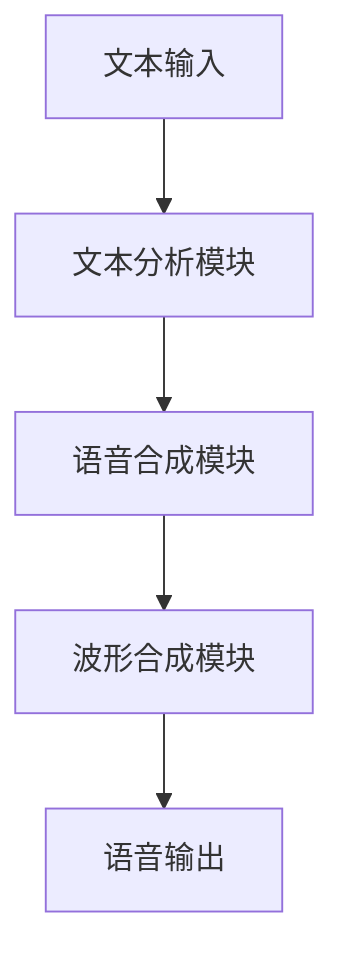

正文内容将在此开始：

# Text-to-Speech (TTS)原理与代码实例讲解

## 1. 背景介绍

### 1.1 问题的由来

在当今信息时代,人机交互已经成为不可或缺的一部分。随着人工智能和语音技术的快速发展,Text-to-Speech(TTS)技术应运而生,成为了一种重要的人机交互方式。TTS系统能够将任意文本转换为自然语音输出,为视障人士提供了获取信息的新渠道,也为智能助手、导航系统等场景带来了全新的体验。

然而,早期的TTS系统往往存在声音单调、不自然的问题,难以达到人耳的期望。随着深度学习技术的兴起,基于神经网络的TTS模型逐渐取代了传统的统计参数模型,语音质量得到了极大的提升,但也带来了新的挑战,如模型复杂度高、训练数据需求大等。

### 1.2 研究现状  

近年来,TTS领域取得了长足的进步,主流的TTS模型可以分为三大类:

1. **基于隐马尔可夫模型(HMM)的统计参数模型**:利用大量语音数据训练获得声学模型和语言模型的参数,再结合文本分析模块进行语音合成。这类模型计算复杂度低,但合成语音质量较差,难以达到自然度。

2. **基于深度神经网络的端到端模型**:使用序列到序列(Seq2Seq)模型直接从文本到语音的映射,如Tacotron、Transformer TTS等。这类模型合成语音质量自然,但需要大量高质量对话语料进行训练,模型复杂度高,推理速度较慢。

3. **基于神经音码器(Neural Vocoder)的模型**:将声学特征预测和波形合成任务分开,先由声学模型预测声学特征序列,再将其输入神经音码器生成语音波形,如WaveNet、WaveRNN、ParallelWaveGAN等。这种方法结合了上述两类模型的优点,语音质量自然,同时推理速度较快。

### 1.3 研究意义

高质量的TTS系统在多个领域具有重要的应用价值:

- **辅助工具**:为视障人士提供获取信息的新渠道,提高生活质量。
- **智能助手**:为智能音箱、手机助手等设备提供自然语音交互。
- **在线教育**:自动生成课程音频,提高教育资源的利用率。
- **车载导航**:为驾驶员提供语音导航服务,提高行车安全性。
- **数字阅读**:自动生成有声读物,提高信息获取的便利性。

因此,研究高质量的TTS系统,不仅可以推动人机交互领域的发展,也能为相关领域带来全新的应用体验。

### 1.4 本文结构

本文将全面介绍TTS技术的核心原理、算法细节和实践应用。具体内容安排如下:

- 第2部分介绍TTS系统的核心概念和模块,并说明各模块之间的联系。
- 第3部分重点讲解TTS系统中的核心算法原理和具体操作步骤。
- 第4部分将从数学角度出发,构建TTS模型的数学基础,并推导相关公式。
- 第5部分提供TTS系统的代码实例,并对关键实现细节进行解读和分析。  
- 第6部分介绍TTS技术在实际应用中的场景,并展望未来的发展方向。
- 第7部分总结TTS领域的学习资源、开发工具和相关论文等推荐内容。
- 第8部分对TTS技术的研究成果进行总结,并阐述未来的发展趋势和面临的挑战。
- 第9部分列举TTS领域的常见问题,并给出解答和建议。

## 2. 核心概念与联系

在深入讲解TTS系统的算法细节之前,我们先来了解一下TTS系统的核心概念和模块组成。一个典型的TTS系统通常包含以下几个主要模块:

1. **文本分析模块(Text Analysis)**:对输入的文本进行预处理,包括文本归一化、词语分割、词性标注、音位转换等步骤,将文本转换为语音合成模块可识别的符号序列。

2. **语音合成模块(Acoustic Model)**:是TTS系统的核心部分,接收文本分析模块的输出,根据训练好的模型参数,预测出对应的声学特征序列,如语音频谱、韵律、音高等。

3. **波形合成模块(Vocoder)**:将语音合成模块输出的声学特征序列转换为最终的语音波形,实现语音的数字化合成。常用的波形合成模块有Griffin-Lim、WORLD、WaveNet、WaveRNN等。

4. **其他模块**:除了上述三个核心模块,TTS系统还可能包含语音编码、声码器(Vocoder)等辅助模块,用于对合成语音进行编码、压缩等操作。

这几个模块有机地协同工作,将输入文本一步步转换为自然语音输出。其中,语音合成模块是决定语音质量的关键所在,也是本文的重点讨论对象。

## 3. 核心算法原理 & 具体操作步骤  

### 3.1 算法原理概述

TTS系统中的语音合成模块,主要任务是根据输入的文本序列,预测出对应的声学特征序列。早期的统计参数模型采用隐马尔可夫模型(HMM)、决策树等传统机器学习算法,但合成语音质量较差。

近年来,基于深度神经网络的端到端模型成为主流,能够直接从文本到声学特征的映射,大大提高了语音质量。常用的端到端模型有:

1. **Seq2Seq模型**:将语音合成任务看作是一个序列到序列的转换问题,使用编码器(Encoder)将输入文本编码为中间表示,解码器(Decoder)则根据中间表示生成声学特征序列。

2. **Transformer模型**:基于Self-Attention机制,避免了RNN的梯度消失问题,能够更好地捕捉长距离依赖关系,合成语音质量更加自然流畅。

3. **基于知识蒸馏(Knowledge Distillation)的模型**:利用教师模型(如Tacotron、Transformer等)的输出,指导学生模型的训练,在降低模型复杂度的同时,保持较高的语音质量。

4. **联合训练多任务模型**:除了声学特征预测之外,同时加入其他辅助任务(如音素持续时间预测、词边界预测等),有助于提高模型的泛化性能。

5. **基于VAE(变分自编码器)的模型**:将声学特征看作是隐变量,通过VAE结构学习其潜在表示,从而实现对声学特征的建模。

6. **GAN(生成对抗网络)模型**:将声学特征预测看作是一个生成任务,通过生成器和判别器的对抗训练,提高合成语音的质量和多样性。

这些算法各有特点,在不同场景下表现也不尽相同。下面我们将重点介绍其中的Transformer模型。

### 3.2 算法步骤详解

Transformer模型由谷歌的Vaswani等人在2017年提出,最初应用于机器翻译任务,后来也被推广到TTS等其他序列生成任务中。该模型完全基于Self-Attention机制,避免了RNN存在的梯度消失、无法并行化等缺陷,能够充分利用残差连接和层归一化,提高了模型的优化效率。

Transformer模型由编码器(Encoder)和解码器(Decoder)两个子模块组成,编码器将输入序列编码为中间表示,解码器则根据中间表示生成输出序列。我们以Transformer TTS为例,介绍其工作原理和具体步骤:

#### 编码器(Encoder)

编码器的主要作用是将输入的字符序列编码为中间表示,为解码器提供必要的信息。编码器由N个相同的层组成,每一层包含两个子层:

1. **Multi-Head Attention子层**:允许每个位置的字符关注其他位置的字符,捕捉序列内的长程依赖关系。
2. **前馈全连接子层**:对每个位置的字符进行非线性变换,为模型增加了非线性表达能力。

每个子层的输出都会经过残差连接和层归一化,以避免梯度消失和爆炸问题。此外,编码器还会在embedding层和每个编码器层之间插入位置编码,赋予每个字符其在序列中的位置信息。

编码器的计算过程如下:

$$\begin{aligned}
&\boldsymbol{z}_0 = \boldsymbol{x} + \text{PositionEncoding}(\boldsymbol{x}) \\
&\text{for } i = 1 \text{ to } N: \\
&\qquad \boldsymbol{z}_i' = \text{MultiHeadAttention}(\boldsymbol{z}_{i-1}, \boldsymbol{z}_{i-1}, \boldsymbol{z}_{i-1}) \\
&\qquad \boldsymbol{z}_i'' = \text{FeedForward}(\boldsymbol{z}_i') \\
&\qquad \boldsymbol{z}_i = \text{LayerNorm}(\boldsymbol{z}_i'' + \boldsymbol{z}_i') \\
&\boldsymbol{z}_N = \text{Encoder Output}
\end{aligned}$$

其中$\boldsymbol{x}$是输入的字符序列的embedding表示,$\boldsymbol{z}_N$是编码器的最终输出,作为解码器的输入。

#### 解码器(Decoder)

解码器的作用是根据编码器的输出,生成对应的声学特征序列。解码器的结构与编码器类似,也由N个相同的层组成,每一层包含三个子层:

1. **Masked Multi-Head Attention子层**:允许每个位置的输出关注之前位置的输出,用于生成当前时间步的输出。
2. **Multi-Head Attention子层**:将当前位置的输出与编码器的输出进行Attention,融合编码器端的信息。  
3. **前馈全连接子层**:对每个位置的输出进行非线性变换,增强模型的表达能力。

解码器的计算过程如下:

$$\begin{aligned}
&\boldsymbol{y}_0 = \boldsymbol{z}_N \\
&\text{for } i = 1 \text{ to } N: \\
&\qquad \boldsymbol{y}_i' = \text{MaskedMultiHeadAttention}(\boldsymbol{y}_{i-1}, \boldsymbol{y}_{i-1}, \boldsymbol{y}_{i-1}) \\  
&\qquad \boldsymbol{y}_i'' = \text{MultiHeadAttention}(\boldsymbol{y}_i', \boldsymbol{z}_N, \boldsymbol{z}_N) \\
&\qquad \boldsymbol{y}_i''' = \text{FeedForward}(\boldsymbol{y}_i'') \\
&\qquad \boldsymbol{y}_i = \text{LayerNorm}(\boldsymbol{y}_i''' + \boldsymbol{y}_i'') \\
&\boldsymbol{y}_N = \text{Decoder Output}
\end{aligned}$$

其中$\boldsymbol{z}_N$是编码器的输出,$\boldsymbol{y}_N$是解码器最终生成的声学特征序列。在训练阶段,解码器的输入是对应的声学特征序列;在推理阶段,则是自回归地生成序列,即当前时间步的输出作为下一时间步的输入。

通过上述编码器-解码器的架构,Transformer模型能够直接从字符序列生成对应的声学特征序列,实现端到端的语音合成。

### 3.3 算法优缺点

Transformer模型相比传统的RNN模型和其他序列生成模型,具有以下优势:

- **并行化能力强**:基于Self-Attention机制,避免了RNN的序列计算瓶颈,能够充分利用GPU/TPU等加速硬件,大幅提高训练和推理速度。
- **长程依赖建模能力强**:Self-Attention机制能够直接对任意两个位置的字符/特征进行关注,更好地捕捉长程依赖关系。
- **位置无关性**:Self-Attention机制对输入序列的顺序是无关的,这使得模型具有更好的泛化能力。