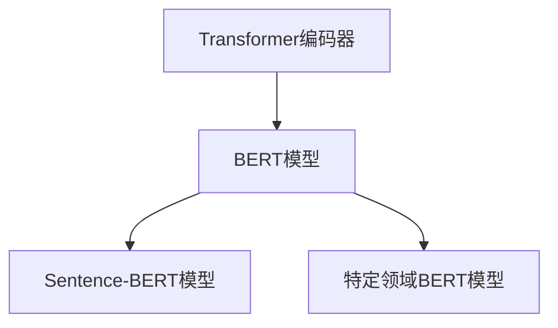

好的,我会按照您的要求,以专业、深入和严谨的方式撰写这篇技术博客文章。

# Transformer大模型实战 Sentence-BERT模型和特定领域的BERT 模型

## 1. 背景介绍

### 1.1 问题的由来

在自然语言处理(NLP)领域,传统的单词嵌入方法如Word2Vec和GloVe只能捕捉单词级别的语义信息,忽视了单词在不同上下文中的多义性问题。而句子级别的语义理解对于许多NLP任务(如文本分类、语义相似度计算等)至关重要。因此,需要一种新的句子嵌入方法来更好地表示句子的语义信息。

### 1.2 研究现状  

早期的一些句子嵌入方法如Sentence2Vec和Hill等,通过简单地对句子中的单词嵌入求平均或拼接来获得句子表示,但这些方法忽视了单词在句子中的顺序和上下文信息。2018年,Google的研究人员提出了BERT(Bidirectional Encoder Representations from Transformers)模型,它基于Transformer编码器,能够有效地捕捉单词的上下文语义信息,取得了突破性的进展。

### 1.3 研究意义

虽然BERT模型在许多NLP任务上取得了卓越的表现,但它主要关注单词级别的语义表示,无法直接生成句子级别的嵌入向量。Sentence-BERT模型通过对BERT模型进行微调,可以生成高质量的句子嵌入向量,为句子级别的语义理解任务提供了强有力的支持。此外,针对特定领域构建BERT模型也是一个重要的研究方向,可以提高模型在该领域的表现。

### 1.4 本文结构

本文首先介绍Sentence-BERT模型的核心概念和原理,包括模型架构、训练目标和损失函数等。然后详细阐述Sentence-BERT模型的训练和微调过程。接下来,探讨如何针对特定领域构建BERT模型,包括数据预处理、模型训练和优化等关键步骤。最后,总结Sentence-BERT模型和特定领域BERT模型的应用场景和未来发展趋势。

## 2. 核心概念与联系

Sentence-BERT模型和特定领域的BERT模型都基于Transformer编码器架构,它们的核心概念和联系如下:

1. **Transformer编码器**: Transformer编码器是一种基于自注意力机制的序列到序列模型,能够有效地捕捉输入序列中单词的上下文语义信息。它是BERT和Sentence-BERT模型的基础架构。

2. **BERT模型**: BERT是一种基于Transformer编码器的双向语言模型,通过掩蔽语言模型(Masked Language Model)和下一句预测(Next Sentence Prediction)两个预训练任务,学习到了丰富的上下文语义表示。BERT模型主要关注单词级别的语义表示。

3. **Sentence-BERT模型**: Sentence-BERT是在BERT模型的基础上进行微调得到的句子级别语义表示模型。它通过对句子对进行语义相似度回归任务的训练,使得BERT模型能够生成高质量的句子嵌入向量,捕捉句子级别的语义信息。

4. **特定领域BERT模型**: 针对特定领域(如医疗、法律等)构建的BERT模型,通过在该领域的大规模语料库上进行预训练,能够学习到该领域的领域知识和语义表示,提高模型在该领域的表现。

这些概念之间的关系如下所示:

Transformer编码器架构是BERT模型和Sentence-BERT模型的基础。BERT模型主要关注单词级别的语义表示,而Sentence-BERT模型则通过对BERT模型进行微调,生成句子级别的语义表示。特定领域BERT模型则是在BERT模型的基础上,针对特定领域进行预训练和优化,以提高模型在该领域的表现。

## 3. 核心算法原理 & 具体操作步骤  

### 3.1 算法原理概述

Sentence-BERT模型的核心思想是通过对BERT模型进行微调,使其能够生成高质量的句子嵌入向量。具体来说,Sentence-BERT模型的训练过程包括以下几个关键步骤:

1. **语料库构建**: 首先需要构建一个包含大量句子对及其语义相似度标注的数据集,作为Sentence-BERT模型的训练数据。

2. **BERT模型初始化**: 将预训练好的BERT模型作为Sentence-BERT模型的初始化参数。

3. **句子对编码**: 将每个句子对通过BERT模型编码,得到句子对的表示向量。

4. **语义相似度回归**: 将句子对的表示向量输入到一个回归层,预测句子对的语义相似度分数。

5. **损失函数计算**: 使用均方误差(Mean Squared Error)或者余弦相似度(Cosine Similarity)作为损失函数,衡量预测的语义相似度分数与真实标注之间的差异。

6. **模型微调**: 通过反向传播算法,更新BERT模型的参数,使得模型能够生成更好的句子嵌入向量,从而提高语义相似度预测的准确性。

7. **模型评估**: 在验证集上评估模型的性能,选择最优模型参数。

通过上述步骤,Sentence-BERT模型能够学习到高质量的句子嵌入向量,这些向量不仅能够捕捉句子的语义信息,而且还能够保持语义相似的句子在向量空间中的距离较近。

### 3.2 算法步骤详解

1. **语料库构建**:

构建高质量的训练语料库是Sentence-BERT模型训练的关键步骤之一。常用的语料库包括:

- 自然语言推理数据集(如SNLI、MultiNLI)
- 问答数据集(如SQuAD)
- 语义相似度数据集(如STS Benchmark)
- 特定领域的语料库(如医疗、法律等)

这些语料库中包含了大量的句子对及其语义相似度标注,可以作为Sentence-BERT模型的训练数据。

2. **BERT模型初始化**:

Sentence-BERT模型的初始化参数来自于预训练好的BERT模型。常用的BERT模型包括:

- BERT-Base: 12层Transformer编码器,768维隐藏层
- BERT-Large: 24层Transformer编码器,1024维隐藏层

选择合适的BERT模型作为初始化参数,可以加快Sentence-BERT模型的训练convergence速度。

3. **句子对编码**:

将每个句子对通过BERT模型编码,得到句子对的表示向量。具体步骤如下:

- 将句子对拼接为单个输入序列,例如: `[CLS] 句子1 [SEP] 句子2 [SEP]`
- 将输入序列输入到BERT模型,得到每个单词的隐藏状态向量
- 取`[CLS]`token对应的隐藏状态向量,作为句子对的表示向量

4. **语义相似度回归**:

将句子对的表示向量输入到一个回归层,预测句子对的语义相似度分数。回归层可以是简单的线性层或者多层感知机。

5. **损失函数计算**:

常用的损失函数包括:

- 均方误差(Mean Squared Error): $$ \mathcal{L}_{MSE} = \frac{1}{N}\sum_{i=1}^{N}(y_i - \hat{y}_i)^2 $$
其中$y_i$是真实的语义相似度标注,$\hat{y}_i$是模型预测的语义相似度分数,$N$是训练样本数量。

- 余弦相似度(Cosine Similarity): $$ \mathcal{L}_{COS} = -\frac{1}{N}\sum_{i=1}^{N}\frac{y_i \cdot \hat{y}_i}{\|y_i\| \|\hat{y}_i\|} $$
其中$y_i$和$\hat{y}_i$分别是真实标注和预测的句子嵌入向量。

6. **模型微调**:

使用反向传播算法,根据损失函数的梯度更新BERT模型的参数,使得模型能够生成更好的句子嵌入向量,从而提高语义相似度预测的准确性。

7. **模型评估**:

在验证集上评估模型的性能,常用的评估指标包括:

- Spearman's rank correlation
- Pearson's correlation
- Cosine-Similarity

选择在验证集上表现最优的模型参数,作为最终的Sentence-BERT模型。

### 3.3 算法优缺点

**优点**:

- 能够生成高质量的句子嵌入向量,捕捉句子级别的语义信息
- 基于BERT模型,能够有效地利用上下文信息
- 可以通过微调的方式快速适应新的数据集和任务
- 句子嵌入向量可以直接用于许多下游NLP任务,如文本分类、语义相似度计算等

**缺点**:

- 需要大量的标注数据进行训练,数据标注成本较高
- 训练过程计算量大,需要较长的训练时间和较多的计算资源
- 对长句子的表示能力可能不足,因为BERT模型的输入长度有限制

### 3.4 算法应用领域

Sentence-BERT模型生成的高质量句子嵌入向量可以应用于多种自然语言处理任务,包括但不限于:

- **文本分类**: 将句子嵌入向量作为文本的表示,输入到分类器(如逻辑回归、支持向量机等)进行文本分类。
- **语义相似度计算**: 通过计算句子嵌入向量之间的余弦相似度或欧几里得距离,评估两个句子的语义相似程度。
- **文本聚类**: 基于句子嵌入向量的相似性,对文本进行聚类。
- **信息检索**: 将查询和文档表示为句子嵌入向量,根据它们的相似性进行相关性排序和检索。
- **对话系统**: 将用户输入和系统响应表示为句子嵌入向量,用于响应选择和生成。
- **机器翻译**: 将源语言句子和目标语言句子表示为句子嵌入向量,用于翻译质量评估和模型优化。

## 4. 数学模型和公式 & 详细讲解 & 举例说明

### 4.1 数学模型构建

Sentence-BERT模型的核心思想是通过对BERT模型进行微调,使其能够生成高质量的句子嵌入向量。为此,我们需要构建一个数学模型,将BERT模型的输出与句子对的语义相似度标注相关联。

假设我们有一个包含$N$个句子对的训练数据集$\mathcal{D} = \{(s_1^{(i)}, s_2^{(i)}, y^{(i)})\}_{i=1}^{N}$,其中$s_1^{(i)}$和$s_2^{(i)}$分别表示第$i$个句子对中的两个句子,$y^{(i)} \in [0, 1]$表示它们的语义相似度标注。

我们将每个句子对$(s_1^{(i)}, s_2^{(i)})$通过BERT模型编码,得到句子对的表示向量$\mathbf{u}^{(i)} \in \mathbb{R}^{d}$,其中$d$是BERT模型的隐藏层维度。然后,我们将$\mathbf{u}^{(i)}$输入到一个回归层,预测句子对的语义相似度分数$\hat{y}^{(i)}$:

$$\hat{y}^{(i)} = \sigma(\mathbf{w}^\top \mathbf{u}^{(i)} + b)$$

其中$\mathbf{w} \in \mathbb{R}^{d}$和$b \in \mathbb{R}$是回归层的参数,$\sigma$是sigmoid激活函数,用于将预测值约束在$[0, 1]$范围内。

为了使预测的语义相似度分数$\hat{y}^{(i)}$尽可能接近真实标注$y^{(i)}$,我们定义了一个损失函数,例如均方误差(Mean Squared Error):

$$\mathcal{L}_{MSE} = \frac{1}{N}\sum_{i=1}^{N}(y^{(i)} - \hat{y}^{(i)})^2$$

在训练过程中,我们通过反向传播算法,根据损失函数的梯度更新BERT