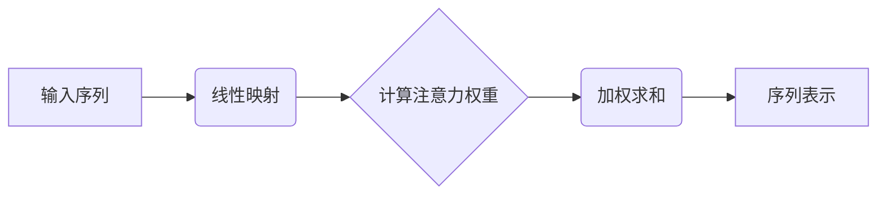

以下是对《Transformer大模型实战 VideoBERT模型和BART模型》这一主题的技术博客文章撰写。

# Transformer大模型实战 VideoBERT模型和BART模型

## 1. 背景介绍

### 1.1 问题的由来

在当今的数字时代,视频数据的爆炸式增长带来了巨大的挑战和机遇。传统的基于手工特征的视频分析方法已经无法满足大规模视频理解的需求。因此,如何高效地对视频内容进行理解和表示成为了一个迫切需要解决的问题。

### 1.2 研究现状 

近年来,benefitting from 大规模标注数据集和强大的计算能力,基于深度学习的视频理解技术取得了长足的进步。其中,Transformer模型因其强大的建模能力而备受关注。VideoBERT和BART等模型将Transformer引入视频领域,展现出了优异的表现。

### 1.3 研究意义

视频理解技术在诸多领域都有广泛的应用前景,如视频检索、视频摘要、视频问答、视频描述生成等。高效、精准的视频理解能力不仅能提高人机交互体验,还可以促进智能视频分析在安防、医疗、教育等领域的落地应用。

### 1.4 本文结构

本文将首先介绍VideoBERT和BART等Transformer大模型在视频理解领域的核心概念和技术原理,包括自注意力机制、跨模态表示学习等。接下来详细阐述这些模型的算法流程、数学模型和关键实现细节。然后通过实际案例分析其应用场景,并给出开发实践的代码示例。最后总结模型的优缺点,展望未来的发展趋势和面临的挑战。

## 2. 核心概念与联系

Transformer大模型的核心思想是利用自注意力(Self-Attention)机制来捕捉输入序列中元素之间的长程依赖关系,避免了RNN等序列模型的梯度消失问题。自注意力机制通过计算Query、Key和Value之间的相似性,对序列中的每个元素进行加权编码,从而学习到全局的上下文表示。

在视频理解任务中,Transformer被用于构建跨模态融合模型,即同时对视频和文本等不同模态的输入进行建模和表示学习。VideoBERT将视频帧序列和文本序列作为输入,通过跨模态的自注意力机制捕捉视频和文本之间的相关性,学习跨模态的联合表示。而BART则专注于视频到文本的生成任务,如视频描述、视频问答等。

这些大模型的出现为视频理解任务带来了突破性的进展,展现了Transformer强大的建模能力。但同时也面临一些挑战,如高计算复杂度、大量参数和数据需求等,需要在模型设计和优化方面做进一步的工作。

## 3. 核心算法原理 & 具体操作步骤

### 3.1 算法原理概述

VideoBERT和BART等Transformer大模型的核心算法原理可概括为以下几个关键步骤:

1. **输入表示**: 将视频帧序列和文本序列转换为对应的特征表示,作为模型的输入。
2. **多头自注意力**: 对输入序列进行多头自注意力计算,捕捉序列元素之间的长程依赖关系。
3. **跨模态融合**: 通过跨模态自注意力机制,学习视频和文本等不同模态输入之间的相关性,获得跨模态的联合表示。
4. **编码器-解码器架构**(BART): 将编码器获得的上下文表示输入到解码器,生成目标输出序列(如视频描述)。
5. **任务特定头**: 根据不同的下游任务(如视频描述、视频问答等),设计相应的输出头对模型进行微调。

### 3.2 算法步骤详解

1. **输入表示**

   - 视频输入: 将视频帧序列输入到预训练的视觉特征提取模型(如3D卷积网络)中,获得视频的特征表示。
   - 文本输入: 将文本序列输入到预训练的语言模型(如BERT)中,获得文本的特征表示。

2. **多头自注意力**

   对于序列 $X = (x_1, x_2, \dots, x_n)$, 自注意力机制的计算过程为:

   $$\begin{aligned}
   Q &= X W_Q \\
   K &= X W_K \\
   V &= X W_V \\
   \text{Attention}(Q, K, V) &= \text{softmax}(\frac{QK^T}{\sqrt{d_k}})V
   \end{aligned}$$

   其中 $W_Q, W_K, W_V$ 为可学习的线性变换矩阵, $d_k$ 为缩放因子。多头注意力通过线性变换将输入投影到不同的子空间,分别计算注意力,最后将结果拼接。

3. **跨模态融合**

   VideoBERT通过跨模态自注意力机制融合视频和文本表示:

   $$\begin{aligned}
   Q_v &= V W_Q \\
   K_t &= T W_K \\
   V_t &= T W_V \\
   \text{Attention}(Q_v, K_t, V_t) &= \text{softmax}(\frac{Q_vK_t^T}{\sqrt{d_k}})V_t
   \end{aligned}$$

   其中 $V, T$ 分别表示视频和文本的输入表示。通过计算视频Query和文本Key、Value之间的相似性,获得视频对文本的注意力表示,从而实现跨模态融合。

4. **编码器-解码器架构**

   BART采用编码器-解码器的Transformer架构,将编码器获得的上下文表示 $C$ 输入到解码器,生成目标输出序列 $Y$:

   $$\begin{aligned}
   C &= \text{Encoder}(X) \\
   P(Y|X) &= \text{Decoder}(Y, C)
   \end{aligned}$$

   解码器同样使用自注意力和交叉注意力机制对输入序列 $Y$ 和上下文表示 $C$ 进行建模。

5. **任务特定头**

   根据不同的下游任务,在Transformer模型的输出端设计相应的头部,如分类头、生成头等,对模型进行进一步的微调,以获得针对性的表现。

### 3.3 算法优缺点

**优点**:

- 自注意力机制能够有效捕捉长程依赖关系,避免了RNN的梯度消失问题。
- 跨模态融合能力强,可以学习视频、文本等不同模态之间的相关性。
- 具有并行计算的优势,能够充分利用GPU/TPU等硬件加速训练。
- 通过预训练和微调的方式,可以在大规模数据上学习通用表示,再转移到下游任务。

**缺点**:

- 计算复杂度高,需要大量的计算资源,尤其是在处理长序列时。
- 模型参数巨大,存在过拟合的风险,需要大规模标注数据进行预训练。
- 对于空间信息的建模能力相对欠缺,需要与CNN等模型结合使用。
- 训练过程不稳定,需要精心设计优化策略。

### 3.4 算法应用领域

Transformer大模型在视频理解领域展现出了广阔的应用前景,主要包括但不限于:

- **视频描述生成**: 根据视频内容自动生成对应的文本描述。
- **视频问答**: 回答关于视频内容的问题,测试对视频的理解能力。
- **视频检索**: 根据文本查询相关的视频,或根据视频查询相关文本。
- **视频分类**: 对视频进行主题分类,如运动类型、场景识别等。
- **视频摘要**: 从视频中自动提取关键帧或片段,生成视频摘要。
- **视频编辑**: 根据文本指令对视频进行剪辑、拼接等编辑操作。

除视频理解外,Transformer大模型在自然语言处理、计算机视觉等领域也有广泛的应用,展现出了强大的建模能力。

## 4. 数学模型和公式 & 详细讲解 & 举例说明

### 4.1 数学模型构建

我们以VideoBERT为例,构建其数学模型。给定视频特征序列 $V = (v_1, v_2, \dots, v_m)$ 和文本特征序列 $T = (t_1, t_2, \dots, t_n)$,VideoBERT的目标是学习一个映射函数 $f$,将视频和文本的特征融合为统一的表示 $h$:

$$h = f(V, T; \Theta)$$

其中 $\Theta$ 为模型参数。具体来说,VideoBERT采用了多层Transformer编码器结构,每一层由多头自注意力和前馈网络组成。

在第 $l$ 层,视频和文本特征首先通过自注意力子层进行自注意力计算,得到更新的表示 $V^l, T^l$:

$$\begin{aligned}
V^l &= \text{AttentionSublayer}(V^{l-1}) \\
T^l &= \text{AttentionSublayer}(T^{l-1})
\end{aligned}$$

接下来,通过跨模态注意力子层对视频和文本特征进行融合:

$$\begin{aligned}
\widetilde{V}^l &= \text{CrossAttention}(V^l, T^l) \\
\widetilde{T}^l &= \text{CrossAttention}(T^l, V^l)
\end{aligned}$$

其中,CrossAttention计算过程如下:

$$\begin{aligned}
Q &= V^l W_Q \\
K &= T^l W_K \\
V &= T^l W_V \\
\widetilde{V}^l &= \text{AttentionSublayer}(V^l, \text{softmax}(\frac{QK^T}{\sqrt{d_k}})V)
\end{aligned}$$

最后,通过前馈网络子层对融合后的表示进行进一步的非线性变换:

$$\begin{aligned}
\widetilde{V}^l &= \text{FFNSublayer}(\widetilde{V}^l) \\
\widetilde{T}^l &= \text{FFNSublayer}(\widetilde{T}^l)
\end{aligned}$$

重复上述过程 $L$ 层后,即可获得视频和文本的融合表示 $\widetilde{V}^L, \widetilde{T}^L$,作为VideoBERT的输出。

### 4.2 公式推导过程

我们以自注意力机制为例,推导其数学原理。自注意力的核心思想是计算Query和Key之间的相似性,作为Value的加权和。

首先,将输入序列 $X = (x_1, x_2, \dots, x_n)$ 通过线性变换分别得到Query、Key和Value:

$$\begin{aligned}
Q &= XW_Q \\
K &= XW_K \\
V &= XW_V
\end{aligned}$$

其中 $W_Q, W_K, W_V$ 为可学习的变换矩阵。

接下来,计算Query和Key之间的点积,得到相似性分数矩阵 $S$:

$$S = QK^T$$

为了避免点积过大导致的梯度不稳定问题,我们对分数矩阵进行缩放:

$$\widetilde{S} = \frac{S}{\sqrt{d_k}}$$

其中 $d_k$ 为Query和Key的维度。

然后,对缩放后的分数矩阵 $\widetilde{S}$ 进行softmax操作,得到注意力权重矩阵 $A$:

$$A = \text{softmax}(\widetilde{S})$$

最后,将Value加权求和,即可得到自注意力的输出表示:

$$\text{Attention}(Q, K, V) = AV$$

将上述过程展开,我们可以得到自注意力的完整计算公式:

$$\begin{aligned}
\text{Attention}(Q, K, V) &= \text{softmax}(\frac{QK^T}{\sqrt{d_k}})V \\
&= \text{softmax}(\frac{XW_QW_K^TX^T}{\sqrt{d_k}})XW_V
\end{aligned}$$

自注意力机制通过计算Query和Key之间的相似性,对Value进行加权编码,从而捕捉输入序列中元素之间的长程依赖关系。

### 4.3 案例分析与讲解

我们以视频描述生成任务为例,分析Vide