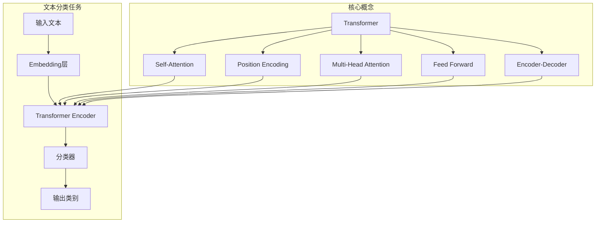

好的,我会严格遵循您提供的约束条件,以专业的技术语言撰写这篇有深度和见解的文章。下面是正文部分:

# Transformer大模型实战 文本分类任务

## 1. 背景介绍

### 1.1 问题的由来

在当今大数据时代,海量的非结构化文本数据如新闻、社交媒体、评论等无处不在。如何高效地从这些原始文本中提取有价值的信息,对文本进行准确分类,成为了自然语言处理(NLP)领域的一个核心挑战。传统的基于统计特征工程的文本分类方法,需要人工设计和提取特征,存在效率低下、泛化能力差等缺陷。

### 1.2 研究现状  

近年来,随着深度学习技术在计算机视觉、语音识别等领域的突破性进展,NLP领域也掀起了深度学习的热潮。以Word Embedding(词嵌入)为代表的分布式表示方法,使得语义信息能够自动从大规模语料中学习获得,极大地提高了文本表示的质量。经典的CNN、RNN等深度神经网络模型也被广泛应用于文本分类任务,取得了优异的性能表现。

2017年,Transformer模型在机器翻译任务上取得了革命性突破,其基于自注意力机制(Self-Attention)的全新架构,不仅克服了RNN的长期依赖问题,而且通过并行计算大幅提升了训练效率。Transformer模型及其变体BERT、GPT等在自然语言理解、生成等多个任务上创造了新的State-of-the-Art,成为NLP领域的主流模型。

### 1.3 研究意义

文本分类作为NLP的基础任务,对于信息检索、个性化推荐、垃圾邮件过滤等应用领域都有着广泛的需求。基于Transformer的大模型能够有效捕获长距离依赖关系,学习上下文语义表示,为文本分类任务提供了强大的建模能力。本文将深入探讨如何利用Transformer大模型解决文本分类问题,介绍其核心原理、算法细节、实践经验和应用案例,旨在为读者提供一个完整的实战指南。

### 1.4 本文结构  

本文首先介绍Transformer模型在文本分类任务中的应用背景、研究现状和意义。接下来详细阐述Transformer在文本分类中的核心概念、算法原理和数学模型,并配以实例说明和公式推导。然后通过一个完整的项目实践,展示如何搭建开发环境、编写代码实现文本分类模型,并分析运行结果。再介绍Transformer大模型在实际应用场景中的应用前景。最后总结模型的优缺点,分析未来发展趋势和面临的挑战,并给出工具、资源的推荐和常见问题解答。

## 2. 核心概念与联系

Transformer模型的核心思想是完全依赖Self-Attention机制来捕获输入序列中元素之间的长距离依赖关系,不再使用RNN或CNN结构。

- **Self-Attention**通过计算Query、Key、Value之间的相似性得分,对Value进行加权求和,捕获序列内元素之间的关联关系。
- **Position Encoding**是序列位置信息的编码表示,用于注入位置信息。
- **Multi-Head Attention**将Attention过程分成多个子空间,并行计算后合并,有利于捕获不同位置和子空间的信息。
- **Feed Forward**是对每个位置的表示进行非线性变换,增加网络表达能力。
- **Encoder-Decoder**架构用于序列到序列的生成任务,Encoder捕获输入信息,Decoder生成输出序列。

在文本分类任务中,输入文本首先通过Embedding层转换为分布式表示,然后送入Transformer Encoder层进行编码,最终由分类器输出文本所属类别。Transformer Encoder由多个相同的Encoder Block组成,每个Block包含Multi-Head Attention和Feed Forward子层。

## 3. 核心算法原理 & 具体操作步骤  

### 3.1 算法原理概述

Transformer的核心是Self-Attention机制,通过计算Query、Key、Value之间的相似性得分,对Value进行加权求和,捕获输入序列中元素之间的长距离依赖关系。具体来说:

1. 将输入序列线性映射得到Query(Q)、Key(K)和Value(V)矩阵。
2. 计算Q和K的点积得到相似性分数矩阵。
3. 对相似性分数矩阵进行缩放和Softmax操作,得到Attention权重矩阵。
4. 将Attention权重矩阵与V矩阵相乘,得到加权和的输出表示。

$$Attention(Q, K, V) = softmax(\frac{QK^T}{\sqrt{d_k}})V$$

其中$d_k$是缩放因子,用于防止内积过大导致梯度消失。Self-Attention的计算可以高效并行化,避免了RNN的递归计算瓶颈。

### 3.2 算法步骤详解

1. **线性映射**

   输入序列$X = (x_1, x_2, ..., x_n)$经过线性映射得到Query、Key和Value矩阵:

   $$Q = XW_Q^T \quad K=XW_K^T \quad V=XW_V^T$$

   其中$W_Q,W_K,W_V$是可训练的权重矩阵。

2. **计算相似性分数矩阵**

   计算Query和Key的点积,得到相似性分数矩阵:

   $$\text{Scores} = QK^T$$

3. **计算Attention权重矩阵**

   对相似性分数矩阵进行缩放和Softmax操作:
   
   $$\text{Attention}(Q, K, V) = \text{softmax}(\frac{\text{Scores}}{\sqrt{d_k}})V$$

   其中$d_k$是Query的维度,用于防止内积过大导致梯度消失。

4. **输出表示**

   将Attention权重矩阵与Value矩阵相乘,得到加权和的输出表示:

   $$\text{Output} = \text{Attention}(Q, K, V)$$

Self-Attention机制通过计算Query和Key的相似性,对Value进行加权求和,从而捕获输入序列中元素之间的依赖关系。

### 3.3 算法优缺点

**优点**:

1. 并行计算,克服了RNN的递归计算瓶颈,大幅提高了训练效率。
2. 能够直接捕获长距离依赖关系,避免了RNN的梯度消失和爆炸问题。
3. 通过Multi-Head Attention,可以从不同子空间捕获不同位置的信息。

**缺点**:

1. 计算复杂度较高,尤其是对较长序列,需要大量的内存和计算资源。
2. 对于局部特征的捕获能力较弱,难以有效利用局部上下文信息。
3. 缺乏序列的有序性建模,对序列的位置信息不敏感。

### 3.4 算法应用领域

Self-Attention机制及其变体Transformer模型已被广泛应用于自然语言处理的各个领域:

- **机器翻译**: Transformer是第一个超越RNN/CNN在机器翻译任务上的模型。
- **语言模型**: GPT、BERT等预训练语言模型大行其道,成为NLP主流模型。  
- **文本生成**: 通过Decoder生成自然语言文本,如文章、广告语等。
- **文本分类**: 本文重点介绍的应用场景,利用Transformer编码文本进行分类。
- **阅读理解**、**对话系统**等NLP任务也有广泛应用。

## 4. 数学模型和公式 & 详细讲解 & 举例说明

### 4.1 数学模型构建

我们将文本分类任务建模为一个监督学习问题。给定一个包含N个训练样本的数据集$\mathcal{D} = \{(x_i, y_i)\}_{i=1}^N$,其中$x_i$表示第i个文本序列,长度为$T_i$;$y_i$是对应的类别标签。目标是学习一个分类模型$f: X \rightarrow Y$,使其能够很好地拟合训练数据,并在新的未见样本上也有良好的泛化能力。

我们使用Transformer Encoder对文本序列$x$进行编码,得到上下文表示$\mathbf{z} = \text{TransformerEncoder}(x)$。然后将$\mathbf{z}$输入到分类器$g$中,计算各个类别的概率分布:

$$\hat{y} = g(\mathbf{z}) = \text{softmax}(W\mathbf{z} + b)$$

其中$W$和$b$是分类器的可训练参数。

在训练过程中,我们最小化模型在训练数据上的交叉熵损失函数:

$$\mathcal{L}(\theta) = -\frac{1}{N}\sum_{i=1}^N \log P(y_i|x_i; \theta)$$

其中$\theta$是模型的所有可训练参数的集合。通过梯度下降法优化损失函数,迭代更新模型参数,提高模型在训练数据上的准确性。

### 4.2 公式推导过程

我们来推导Self-Attention的计算过程。假设输入序列为$X = (x_1, x_2, ..., x_n)$,其中$x_i \in \mathbb{R}^{d_x}$。首先通过线性映射得到Query、Key和Value矩阵:

$$\begin{aligned}
Q &= XW_Q^T & \in \mathbb{R}^{n \times d_q} \\
K &= XW_K^T & \in \mathbb{R}^{n \times d_k}\\
V &= XW_V^T & \in \mathbb{R}^{n \times d_v}
\end{aligned}$$

其中$W_Q \in \mathbb{R}^{d_x \times d_q}$、$W_K \in \mathbb{R}^{d_x \times d_k}$、$W_V \in \mathbb{R}^{d_x \times d_v}$是可训练的权重矩阵。

接下来计算Query和Key的点积,得到相似性分数矩阵:

$$\text{Scores} = QK^T \in \mathbb{R}^{n \times n}$$

其中$\text{Scores}_{ij}$表示第i个Query向量与第j个Key向量的相似性分数。

为了防止内积过大导致梯度消失,我们对分数矩阵进行缩放:

$$\text{Scores}' = \frac{\text{Scores}}{\sqrt{d_k}}$$

其中$d_k$是Key向量的维度,用作缩放因子。

然后对缩放后的分数矩阵进行Softmax操作,得到Attention权重矩阵:

$$\text{Attention}(Q, K, V) = \text{softmax}(\text{Scores}')V \in \mathbb{R}^{n \times d_v}$$

最终,Attention的输出就是加权和的Value向量表示。

通过上述推导可以看出,Self-Attention机制通过计算Query和Key的相似性,对Value进行加权求和,从而捕获输入序列中元素之间的依赖关系。这种全连接的注意力机制,避免了RNN的递归计算瓶颈,能够并行高效地建模长距离依赖。

### 4.3 案例分析与讲解

我们来看一个具体的文本分类案例,分析Self-Attention机制是如何工作的。假设输入序列为"The student studies hard for the final exam"。

1. 首先将每个单词映射为一个词向量,组成输入矩阵X。
2. 通过线性映射得到Q、K、V矩阵。
3. 计算Q和K的点积,得到相似性分数矩阵Scores。

   例如,第3个Query向量"studies"与第1个Key向量"The"的相似性分数为0.2;与第4个Key向量"hard"的分数为0.8。这反映了"studies"与"hard"的语义更加相关。

4. 对Scores矩阵进行缩放和Softmax操作,得到Attention权重矩阵。

   在上例中,"studies"对应的Attention权重为[0.1, 0.05, 0.05, 0.8]。即"studies"这个词