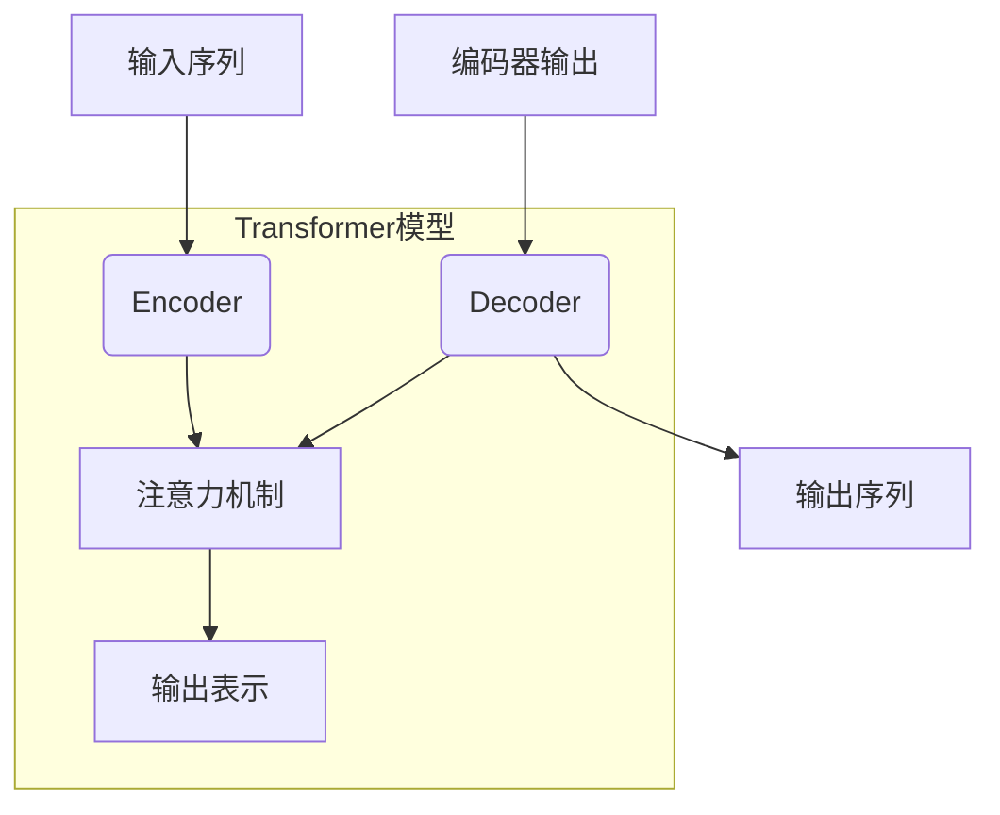

# Transformer大模型实战 训练Transformer

## 1. 背景介绍

### 1.1 问题的由来

随着深度学习的飞速发展,自然语言处理(NLP)领域取得了令人瞩目的进步。传统的序列模型如RNN和LSTM虽然在处理序列数据方面有着不错的表现,但由于存在梯度消失、无法并行计算等缺陷,使得它们在处理长序列时遇到了瓶颈。为了克服这些问题,Transformer模型应运而生。

Transformer是2017年由Google的Vaswani等人在论文"Attention Is All You Need"中提出的一种全新的基于注意力机制(Attention Mechanism)的序列到序列(Seq2Seq)模型。它完全抛弃了RNN和CNN等结构,使用多头自注意力(Multi-Head Attention)机制来捕捉输入和输出之间的长程依赖关系,从而实现了高效的并行计算。自问世以来,Transformer模型在机器翻译、文本生成、语音识别等多个NLP任务中表现出色,成为NLP领域的新标杆模型。

### 1.2 研究现状

Transformer模型的出现极大地推动了NLP领域的发展。随后,研究人员在Transformer的基础上不断进行改进和探索,诞生了一系列大型预训练语言模型,如GPT、BERT、XLNet等。这些大模型通过在大规模无标注语料库上进行预训练,获得了强大的语义表示能力,在下游NLP任务上表现出了卓越的性能。

当前,训练大型Transformer模型已经成为NLP领域的主流研究方向之一。随着模型规模和训练数据的不断增大,模型的性能也在不断提升。例如,OpenAI推出的GPT-3大模型拥有1750亿个参数,展现出了惊人的语言生成能力,可以生成看似人类水平的文本。

### 1.3 研究意义

训练大型Transformer模型对于推动NLP技术的发展具有重要意义:

1. **提升模型性能**:大模型通过学习海量数据,能够获取更丰富的语义知识,从而在下游任务上取得更好的表现。
2. **通用能力强大**:大模型经过有效预训练后,可以应用于多种NLP任务,展现出强大的通用能力。
3. **推动技术创新**:训练大模型需要解决诸多技术挑战,如高效的并行计算、优化算法、模型压缩等,这将推动相关技术的创新与发展。
4. **促进产业应用**:大模型的强大能力为NLP技术在机器翻译、智能问答、内容生成等领域的产业化应用提供了有力支撑。

### 1.4 本文结构

本文将全面介绍如何训练大型Transformer模型。首先阐述Transformer的核心概念和原理,包括注意力机制、编码器-解码器架构等。接着详细讲解Transformer模型的训练过程,包括数据预处理、损失函数设计、优化算法选择等关键环节。然后通过数学模型和公式,深入解析注意力计算、梯度更新等核心算法细节。此外,还将提供具体的代码实现,并对关键模块进行解读和分析。最后,探讨Transformer模型在实际应用中的场景,以及未来的发展趋势和面临的挑战。

## 2. 核心概念与联系

Transformer模型的核心思想是利用注意力机制(Attention Mechanism)来捕捉输入和输出序列之间的长程依赖关系,从而实现高效的序列到序列(Seq2Seq)建模。

1. **编码器(Encoder)**:将输入序列编码为一系列连续的表示,用于捕捉输入序列的上下文信息。
2. **解码器(Decoder)**:基于编码器的输出和注意力机制,生成目标输出序列。
3. **注意力机制(Attention Mechanism)**:模型的核心部分,通过计算查询(Query)、键(Key)和值(Value)之间的相关性分数,捕捉序列间的长程依赖关系。
4. **多头注意力(Multi-Head Attention)**:将注意力机制扩展到多个"头"(Head),每个头捕捉序列的不同表示子空间,最终将多头注意力的结果拼接起来,形成最终的注意力表示。
5. **位置编码(Positional Encoding)**:由于Transformer模型完全放弃了RNN和CNN结构,因此需要一种机制来注入序列的位置信息。位置编码就是将序列的位置信息编码为向量,并与序列的词嵌入相加,从而使模型能够捕捉序列的位置信息。

Transformer模型通过自注意力机制捕捉输入和输出序列之间的长程依赖关系,避免了RNN的梯度消失问题。同时,由于自注意力机制可以高效并行计算,因此Transformer模型在处理长序列时具有更好的计算效率。

## 3. 核心算法原理 & 具体操作步骤

### 3.1 算法原理概述

Transformer的核心算法是**注意力机制(Attention Mechanism)**,它能够捕捉输入序列中任意两个位置之间的依赖关系,从而更好地建模长序列数据。

注意力机制的基本思想是:在生成一个词时,不仅要考虑前一个词,还要结合整个输入序列,对每个位置的词计算一个注意力权重,然后将注意力权重与词嵌入相加,得到该位置的注意力表示。

具体来说,注意力机制包括以下三个核心计算步骤:

1. **计算注意力分数(Attention Scores)**:对于解码器中的每个位置,计算其与编码器中所有位置的注意力分数。注意力分数通过查询(Query)与键(Key)的点积来计算。
2. **计算注意力权重(Attention Weights)**:对注意力分数进行softmax归一化,得到注意力权重。
3. **计算注意力表示(Attention Representation)**:将注意力权重与编码器中对应位置的值(Value)相乘并求和,得到该位置的注意力表示。

### 3.2 算法步骤详解

以下是Transformer注意力机制的具体计算步骤:

1. **线性投影**:将查询(Query)、键(Key)和值(Value)通过不同的线性投影矩阵进行投影,得到新的表示。
   $$
   \begin{aligned}
   Q &= XW^Q\\
   K &= XW^K\\
   V &= XW^V
   \end{aligned}
   $$
   其中,$X$是输入序列,$W^Q,W^K,W^V$分别是查询、键和值的线性投影矩阵。

2. **计算注意力分数**:通过查询和键的点积计算注意力分数,并除以一个缩放因子$\sqrt{d_k}$,其中$d_k$是键的维度。
   $$
   \text{Attention Scores} = \frac{QK^T}{\sqrt{d_k}}
   $$

3. **计算注意力权重**:对注意力分数进行softmax归一化,得到注意力权重。
   $$
   \text{Attention Weights} = \text{softmax}(\text{Attention Scores})
   $$

4. **计算注意力表示**:将注意力权重与值(Value)相乘并求和,得到注意力表示。
   $$
   \text{Attention Representation} = \text{Attention Weights} \cdot V
   $$

5. **多头注意力**:将上述过程扩展到多个"头"(Head),每个头捕捉序列的不同表示子空间,最终将多头注意力的结果拼接起来,形成最终的注意力表示。
   $$
   \begin{aligned}
   \text{MultiHead}(Q,K,V) &= \text{Concat}(\text{head}_1, \dots, \text{head}_h) W^O\\
   \text{where}\ \text{head}_i &= \text{Attention}(QW_i^Q, KW_i^K, VW_i^V)
   \end{aligned}
   $$
   其中,$W_i^Q,W_i^K,W_i^V$是第$i$个头的线性投影矩阵,$W^O$是最终的线性投影矩阵。

通过上述步骤,Transformer模型能够高效地捕捉输入序列中任意两个位置之间的长程依赖关系,从而更好地建模长序列数据。

### 3.3 算法优缺点

**优点**:

1. **并行计算**:与RNN不同,Transformer模型中的注意力机制可以高效并行计算,大大提高了计算效率。
2. **长程依赖建模**:注意力机制能够直接捕捉序列中任意两个位置之间的依赖关系,避免了RNN中的梯度消失和梯度爆炸问题。
3. **灵活性强**:Transformer模型可以应用于多种序列到序列的任务,如机器翻译、文本生成、语音识别等。

**缺点**:

1. **计算复杂度高**:注意力机制需要计算查询与所有键的注意力分数,计算复杂度为$O(n^2)$,当序列长度$n$较大时,计算代价会急剧增加。
2. **缺乏位置信息**:Transformer模型本身无法捕捉序列的位置信息,需要额外引入位置编码。
3. **长期依赖建模能力有限**:尽管注意力机制能够捕捉长程依赖关系,但对于极长的序列,其建模能力仍然有限。

### 3.4 算法应用领域

Transformer模型及其变体已广泛应用于自然语言处理的各个领域,主要包括:

1. **机器翻译**:Transformer是首个超越RNN和CNN的神经机器翻译模型,在多种语言对的翻译任务上取得了state-of-the-art的性能。
2. **文本生成**:基于Transformer的大型语言模型(如GPT系列)在文本生成、对话系统等任务上表现出色。
3. **序列标注**:Transformer被应用于命名实体识别、关系抽取等序列标注任务。
4. **文本分类**:Transformer可用于文本分类任务,如情感分析、新闻分类等。
5. **语音识别**:Transformer模型也被成功应用于语音识别领域。
6. **计算机视觉**:Vision Transformer(ViT)将Transformer应用于图像分类等计算机视觉任务。

总的来说,Transformer模型凭借其强大的序列建模能力,在NLP和其他领域取得了广泛的应用,推动了人工智能技术的发展。

## 4. 数学模型和公式 & 详细讲解 & 举例说明

### 4.1 数学模型构建

为了更好地理解Transformer模型的核心机制,我们需要构建相应的数学模型。在这里,我们将注意力机制(Attention Mechanism)形式化为一个数学模型。

设输入序列为$X = (x_1, x_2, \dots, x_n)$,其中$x_i \in \mathbb{R}^{d_x}$是第$i$个位置的词嵌入向量,维度为$d_x$。我们的目标是计算每个位置$i$的注意力表示$z_i$。

首先,我们将输入序列$X$分别通过三个线性变换,得到查询(Query)、键(Key)和值(Value)矩阵:

$$
\begin{aligned}
Q &= XW^Q &&\in \mathbb{R}^{n \times d_q}\\
K &= XW^K &&\in \mathbb{R}^{n \times d_k}\\
V &= XW^V &&\in \mathbb{R}^{n \times d_v}
\end{aligned}
$$

其中,$W^Q \in \mathbb{R}^{d_x \times d_q}$,$W^K \in \mathbb{R}^{d_x \times d_k}$,$W^V \in \mathbb{R}^{d_x \times d_v}$分别是查询、键和值的线性变换矩阵。

接下来,我们计算查询$Q$与所有键$K$的注意力分数,并除以一个缩放因子$\sqrt{d_k}$:

$$
\text{Attention Scores} = \frac{QK^T}{\sqrt{d_k}} \in \mathbb{R}^{n \times n}
$$

然后,对注意力分数进行softmax归一化,得到注意力权重矩阵:

$$
\text{Attention Weights} = \text{softmax}(\