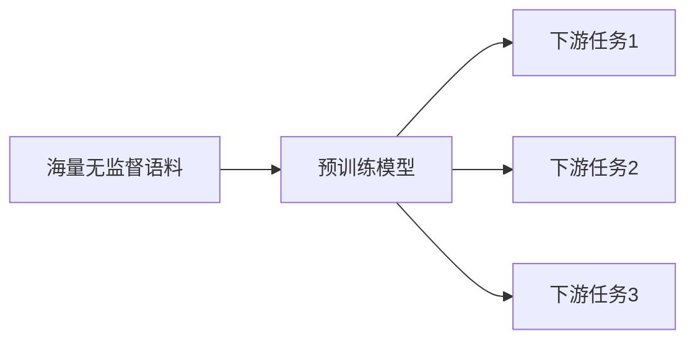

# Transformer大模型实战 针对下游任务进行微调

作者：禅与计算机程序设计艺术 / Zen and the Art of Computer Programming

## 1. 背景介绍
### 1.1 问题的由来
近年来，随着深度学习技术的飞速发展，尤其是Transformer模型的出现，自然语言处理领域取得了突破性的进展。Transformer模型以其强大的并行计算能力和长距离依赖建模能力，在机器翻译、文本分类、问答系统等任务上取得了卓越的表现。然而，训练一个高质量的Transformer模型需要大量的标注数据和计算资源，对于许多特定领域的下游任务来说，直接从头训练模型是不现实的。因此，如何利用预训练的Transformer大模型，针对下游任务进行微调，成为了一个亟待解决的问题。

### 1.2 研究现状
目前，利用预训练语言模型进行迁移学习已经成为NLP领域的主流范式。一般的做法是先在大规模无监督语料上预训练一个语言模型，学习通用的语言表征，然后在特定任务的标注数据上进行微调，使模型适应下游任务。这种范式已经在多个NLP任务上取得了state-of-the-art的结果。

代表性的预训练模型包括BERT、GPT、RoBERTa等。其中，BERT采用了Masked Language Model和Next Sentence Prediction的预训练任务，在多个NLP任务上取得了突破性的进展。此后，各种BERT的变体和改进不断涌现，如RoBERTa、ALBERT、ELECTRA等。这些模型通过改进训练目标、训练策略、模型结构等方面，进一步提升了模型性能。

### 1.3 研究意义
Transformer大模型在NLP领域取得了广泛的成功，但针对特定领域的任务直接应用这些大模型效果往往不尽如人意。通过在下游任务数据上微调预训练模型，可以显著提升模型在特定任务上的表现。这不仅可以节省从头训练模型的时间和计算资源，还可以利用预训练模型学习到的丰富语言知识，提高模型的泛化能力。

深入研究Transformer大模型的微调技术，对于推动NLP技术在垂直领域的落地应用具有重要意义。这不仅可以帮助我们构建高质量的自然语言处理系统，还可以加速人工智能技术在各行各业的应用步伐。

### 1.4 本文结构
本文将全面探讨如何利用Transformer大模型进行下游任务微调。第2部分介绍相关的核心概念；第3部分详细阐述微调的算法原理和具体步骤；第4部分给出微调涉及的数学模型和公式推导；第5部分通过代码实例演示微调的实现细节；第6部分讨论微调技术的实际应用场景；第7部分推荐相关的学习资源和开发工具；第8部分对全文进行总结，并展望微调技术的未来发展方向。

## 2. 核心概念与联系
- Transformer：一种基于自注意力机制的神经网络模型，广泛应用于NLP任务。
- 预训练模型：在大规模无监督语料上训练的通用语言模型，可以学习语言的通用表征。代表模型有BERT、GPT、RoBERTa等。
- 下游任务：特定领域的NLP应用，如文本分类、命名实体识别、问答系统等。
- 微调(Fine-tuning)：在预训练模型的基础上，利用下游任务的标注数据对模型进行二次训练，使其适应特定任务。
- 迁移学习：将模型从源任务迁移到目标任务，利用源任务学习到的知识，提高目标任务的性能。预训练-微调范式是迁移学习的典型应用。

下图展示了预训练模型与下游任务微调的关系：



## 3. 核心算法原理 & 具体操作步骤
### 3.1 算法原理概述
Transformer大模型的微调本质上是一个迁移学习的过程。我们先在大规模语料上预训练一个通用的语言模型，然后在下游任务的标注数据上对模型进行二次训练，使其适应特定任务。微调过程中，我们通常会固定预训练模型的大部分参数，只更新与任务相关的少部分参数，以防止过拟合。

### 3.2 算法步骤详解
1. 加载预训练模型：选择一个适合下游任务的预训练模型，如BERT、RoBERTa等，加载其参数作为微调的初始化参数。
2. 添加任务特定的输出层：在预训练模型之上，根据下游任务的类型（分类、序列标注、生成等）添加相应的输出层，如全连接层、CRF层等。
3. 准备任务数据：将下游任务的标注数据处理成模型需要的输入格式，如token ids、attention mask等。
4. 设置微调超参数：选择合适的优化器、学习率、batch size、epoch数等超参数。通常使用Adam优化器，学习率设置较小（如2e-5），以防止过拟合。
5. 训练模型：使用下游任务数据对模型进行训练，通常训练较少的epoch（如3~5个），以防止过拟合。在训练过程中，监控模型在验证集上的性能，以选择最优模型。
6. 评估模型：在测试集上评估微调后的模型性能，计算准确率、F1值等评价指标。
7. 模型部署：将微调后的模型部署到生产环境，用于实际任务的预测。

### 3.3 算法优缺点
优点：
- 利用预训练模型学习到的通用语言知识，可以显著提升下游任务性能。
- 节省从头训练模型的时间和计算资源。
- 可以处理标注数据较少的任务，具有较好的少样本学习能力。

缺点：
- 预训练模型的选择对最终性能影响较大，需要根据任务特点选择合适的模型。
- 微调需要一定的标注数据，对于标注成本较高的任务，应用受限。
- 微调得到的模型针对特定任务，泛化能力有限，无法直接迁移到其他任务。

### 3.4 算法应用领域
Transformer大模型微调技术几乎可以应用于NLP的所有任务，如：
- 文本分类：情感分析、新闻分类、意图识别等。
- 序列标注：命名实体识别、词性标注、语义角色标注等。 
- 问答系统：阅读理解、知识问答等。
- 文本生成：摘要生成、对话生成、机器翻译等。

## 4. 数学模型和公式 & 详细讲解 & 举例说明
### 4.1 数学模型构建
我们以文本分类任务为例，介绍Transformer微调的数学模型。设输入文本序列为$\mathbf{x}=(x_1,\cdots,x_n)$，对应的类别标签为$y\in\{1,\cdots,K\}$，其中$K$为类别数。我们的目标是学习一个分类模型$f_\theta(\mathbf{x})$，最小化经验风险：

$$\min_\theta \frac{1}{N}\sum_{i=1}^N L(f_\theta(\mathbf{x}_i), y_i)$$

其中$N$为训练样本数，$L$为损失函数，如交叉熵损失：

$$L(f_\theta(\mathbf{x}_i), y_i)=-\sum_{k=1}^K y_{ik}\log p(y_i=k|\mathbf{x}_i)$$

其中$y_{ik}=1$当且仅当样本$i$的真实标签为$k$，否则为0。$p(y_i=k|\mathbf{x}_i)$为模型预测样本$i$属于类别$k$的概率。

### 4.2 公式推导过程
对于Transformer模型，我们首先将输入文本$\mathbf{x}$映射为向量序列$\mathbf{h}^0=(\mathbf{x}_1,\cdots,\mathbf{x}_n)$，然后通过$L$层Transformer Block得到最终的文本表征$\mathbf{h}^L=(\mathbf{h}_1^L,\cdots,\mathbf{h}_n^L)$：

$$\mathbf{h}^l=\text{TransformerBlock}(\mathbf{h}^{l-1}),l=1,\cdots,L$$

其中每个Transformer Block包含多头自注意力层(Multi-head Self-attention)和前馈神经网络层(Feed-forward Network)：

$$
\begin{aligned}
\mathbf{z}^l &= \text{LayerNorm}(\mathbf{h}^{l-1}+\text{MultiHead}(\mathbf{h}^{l-1}))\\
\mathbf{h}^l &= \text{LayerNorm}(\mathbf{z}^l+\text{FFN}(\mathbf{z}^l))
\end{aligned}
$$

对于分类任务，我们通常使用$\mathbf{h}_1^L$（即[CLS]向量）作为整个文本的表征，然后通过一个全连接层得到最终的分类概率分布：

$$p(y|\mathbf{x})=\text{softmax}(\mathbf{W}\mathbf{h}_1^L+\mathbf{b})$$

其中$\mathbf{W}\in\mathbb{R}^{K\times d}, \mathbf{b}\in\mathbb{R}^K$为可学习的参数，$d$为隐藏层维度。

在微调阶段，我们固定预训练模型的大部分参数，只更新与任务相关的少部分参数（如$\mathbf{W},\mathbf{b}$），通过最小化交叉熵损失来更新参数：

$$\theta^*=\arg\min_\theta \frac{1}{N}\sum_{i=1}^N L(f_\theta(\mathbf{x}_i), y_i)$$

### 4.3 案例分析与讲解
我们以情感分类任务为例，说明如何利用BERT模型进行微调。假设我们有一个二分类任务，判断一段文本表达的情感是积极还是消极。我们首先加载预训练的BERT模型，然后在其上添加一个全连接层作为分类器。输入文本经过BERT编码后，得到[CLS]向量，再通过全连接层得到最终的分类概率。

在训练过程中，我们固定BERT的大部分参数，只更新分类器的参数以及BERT的最后几层。这样可以在保留BERT语言知识的同时，又能适应特定任务。我们使用交叉熵损失函数，通过反向传播算法更新参数，最终得到一个微调后的情感分类模型。

### 4.4 常见问题解答
Q: 微调时需要更新预训练模型的哪些参数？  
A: 通常我们只更新与任务相关的参数，如分类器的参数，以及预训练模型的最后几层。这样可以在保留预训练知识的同时，又能适应特定任务。具体更新哪些参数需要根据任务和数据量来决定，可以通过实验来选择最优方案。

Q: 微调时的学习率应该如何设置？  
A: 微调时的学习率通常设置较小，如2e-5，以防止过拟合。同时可以使用学习率衰减策略，如线性衰减或余弦退火，以更好地收敛。具体学习率的选择需要通过实验来调优。

Q: 微调时需要训练多少个epoch？  
A: 微调时通常训练较少的epoch，如3~5个，以防止过拟合。具体epoch数需要根据任务难度和数据量来决定，可以通过早停策略来选择最优模型。

## 5. 项目实践：代码实例和详细解释说明
### 5.1 开发环境搭建
我们以PyTorch为例，介绍如何搭建Transformer微调的开发环境。首先需要安装PyTorch和Transformers库：

```bash
pip install torch transformers
```

Transformers库提供了多种预训练模型，如BERT、GPT、RoBERTa等，可以方便地进行微调。

### 5.2 源代码详细实现
下面我们以文本分类任务为例，给出利用BERT进行微调的PyTorch代码实现：

```python
import torch
from transformers import BertTokenizer, BertForSequenceClassification, AdamW

# 加载预训练模型和分词器
model = BertForSequenceClassification.from_pretrained('bert-base-uncased', num_labels=2)
tokenizer = Bert