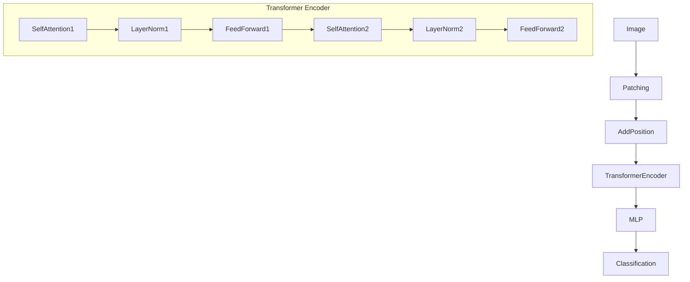

# Vision Transformer 原理与代码实例讲解

## 1. 背景介绍
### 1.1 问题的由来
近年来，深度学习技术在计算机视觉领域取得了巨大的成功，尤其是卷积神经网络(CNN)在图像分类、目标检测、语义分割等任务上表现出色。然而，CNN存在一些固有的局限性，如局部感受野、空间不变性等，限制了其进一步提升性能的潜力。因此，研究者们一直在探索新的网络架构，以克服CNN的不足。

### 1.2 研究现状 
2020年，谷歌研究团队提出了Vision Transformer(ViT)模型，将Transformer架构引入计算机视觉领域。Transformer最初应用于自然语言处理(NLP)任务，并在机器翻译、语言模型等方面取得了巨大成功。ViT将图像分割成小块，然后将这些块序列输入到Transformer中进行建模，实现了端到端的视觉任务学习。ViT在ImageNet分类任务上达到了88.55%的Top-1准确率，超过了同期最先进的CNN模型。

### 1.3 研究意义
ViT的提出开启了将Transformer应用于计算机视觉的新篇章。相比CNN，ViT具有全局感受野、动态注意力机制等优势，能够更好地捕捉图像中的长程依赖关系。此外，ViT的训练过程更加简单高效，不需要特殊设计的卷积层和池化层。ViT的成功证明了Transformer在视觉领域的巨大潜力，为后续研究指明了方向。

### 1.4 本文结构
本文将全面介绍Vision Transformer的原理和实现。第2节介绍ViT的核心概念；第3节详细阐述ViT的算法原理和操作步骤；第4节给出ViT的数学模型和公式推导；第5节提供ViT的代码实例和详细解释；第6节讨论ViT的实际应用场景；第7节推荐ViT相关的学习资源和开发工具；第8节总结ViT的研究现状和未来发展方向；第9节附录了常见问题解答。

## 2. 核心概念与联系
Vision Transformer的核心思想是将图像分割成一系列小块(patch)，然后将这些块看作一个序列输入到Transformer中进行建模。具体来说，ViT包含以下几个关键概念：

- 图像分块(Image Patching)：将输入图像分割成固定大小的小块，每个块是一个向量。这类似于CNN中的局部感受野，但ViT的分块是非重叠的。

- 位置嵌入(Position Embedding)：为每个图像块添加位置编码，以区分不同位置的块。位置编码可以是可学习的，也可以是固定的正弦函数。

- Transformer Encoder：由多个Transformer层组成，每层包含多头自注意力(Multi-Head Self-Attention)和前馈神经网络(Feed-Forward Network)。自注意力机制能够建模图像块之间的长程依赖关系。

- MLP Head：在Transformer Encoder之后添加的多层感知机，用于图像分类任务的预测。

下图展示了ViT的整体架构：

## 3. 核心算法原理 & 具体操作步骤
### 3.1 算法原理概述
ViT的核心算法可以分为以下几个步骤：
1. 将输入图像分割成固定大小的小块
2. 对每个图像块进行线性变换，得到块向量
3. 添加位置编码，区分不同位置的块
4. 将块向量序列输入到Transformer Encoder中
5. Transformer Encoder通过自注意力机制建模块之间的关系
6. 将Transformer的输出送入MLP Head进行分类预测

### 3.2 算法步骤详解

**步骤1：图像分块**

设输入图像的大小为 $(H,W,C)$，其中 $H$ 和 $W$ 分别为图像的高和宽，$C$ 为颜色通道数。将图像均匀分割成 $N$ 个大小为 $(P,P,C)$ 的非重叠块，其中 $P$ 为块大小，$N=HW/P^2$。然后将每个块拉平为一个向量，大小为 $(P^2C,)$。

**步骤2：线性变换**

对每个块向量进行线性变换，将其映射到 $D$ 维空间：

$$z_0 = [x_p^1E;x_p^2E;...;x_p^NE] + E_{pos}$$

其中，$x_p^i$ 是第 $i$ 个块向量，$E$ 是可学习的线性投影矩阵，$E_{pos}$ 是位置编码。

**步骤3：位置编码**

为每个块向量添加位置编码 $E_{pos}$，以区分不同位置的块。位置编码可以是可学习的，也可以是固定的正弦函数。

**步骤4：Transformer Encoder**

将块向量序列 $z_0$ 输入到 Transformer Encoder 中。Transformer Encoder 由 $L$ 个相同的层组成，每层包含多头自注意力(MSA)和多层感知机(MLP)：

$$z_l' = MSA(LN(z_{l-1})) + z_{l-1}$$
$$z_l = MLP(LN(z_l')) + z_l'$$

其中，$LN$ 是层归一化(Layer Normalization)，$l=1...L$。

**步骤5：自注意力机制**

多头自注意力(MSA)用于建模块向量之间的关系。对于第 $l$ 层的第 $i$ 个注意力头，计算过程如下：

$$q_i = z_{l-1}W_i^Q, k_i=z_{l-1}W_i^K, v_i=z_{l-1}W_i^V$$
$$Attention(Q,K,V) = softmax(\frac{QK^T}{\sqrt{d}})V$$
$$head_i = Attention(q_i,k_i,v_i)$$
$$MSA(z_{l-1}) = Concat(head_1,...,head_h)W^O$$

其中，$W_i^Q,W_i^K,W_i^V,W^O$ 是可学习的投影矩阵，$h$ 是注意力头的数量，$d$ 是每个头的维度。

**步骤6：分类预测**

将 Transformer Encoder 的输出 $z_L^0$ (即分类标记对应的向量)送入 MLP Head，得到最终的分类概率分布：

$$y = MLP(z_L^0)$$

其中，$y$ 是一个 $K$ 维向量，$K$ 为类别数。

### 3.3 算法优缺点

**优点**：
- 全局感受野：ViT 能够建模图像中任意两个块之间的关系，捕捉全局信息。
- 动态注意力：ViT 的自注意力机制可以根据输入图像的内容动态调整注意力权重。
- 简单高效：ViT 的训练过程简单，不需要特殊设计的卷积层和池化层。

**缺点**：
- 计算复杂度高：自注意力机制的计算复杂度与序列长度的平方成正比，对于高分辨率图像，计算开销较大。
- 数据效率低：ViT 在小规模数据集上的表现不如 CNN，需要大量的训练数据才能发挥其优势。

### 3.4 算法应用领域
- 图像分类：ViT 在 ImageNet、CIFAR 等数据集上取得了优异的分类性能。
- 目标检测：将 ViT 作为骨干网络，可以构建高效的目标检测模型，如 DETR。
- 语义分割：ViT 可以用于像素级别的分类任务，实现语义分割。
- 视频理解：将 ViT 扩展到时空域，可以处理视频数据，进行动作识别、视频分类等任务。

## 4. 数学模型和公式 & 详细讲解 & 举例说明
### 4.1 数学模型构建
ViT 的数学模型可以用以下几个关键公式来表示：

**图像分块**：

$$x_p = [x_p^1;x_p^2;...;x_p^N], x_p^i \in \mathbb{R}^{P^2C}$$

其中，$x_p$ 是图像块序列，$x_p^i$ 是第 $i$ 个块向量，$P$ 是块大小，$C$ 是颜色通道数，$N$ 是块的数量。

**线性投影**：

$$z_0 = [x_p^1E;x_p^2E;...;x_p^NE] + E_{pos}, E \in \mathbb{R}^{P^2C \times D}, E_{pos} \in \mathbb{R}^{(N+1) \times D}$$

其中，$E$ 是可学习的线性投影矩阵，$E_{pos}$ 是位置编码，$D$ 是隐藏层维度。

**Transformer Encoder**：

$$z_l' = MSA(LN(z_{l-1})) + z_{l-1}$$
$$z_l = MLP(LN(z_l')) + z_l'$$

其中，$MSA$ 是多头自注意力，$LN$ 是层归一化，$MLP$ 是多层感知机，$l=1...L$，$L$ 是 Transformer 层数。

**多头自注意力**：

$$head_i = Attention(z_{l-1}W_i^Q,z_{l-1}W_i^K,z_{l-1}W_i^V)$$
$$Attention(Q,K,V) = softmax(\frac{QK^T}{\sqrt{d}})V$$
$$MSA(z_{l-1}) = Concat(head_1,...,head_h)W^O$$

其中，$W_i^Q,W_i^K,W_i^V \in \mathbb{R}^{D \times d},W^O \in \mathbb{R}^{hd \times D}$ 是可学习的投影矩阵，$h$ 是注意力头数，$d$ 是每个头的维度。

**分类输出**：

$$y = MLP(z_L^0), y \in \mathbb{R}^K$$

其中，$z_L^0$ 是 Transformer 最后一层的分类标记输出，$K$ 是类别数。

### 4.2 公式推导过程

**自注意力公式推导**：

对于第 $l$ 层第 $i$ 个注意力头，输入为 $z_{l-1} \in \mathbb{R}^{N \times D}$。首先通过线性变换得到查询矩阵 $Q$，键矩阵 $K$ 和值矩阵 $V$：

$$Q = z_{l-1}W_i^Q, K = z_{l-1}W_i^K, V = z_{l-1}W_i^V$$

其中，$W_i^Q,W_i^K,W_i^V \in \mathbb{R}^{D \times d}$ 是可学习的投影矩阵。

然后计算 $Q$ 和 $K$ 的点积注意力得分：

$$A = \frac{QK^T}{\sqrt{d}} \in \mathbb{R}^{N \times N}$$

接着对注意力得分进行 softmax 归一化，得到注意力权重：

$$\alpha = softmax(A) \in \mathbb{R}^{N \times N}$$

最后根据注意力权重对值矩阵 $V$ 进行加权求和，得到注意力输出：

$$head_i = \alpha V \in \mathbb{R}^{N \times d}$$

多头自注意力的输出是将所有头的输出拼接起来，再经过一个线性变换：

$$MSA(z_{l-1}) = Concat(head_1,...,head_h)W^O$$

其中，$W^O \in \mathbb{R}^{hd \times D}$ 是可学习的投影矩阵。

**前向传播公式推导**：

假设输入图像 $x \in \mathbb{R}^{H \times W \times C}$，块大小为 $P$，隐藏层维度为 $D$，类别数为 $K$，Transformer 层数为 $L$。

1. 图像分块：将图像分割成 $N=HW/P^2$ 个块，每个块拉平为向量 $x_p^i \in \mathbb{R}^{P^2C}$，得到块序列 $x_p \in \mathbb{R}^{N \times P^2C}$。

2. 线性投影：对块序列进行线性变换和位置编码，得到初始的隐藏状态 $z_0 \in \mathbb{R}^{(N+1) \