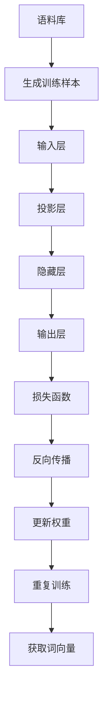

以下是《Word Embeddings 原理与代码实战案例讲解》的正文内容：

# Word Embeddings 原理与代码实战案例讲解

## 1. 背景介绍

### 1.1 问题的由来

在自然语言处理(NLP)领域中,将文本转换为机器可以理解和处理的数值向量表示一直是一个核心挑战。传统的文本表示方法,如one-hot编码和bag-of-words模型,存在高维稀疏、无法捕捉词与词之间语义关联等缺陷,这极大地限制了NLP任务的性能。

为了解决这一问题,Word Embeddings(词嵌入)技术应运而生。它通过将单词映射到低维连续的向量空间中,使得语义相似的单词在向量空间中彼此靠近,从而捕捉单词之间的语义关系和上下文信息。这种分布式表示方式不仅降低了维度,还能体现单词在不同上下文中的多义性,为下游的NLP任务提供了高质量的输入表示,极大地推动了NLP技术的发展。

### 1.2 研究现状

Word Embeddings最早可追溯到2003年,Bengio等人提出的神经网络语言模型(NNLM)首次尝试将词映射到低维连续向量空间。2013年,Mikolov等人在Google开发了两种高效的Word Embeddings模型:CBOW(Continuous Bag-of-Words)和Skip-Gram,并发表了著名的word2vec工具,标志着Word Embeddings进入了实用化阶段。

此后,GloVe、fastText、ELMo、BERT等新型Word Embeddings模型不断涌现,在捕捉词义、上下文信息、子词信息等方面有了长足进展。这些模型已广泛应用于机器翻译、文本分类、情感分析、问答系统等NLP任务中,取得了卓越的性能。

### 1.3 研究意义

Word Embeddings技术的出现为NLP领域带来了革命性的变革,它克服了传统文本表示方法的诸多缺陷,为机器更好地理解自然语言奠定了基础。研究Word Embeddings原理及其应用,不仅可以帮助我们更深入地理解语言的本质,还能推动NLP技术在机器翻译、信息检索、对话系统等领域的创新发展。

### 1.4 本文结构

本文将全面介绍Word Embeddings的核心概念、原理及实践应用。第2节将阐述Word Embeddings的基本思想和主要模型;第3节深入探讨Word Embeddings的核心算法原理;第4节将通过数学模型和公式,对算法进行严格的理论推导;第5节将提供Word Embeddings的代码实现及案例分析;第6节将介绍Word Embeddings在实际应用中的场景;第7节将推荐相关的工具和学习资源;最后第8节将总结Word Embeddings的发展趋势和面临的挑战。

## 2. 核心概念与联系

Word Embeddings的核心思想是将单词映射到低维连续的向量空间中,使得在该向量空间内,语义相似的单词彼此靠近。这种分布式表示方式不仅降低了维度,还能捕捉单词在不同上下文中的多义性,为NLP任务提供高质量的输入表示。

Word Embeddings主要包括以下几个关键概念:

1. **One-hot Representation**:传统的one-hot编码将每个单词表示为一个高维稀疏向量,其中只有一个位置为1,其余全为0。这种表示方式无法体现单词之间的语义关联。

2. **Distributed Representation**:分布式表示将单词映射到低维连续的向量空间中,使得语义相似的单词在该空间内彼此靠近。这种表示方式能够很好地捕捉单词之间的语义关系和上下文信息。

3. **Word Analogy**:在Word Embeddings向量空间中,单词之间的线性关系往往对应着语义上的类比关系,如"男人 - 女人 + 女王 ≈ 国王"。这种单词类比特性反映了Word Embeddings捕捉了单词之间微妙的语义关联。

4. **Word Similarity**:在Word Embeddings向量空间中,两个单词向量的余弦相似度可以度量它们的语义相似程度。这为基于语义的文本相似度计算、文本聚类等任务提供了有力支持。

5. **主要模型**:目前主要的Word Embeddings模型包括Word2Vec(CBOW和Skip-Gram)、GloVe、fastText、ELMo、BERT等。这些模型在捕捉词义、上下文信息、子词信息等方面各有侧重。

Word Embeddings将自然语言单词映射到数值向量空间,为机器理解语义信息提供了有效途径,是NLP领域中极为重要的基础技术。

## 3. 核心算法原理 & 具体操作步骤

### 3.1 算法原理概述

Word Embeddings的核心算法原理是通过神经网络模型对大规模语料库进行无监督训练,自动学习每个单词在低维连续向量空间中的表示,使得语义相似的单词在该向量空间内彼此靠近。

常见的Word Embeddings算法主要包括:

1. **Word2Vec**:由Google的Mikolov等人于2013年提出,包括两种模型CBOW(Continuous Bag-of-Words)和Skip-Gram。CBOW基于上下文预测目标单词,Skip-Gram则基于目标单词预测上下文。两种模型都采用了Hierarchical Softmax和Negative Sampling等技术来加速训练。

2. **GloVe**(Global Vectors for Word Representation):由斯坦福大学的Pennington等人于2014年提出。该算法利用单词共现统计信息,通过最小化单词共现概率与单词向量点积之间的差异,获得单词的向量表示。

3. **fastText**:由Facebook AI研究院于2016年提出,支持基于字符级别的子词嵌入表示,能够更好地处理生僻词和新词。

4. **ELMo**(Embeddings from Language Models):由AI2于2018年提出,利用双向语言模型捕捉单词的上下文信息,生成动态的单词嵌入表示。

5. **BERT**(Bidirectional Encoder Representations from Transformers):由Google于2018年提出,采用Transformer编码器结构对双向语境进行建模,生成上下文敏感的单词表示,在多项NLP任务上取得了卓越表现。

上述算法均基于神经网络模型对大规模语料库进行无监督训练,学习每个单词在低维向量空间中的分布式表示,从而捕捉单词之间的语义关联和上下文信息。

### 3.2 算法步骤详解

以Word2Vec的CBOW模型为例,我们详细介绍Word Embeddings算法的训练步骤:

1. **语料库预处理**:首先需要准备大规模的语料库文本数据,并进行分词、去除低频词等预处理。

2. **生成训练样本**:以滑动窗口的方式从语料库中提取上下文单词序列,将上下文单词作为输入,目标单词作为输出,构建训练样本对。

3. **输入层**:将上下文单词的one-hot编码输入到Embedding层,将其映射到低维的词向量表示。

4. **投影层**:将上下文单词的词向量相加,得到上下文向量表示。

5. **隐藏层**:上下文向量通过隐藏层进行非线性变换。

6. **输出层**:隐藏层的输出通过Softmax层,得到预测的目标单词在词表中的概率分布。

7. **损失函数**:将预测的概率分布与目标单词的one-hot编码计算交叉熵损失。

8. **反向传播**:根据损失函数,利用反向传播算法计算梯度。

9. **更新权重**:使用优化算法(如SGD)更新Embedding层和神经网络模型的权重参数。

10. **重复训练**:重复上述过程,对语料库中的所有样本进行多次迭代训练,直至模型收敛。

11. **获取词向量**:训练完成后,从Embedding层获取每个单词对应的词向量表示。

通过上述无监督训练过程,Word Embeddings算法可以自动学习每个单词在低维向量空间中的分布式表示,使得语义相似的单词在该空间内彼此靠近,从而捕捉单词之间的语义关联和上下文信息。

### 3.3 算法优缺点

Word Embeddings算法的主要优点包括:

1. **降维性能好**:将高维稀疏的one-hot表示映射到低维连续的向量空间,降低了维度,提高了计算效率。

2. **捕捉语义关联**:能够捕捉单词之间的语义关联,使得语义相似的单词在向量空间内彼此靠近。

3. **提供上下文信息**:向量表示能够体现单词在不同上下文中的多义性,为下游NLP任务提供有用的上下文信息。

4. **无监督学习**:算法基于无监督学习,无需人工标注语料,可以利用大规模的未标注语料进行训练。

5. **泛化能力强**:训练好的Word Embeddings可直接应用于各种NLP任务,具有很强的泛化能力。

不过,Word Embeddings算法也存在一些缺点和局限性:

1. **语义偏差**:由于训练语料的局限性,可能会导致词向量存在一定的语义偏差或偏见。

2. **稀疏词向量**:对于一些生僻词或新词,由于语料中出现频率较低,其词向量可能不够精确。

3. **语义漂移**:随着时间推移,单词的语义可能会发生变化,但预训练的词向量无法动态更新。

4. **缺乏多词组合**:单个词的词向量难以很好地表示多词短语或复杂语义的组合关系。

5. **缺乏语法信息**:词向量主要捕捉词的语义信息,缺乏对词性、句法结构等语法信息的编码。

尽管存在一些不足,Word Embeddings技术仍然是NLP领域中极为重要和有影响力的基础技术,为机器理解自然语言奠定了坚实基础。

### 3.4 算法应用领域

Word Embeddings算法广泛应用于自然语言处理的各个领域,主要包括:

1. **机器翻译**:在神经机器翻译系统中,Word Embeddings可以为源语言和目标语言提供高质量的词向量表示,捕捉词与词之间的语义关联,从而提高翻译质量。

2. **文本分类**:在文本分类任务中,Word Embeddings可以将文本映射到向量空间,作为分类模型(如CNN、RNN等)的输入,提高分类的准确性。

3. **情感分析**:通过Word Embeddings捕捉情感词与其他词之间的语义关联,可以更好地理解文本的情感倾向,提升情感分析的性能。

4. **命名实体识别**:利用Word Embeddings捕捉词与词之间的上下文关系,可以更准确地识别出文本中的命名实体,如人名、地名、组织机构名等。

5. **问答系统**:在问答系统中,Word Embeddings可以帮助计算问句与候选答案之间的语义相似度,从而更好地匹配问题和答案。

6. **文本相似度计算**:通过计算两个文本的词向量之间的余弦相似度,可以量化它们的语义相似程度,广泛应用于文本聚类、重复检测、推荐系统等领域。

7. **词义消歧**:利用Word Embeddings捕捉单词在不同上下文中的多义性,可以更好地识别和区分单词的不同词义。

8. **关系抽取**:通过Word Embeddings捕捉实体与实体之间、实体与动词之间的语义关联,可以更准确地从文本中抽取出实体之间的关系。

总之,Word Embeddings作为自然语言处理的基础技术,在机器翻译、文本分类、问答系统等诸多领域发挥着重要作用,为机器更好地理解自然语言奠定了坚实基础。

## 4.