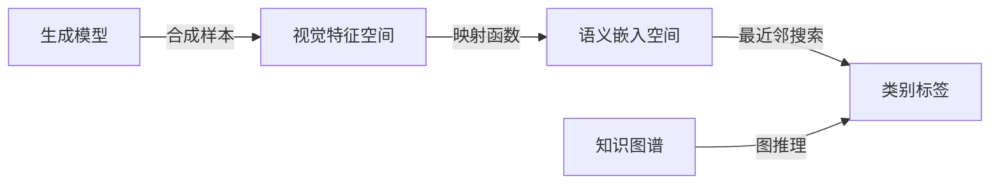

# Zero-Shot Learning 原理与代码实例讲解

## 1. 背景介绍
### 1.1 问题的由来
在传统的机器学习和深度学习中,我们通常需要大量的标注数据来训练模型。但在现实世界中,很多情况下我们无法获得足够的标注数据,甚至某些类别完全没有训练样本。Zero-Shot Learning (零次学习)就是为了解决这个问题而提出的。它希望模型能够识别那些在训练阶段未曾见过的类别,就像人类可以根据对事物的描述和理解认识新事物一样。

### 1.2 研究现状
Zero-Shot Learning 在近年来受到了学术界和工业界的广泛关注。一些经典的 ZSL 方法包括:
- 基于属性的方法:通过中间属性空间将视觉特征映射到语义空间。
- 基于知识图谱的方法:利用类别之间在知识图谱或本体中的关系进行推理。
- 基于生成式方法:通过生成模型合成看不见类别的训练样本。

此外还有一些将 ZSL 与小样本学习、域适应等方向结合的工作,以进一步提升模型性能。

### 1.3 研究意义
Zero-Shot Learning 具有重要的理论和实践意义:
1. 它让机器学习模型具备了一定的常识推理和类比能力,是通用人工智能的重要组成。 
2. 在现实应用中,很多长尾、新兴的物体类别缺乏训练数据,ZSL 为识别这些类别提供了可能。
3. ZSL 有利于降低模型对大规模标注数据的依赖,减少人工标注成本。

### 1.4 本文结构
本文将从以下几个方面对 Zero-Shot Learning 进行系统阐述:
- 第2部分介绍 ZSL 的核心概念与类别关系
- 第3部分讲解 ZSL 的主要算法原理和实现步骤
- 第4部分深入 ZSL 背后的数学模型和公式推导
- 第5部分通过代码实例演示如何实现一个 ZSL 系统
- 第6部分展望 ZSL 的实际应用场景
- 第7部分推荐 ZSL 相关的学习资源和工具
- 第8部分总结全文,并对 ZSL 的未来发展趋势和挑战进行展望

## 2. 核心概念与联系
Zero-Shot Learning 的目标是让模型能识别训练集中未曾出现过的"看不见"的类别。它的核心思想是找到一个将视觉特征空间映射到语义空间的映射函数。其中:
- 视觉空间:图像的特征表示,通常由预训练的CNN提取。
- 语义空间:每个类别对应的语义向量表示,可以是属性向量或词向量等。
- 映射函数:视觉特征到语义向量的映射,可以是线性的或非线性的函数。

通过这种映射,模型可以将"看不见"类别的图像映射到相应的语义向量,然后通过与已知类别的语义向量比较,找出最相似的类别作为预测结果。

除了这种基于语义嵌入空间的主流范式,ZSL 还可以通过知识图谱建模类别之间的层次关系和逻辑关系,或者通过生成式方法合成未知类别的训练样本。

总的来说,ZSL 的核心在于借助先验知识,构建起视觉空间与类别语义空间之间的桥梁,从而实现对未知类别的识别。不同的 ZSL 方法的区别在于如何表示类别语义,如何构建映射函数,以及如何进行推理预测。



## 3. 核心算法原理 & 具体操作步骤
### 3.1 算法原理概述
基于语义嵌入的 ZSL 方法通常包含以下关键步骤:
1. 特征提取:使用预训练的 CNN 对图像提取语义特征。
2. 语义嵌入:将每个类别的语义信息(如属性、文本描述)嵌入到语义空间。 
3. 映射学习:学习一个将视觉特征映射到语义空间的函数。
4. 推理预测:对测试图像提取特征,映射到语义空间,找最近邻的类别向量作为预测。

其中映射函数的学习是核心,常见的学习范式有:
- 回归方法:学习从视觉特征到类别语义向量的回归函数。
- 结构嵌入:同时学习视觉-语义空间的结构性表示。
- 对抗学习:引入判别器对抗优化,缩小视觉-语义的分布差异。

### 3.2 算法步骤详解
以简单的线性回归映射为例,ZSL 的主要步骤如下:
1. 对于训练集中的每个图像 $x_i$,提取其 CNN 特征向量 $f(x_i)$。
2. 对于每个训练类别 $y$,基于其属性或文本描述,构建语义嵌入向量 $a_y$。
3. 学习一个线性映射矩阵 $W$,使得:

$$
\min_W \sum_i \| W f(x_i) - a_{y_i} \|^2
$$

4. 对于测试图像 $\hat{x}$,提取其特征 $f(\hat{x})$,通过 $W$ 映射到语义空间:

$$
\hat{a} = W f(\hat{x})
$$

5. 在语义空间中,找到与 $\hat{a}$ 最近邻的类别向量 $a_y$,作为预测的类别:

$$
\hat{y} = \arg\min_y d(\hat{a}, a_y)
$$

其中 $d$ 为语义空间的距离度量,常用余弦相似度或欧氏距离。

### 3.3 算法优缺点
基于语义嵌入的 ZSL 方法的优点是:
- 可解释性强,直接建模视觉-语义的关联。
- 可扩展性好,易于添加新的类别和属性。
- 通用性强,可用于图像分类、检测、分割等任务。

其缺点主要在于:
- 语义空间的表示可能不充分,影响性能。
- 视觉-语义间的语义鸿沟,导致域偏移问题。
- 类别不平衡问题,易偏向头部类别。

### 3.4 算法应用领域
ZSL 可应用于多种计算机视觉任务,如:
- 图像分类:识别新的物体、场景类别。
- 目标检测:检测未见过的目标类型。
- 语义分割:对新类别的图像区域进行分割。
- 人脸识别:识别未入库的新人脸等。

此外,ZSL 还可用于多模态学习、视频分析、医学影像等领域。

## 4. 数学模型和公式 & 详细讲解 & 举例说明
### 4.1 数学模型构建
设训练集为 $\mathcal{D} = \{(x_i, y_i)\}$,其中 $x_i$ 为图像,$y_i$ 为其类别标签。$\mathcal{S} = \{y_1, \ldots, y_s\}$ 为训练集中的"已见"类别集合。

每个类别 $y$ 对应一个语义嵌入向量 $a_y \in \mathcal{A}$,其中 $\mathcal{A}$ 为语义嵌入空间。

ZSL 的目标是学习一个映射函数 $f: \mathcal{X} \mapsto \mathcal{A}$,使得对于未见类别的测试图像 $\hat{x}$,可以预测其类别:

$$
\hat{y} = \arg\max_{y \in \mathcal{U}} \cos (f(\hat{x}), a_y)
$$

其中 $\mathcal{U}$ 为未见类别集合,$\cos$ 为余弦相似度。

### 4.2 公式推导过程
线性映射 $f(x) = Wx$ 的学习过程可表示为:

$$
\min_{W} \mathcal{L}(W) = \frac{1}{N} \sum_{i=1}^N \| W x_i - a_{y_i} \|^2_2 + \lambda \| W \|^2_F
$$

其中 $\| \cdot \|_F$ 为矩阵的 Frobenius 范数,用于正则化以防止过拟合。$\lambda$ 为正则化系数。

上式可通过梯度下降法求解,梯度为:

$$
\frac{\partial \mathcal{L}}{\partial W} = \frac{2}{N} \sum_{i=1}^N (W x_i - a_{y_i}) x_i^T + 2 \lambda W
$$

### 4.3 案例分析与讲解
以动物识别为例,假设训练集包含 $\{\text{cat}, \text{dog}, \text{rabbit}\}$ 三个类别,每个类别有若干张图像。我们希望模型能识别一个新的动物类别 $\text{tiger}$。

首先,提取每张图像的 CNN 特征,得到特征矩阵 $X \in \mathbb{R}^{d \times N}$。然后,基于动物的属性(如 $\{\text{has_fur}, \text{has_claws}, \text{is_wild}\}$)构建语义嵌入矩阵 $A \in \{0, 1\}^{s \times k}$:

$$
A = 
\begin{bmatrix}
1 & 0 & 0\\
1 & 0 & 0\\
1 & 0 & 0\\
1 & 1 & 1
\end{bmatrix}
$$

其中最后一行为 $\text{tiger}$ 的属性向量。

接下来,通过优化问题学习映射矩阵 $W$:

$$
W^* = \arg\min_W \| W X - A \|^2_F
$$

得到 $W^*$ 后,对于一张 $\text{tiger}$ 的测试图像 $\hat{x}$,提取其特征 $\hat{x}$,然后计算:

$$
\hat{a} = W^* \hat{x}
$$

比较 $\hat{a}$ 与每个类别的属性向量 $a_y$ 的相似度,相似度最大的即为预测类别:

$$
\hat{y} = \arg\max_{y \in \{\text{cat}, \text{dog}, \text{rabbit}, \text{tiger}\}} \cos (\hat{a}, a_y)
$$

### 4.4 常见问题解答
Q: 如何构建语义嵌入空间?
A: 主要有三类方法:基于属性(需要人工定义),基于文本描述(如 word2vec),以及基于知识图谱。理想的语义嵌入应该能充分表达类别间的语义关系。

Q: 如何缓解 ZSL 中的域偏移问题?
A: 域偏移是指训练集和测试集的特征分布不一致。主要策略包括:对抗学习缩小视觉-语义分布差异,生成式方法合成未见类别样本,以及使用更鲁棒的特征表示和映射函数。

Q: ZSL 的评价指标有哪些?
A: 常用的指标包括:Top-1/5 准确率,harmonic mean (调和平均),area under seen-unseen curve (AUSUC) 等。其中 harmonic mean 用于平衡"已见"和"未见"类别的性能。

## 5. 项目实践：代码实例和详细解释说明
### 5.1 开发环境搭建
本项目使用 Python3 和 PyTorch 实现,需要安装以下依赖库:
- pytorch
- torchvision
- numpy
- scipy
- sklearn
- matplotlib

可使用 Anaconda 创建虚拟环境并安装:

```bash
conda create -n zsl python=3.7
conda activate zsl
pip install pytorch torchvision numpy scipy scikit-learn matplotlib
```

### 5.2 源代码详细实现
以下是一个简单的 ZSL 图像分类器的 PyTorch 实现:

```python
import torch
import torch.nn as nn
import torch.optim as optim
from torch.utils.data import Dataset, DataLoader
import torchvision.models as models
import numpy as np
from sklearn.preprocessing import normalize

class ImageDataset(Dataset):
    def __init__(self, features, labels):
        self.features = features
        self.labels = labels
        
    def __len__(self):
        return len(self.labels)
    
    def __getitem__(self, idx):
        return self.features[idx], self.labels[idx]

class ZSLNet(nn.Module):
    def __init__(self, input_dim, output_dim):
        super(ZSLNet, self).__