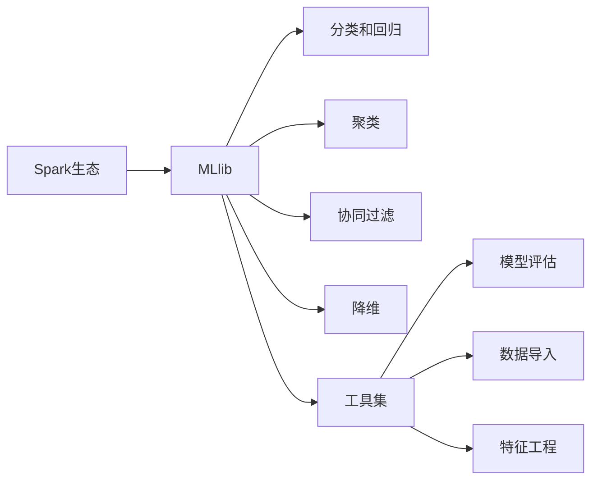

# 【AI大数据计算原理与代码实例讲解】MLlib

关键词：MLlib, 机器学习, 大数据, Spark, 分布式计算, 推荐系统, 聚类, 分类, 回归, 深度学习

## 1. 背景介绍
### 1.1  问题的由来
随着大数据时代的到来,海量数据的存储和处理成为了企业和研究机构面临的重大挑战。传统的单机处理模式已经无法满足日益增长的计算需求。同时,人工智能和机器学习技术的快速发展,对大规模数据的实时计算提出了更高的要求。如何高效地利用分布式计算资源,实现机器学习算法的并行化,成为了业界关注的焦点。
### 1.2  研究现状
目前,业界主流的大数据处理框架包括Hadoop、Spark等。其中,Spark凭借其快速、通用、易用等特点,在学术界和工业界得到了广泛应用。Spark生态系统中的MLlib作为其核心组件之一,提供了丰富的分布式机器学习算法库,可以帮助用户快速构建大规模机器学习应用。

国内外已有不少团队基于MLlib开展研究和应用实践。比如:
- 腾讯的广告平台使用MLlib进行点击率预估,显著提升了广告投放效果
- 阿里利用MLlib优化了搜索和推荐系统,大幅提高了用户体验
- 滴滴出行基于MLlib构建了智能调度系统,有效缓解了供需失衡问题

### 1.3  研究意义
深入研究MLlib的架构原理和算法实现,对于理解和掌握分布式机器学习计算模式具有重要意义。通过对MLlib的学习和实践,可以:
1. 了解当前主流的分布式机器学习范式
2. 掌握经典机器学习算法的分布式实现方法  
3. 积累大规模机器学习系统的开发经验
4. 探索人工智能技术在实际场景中的应用价值

这不仅能够帮助我们设计和优化机器学习系统,也为解决实际问题提供了新的思路。

### 1.4  本文结构
本文将重点介绍MLlib的整体架构、核心算法、编程实践等内容。主要章节安排如下:
- 第2节: MLlib的核心概念与内在联系
- 第3节: MLlib的架构原理和工作流程
- 第4节: MLlib的数学基础和算法详解
- 第5节: 基于MLlib的项目实践和代码解读
- 第6节: MLlib在推荐、广告、金融等领域的应用案例
- 第7节: MLlib相关工具和学习资源推荐
- 第8节: MLlib的未来发展趋势与面临的挑战
- 第9节: 常见问题解答

## 2. 核心概念与联系
在正式介绍MLlib之前,我们有必要先了解一些相关的核心概念:
- 大数据(Big Data):数据量大、类型多、处理速度快、价值密度低的数据集合
- 分布式计算(Distributed Computing):通过网络将计算任务分配到多个节点协同完成
- Spark:一个快速、通用的大规模数据处理引擎,支持Java、Scala、Python、R等语言
- RDD(Resilient Distributed Dataset):Spark的基本计算单元,支持丰富的转换和动作操作
- 机器学习(Machine Learning):一类从数据中自动分析获得规律,并利用规律对未知数据进行预测的算法
- 监督学习(Supervised Learning):由已标注的训练样本学习预测模型,代表算法有决策树、SVM等
- 无监督学习(Unsupervised Learning):从无标注的数据中发现内在结构和规律,代表算法有聚类、降维等
- 推荐系统(Recommender System):根据用户的历史行为和兴趣特征,向其推荐感兴趣的信息和商品

MLlib正是一个基于Spark的分布式机器学习算法库。它利用Spark的分布式内存计算引擎,为常见的机器学习算法提供了高性能、高可扩展的实现。通过MLlib,用户可以在海量数据上快速训练模型,并将机器学习应用部署到生产环境中。

MLlib目前支持以下四大类机器学习任务:
1. 分类和回归:如逻辑回归、决策树、随机森林、梯度提升树、线性支持向量机等
2. 聚类:如K-means、高斯混合模型、幂迭代聚类等
3. 协同过滤:如交替最小二乘、隐语义模型等
4. 降维:如奇异值分解、主成分分析等

此外,MLlib还提供了模型评估、数据导入、特征提取、转换和选择等辅助工具。

下图展示了MLlib的核心概念之间的关系:

可以看到,MLlib是Spark生态的重要组成部分,为各类机器学习任务提供了统一的编程接口和工具支持。这大大降低了分布式机器学习的开发门槛,使得普通开发者也能轻松上手。

## 3. 核心算法原理 & 具体操作步骤
### 3.1  算法原理概述
MLlib实现了多种分类、回归、聚类、协同过滤等经典的机器学习算法。这里我们以逻辑回归为例,讲解其分布式实现原理。

逻辑回归是一种常用的分类算法,它利用Sigmoid函数将样本特征映射到0~1之间,得到样本属于正类的概率。其数学形式如下:

$$
h_\theta(x)=g(\theta^Tx)=\frac{1}{1+e^{-\theta^Tx}}
$$

其中,$x$为样本特征向量,$\theta$为待学习的参数,$g$为Sigmoid函数。

在大数据场景下,样本数量非常庞大,使用单机的批量梯度下降法(BGD)进行训练非常耗时。MLlib采用了分布式的随机梯度下降法(SGD)来加速模型训练。

### 3.2  算法步骤详解
MLlib的分布式逻辑回归算法主要分为以下几个步骤:
1. 数据读入和分区:将HDFS上的数据按照一定的规则划分成多个分区,加载为RDD
2. 模型初始化:初始化逻辑回归模型的参数$\theta$
3. 迭代优化:重复以下步骤直到参数收敛或达到最大迭代次数
   - 每个分区并行计算局部梯度
   - 汇总各分区的局部梯度,更新全局参数
4. 模型评估:使用测试集评估训练得到的模型性能

其中,最关键的是参数的更新过程。假设每个节点计算得到的局部梯度为$g_i$,学习率为$\alpha$,则全局参数$\theta$的更新公式为:

$$
\theta:=\theta-\alpha\sum_{i=1}^n g_i
$$

可以看到,MLlib巧妙地利用了Spark的分布式计算能力,将批量梯度下降转化为随机梯度下降,从而实现了并行化加速。同时,参数在节点间的同步开销也大大降低。

### 3.3  算法优缺点
MLlib的分布式逻辑回归相比单机实现有以下优点:
- 训练速度快:可以利用集群资源并行训练,显著缩短训练时间
- 可扩展性强:可以通过增加节点数来提高计算能力,适应不断增长的数据量
- 容错性好:基于Spark的容错机制,能够自动从节点失效中恢复

但它也存在一些局限性:
- 算法选择有限:目前MLlib支持的算法还比较有限,对一些复杂模型的支持不够
- 参数调优困难:分布式环境下各种参数的选择和调优比较困难,需要丰富的经验
- 模型规模受限:受内存限制,单个模型的规模不能过大,否则会出现OOM等问题

### 3.4  算法应用领域
逻辑回归是一种非常常用的分类算法,在互联网领域有广泛的应用,如:
- 垃圾邮件识别:根据邮件的内容和元信息,判断其是否为垃圾邮件
- 用户流失预测:根据用户的行为特征,预测其流失的可能性
- 信用评分:根据用户的个人信息和信用记录,评估其信用等级
- 推荐系统:根据用户的历史行为,预测其对新商品的兴趣度

此外,逻辑回归还被用于金融风控、医疗诊断、自然语言处理等众多领域。

## 4. 数学模型和公式 & 详细讲解 & 举例说明
### 4.1  数学模型构建
逻辑回归的数学模型如下:

$$
\begin{aligned}
P(y=1|x;\theta)&=h_\theta(x)=\frac{1}{1+e^{-\theta^Tx}}\\
P(y=0|x;\theta)&=1-h_\theta(x)=\frac{e^{-\theta^Tx}}{1+e^{-\theta^Tx}}
\end{aligned}
$$

其中,$y\in\{0,1\}$为样本的标签,$x$为样本的特征向量,$\theta$为待学习的参数。

对于给定的训练集$\{(x^{(i)},y^{(i)})\}_{i=1}^m$,逻辑回归的目标是最大化似然函数:

$$
\begin{aligned}
L(\theta)&=\prod_{i=1}^m P(y^{(i)}|x^{(i)};\theta)\\
&=\prod_{i=1}^m (h_\theta(x^{(i)}))^{y^{(i)}}(1-h_\theta(x^{(i)}))^{1-y^{(i)}}
\end{aligned}
$$

取对数后得到对数似然函数:

$$
\ell(\theta)=\log L(\theta)=\sum_{i=1}^m [y^{(i)}\log h_\theta(x^{(i)})+(1-y^{(i)})\log(1-h_\theta(x^{(i)}))]
$$

最大化$\ell(\theta)$等价于最小化损失函数:

$$
J(\theta)=-\frac{1}{m}\ell(\theta)=-\frac{1}{m}\sum_{i=1}^m [y^{(i)}\log h_\theta(x^{(i)})+(1-y^{(i)})\log(1-h_\theta(x^{(i)}))]
$$

这就将逻辑回归问题转化为了一个无约束的最优化问题。

### 4.2  公式推导过程
求解逻辑回归问题,需要求解最优化问题:

$$
\theta^*=\arg\min_\theta J(\theta)
$$

MLlib采用随机梯度下降法来求解该问题。随机梯度下降法的基本思想是:每次随机抽取一个样本,计算其梯度,然后沿梯度的反方向更新参数。

具体来说,假设随机抽取的样本为$(x^{(i)},y^{(i)})$,则损失函数的梯度为:

$$
\begin{aligned}
\nabla_\theta J(\theta)&=-\frac{1}{m}\nabla_\theta \ell(\theta)\\
&=-\frac{1}{m}(y^{(i)}-h_\theta(x^{(i)}))x^{(i)}
\end{aligned}
$$

则参数$\theta$的更新公式为:

$$
\theta:=\theta-\alpha(h_\theta(x^{(i)})-y^{(i)})x^{(i)}
$$

其中$\alpha$为学习率。重复以上过程直到参数收敛或达到最大迭代次数。

### 4.3  案例分析与讲解
下面我们以一个简单的二分类问题为例,演示逻辑回归的建模过程。

假设有10个样本,每个样本有两个特征$x_1$和$x_2$,标签$y\in\{0,1\}$。数据如下:

| $x_1$ | $x_2$ | $y$ |
|-------|-------|-----|
| 1.0   | 2.0   | 0   |
| 2.0   | 1.1   | 0   |
| 1.3   | 1.0   | 0   |
| 5.0   | 4.2   | 1   |
| 4.8   | 5.1   | 1   |
| 2.3   | 6.1