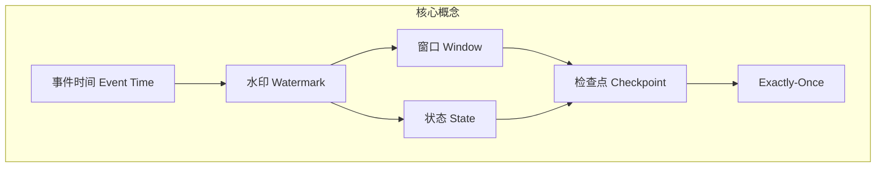
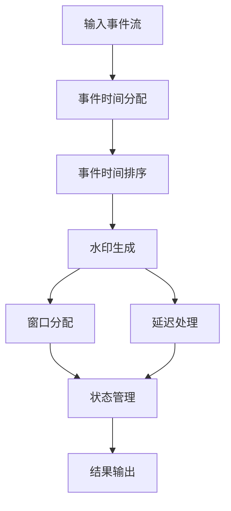

好的,我明白了您的要求。以下是标题为《【AI大数据计算原理与代码实例讲解】事件时间》的技术博客文章的正文部分:

# 【AI大数据计算原理与代码实例讲解】事件时间

## 1. 背景介绍

### 1.1 问题的由来

在当今大数据时代,海量的数据被持续产生和采集,如何高效地处理和分析这些数据成为了一个迫切的问题。其中,事件数据作为一种重要的数据类型,广泛存在于各个领域,如网络日志、传感器数据、金融交易记录等。事件数据通常以时间序列的形式出现,描述了一系列按时间顺序发生的事件。

对于事件数据的处理和分析,传统的批处理方法已经不能满足实时性和低延迟的需求。因此,需要一种新的计算模型来高效处理事件数据流。这就催生了事件时间(Event Time)的概念,它为处理无边界、持续到来的事件数据流提供了一种新的计算范式。

### 1.2 研究现状  

事件时间的概念最早源于流式处理(Stream Processing)领域,旨在解决传统批处理系统在处理持续到来的数据流时面临的挑战。Apache Flink、Apache Spark Streaming 和 Apache Kafka 等流处理系统都支持事件时间语义。

近年来,随着大数据技术的不断发展,事件时间的概念也逐渐被引入到其他领域,如机器学习、数据库系统等。例如,TensorFlow 支持使用事件时间来训练循环神经网络模型;Apache Hudi 等数据湖系统利用事件时间来管理增量数据的更新和压缩。

### 1.3 研究意义

事件时间为处理无边界、持续到来的事件数据流提供了一种新的计算范式,具有以下重要意义:

1. **准确性**:通过使用事件发生的实际时间而不是处理时间,可以保证计算结果的准确性,避免由于数据乱序或延迟到达而导致的错误。

2. **一致性**:基于事件时间的处理可以确保相同的输入事件流产生相同的结果,从而提高系统的可重复性和一致性。

3. **低延迟**:事件时间处理能够在数据到达时立即进行计算,而不必等待所有数据到达,从而实现低延迟的实时处理。

4. **容错性**:通过重新处理延迟到达的事件,事件时间处理可以提高系统的容错性,确保计算结果的完整性和正确性。

5. **可扩展性**:事件时间处理天然支持分布式和并行计算,可以轻松扩展以处理大规模的事件数据流。

综上所述,事件时间为实时数据处理、机器学习、数据库等领域提供了一种通用的计算模型,对于构建高性能、高可靠的大数据系统具有重要意义。

### 1.4 本文结构

本文将全面介绍事件时间的核心概念、算法原理、数学模型、实际应用场景以及相关代码实现。文章结构安排如下:

1. 背景介绍
2. 核心概念与联系
3. 核心算法原理与具体操作步骤
4. 数学模型和公式详细讲解与举例说明
5. 项目实践:代码实例和详细解释说明
6. 实际应用场景
7. 工具和资源推荐
8. 总结:未来发展趋势与挑战
9. 附录:常见问题与解答

## 2. 核心概念与联系

事件时间(Event Time)是一种用于处理无边界、持续到来的事件数据流的计算模型。它基于事件发生的实际时间而不是处理时间来对事件进行排序和计算。与之相关的核心概念包括:

1. **Processing Time**:处理时间是指事件被处理的实际时间,它取决于事件到达系统的时间以及系统的负载情况。

2. **Event Time**:事件时间是指事件实际发生的时间,通常由事件数据本身携带。

3. **Watermark**:水印(Watermark)是一种衡量事件时间进度的机制,它是一个事件时间戳,表示当前事件时间的下界。水印用于确定哪些事件已经延迟到达,从而触发相应的计算或清理操作。

4. **Window**:窗口(Window)是一种用于对事件数据流进行分组和聚合的机制。根据窗口的类型不同,可以划分为时间窗口(Time Window)、计数窗口(Count Window)和会话窗口(Session Window)等。

5. **State**:状态(State)是指系统在处理事件数据流时需要维护的中间结果或元数据。状态可以是内部状态(如窗口聚合结果)或外部状态(如与外部系统交互的缓存数据)。

6. **Checkpoint**:检查点(Checkpoint)是一种容错机制,用于定期保存系统的状态快照,以便在发生故障时能够从最近的一致状态恢复。

7. **Exactly-Once**:准确一次(Exactly-Once)是指对于每个输入事件,计算结果只会被精确计算和输出一次,即使发生故障也不会重复计算或遗漏计算。这是事件时间处理需要满足的一个重要语义。

这些核心概念相互关联,共同构建了事件时间处理的基础框架。其中,事件时间和水印是核心概念,它们确定了事件的顺序和进度;窗口和状态则是实现具体计算逻辑的关键机制;而检查点和Exactly-Once语义则保证了计算的容错性和准确性。

## 3. 核心算法原理与具体操作步骤

### 3.1 算法原理概述

事件时间处理的核心算法原理可以概括为以下几个关键步骤:

1. **事件时间分配**:为每个输入事件分配一个事件时间戳,通常从事件数据本身提取或由上游系统生成。

2. **事件时间排序**:根据事件时间戳对输入事件流进行排序,确保事件按时间顺序处理。

3. **水印生成**:基于已处理的事件时间戳,生成水印(Watermark),作为衡量事件时间进度的标志。

4. **窗口分配**:根据窗口策略(如滚动窗口、滑动窗口等)将事件分配到相应的窗口中进行聚合计算。

5. **状态管理**:维护窗口聚合结果等中间状态,并定期通过检查点机制对状态进行持久化,以实现故障恢复。

6. **结果输出**:当水印超过窗口的结束边界时,输出该窗口的最终聚合结果。

7. **延迟处理**:对于延迟到达的事件,根据其事件时间戳重新计算受影响的窗口,并更新相应的结果。

该算法的核心在于通过事件时间排序、水印生成和窗口分配等机制,实现了基于事件实际发生时间的准确计算,同时利用状态管理和检查点机制保证了计算的容错性和Exactly-Once语义。

### 3.2 算法步骤详解

下面将详细介绍事件时间处理算法的具体步骤:

1. **事件时间分配**

   为每个输入事件分配一个事件时间戳,通常有以下几种方式:
   - 从事件数据本身提取时间戳字段作为事件时间,如日志文件中的时间戳。
   - 由上游系统(如Kafka)在事件入队时为其分配一个事件时间戳。
   - 如果事件数据本身不包含时间信息,则可以使用处理时间作为事件时间的近似值。

2. **事件时间排序**

   根据事件时间戳对输入事件流进行排序,确保事件按时间顺序处理。这一步通常由流处理系统的内部机制自动完成,如Flink的EventTimeTimer或Spark Streaming的DStream.

3. **水印生成**

   水印(Watermark)是衡量事件时间进度的机制,它是一个事件时间戳,表示当前事件时间的下界。水印的生成策略有多种,常见的包括:

   - **固定延迟水印**: 水印 = 当前最大事件时间戳 - 固定延迟时间
   - **百分位水印**: 水印 = 当前事件时间戳的P分位数
   - **预测水印**: 基于事件到达模式,预测未来事件的最大延迟时间

   水印的作用是允许系统在有限的延迟内输出结果,同时对于超过水印的延迟事件进行重计算。因此,水印的生成策略需要权衡延迟和完整性。

4. **窗口分配**

   根据窗口策略(如滚动窗口、滑动窗口等)将事件分配到相应的窗口中进行聚合计算。常见的窗口类型包括:

   - **时间窗口(Time Window)**: 按固定时间范围对事件进行分组,如每5分钟一个窗口。
   - **计数窗口(Count Window)**: 按固定事件数量对事件进行分组,如每1000个事件一个窗口。
   - **会话窗口(Session Window)**: 根据事件之间的时间间隔对事件进行分组,常用于会话数据分析。

5. **状态管理**

   维护窗口聚合结果等中间状态,并定期通过检查点机制对状态进行持久化,以实现故障恢复。状态可以是内部状态(如窗口聚合结果)或外部状态(如与外部系统交互的缓存数据)。

   检查点机制会在指定的检查点间隔时间内,对系统的状态进行快照,并将快照持久化到外部存储系统(如HDFS)。发生故障时,系统可以从最近的一致检查点恢复状态,并重新处理自上次检查点以来的事件,从而实现精确一次(Exactly-Once)语义。

6. **结果输出**

   当水印超过窗口的结束边界时,输出该窗口的最终聚合结果。由于存在延迟事件的可能,因此窗口的结果输出需要延迟一定时间,以等待可能延迟到达的事件。

7. **延迟处理**

   对于延迟到达的事件(即事件时间戳小于当前水印),根据其事件时间戳重新计算受影响的窗口,并更新相应的结果。

   延迟处理通常采用以下策略:
   - **重放延迟事件**: 将延迟事件重新发送到相应的窗口进行重计算。
   - **修正累加器**: 使用延迟事件修正相应窗口的累加器状态,而不重新计算整个窗口。

   延迟处理的目的是确保最终结果的完整性和正确性,但也会增加系统的计算开销。因此,需要根据具体场景权衡延迟处理的成本和收益。

上述算法步骤保证了事件时间处理的准确性、一致性和容错性,使其能够高效地处理无边界、持续到来的事件数据流。

### 3.3 算法优缺点

事件时间处理算法具有以下优点:

1. **准确性**:基于事件实际发生的时间进行计算,避免了由于数据乱序或延迟导致的不准确结果。

2. **一致性**:对于相同的输入事件流,算法可以产生相同的输出结果,保证了计算的一致性和可重复性。

3. **低延迟**:算法能够在事件到达时立即进行处理,而不必等待所有数据到达,从而实现低延迟的实时计算。

4. **容错性**:通过检查点机制和延迟处理策略,算法能够从故障中恢复,并保证最终结果的完整性和正确性。

5. **可扩展性**:算法天生支持分布式和并行计算,可以轻松扩展以