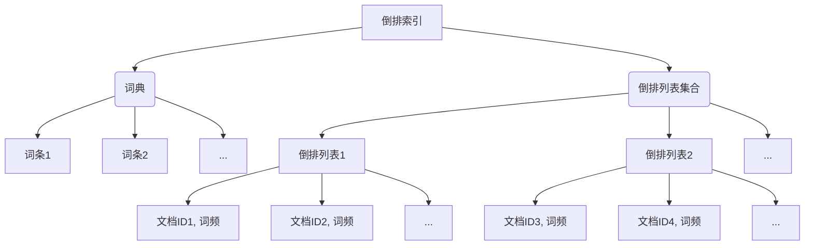

好的,我明白了您的要求。以下是标题为《【AI大数据计算原理与代码实例讲解】倒排索引》的技术博客文章的正文内容:

# 【AI大数据计算原理与代码实例讲解】倒排索引

## 1. 背景介绍

### 1.1 问题的由来

在当今大数据时代,海量的非结构化数据急剧增长,如何高效地存储和检索这些数据成为一个巨大的挑战。传统的数据库系统往往在处理非结构化数据时效率低下。为了解决这个问题,倒排索引(Inverted Index)应运而生。

倒排索引是一种将数据与其出现位置相关联的索引技术,广泛应用于全文搜索引擎、自然语言处理和信息检索等领域。它通过构建一个反向的数据结构,将文档中的每个词条与其出现的文档相关联,从而实现快速的关键词搜索。

### 1.2 研究现状  

倒排索引技术经过多年的发展,已经成为信息检索领域的核心技术之一。目前,主流的搜索引擎、电子商务平台、社交网络等都广泛采用了倒排索引。同时,随着大数据和人工智能技术的快速发展,倒排索引也在不断演进和优化,以适应更加复杂的应用场景。

### 1.3 研究意义

倒排索引技术对于高效地存储和检索海量非结构化数据至关重要。通过深入研究倒排索引的原理、算法和实现,我们可以:

1. 提高信息检索的效率和准确性,为用户提供更好的搜索体验。
2. 优化大数据处理流程,加快数据分析和挖掘的速度。
3. 促进自然语言处理、知识图谱构建等人工智能技术的发展。
4. 探索新的索引优化策略,应对未来更加复杂的数据挑战。

### 1.4 本文结构

本文将全面介绍倒排索引的核心概念、算法原理、数学模型、实现细节和实际应用。内容安排如下:

- 第2部分阐述倒排索引的核心概念及其与其他数据结构的联系。
- 第3部分详细讲解倒排索引的核心算法原理和具体操作步骤。
- 第4部分构建倒排索引的数学模型,并通过公式推导和案例分析加深理解。
- 第5部分提供一个基于Python的倒排索引项目实践,包括代码实现和运行结果分析。
- 第6部分探讨倒排索引在搜索引擎、自然语言处理等领域的实际应用场景。
- 第7部分推荐相关的学习资源、开发工具和论文等。
- 第8部分总结倒排索引的研究成果,展望未来发展趋势和面临的挑战。
- 第9部分是附录,回答一些常见的问题。

## 2. 核心概念与联系

倒排索引(Inverted Index)是一种将数据与其出现位置相关联的索引技术。它的核心思想是将文档集合中的每个词条与其出现的文档相关联,形成一个反向的数据结构。这种结构使得根据关键词快速查找相关文档成为可能。

在理解倒排索引之前,我们需要先了解一些基本概念:

- **文档集合(Corpus)**: 需要建立索引的一组文档的总集合。
- **词条(Term)**: 文档中出现的单词或短语,通常经过分词和去重处理。
- **词典(Dictionary)**: 存储文档集合中所有唯一词条的数据结构。
- **词频(Term Frequency, TF)**: 某个词条在特定文档中出现的次数。
- **文档频率(Document Frequency, DF)**: 某个词条在整个文档集合中出现的文档数量。

倒排索引的核心数据结构是一个关联词条与其出现文档位置的映射表,通常使用哈希表或树状结构实现。每个词条对应一个倒排列表(Inverted List),存储包含该词条的所有文档的相关信息,如文档ID、词频等。

倒排索引与其他常见数据结构也有一些联系:

- **哈希表**: 倒排索引中的词典通常使用哈希表实现,以实现高效的词条查找。
- **链表**: 每个倒排列表可以看作是一种链式存储结构。
- **树状结构**: 一些高级的倒排索引实现使用树状结构(如B+树)来组织倒排列表,提高查询效率。
- **位向量**: 在分布式系统中,倒排索引可以使用压缩的位向量来表示文档集合,以节省存储空间。

通过合理利用这些数据结构,倒排索引可以实现高效的索引构建、更新和查询操作。

## 3. 核心算法原理与具体操作步骤

### 3.1 算法原理概述

倒排索引的构建过程可以概括为以下几个主要步骤:

1. **收集文档集合**: 从各种数据源获取需要建立索引的文档集合。
2. **文档预处理**: 对文档进行分词、去停用词、词形还原等预处理,以提取出词条。
3. **建立词典**: 遍历文档集合,收集并去重所有出现的词条,构建词典。
4. **生成倒排列表**: 对于每个词条,遍历文档集合,记录该词条在每个文档中出现的位置信息(如文档ID、词频等),生成对应的倒排列表。
5. **存储索引**: 将构建好的倒排索引(包括词典和倒排列表集合)持久化存储,以供后续查询。

在查询时,我们可以根据用户输入的查询词条,快速从倒排索引中获取包含这些词条的所有文档列表,再进行进一步的排序、过滤和评分,最终返回相关的搜索结果。

### 3.2 算法步骤详解  

下面我们详细解释倒排索引构建的每一个步骤:

1. **收集文档集合**

   这一步通常需要从各种数据源(如网页、文件、数据库等)获取原始文档数据。根据具体应用场景的不同,文档可能是网页、新闻文章、电子书、产品描述等多种形式。

2. **文档预处理**

   原始文档数据往往需要进行一系列预处理,以提取出有用的词条信息。常见的预处理步骤包括:

   - **分词(Tokenization)**: 将文档按照某种规则(如空格、标点符号等)分割成一个个单词或词组,即词条。
   - **去停用词(Stop Words Removal)**: 移除一些高频但无实际意义的词条,如"the"、"a"、"is"等,以减小索引的体积。
   - **词形还原(Stemming/Lemmatization)**: 将词条规范化为基本词形,如将"running"、"ran"还原为"run"。
   - **大小写规范化**: 将所有词条统一为大写或小写。
   - **特殊字符处理**: 移除或规范化特殊字符,如将"C++"处理为"cpp"。

3. **建立词典**

   遍历预处理后的文档集合,收集并去重所有出现的词条,构建词典。词典是一个存储所有唯一词条的数据结构,通常使用哈希表实现,以实现高效的插入、查找和遍历操作。

4. **生成倒排列表**

   这是倒排索引构建的核心步骤。对于每个词条,我们遍历文档集合,记录该词条在每个文档中出现的位置信息,生成对应的倒排列表。

   倒排列表是一个数据结构,存储了包含该词条的所有文档的相关信息,通常包括:

   - 文档ID: 唯一标识文档的ID。
   - 词频(Term Frequency, TF): 该词条在该文档中出现的次数。
   - 位置(Position): 该词条在文档中出现的位置,用于词近邻查询等。
   - 其他信息: 如文档长度、文档得分等,用于相关性排序。

   倒排列表可以使用多种数据结构实现,如链表、跳跃表、压缩位向量等,具体取决于存储和查询效率的权衡。

5. **存储索引**

   最后,我们需要将构建好的倒排索引(包括词典和倒排列表集合)持久化存储,以供后续的查询操作。存储方式可以是本地文件系统、分布式文件系统、数据库等,需要根据索引的大小和查询性能要求进行选择。

   索引的存储格式也有多种选择,如原始格式、压缩格式等,需要在存储空间和查询效率之间权衡。

在查询时,我们可以根据用户输入的查询词条,快速从倒排索引中获取包含这些词条的所有文档列表,再进行进一步的排序、过滤和评分,最终返回相关的搜索结果。

### 3.3 算法优缺点

倒排索引算法的主要优点包括:

1. **快速查询**: 通过倒排索引,我们可以快速获取包含查询词条的文档列表,大大提高了查询效率。
2. **支持多种查询**: 除了基本的关键词查询,倒排索引还支持短语查询、词近邻查询、模糊查询等多种查询方式。
3. **可扩展性强**: 倒排索引可以很好地扩展到大规模的文档集合,并支持分布式存储和查询。
4. **支持相关性排序**: 倒排索引中存储了词频、文档长度等信息,可以用于计算文档与查询的相关性得分,从而对结果进行排序。

但倒排索引也存在一些缺点和挑战:

1. **索引构建耗时**: 对于大规模文档集合,构建倒排索引是一个耗时的过程,需要投入大量的计算资源。
2. **索引更新开销大**: 当文档集合发生变化时,需要重新构建或更新倒排索引,开销可能很大。
3. **存储空间消耗大**: 倒排索引需要存储大量的元数据,如词典、倒排列表等,对存储空间的需求较高。
4. **查询结果质量**: 如何准确评估文档与查询的相关性,并对结果进行有效排序,是一个持续的挑战。

### 3.4 算法应用领域

倒排索引广泛应用于以下领域:

1. **全文搜索引擎**: 搜索引擎是倒排索引最典型的应用场景,用于索引网页、文档等非结构化数据,提供高效的关键词搜索服务。

2. **自然语言处理**: 在信息检索、文本挖掘、问答系统等自然语言处理任务中,倒排索引被用于快速查找相关文本数据。

3. **电子商务平台**: 在电商网站中,倒排索引用于索引商品描述、评论等信息,支持基于关键词的商品搜索。

4. **代码搜索**: 在代码编辑器、代码托管平台中,倒排索引可以用于索引代码文件,支持快速查找特定函数、变量等代码片段。

5. **社交网络分析**: 在社交网络中,倒排索引可以用于索引用户信息、社交内容等,支持基于关键词的用户搜索和内容推荐。

6. **垃圾邮件过滤**: 在垃圾邮件过滤系统中,倒排索引可以用于索引邮件内容,快速识别垃圾邮件。

7. **基因组学**: 在生物信息学领域,倒排索引可以用于索引基因序列数据,支持快速搜索和比对。

总的来说,只要涉及到对非结构化数据进行快速搜索和检索,倒排索引都可以发挥重要作用。

## 4. 数学模型和公式详细讲解与举例说明

### 4.1 数学模型构