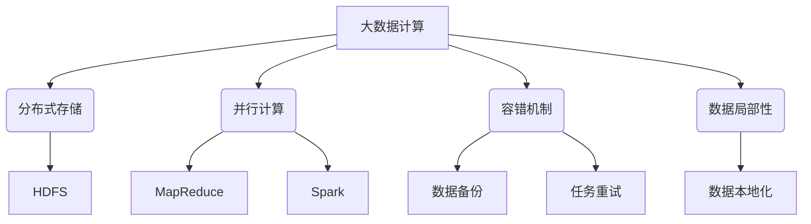
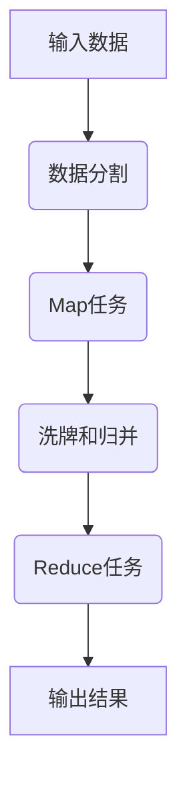

# 【AI大数据计算原理与代码实例讲解】大数据

## 1. 背景介绍

### 1.1 问题的由来

在当今时代，数据已经成为推动科技进步和商业发展的核心动力。随着互联网、物联网、人工智能等技术的飞速发展,数据的产生速度和规模都在呈现爆炸式增长。传统的数据处理方式已经无法满足当前海量数据的存储、计算和分析需求。这就催生了大数据技术的兴起。

大数据(Big Data)指无法在合理时间范围内用常规软件工具进行捕获、管理和处理的数据集合,需要新处理模式才能有更强的决策力、洞见发现能力和流程优化能力。大数据技术应运而生,旨在解决传统数据处理系统在存储容量、计算能力、数据传输能力等方面的瓶颈,高效地管理和分析大规模、高增长率和多样化的数据资产。

### 1.2 研究现状

近年来,大数据技术受到了学术界和工业界的广泛关注,成为了一个热门研究领域。主流的大数据处理框架有Apache Hadoop、Apache Spark等,它们采用分布式计算模型,将海量数据分布存储在廉价的计算节点集群中,利用大量节点的并行计算能力实现高效的数据处理。

在大数据分析算法方面,机器学习和深度学习等人工智能技术得到了广泛应用,可以从海量数据中发现隐藏的模式和规律,为企业决策提供有价值的洞见。常见的分析算法包括聚类分析、关联规则挖掘、异常检测等。

### 1.3 研究意义 

大数据技术的发展对于推动科技创新、提升企业竞争力和促进社会进步具有重要意义:

1. **科学研究**:大数据为科学家提供了前所未有的数据资源,有助于发现新的科学规律,推进人类知识的发展。
2. **商业智能**:企业可以利用大数据分析技术挖掘有价值的商业洞见,优化业务流程、改善产品和服务、制定更明智的决策策略。
3. **社会治理**:政府部门可以基于大数据技术构建智慧城市、提高公共服务水平、维护社会安全稳定。
4. **个性化服务**:通过分析用户的行为数据和偏好,企业能够为用户提供更加个性化和人性化的产品和服务。

### 1.4 本文结构

本文将全面介绍大数据计算的核心概念、算法原理、数学模型、代码实现和实际应用场景。具体内容安排如下:

- 第2章阐述大数据计算的核心概念,包括分布式存储、并行计算、容错机制等。
- 第3章详细讲解大数据计算的核心算法原理和具体操作步骤。
- 第4章构建大数据计算的数学模型,推导公式并结合案例进行讲解。
- 第5章提供大数据计算的代码实例,并对关键代码进行解读和分析。  
- 第6章介绍大数据计算在实际应用中的场景,并对未来发展趋势进行展望。
- 第7章推荐大数据计算相关的学习资源、开发工具和研究论文。
- 第8章对本文内容进行总结,并阐述大数据计算面临的挑战和未来发展方向。
- 第9章列出常见问题并给出解答,以帮助读者更好地理解和掌握大数据计算。

## 2. 核心概念与联系

大数据计算的核心概念主要包括以下几个方面:



1. **分布式存储**:由于数据规模庞大,无法在单个节点上存储,因此需要将数据分布式存储在多个节点上。常用的分布式文件系统有HDFS(Hadoop分布式文件系统)。

2. **并行计算**:为了提高数据处理效率,需要利用多个计算节点并行执行计算任务。MapReduce和Spark是常用的并行计算框架。

3. **容错机制**:在分布式环境中,硬件故障和网络异常是无法避免的,因此需要容错机制来保证计算的可靠性。常见的容错措施包括数据备份和任务重试。

4. **数据局部性**:为了减少数据传输,计算任务应当就近调度到存储数据的节点上执行,这就是数据本地化原则。

上述核心概念相互关联、相辅相成,共同构建了大数据计算的基础架构。分布式存储解决了数据存储的问题,并行计算提高了计算效率,容错机制保证了系统的可靠性,而数据局部性则优化了计算性能。

## 3. 核心算法原理 & 具体操作步骤

### 3.1 算法原理概述

大数据计算的核心算法是MapReduce,它将计算过程分为两个阶段:Map阶段和Reduce阶段。

1. **Map阶段**:输入数据被分割为多个数据块,每个数据块分配给一个Map任务进行处理。Map任务将输入数据转换为中间结果(Key-Value对)。

2. **Reduce阶段**:框架对Map阶段产生的中间结果进行分组,每一组Key-Value对分配给一个Reduce任务。Reduce任务对相同Key的Value进行合并操作,最终生成最终结果。

MapReduce算法的优势在于其并行、分布式的特性,可以充分利用集群中的计算资源,从而高效地处理海量数据。

### 3.2 算法步骤详解

MapReduce算法的具体执行步骤如下:



1. **数据分割**:输入数据被划分为多个数据块(Split),每个数据块对应一个Map任务。

2. **Map任务**:每个Map任务读取一个数据块,并对其中的每条记录执行Map函数,生成中间结果(Key-Value对)。

3. **洗牌和归并**:框架对Map阶段产生的中间结果按照Key进行分组,并将相同Key的Value值合并成一个集合,形成(Key, Value List)对。

4. **Reduce任务**:每个(Key, Value List)对分配给一个Reduce任务。Reduce任务对Value List执行Reduce函数,生成最终结果。

5. **输出结果**:Reduce任务的输出结果被写入分布式文件系统中。

### 3.3 算法优缺点

MapReduce算法的优点:

1. **高度并行**:可以充分利用集群中的计算资源,实现高效的并行计算。
2. **容错性强**:通过任务重试和数据备份机制,可以有效应对节点故障。
3. **可扩展性好**:计算资源不足时,可以方便地扩展集群规模。

MapReduce算法的缺点:

1. **延迟高**:需要进行多次磁盘I/O和网络数据传输,导致作业执行延迟较高。
2. **不适合迭代计算**:每次迭代都需要从HDFS读写数据,效率低下。
3. **编程模型限制**:MapReduce编程模型相对低级和rigid,不够灵活。

### 3.4 算法应用领域

MapReduce算法广泛应用于以下领域:

1. **网络数据分析**:分析网络日志、社交网络数据等,用于网站优化、广告投放等。
2. **生物信息学**:分析基因序列数据,用于基因组研究、药物设计等。
3. **科学计算**:进行大规模数值计算和模拟,如天气预报、气候模拟等。
4. **商业智能**:分析用户行为数据、交易数据等,用于个性化推荐、欺诈检测等。

## 4. 数学模型和公式 & 详细讲解 & 举例说明

### 4.1 数学模型构建

在大数据计算中,我们常常需要对海量数据进行统计分析。假设我们有一个数据集$D=\{x_1, x_2, \ldots, x_n\}$,其中$x_i$表示第$i$个数据样本。我们希望计算数据集的均值$\mu$和方差$\sigma^2$。

传统的计算方法是:

$$\mu = \frac{1}{n}\sum_{i=1}^{n}x_i$$

$$\sigma^2 = \frac{1}{n}\sum_{i=1}^{n}(x_i - \mu)^2$$

但是,当数据规模$n$非常大时,上述计算方法效率低下。我们可以构建一个增量式的数学模型,将计算过程分解为多个阶段,以适应MapReduce的并行计算框架。

### 4.2 公式推导过程

我们定义两个辅助变量$M_k$和$S_k$,其中$M_k$表示前$k$个数据样本的均值,$S_k$表示前$k$个数据样本的方差。

$$M_k = \frac{1}{k}\sum_{i=1}^{k}x_i$$

$$S_k = \frac{1}{k}\sum_{i=1}^{k}(x_i - M_k)^2$$

我们可以递推地计算$M_{k+1}$和$S_{k+1}$:

$$M_{k+1} = \frac{k}{k+1}M_k + \frac{1}{k+1}x_{k+1}$$

$$S_{k+1} = \frac{k}{k+1}S_k + \frac{k}{k+1}(M_{k+1} - M_k)^2 + \frac{1}{k+1}(x_{k+1} - M_{k+1})^2$$

这种增量式的计算方法可以很好地并行化,适合在MapReduce框架上执行。最终,我们可以得到数据集的均值$\mu = M_n$和方差$\sigma^2 = S_n$。

### 4.3 案例分析与讲解

假设我们有一个包含1亿条数据的数据集,每条数据是一个浮点数。我们希望计算这个数据集的均值和方差。

在MapReduce框架上,我们可以将数据集划分为10000个数据块,每个数据块包含10000条数据。每个Map任务处理一个数据块,计算该数据块的$M_k$和$S_k$,并将结果发送给Reduce任务。

Reduce任务收集所有Map任务的结果,并按照上述公式递推计算出最终的$M_n$和$S_n$,即整个数据集的均值和方差。

通过这种并行化的方式,我们可以充分利用集群中的计算资源,大大提高了计算效率。

### 4.4 常见问题解答

**Q: 为什么需要构建增量式的数学模型?**

A: 对于海量数据集,直接计算均值和方差的传统方法效率低下。增量式模型将计算过程分解为多个阶段,可以很好地并行化,适合在MapReduce框架上执行。

**Q: 增量式模型的计算精度如何?**

A: 增量式模型的计算精度与传统方法相同,只是将计算过程分解为多个步骤而已。但是,由于浮点数运算的舍入误差,当数据规模非常大时,计算结果可能会存在一定偏差。

**Q: 如何处理数据中的异常值?**

A: 在Map阶段,我们可以对每个数据块进行预处理,剔除异常值。或者在Reduce阶段,根据计算出的均值和方差,对异常值进行识别和处理。

## 5. 项目实践:代码实例和详细解释说明

### 5.1 开发环境搭建

我们将使用Apache Spark作为大数据计算框架,Scala作为编程语言。开发环境的搭建步骤如下:

1. 安装Java 8或更高版本。
2. 下载并解压Apache Spark发行版。
3. 配置Spark环境变量。
4. 安装Scala编译器和IDE(如IntelliJ IDEA)。

### 5.2 源代码详细实现

```scala
import org.apache.spark.sql.SparkSession

object MeanVariance {

  def main(args: Array[String]): Unit = {